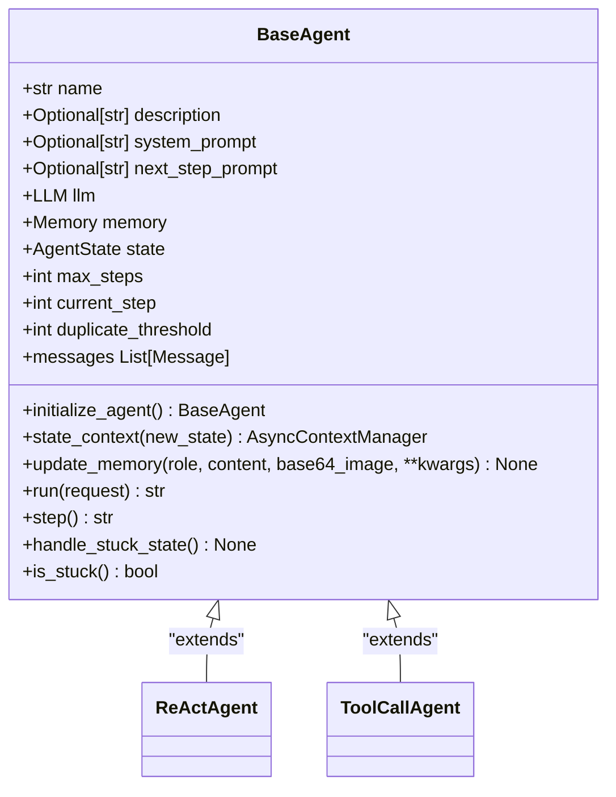
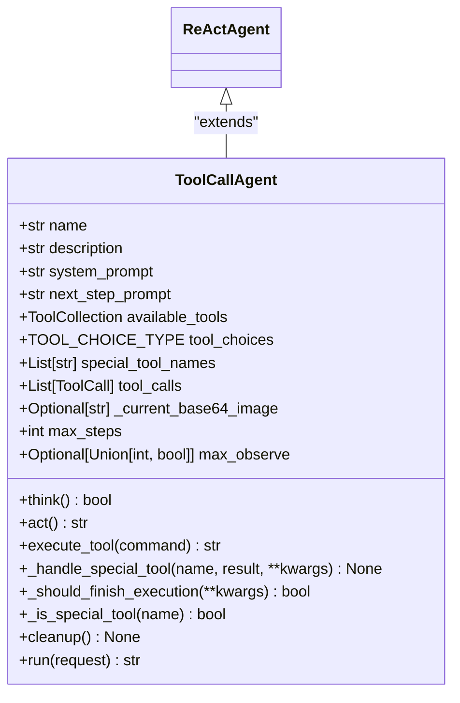
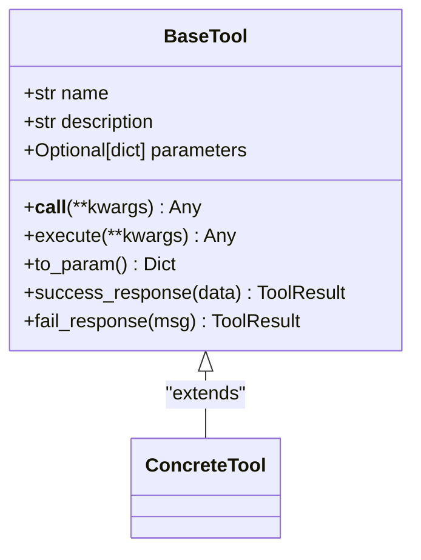
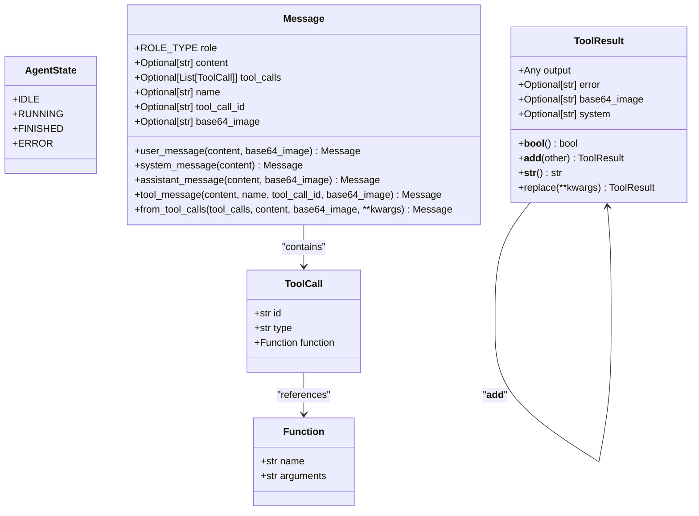

# API参考

<cite>
**Referenced Files in This Document**   
- [app/agent/base.py](file://app/agent/base.py)
- [app/agent/toolcall.py](file://app/agent/toolcall.py)
- [app/agent/react.py](file://app/agent/react.py)
- [app/tool/base.py](file://app/tool/base.py)
- [app/tool/tool_collection.py](file://app/tool/tool_collection.py)
- [app/schema.py](file://app/schema.py)
- [app/prompt/toolcall.py](file://app/prompt/toolcall.py)
</cite>

## 目录
1. [简介](#简介)
2. [核心组件](#核心组件)
3. [BaseAgent接口文档](#baseagent接口文档)
4. [ToolCallAgent接口文档](#toolcallagent接口文档)
5. [BaseTool接口规范](#basetool接口规范)
6. [数据模型定义](#数据模型定义)
7. [使用示例](#使用示例)
8. [错误处理模式](#错误处理模式)

## 简介
OpenManus是一个基于代理的系统，提供灵活的工具调用和任务执行能力。本API参考文档全面记录了系统的核心接口，包括代理基类、工具调用代理、工具基类以及关键数据模型。文档旨在为开发者提供准确、可靠的参考，帮助理解系统架构和实现细节。

## 核心组件
OpenManus的核心组件包括代理系统、工具系统和数据模型。代理系统负责任务的规划和执行，工具系统提供具体的功能实现，数据模型则定义了系统内部通信的数据结构。这些组件通过清晰的接口进行交互，形成了一个可扩展的架构。

**Section sources**
- [app/agent/base.py](file://app/agent/base.py#L12-L195)
- [app/tool/base.py](file://app/tool/base.py#L77-L172)
- [app/schema.py](file://app/schema.py#L31-L155)

## BaseAgent接口文档
`BaseAgent`是所有代理的抽象基类，定义了代理的核心属性和方法。它继承自`BaseModel`并实现了`ABC`（抽象基类），为代理的状态管理、内存管理和执行循环提供了基础功能。

### 属性
- **name**: 代理的唯一名称
- **description**: 代理的可选描述
- **system_prompt**: 系统级指令提示
- **next_step_prompt**: 确定下一步操作的提示
- **llm**: 语言模型实例
- **memory**: 代理的内存存储
- **state**: 当前代理状态（`AgentState`）
- **max_steps**: 终止前的最大步数
- **current_step**: 执行中的当前步数
- **duplicate_threshold**: 检测循环的重复阈值

### 方法
- **initialize_agent**: 初始化代理的默认设置
- **state_context**: 安全的代理状态转换上下文管理器
- **update_memory**: 向代理内存添加消息
- **run**: 异步执行代理的主循环
- **step**: 执行代理工作流中的单个步骤（抽象方法，必须由子类实现）
- **handle_stuck_state**: 处理代理陷入循环的状态
- **is_stuck**: 检查代理是否陷入循环
- **messages**: 获取和设置代理内存中的消息列表



**Diagram sources**
- [app/agent/base.py](file://app/agent/base.py#L12-L195)

**Section sources**
- [app/agent/base.py](file://app/agent/base.py#L12-L195)

## ToolCallAgent接口文档
`ToolCallAgent`是处理工具/函数调用的基类代理，继承自`ReActAgent`。它增强了工具调用的抽象能力，能够处理复杂的工具执行流程。

### 属性
- **name**: 代理名称，默认为"toolcall"
- **description**: 代理描述
- **system_prompt**: 系统提示，默认为`SYSTEM_PROMPT`
- **next_step_prompt**: 下一步提示，默认为`NEXT_STEP_PROMPT`
- **available_tools**: 可用工具集合（`ToolCollection`）
- **tool_choices**: 工具选择模式（`TOOL_CHOICE_TYPE`）
- **special_tool_names**: 特殊工具名称列表
- **tool_calls**: 工具调用列表（`ToolCall`）
- **_current_base64_image**: 当前的base64编码图像（私有）
- **max_steps**: 最大步数，默认为30
- **max_observe**: 最大观察长度

### 方法
- **think**: 处理当前状态并决定使用哪些工具
- **act**: 执行工具调用并处理结果
- **execute_tool**: 执行单个工具调用并进行健壮的错误处理
- **_handle_special_tool**: 处理特殊工具的执行和状态变化
- **_should_finish_execution**: 确定工具执行是否应完成代理
- **_is_special_tool**: 检查工具名称是否在特殊工具列表中
- **cleanup**: 清理代理工具使用的资源
- **run**: 运行代理并在完成后清理



**Diagram sources**
- [app/agent/toolcall.py](file://app/agent/toolcall.py#L17-L249)

**Section sources**
- [app/agent/toolcall.py](file://app/agent/toolcall.py#L17-L249)

## BaseTool接口规范
`BaseTool`是所有工具的基类，结合了`BaseModel`和工具功能。它提供了Pydantic模型验证、模式注册、标准化结果处理和抽象执行接口。

### 属性
- **name**: 工具名称
- **description**: 工具描述
- **parameters**: 工具参数模式

### 方法
- **__call__**: 使用给定参数执行工具
- **execute**: 使用给定参数执行工具（抽象方法，必须由子类实现）
- **to_param**: 将工具转换为函数调用格式
- **success_response**: 创建成功的工具结果
- **fail_response**: 创建失败的工具结果



**Diagram sources**
- [app/tool/base.py](file://app/tool/base.py#L77-L172)

**Section sources**
- [app/tool/base.py](file://app/tool/base.py#L77-L172)

## 数据模型定义
OpenManus使用一系列数据模型来表示系统中的各种实体，包括消息、工具调用、工具结果和代理状态。

### AgentState
表示代理的执行状态，是一个字符串枚举类型，包含以下值：
- **IDLE**: 空闲状态
- **RUNNING**: 运行状态
- **FINISHED**: 完成状态
- **ERROR**: 错误状态

### Message
表示对话中的聊天消息，包含以下字段：
- **role**: 消息角色（`ROLE_TYPE`）
- **content**: 消息内容
- **tool_calls**: 工具调用列表
- **name**: 工具名称
- **tool_call_id**: 工具调用ID
- **base64_image**: base64编码的图像

提供了一系列类方法来创建不同类型的消息：
- **user_message**: 创建用户消息
- **system_message**: 创建系统消息
- **assistant_message**: 创建助手消息
- **tool_message**: 创建工具消息
- **from_tool_calls**: 从原始工具调用创建消息

### ToolCall
表示消息中的工具/函数调用，包含以下字段：
- **id**: 调用ID
- **type**: 调用类型，默认为"function"
- **function**: 函数对象，包含名称和参数

### ToolResult
表示工具执行的结果，包含以下字段：
- **output**: 输出结果
- **error**: 错误消息
- **base64_image**: base64编码的图像
- **system**: 系统消息

提供了以下方法：
- **__bool__**: 检查结果是否有效
- **__add__**: 合并两个工具结果
- **__str__**: 返回结果的字符串表示
- **replace**: 返回一个新结果，其中包含替换的字段



**Diagram sources**
- [app/schema.py](file://app/schema.py#L31-L155)

**Section sources**
- [app/schema.py](file://app/schema.py#L31-L155)

## 使用示例
以下示例展示了如何使用`ToolCallAgent`和`BaseTool`来创建一个简单的代理系统。

首先，创建一个自定义工具：

```python
class MyTool(BaseTool):
    name = "my_tool"
    description = "A simple tool that returns a greeting"
    parameters = {
        "type": "object",
        "properties": {
            "name": {"type": "string", "description": "The name to greet"}
        },
        "required": ["name"]
    }

    async def execute(self, **kwargs):
        name = kwargs.get("name", "World")
        return self.success_response(f"Hello, {name}!")
```

然后，创建一个代理并添加工具：

```python
agent = ToolCallAgent()
my_tool = MyTool()
agent.available_tools.add_tool(my_tool)
```

最后，运行代理：

```python
result = await agent.run("Use my_tool to greet Alice")
print(result)
```

**Section sources**
- [app/tool/base.py](file://app/tool/base.py#L77-L172)
- [app/agent/toolcall.py](file://app/agent/toolcall.py#L17-L249)

## 错误处理模式
OpenManus系统采用了多层次的错误处理模式，确保系统的健壮性和可靠性。

### 代理级别的错误处理
`BaseAgent`在`run`方法中使用`state_context`上下文管理器来安全地进行状态转换。如果在执行过程中发生异常，代理状态将转换为`ERROR`，并重新抛出异常。

### 工具级别的错误处理
`ToolCallAgent`在`execute_tool`方法中实现了健壮的错误处理：
- 捕获`json.JSONDecodeError`以处理无效的JSON参数
- 捕获一般异常以处理工具执行中的问题
- 使用`ToolResult`来标准化错误响应

### 特殊工具处理
系统支持特殊工具的概念，这些工具可以改变代理的状态。例如，`Terminate`工具可以将代理状态设置为`FINISHED`，从而结束执行。

### 资源清理
`ToolCallAgent`实现了`cleanup`方法，在代理运行完成后清理资源，确保不会发生资源泄漏。

**Section sources**
- [app/agent/base.py](file://app/agent/base.py#L12-L195)
- [app/agent/toolcall.py](file://app/agent/toolcall.py#L17-L249)
- [app/tool/base.py](file://app/tool/base.py#L77-L172)