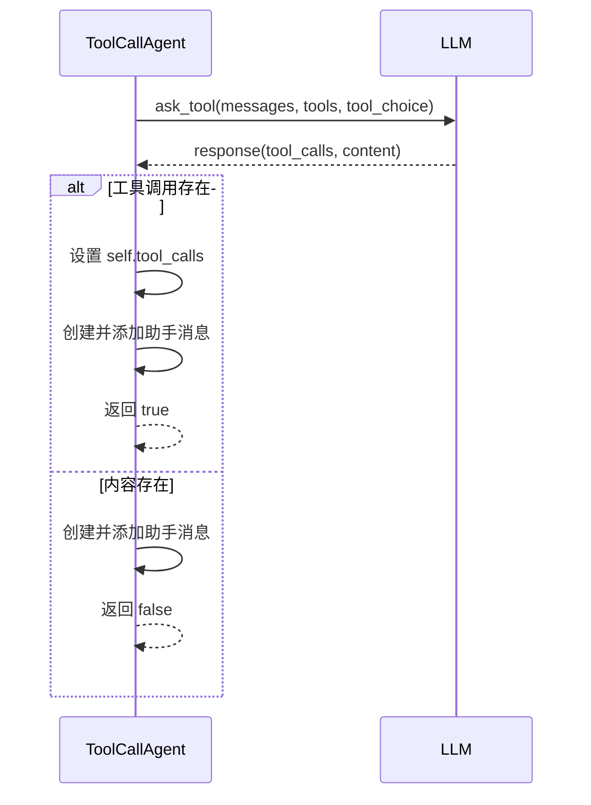
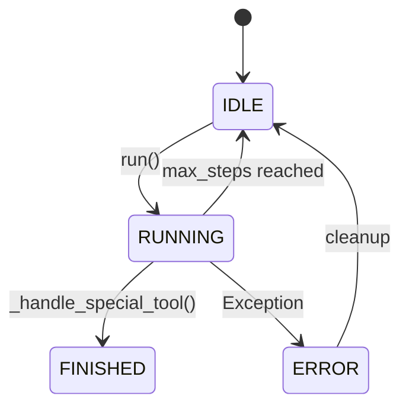

# 代理API

<cite>
**本文档引用的文件**
- [base.py](file://app/agent/base.py)
- [toolcall.py](file://app/agent/toolcall.py)
- [react.py](file://app/agent/react.py)
- [schema.py](file://app/schema.py)
</cite>

## 目录
1. [简介](#简介)
2. [核心组件](#核心组件)
3. [BaseAgent 详解](#baseagent-详解)
4. [ToolCallAgent 详解](#toolcallagent-详解)
5. [代理状态机](#代理状态机)
6. [错误处理与性能优化](#错误处理与性能优化)
7. [代码示例](#代码示例)

## 简介
OpenManus 代理系统提供了一套灵活的代理框架，用于构建能够与外部工具交互的智能代理。该系统的核心是 `BaseAgent` 和 `ToolCallAgent` 两个类。`BaseAgent` 是所有代理的抽象基类，定义了代理的基本属性、状态管理和执行流程。`ToolCallAgent` 继承自 `ReActAgent`，专门用于处理工具调用，它通过与语言模型（LLM）的交互来决定何时以及如何调用工具，并处理调用结果。本文档将详细描述这两个代理的接口、属性、方法以及它们的工作原理。

## 核心组件

本文档主要分析 `BaseAgent` 和 `ToolCallAgent` 两个核心组件。`BaseAgent` 位于 `app/agent/base.py`，是所有代理的基础，提供了状态管理、内存管理和执行循环等核心功能。`ToolCallAgent` 位于 `app/agent/toolcall.py`，是 `BaseAgent` 的具体实现，专注于工具调用机制。它依赖于 `ReActAgent`（位于 `app/agent/react.py`）的“思考-行动”（Think-Act）模式，并通过 `app/schema.py` 中定义的 `Message`、`ToolCall` 和 `AgentState` 等数据结构来管理对话和状态。

**本文档引用的文件**
- [base.py](file://app/agent/base.py)
- [toolcall.py](file://app/agent/toolcall.py)
- [react.py](file://app/agent/react.py)
- [schema.py](file://app/schema.py)

## BaseAgent 详解

`BaseAgent` 是一个抽象基类，为所有代理提供了统一的接口和基础功能。它定义了代理的通用属性和方法，确保了系统的一致性和可扩展性。

### 属性

`BaseAgent` 的属性通过 Pydantic 的 `Field` 进行定义，确保了类型安全和文档化。

- **name**: (str) 代理的唯一名称，用于标识和日志记录。
- **description**: (Optional[str]) 代理的可选描述，提供关于其功能的额外信息。
- **system_prompt**: (Optional[str]) 系统级指令提示，用于指导代理的行为。
- **next_step_prompt**: (Optional[str]) 用于确定下一步行动的提示，通常在代理陷入循环时被修改。
- **llm**: (LLM) 语言模型实例，代理通过它来生成响应和决策。
- **memory**: (Memory) 代理的记忆存储，用于保存对话历史和上下文信息。
- **state**: (AgentState) 代理的当前状态，如 IDLE、RUNNING、FINISHED 或 ERROR。
- **max_steps**: (int) 执行的最大步数，防止代理无限循环。
- **current_step**: (int) 当前执行的步数。
- **duplicate_threshold**: (int) 判断代理是否陷入循环的重复内容阈值。

### 方法

`BaseAgent` 提供了多个关键方法来管理代理的生命周期。

- **initialize_agent**: 在代理初始化后调用，用于设置默认的 LLM 和 Memory 实例。
- **state_context**: 一个异步上下文管理器，用于安全地进行代理状态转换。它确保在发生异常时，代理状态能回滚到之前的状态。
- **update_memory**: 向代理的记忆中添加一条消息。它接受消息角色（user, system, assistant, tool）、内容和可选的 base64 图像。
- **run**: 代理的主执行循环。它在 `RUNNING` 状态下异步执行，直到达到最大步数或状态变为 `FINISHED`。在每一步中，它都会调用 `step` 方法，并检查是否陷入循环。
- **step**: 一个抽象方法，必须由子类实现。它定义了代理在单个步骤中的具体行为。
- **handle_stuck_state**: 当代理陷入循环时被调用。它会向 `next_step_prompt` 中添加一个提示，要求代理改变策略。
- **is_stuck**: 检查代理是否陷入循环。它通过检查记忆中是否存在重复的助手消息来判断。
- **messages**: 一个属性，用于获取或设置代理记忆中的消息列表。

**本文档引用的文件**
- [base.py](file://app/agent/base.py#L12-L195)
- [schema.py](file://app/schema.py#L31-L37)

## ToolCallAgent 详解

`ToolCallAgent` 是 `ReActAgent` 的一个具体实现，专门用于处理工具调用。它通过 `think` 和 `act` 方法实现了“思考-行动”循环。

### 核心方法

#### think 方法
`think` 方法负责处理当前状态并决定下一步的行动。它首先将 `next_step_prompt` 添加到消息历史中，然后调用 LLM 的 `ask_tool` 方法，传入当前消息、系统提示、可用工具列表和工具选择策略。LLM 的响应可能包含工具调用（`tool_calls`）或普通内容（`content`）。该方法会根据 `tool_choice` 的设置（`NONE`, `AUTO`, `REQUIRED`）来处理不同的情况，并将结果（工具调用或内容）添加到记忆中。如果 LLM 的响应中包含工具调用，则返回 `True`，表示需要执行 `act` 方法；否则返回 `False`。



**图示来源**
- [toolcall.py](file://app/agent/toolcall.py#L38-L128)
- [react.py](file://app/agent/react.py#L25-L26)

#### act 方法
`act` 方法负责执行 `think` 方法中决定的工具调用。它遍历 `self.tool_calls` 列表，对每个工具调用调用 `execute_tool` 方法。执行结果会被截断（如果设置了 `max_observe`），然后作为工具消息（`tool_message`）添加到记忆中。最后，该方法返回所有执行结果的拼接字符串。

#### execute_tool 方法
`execute_tool` 方法用于执行单个工具调用。它首先验证命令格式，然后检查工具是否在 `available_tools` 中。接着，它解析工具参数并调用 `available_tools.execute` 方法来执行工具。执行后，它会调用 `_handle_special_tool` 来处理特殊工具（如终止工具），并检查结果中是否包含 base64 图像。最后，它将执行结果格式化为一个观察字符串并返回。

#### _handle_special_tool 方法
`_handle_special_tool` 方法用于处理特殊工具的执行。它首先检查工具名称是否在 `special_tool_names` 列表中。如果是，则调用 `_should_finish_execution` 来判断是否应该结束代理的执行。如果应该结束，则将代理状态设置为 `FINISHED`。

**本文档引用的文件**
- [toolcall.py](file://app/agent/toolcall.py#L17-L249)
- [react.py](file://app/agent/react.py#L29-L30)

## 代理状态机

代理的状态由 `AgentState` 枚举类定义，位于 `app/schema.py`。它定义了代理的四种可能状态：

- **IDLE**: 代理处于空闲状态，可以开始执行。
- **RUNNING**: 代理正在执行任务。
- **FINISHED**: 代理已完成任务。
- **ERROR**: 代理在执行过程中遇到错误。

状态转换由 `state_context` 上下文管理器管理。当调用 `run` 方法时，代理状态会从 `IDLE` 转换为 `RUNNING`。在执行过程中，如果遇到错误，状态会变为 `ERROR`。当代理完成任务或达到最大步数时，状态会变回 `IDLE`。特殊工具（如 `Terminate`）的执行会将状态设置为 `FINISHED`。



**图示来源**
- [schema.py](file://app/schema.py#L31-L37)
- [base.py](file://app/agent/base.py#L58-L81)

## 错误处理与性能优化

### 错误处理
系统实现了多层次的错误处理机制。在 `think` 方法中，如果 LLM 调用因 `TokenLimitExceeded` 异常而失败，代理会将状态设置为 `FINISHED` 并在记忆中添加一条错误消息。`execute_tool` 方法捕获 `JSONDecodeError` 和通用异常，并返回格式化的错误字符串。`state_context` 确保了在任何步骤中发生异常时，代理状态都能正确地转换为 `ERROR`。

### 性能优化
- **避免循环执行**: `is_stuck` 和 `handle_stuck_state` 方法共同作用，检测并处理代理陷入重复响应的循环问题。
- **处理 Token 限制**: LLM 类内置了 `check_token_limit` 和 `update_token_count` 方法，用于跟踪和管理 token 使用量，防止请求超出模型的上下文窗口。
- **资源清理**: `ToolCallAgent` 的 `cleanup` 方法会在 `run` 方法完成后被调用，用于清理其工具使用的资源，防止资源泄漏。

**本文档引用的文件**
- [toolcall.py](file://app/agent/toolcall.py#L130-L163)
- [llm.py](file://app/llm.py#L237-L246)

## 代码示例

以下代码示例展示了如何实例化一个 `ToolCallAgent`，配置其 LLM 和内存，并执行一个任务。

```python
# 实例化代理
agent = ToolCallAgent(name="my_agent", description="A test agent")

# 配置 LLM (通常通过配置文件自动完成)
# agent.llm = LLM(config_name="my_config")

# 执行任务
result = await agent.run("请帮我搜索一下 OpenManus 项目。")
print(result)
```

**本文档引用的文件**
- [toolcall.py](file://app/agent/toolcall.py#L244-L249)
- [base.py](file://app/agent/base.py#L115-L153)