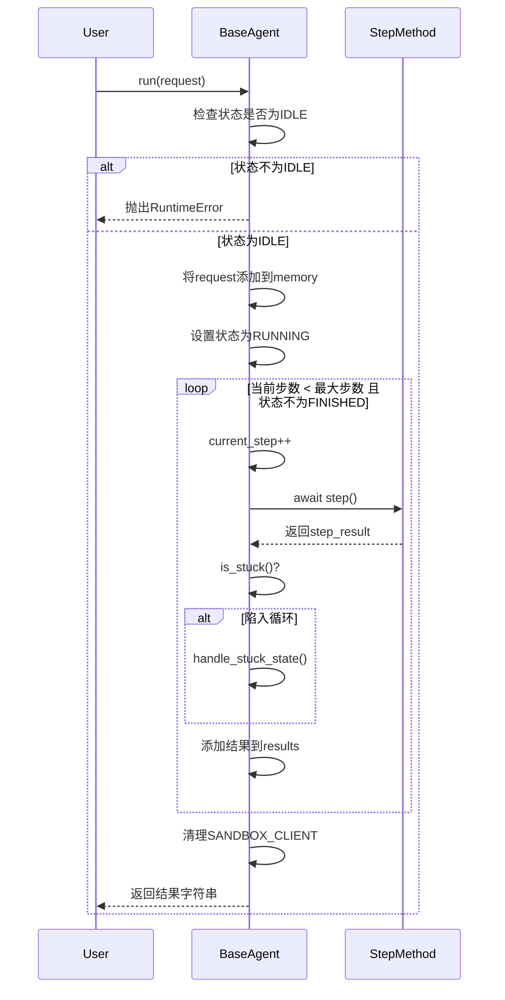
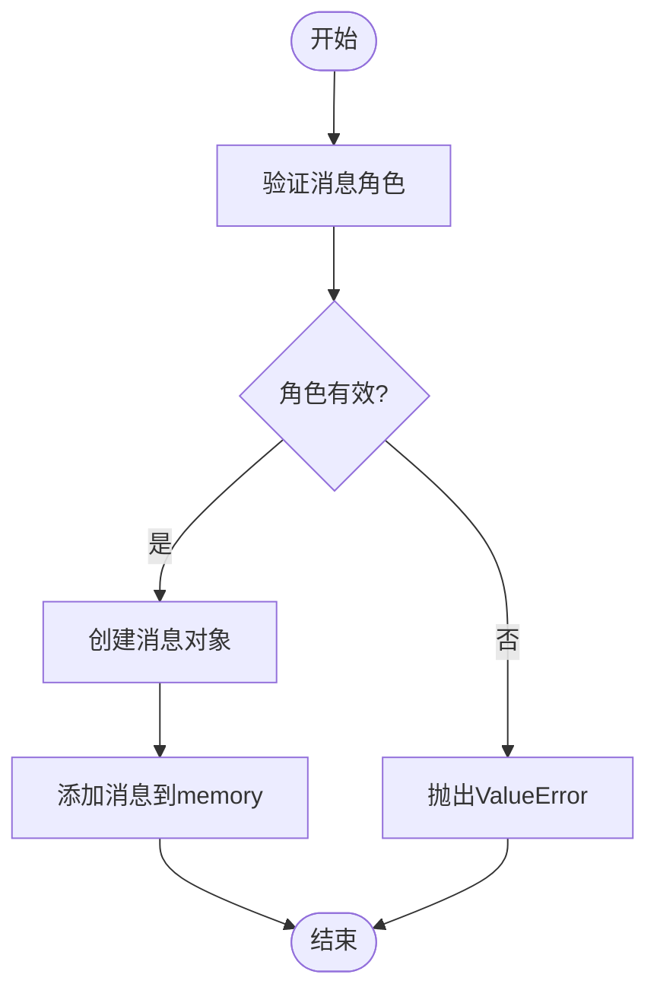
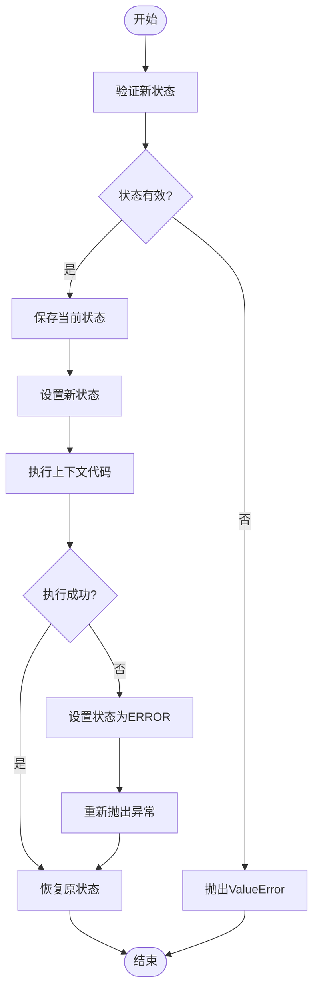
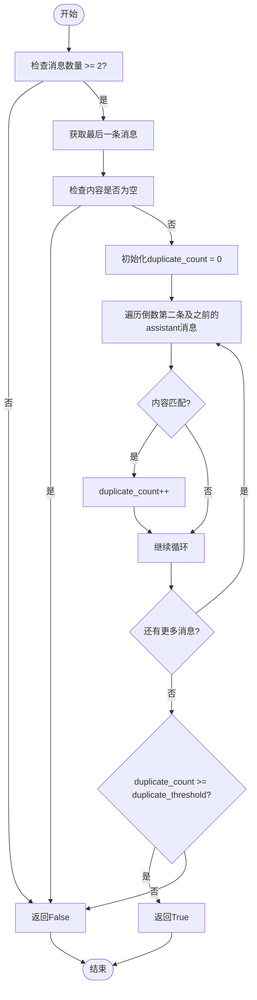
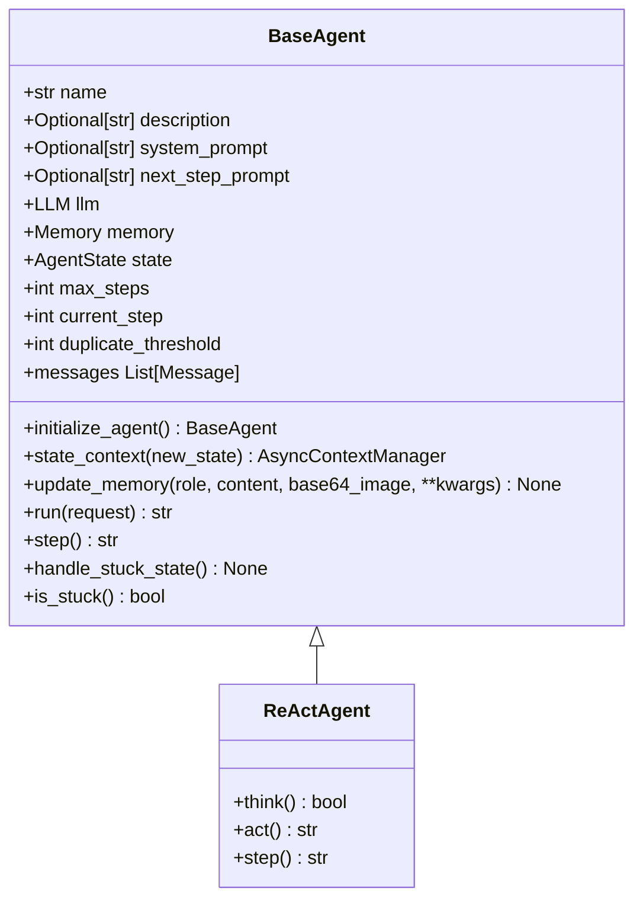

# 基础代理API

<cite>
**本文档引用的文件**
- [base.py](file://app/agent/base.py)
- [schema.py](file://app/schema.py)
- [llm.py](file://app/llm.py)
- [react.py](file://app/agent/react.py)
- [planning.py](file://app/flow/planning.py)
</cite>

## 目录
1. [简介](#简介)
2. [核心属性](#核心属性)
3. [执行流程](#执行流程)
4. [内存管理](#内存管理)
5. [状态管理](#状态管理)
6. [循环检测与处理](#循环检测与处理)
7. [继承与实现](#继承与实现)
8. [错误处理](#错误处理)

## 简介
`BaseAgent`是OpenManus框架中所有代理的抽象基类，为代理的状态管理、内存管理和执行循环提供了基础功能。该类定义了代理的核心属性和执行流程，所有具体的代理实现都必须继承此类并实现其抽象方法。`BaseAgent`通过`run`方法驱动代理的执行循环，通过`step`方法定义每一步的具体行为，并提供了内存管理、状态转换和循环检测等关键功能。

**Section sources**
- [base.py](file://app/agent/base.py#L12-L195)

## 核心属性
`BaseAgent`类定义了多个核心属性，用于配置和控制代理的行为。

### 基本属性
- **name**: 代理的唯一名称，用于标识和区分不同的代理实例。
- **description**: 代理的可选描述，用于提供关于代理功能的额外信息。

### 提示属性
- **system_prompt**: 系统级别的指令提示，用于指导代理的行为。
- **next_step_prompt**: 用于确定下一步行动的提示，可在代理陷入循环时被修改以改变策略。

### 依赖属性
- **llm**: 语言模型实例，用于生成代理的响应。如果未提供，则使用默认配置创建。
- **memory**: 代理的记忆存储，用于保存对话历史和上下文信息。如果未提供，则创建一个新的`Memory`实例。
- **state**: 代理的当前状态，默认为`AgentState.IDLE`。状态在执行过程中会动态变化。

### 执行控制属性
- **max_steps**: 执行的最大步数，达到此限制后代理将终止执行。默认值为10。
- **current_step**: 当前执行的步数，用于跟踪执行进度。
- **duplicate_threshold**: 检测循环的重复内容阈值，当相同内容出现次数达到此阈值时，认为代理陷入循环。默认值为2。

**Section sources**
- [base.py](file://app/agent/base.py#L12-L195)

## 执行流程
`BaseAgent`的执行流程由`run`方法驱动，该方法实现了代理的主循环。

### 状态检查
`run`方法首先检查代理的当前状态是否为`IDLE`。如果代理不处于空闲状态，则抛出`RuntimeError`异常，防止从非法状态启动。

### 内存更新
如果提供了初始请求（request），`run`方法会调用`update_memory`方法将用户消息添加到代理的记忆中。

### 异步执行循环
`run`方法使用`state_context`上下文管理器将代理状态安全地转换为`RUNNING`，并在该上下文中执行主循环。循环的终止条件是当前步数小于最大步数且代理状态不为`FINISHED`。

### 步骤计数
在每次循环迭代中，`current_step`属性递增，表示进入下一步执行。

### 循环检测与清理
在执行`step`方法后，`run`方法会调用`is_stuck`方法检测代理是否陷入循环。如果检测到循环，则调用`handle_stuck_state`方法进行处理。最后，将当前步骤的结果添加到结果列表中。

### 清理与返回
当循环结束时，`run`方法会清理沙箱客户端，并将所有步骤的结果连接成一个字符串返回。

**Diagram sources**
- [base.py](file://app/agent/base.py#L115-L153)

**Section sources**
- [base.py](file://app/agent/base.py#L115-L153)

## 内存管理
`BaseAgent`通过`update_memory`方法管理其记忆。

### 消息角色处理
`update_memory`方法支持四种消息角色：`user`、`system`、`assistant`和`tool`。对于每种角色，方法会创建相应的消息对象并添加到记忆中。

### 消息创建
方法使用`message_map`字典将角色映射到对应的消息创建函数。对于`tool`角色，需要提供`name`和`tool_call_id`参数。

### 错误处理
如果提供的角色不被支持，`update_memory`方法会抛出`ValueError`异常。

**Diagram sources**
- [base.py](file://app/agent/base.py#L83-L113)

**Section sources**
- [base.py](file://app/agent/base.py#L83-L113)

## 状态管理
`BaseAgent`使用`state_context`上下文管理器来安全地管理状态转换。

### 安全转换
`state_context`方法确保状态转换是安全的。它首先验证新状态的有效性，然后保存当前状态，将代理状态设置为新状态，并在`try`块中执行上下文内的代码。

### 异常处理
如果在上下文执行过程中发生异常，`state_context`方法会将代理状态设置为`ERROR`，然后重新抛出异常。

### 状态恢复
无论上下文执行是否成功，`finally`块都会确保代理状态恢复到转换前的状态。

**Diagram sources**
- [base.py](file://app/agent/base.py#L58-L81)

**Section sources**
- [base.py](file://app/agent/base.py#L58-L81)

## 循环检测与处理
`BaseAgent`提供了检测和处理代理陷入循环的机制。

### 循环检测
`is_stuck`方法通过检查记忆中是否存在重复的`assistant`消息来检测循环。它首先检查记忆中是否有至少两条消息，然后获取最后一条消息的内容。接着，它遍历倒数第二条及之前的`assistant`消息，统计内容与最后一条消息相同的数量。如果该数量大于或等于`duplicate_threshold`，则认为代理陷入循环。

### 循环处理
`handle_stuck_state`方法通过向`next_step_prompt`添加一个提示来处理循环。该提示建议代理考虑新的策略，避免重复无效的路径。

**Diagram sources**
- [base.py](file://app/agent/base.py#L169-L185)
- [base.py](file://app/agent/base.py#L162-L167)

**Section sources**
- [base.py](file://app/agent/base.py#L169-L185)
- [base.py](file://app/agent/base.py#L162-L167)

## 继承与实现
`BaseAgent`是一个抽象基类，其子类必须实现`step`方法。

### 抽象方法
`step`方法是一个抽象方法，必须由子类实现。该方法定义了代理在每一步执行的具体行为。

### 示例实现
`ReActAgent`是`BaseAgent`的一个子类，它实现了`think`和`act`两个抽象方法，并在`step`方法中调用它们。

**Diagram sources**
- [base.py](file://app/agent/base.py#L12-L195)
- [react.py](file://app/agent/react.py#L10-L37)

**Section sources**
- [base.py](file://app/agent/base.py#L156-L160)
- [react.py](file://app/agent/react.py#L10-L37)

## 错误处理
`BaseAgent`在多个方面实现了错误处理机制。

### 非法状态启动
当代理不处于`IDLE`状态时调用`run`方法，会抛出`RuntimeError`异常。

### 不支持的消息角色
当`update_memory`方法接收到不支持的消息角色时，会抛出`ValueError`异常。

### 无效状态转换
当`state_context`方法接收到无效的新状态时，会抛出`ValueError`异常。

### 循环检测
当`is_stuck`方法检测到代理陷入循环时，会通过`handle_stuck_state`方法进行处理，而不是抛出异常。

**Section sources**
- [base.py](file://app/agent/base.py#L115-L153)
- [base.py](file://app/agent/base.py#L83-L113)
- [base.py](file://app/agent/base.py#L58-L81)
- [base.py](file://app/agent/base.py#L169-L185)
- [base.py](file://app/agent/base.py#L162-L167)