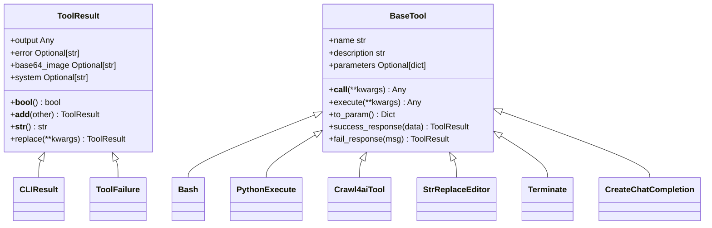
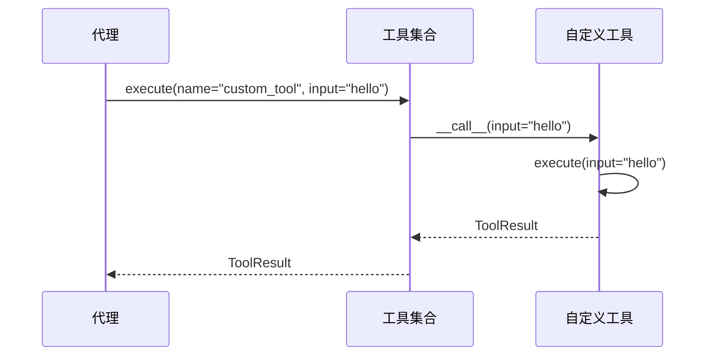

# 工具API

<cite>
**本文档中引用的文件**  
- [base.py](file://app/tool/base.py)
- [tool_collection.py](file://app/tool/tool_collection.py)
- [bash.py](file://app/tool/bash.py)
- [python_execute.py](file://app/tool/python_execute.py)
- [crawl4ai.py](file://app/tool/crawl4ai.py)
- [str_replace_editor.py](file://app/tool/str_replace_editor.py)
- [terminate.py](file://app/tool/terminate.py)
- [create_chat_completion.py](file://app/tool/create_chat_completion.py)
</cite>

## 目录
1. [简介](#简介)
2. [核心组件](#核心组件)
3. [工具执行机制](#工具执行机制)
4. [自定义工具开发示例](#自定义工具开发示例)
5. [错误处理与日志记录](#错误处理与日志记录)
6. [工具与代理交互协议](#工具与代理交互协议)
7. [资源清理最佳实践](#资源清理最佳实践)

## 简介
OpenManus工具系统提供了一套标准化的工具接口规范，通过`BaseTool`抽象基类实现统一的工具管理与执行机制。该系统支持异步调用、参数验证、结果封装等功能，为开发者提供了构建可扩展工具集的基础框架。所有工具均需继承`BaseTool`类并实现其核心方法，以确保与代理系统的兼容性和一致性。

## 核心组件

`BaseTool`是所有工具的抽象基类，定义了工具的基本属性和核心方法。每个工具必须实现`name`、`description`和`parameters`三个属性，并重写`execute`方法。`ToolResult`对象用于封装工具执行结果，包含输出、错误信息、base64编码的图像和系统消息等字段。

**Section sources**
- [base.py](file://app/tool/base.py#L77-L172)
- [tool_collection.py](file://app/tool/tool_collection.py#L8-L70)

## 工具执行机制

### 异步调用机制
工具通过`__call__`方法实现异步调用，该方法会转发到`execute`方法执行具体逻辑。`to_param`方法将工具转换为符合OpenAI函数调用格式的字典结构，包含名称、描述和参数schema。`success_response`和`fail_response`方法分别用于创建成功和失败的`ToolResult`对象。

### 结果封装模式
`ToolResult`对象采用Pydantic模型进行数据验证，支持多种输出类型。`__add__`方法允许合并多个`ToolResult`对象，`replace`方法可用于创建带有替换字段的新实例。`CLIResult`和`ToolFailure`是`ToolResult`的特殊子类，分别用于CLI输出和失败场景。



**Diagram sources**
- [base.py](file://app/tool/base.py#L37-L74)
- [base.py](file://app/tool/base.py#L77-L172)

**Section sources**
- [base.py](file://app/tool/base.py#L115-L136)
- [base.py](file://app/tool/base.py#L146-L160)
- [base.py](file://app/tool/base.py#L162-L172)

## 自定义工具开发示例

以下示例展示如何创建一个自定义工具：

```python
from app.tool.base import BaseTool, ToolResult

class CustomTool(BaseTool):
    name: str = "custom_tool"
    description: str = "A custom tool for demonstration"
    parameters: dict = {
        "type": "object",
        "properties": {
            "input": {
                "type": "string",
                "description": "Input string for processing"
            }
        },
        "required": ["input"]
    }

    async def execute(self, input: str) -> ToolResult:
        try:
            # 执行具体逻辑
            result = f"Processed: {input.upper()}"
            return self.success_response(result)
        except Exception as e:
            return self.fail_response(str(e))
```

工具通过`ToolCollection`进行注册和管理，支持批量添加和执行。`add_tool`和`add_tools`方法用于向集合中添加工具，`execute`方法根据名称调用指定工具。



**Diagram sources**
- [tool_collection.py](file://app/tool/tool_collection.py#L24-L34)
- [tool_collection.py](file://app/tool/tool_collection.py#L50-L61)

**Section sources**
- [tool_collection.py](file://app/tool/tool_collection.py#L14-L16)
- [tool_collection.py](file://app/tool/tool_collection.py#L63-L70)

## 错误处理与日志记录

工具系统采用统一的错误处理策略，通过`ToolError`异常和`fail_response`方法捕获和报告错误。所有工具执行过程中的关键操作都会记录到日志中，便于调试和监控。建议在自定义工具中使用`logger`模块进行详细的日志记录，包括输入参数、执行步骤和输出结果。

**Section sources**
- [base.py](file://app/tool/base.py#L162-L172)
- [tool_collection.py](file://app/tool/tool_collection.py#L24-L34)

## 工具与代理交互协议

工具与代理之间通过标准化的协议进行交互。代理调用`ToolCollection`的`execute`方法，传入工具名称和参数。工具执行完成后返回`ToolResult`对象，代理根据结果决定后续操作。对于需要多步交互的工具，可通过`system`字段传递状态信息，或使用`base64_image`字段返回可视化结果。

**Section sources**
- [tool_collection.py](file://app/tool/tool_collection.py#L24-L34)
- [base.py](file://app/tool/base.py#L115-L117)

## 资源清理最佳实践

对于需要管理外部资源的工具（如文件句柄、网络连接等），应在工具类中实现适当的清理机制。建议在`__del__`方法或使用上下文管理器确保资源的正确释放。对于异步工具，可利用`asyncio`的清理钩子或在`execute`方法结束时显式释放资源。长时间运行的工具应提供`cleanup`方法供代理显式调用。

**Section sources**
- [bash.py](file://app/tool/bash.py#L115-L151)
- [python_execute.py](file://app/tool/python_execute.py#L8-L74)