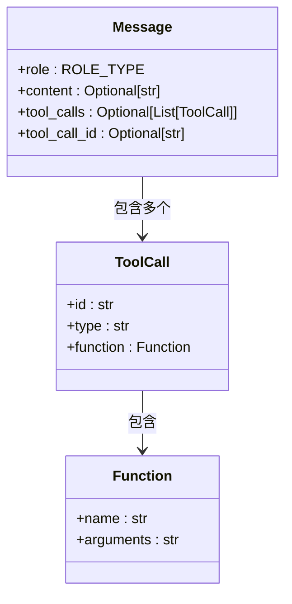
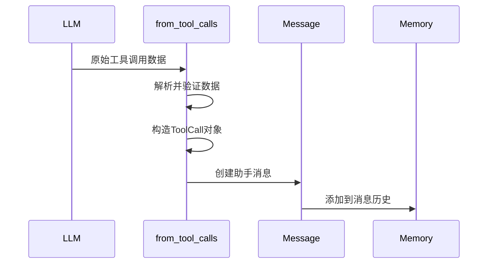

# 工具调用模型 (ToolCall & Function)

<cite>
**本文档中引用的文件**  
- [ToolCall](file://app/schema.py#L45-L50)
- [Function](file://app/schema.py#L40-L42)
- [Message.from_tool_calls](file://app/schema.py#L119-L138)
- [ToolCallAgent.execute_tool](file://app/agent/toolcall.py#L165-L207)
- [Message.tool_calls](file://app/agent/toolcall.py#L32-L32)
</cite>

## 目录
1. [引言](#引言)
2. [核心数据结构](#核心数据结构)
3. [ToolCall 类详解](#toolcall-类详解)
4. [Function 类详解](#function-类详解)
5. [工具调用解析流程](#工具调用解析流程)
6. [序列化与反序列化机制](#序列化与反序列化机制)
7. [错误处理机制](#错误处理机制)
8. [集成使用方式](#集成使用方式)
9. [JSON 载荷示例](#json-载荷示例)
10. [总结](#总结)

## 引言
本文档深入解析 OpenManus 项目中 `ToolCall` 和 `Function` 类的结构设计及其在智能体-工具交互协议中的核心作用。重点阐述工具调用模型如何实现 LLM 输出到可执行工具调用的转换，包括类型验证、参数解析、错误处理等关键机制。

## 核心数据结构



**图示来源**  
- [ToolCall](file://app/schema.py#L45-L50)
- [Function](file://app/schema.py#L40-L42)
- [Message](file://app/schema.py#L52-L96)

## ToolCall 类详解
`ToolCall` 类代表消息中的工具/函数调用，是智能体与工具交互的核心数据载体。

### 字段解析
- **id**: 唯一标识符，用于匹配工具调用请求与响应
- **type**: 调用类型，默认为 "function"，支持扩展其他类型
- **function**: 封装实际的函数调用信息，包含名称和参数

`ToolCall` 类通过 Pydantic 模型确保数据结构的完整性和类型安全，其 `function` 字段直接引用 `Function` 实例，形成清晰的组合关系。

**本节来源**  
- [ToolCall](file://app/schema.py#L45-L50)

## Function 类详解
`Function` 类封装工具调用的具体函数信息，是工具执行的最小单元。

### 设计意义
- **name**: 工具名称，用于在工具注册表中查找对应实现
- **arguments**: 参数序列化字符串，采用 JSON 格式存储函数参数

#### 参数序列化机制
`arguments` 字段设计为 JSON 字符串而非直接对象，具有以下优势：
1. **传输兼容性**: 确保在不同系统间传输时保持格式一致性
2. **延迟解析**: 允许在执行时才进行参数验证和类型转换
3. **错误隔离**: 参数解析错误可被捕获并处理，不影响主流程

该设计遵循 OpenAI 函数调用规范，确保与主流 LLM API 的兼容性。

**本节来源**  
- [Function](file://app/schema.py#L40-L42)

## 工具调用解析流程
LLM 输出的原始工具调用数据通过 `from_tool_calls` 工厂方法转换为标准 `ToolCall` 对象。

### 转换过程
1. 接收 LLM 输出的原始工具调用列表
2. 遍历每个调用，提取 id、function 和 type 字段
3. 使用 `function.model_dump()` 序列化函数信息
4. 构造标准 `ToolCall` 对象列表
5. 创建包含工具调用的助手消息



**图示来源**  
- [Message.from_tool_calls](file://app/schema.py#L119-L138)
- [ToolCallAgent.think](file://app/agent/toolcall.py#L60-L100)

## 序列化与反序列化机制
工具调用在系统各组件间传输时需进行序列化与反序列化。

### 序列化流程
1. `ToolCall` 对象通过 Pydantic 的 `dict()` 方法转换为字典
2. 字典结构符合 OpenAI API 规范
3. 通过 JSON 编码进行网络传输

### 反序列化流程
1. 接收 JSON 格式的工具调用数据
2. 使用 Pydantic 模型自动验证和解析
3. 构造 `ToolCall` 实例
4. 在执行前解析 `arguments` 字段


**图示来源**  
- [Message.from_tool_calls](file://app/schema.py#L119-L138)
- [ToolCallAgent.execute_tool](file://app/agent/toolcall.py#L165-L207)

## 错误处理机制
系统实现了多层次的错误处理机制，确保工具调用的健壮性。

### 类型验证规则
- `id` 必须为非空字符串
- `type` 必须为有效类型（默认 "function"）
- `function` 必须包含有效的 `name` 和 `arguments`

### 错误处理场景
1. **无效参数格式**: 当 `arguments` 不是有效 JSON 时，捕获 `json.JSONDecodeError`
2. **未知工具**: 工具名称不在注册表中时返回明确错误
3. **执行异常**: 捕获工具执行过程中的任何异常

```python
try:
    args = json.loads(command.function.arguments or "{}")
except json.JSONDecodeError:
    return f"Error: Invalid JSON format in arguments"
```

错误信息会被记录到日志并返回给用户，同时不影响系统整体运行。

**本节来源**  
- [ToolCallAgent.execute_tool](file://app/agent/toolcall.py#L165-L207)

## 集成使用方式
`ToolCall` 模型通过 `Message.tool_calls` 字段与消息系统深度集成。

### 集成要点
- **消息扩展**: `Message` 类的 `tool_calls` 字段支持工具调用列表
- **状态管理**: 工具调用状态在智能体内存中持久化
- **执行循环**: 在 `think` → `act` 循环中处理工具调用

`ToolCallAgent` 基类提供了完整的工具调用处理流程，包括：
1. 在 `think` 阶段接收 LLM 的工具调用建议
2. 在 `act` 阶段执行工具并记录结果
3. 将结果作为工具消息返回给 LLM

**本节来源**  
- [Message.tool_calls](file://app/agent/toolcall.py#L32-L32)
- [ToolCallAgent.think](file://app/agent/toolcall.py#L60-L100)
- [ToolCallAgent.act](file://app/agent/toolcall.py#L135-L163)

## JSON 载荷示例
以下是工具调用的典型输入输出格式示例。

### 输入格式 (LLM 输出)
```json
{
  "tool_calls": [
    {
      "id": "call_123",
      "type": "function",
      "function": {
        "name": "search",
        "arguments": "{\"query\": \"Python programming\", \"max_results\": 5}"
      }
    }
  ]
}
```

### 输出格式 (工具响应)
```json
{
  "role": "tool",
  "content": "Observed output of cmd `search` executed:\n[{'title': 'Python Guide', 'url': '...'}]",
  "tool_call_id": "call_123",
  "name": "search"
}
```

这些格式遵循标准的消息协议，确保了系统各组件间的互操作性。

**本节来源**  
- [Message.from_tool_calls](file://app/schema.py#L119-L138)
- [ToolCallAgent.execute_tool](file://app/agent/toolcall.py#L165-L207)

## 总结
`ToolCall` 和 `Function` 类构成了 OpenManus 项目中智能体-工具交互的核心协议。通过清晰的结构设计、严格的类型验证和完善的错误处理，系统实现了可靠、可扩展的工具调用机制。JSON 序列化参数设计平衡了灵活性与安全性，而与消息系统的深度集成确保了交互流程的顺畅。该模型不仅支持当前功能，也为未来扩展提供了坚实基础。