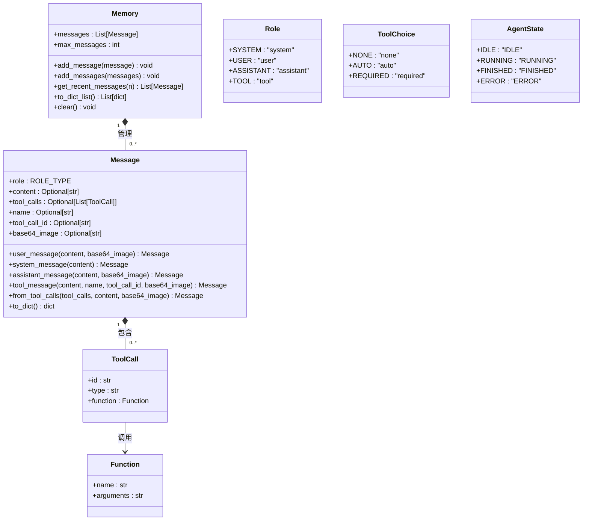

# 数据模型

<cite>
**本文档中引用的文件**   
- [schema.py](file://app/schema.py)
- [base.py](file://app/agent/base.py)
- [toolcall.py](file://app/agent/toolcall.py)
</cite>

## 目录
1. [简介](#简介)
2. [核心数据结构](#核心数据结构)
3. [消息模型](#消息模型)
4. [工具调用模型](#工具调用模型)
5. [枚举类型](#枚举类型)
6. [内存管理](#内存管理)
7. [实体关系图](#实体关系图)
8. [数据序列化示例](#数据序列化示例)
9. [数据验证规则](#数据验证规则)

## 简介
本文档全面介绍了OpenManus项目中的核心数据模型，重点解析了`schema.py`文件中定义的数据结构。这些模型构成了系统对话流、工具调用和状态管理的基础。文档详细说明了`Message`、`ToolCall`、`Function`、`Memory`等核心类的字段、方法和使用场景，以及`Role`、`ToolChoice`、`AgentState`等枚举类型的业务含义。

## 核心数据结构
OpenManus的数据模型围绕对话和工具交互构建，主要包含以下核心组件：
- **Message**: 表示对话中的单条消息，是信息交换的基本单元。
- **ToolCall**: 表示对工具或函数的调用请求。
- **Function**: 封装工具调用的具体函数信息。
- **Memory**: 管理对话历史消息的容器。
- **Role**: 定义消息发送者的角色。
- **ToolChoice**: 控制模型在响应中是否应调用工具。
- **AgentState**: 表示智能体的执行状态。

这些结构共同协作，实现了从用户输入到工具执行再到结果反馈的完整工作流。

**Section sources**
- [schema.py](file://app/schema.py#L6-L186)

## 消息模型
`Message`类是对话系统的核心，它定义了消息的结构和行为。

### 字段说明
`Message`类包含以下关键字段：

**role**
- **类型**: `ROLE_TYPE`
- **描述**: 消息角色，标识消息的发送者。有效值为`system`、`user`、`assistant`、`tool`。
- **作用**: 在对话流中区分不同参与方，指导模型如何处理消息。

**content**
- **类型**: `Optional[str]`
- **描述**: 消息的文本内容。
- **作用**: 传递主要信息，如用户请求、系统指令或助手的回复。

**tool_calls**
- **类型**: `Optional[List[ToolCall]]`
- **描述**: 一个工具调用对象的列表。
- **作用**: 当`role`为`assistant`时，此字段包含模型建议调用的工具列表，用于触发外部操作。

**name**
- **类型**: `Optional[str]`
- **描述**: 工具的名称。
- **作用**: 当`role`为`tool`时，此字段标识是哪个工具返回了结果。

**tool_call_id**
- **类型**: `Optional[str]`
- **描述**: 工具调用的唯一标识符。
- **作用**: 将`tool`角色的消息与之前`assistant`发起的`tool_call`关联起来，确保响应的正确匹配。

**base64_image**
- **类型**: `Optional[str]`
- **描述**: Base64编码的图像数据。
- **作用**: 支持多模态输入，允许在消息中嵌入图像。

**Section sources**
- [schema.py](file://app/schema.py#L56-L61)

### 工厂方法
`Message`类提供了静态工厂方法，用于便捷地创建不同角色的消息：

**user_message**
- **功能**: 创建用户消息。
- **参数**: `content` (消息内容), `base64_image` (可选的Base64图像)。
- **示例**: `Message.user_message("查询北京天气")`

**system_message**
- **功能**: 创建系统消息。
- **参数**: `content` (系统指令)。
- **示例**: `Message.system_message("你是一个有用的助手")`

**assistant_message**
- **功能**: 创建助手消息。
- **参数**: `content` (助手回复), `base64_image` (可选的Base64图像)。
- **示例**: `Message.assistant_message("正在为您查询...")`

**tool_message**
- **功能**: 创建工具消息，用于报告工具执行结果。
- **参数**: `content` (执行结果), `name` (工具名), `tool_call_id` (关联的调用ID), `base64_image` (可选的Base64图像)。
- **示例**: `Message.tool_message("天气: 晴, 温度: 25°C", "get_weather", "call_abc123")`

**from_tool_calls**
- **功能**: 从原始的工具调用列表创建一个包含`tool_calls`字段的助手消息。
- **参数**: `tool_calls` (原始调用列表), `content` (可选的附加内容)。
- **作用**: 将LLM返回的原始工具调用数据格式化为符合`Message`模型的结构，并自动设置`role`为`assistant`。

**Section sources**
- [schema.py](file://app/schema.py#L99-L131)

## 工具调用模型
该模型定义了工具调用的结构和序列化格式。

### ToolCall 结构
`ToolCall`类代表消息中的一个工具调用。

**id**
- **类型**: `str`
- **描述**: 调用的唯一标识符，由LLM生成。
- **作用**: 用于将后续的`tool`消息与此次调用关联。

**type**
- **类型**: `str`
- **默认值**: `"function"`
- **描述**: 调用的类型。
- **作用**: 目前固定为`"function"`，为未来扩展预留。

**function**
- **类型**: `Function`
- **描述**: 一个`Function`对象，包含要调用的函数的具体信息。
- **作用**: 封装了工具调用的核心参数。

**Section sources**
- [schema.py](file://app/schema.py#L48-L50)

### Function 结构
`Function`类封装了工具调用的函数信息。

**name**
- **类型**: `str`
- **描述**: 要调用的工具的名称。
- **作用**: 用于在工具注册表中查找并执行对应的工具。

**arguments**
- **类型**: `str`
- **描述**: 传递给函数的参数，以JSON字符串形式表示。
- **作用**: 包含调用工具所需的所有数据。例如，`{"location": "Beijing", "unit": "celsius"}`。

**Section sources**
- [schema.py](file://app/schema.py#L41-L42)

## 枚举类型
系统定义了多个枚举类型来约束关键字段的取值。

### Role
定义了消息的角色。

- **SYSTEM**: `"system"` - 系统指令，用于设定助手的行为和上下文。
- **USER**: `"user"` - 用户输入，代表用户的请求或问题。
- **ASSISTANT**: `"assistant"` - 助手的回复，可以是文本或包含工具调用。
- **TOOL**: `"tool"` - 工具执行结果，由系统或工具返回。

**业务含义**: 角色决定了消息在对话流中的位置和处理逻辑。例如，`assistant`消息可能触发工具执行，而`tool`消息则会将结果带回对话。

**Section sources**
- [schema.py](file://app/schema.py#L9-L12)

### ToolChoice
控制模型在响应中是否以及如何调用工具。

- **NONE**: `"none"` - 模型不应调用任何工具，仅生成文本回复。
- **AUTO**: `"auto"` - 模型可以自行决定是否调用工具。
- **REQUIRED**: `"required"` - 模型必须调用工具，不能仅生成文本。

**业务含义**: 此设置用于指导模型的行为。例如，在需要执行具体操作的场景下，可设置为`REQUIRED`以强制模型使用工具。

**Section sources**
- [schema.py](file://app/schema.py#L20-L24)

### AgentState
表示智能体（Agent）的执行状态。

- **IDLE**: `"IDLE"` - 空闲状态，等待任务。
- **RUNNING**: `"RUNNING"` - 正在执行任务。
- **FINISHED**: `"FINISHED"` - 任务已完成。
- **ERROR**: `"ERROR"` - 执行过程中发生错误。

**业务含义**: 状态机用于管理智能体的生命周期。例如，`ToolCallAgent`在执行`run`方法时会从`IDLE`进入`RUNNING`，并在完成或出错时切换到`FINISHED`或`ERROR`。

**Section sources**
- [schema.py](file://app/schema.py#L32-L37)

## 内存管理
`Memory`类负责管理对话的上下文历史。

### 消息管理机制
`Memory`通过一个`messages`列表来存储所有历史消息。

**add_message**
- **功能**: 向内存中添加一条消息。
- **行为**: 消息被追加到列表末尾。如果消息数量超过`max_messages`，则会自动移除最旧的消息，以保持内存大小。

**add_messages**
- **功能**: 向内存中批量添加多条消息。
- **行为**: 与`add_message`类似，但一次添加一个列表。

**get_recent_messages**
- **功能**: 获取最近的n条消息。
- **用途**: 通常用于构建发送给LLM的上下文窗口，确保模型只看到最近的相关对话。

**to_dict_list**
- **功能**: 将内存中的所有消息转换为字典列表。
- **用途**: 用于序列化，将消息列表转换为JSON兼容的格式，便于存储或传输。

**clear**
- **功能**: 清空所有消息。
- **用途**: 重置对话上下文。

**Section sources**
- [schema.py](file://app/schema.py#L162-L184)

## 实体关系图


**Diagram sources **
- [schema.py](file://app/schema.py#L53-L186)

## 数据序列化示例
以下是各模型的JSON序列化输出示例。

### 用户消息
```json
{
  "role": "user",
  "content": "帮我画一张日落的图片"
}
```

### 助手消息（包含工具调用）
```json
{
  "role": "assistant",
  "content": "我将为您生成一张日落图片。",
  "tool_calls": [
    {
      "id": "call_abc123",
      "type": "function",
      "function": {
        "name": "generate_image",
        "arguments": "{\"prompt\": \"a beautiful sunset over the ocean\", \"size\": \"1024x1024\"}"
      }
    }
  ]
}
```

### 工具消息（工具执行结果）
```json
{
  "role": "tool",
  "content": "Observed output of cmd `generate_image` executed:\nImage generated successfully.",
  "name": "generate_image",
  "tool_call_id": "call_abc123",
  "base64_image": "iVBORw0KGgoAAAANSUhEUgAAAAEAAAABCAYAAAAfFcSJAAAADUlEQVR42mP8/5+hHgAHggJ/PchI7wAAAABJRU5ErkJggg=="
}
```

### 内存序列化
```json
[
  {
    "role": "user",
    "content": "帮我画一张日落的图片"
  },
  {
    "role": "assistant",
    "content": "我将为您生成一张日落图片。",
    "tool_calls": [
      {
        "id": "call_abc123",
        "type": "function",
        "function": {
          "name": "generate_image",
          "arguments": "{\"prompt\": \"a beautiful sunset over the ocean\", \"size\": \"1024x1024\"}"
        }
      }
    ]
  },
  {
    "role": "tool",
    "content": "Observed output of cmd `generate_image` executed:\nImage generated successfully.",
    "name": "generate_image",
    "tool_call_id": "call_abc123",
    "base64_image": "iVBORw0KGgoAAAANSUhEUgAAAAEAAAABCAYAAAAfFcSJAAAADUlEQVR42mP8/5+hHgAHggJ/PchI7wAAAABJRU5ErkJggg=="
  }
]
```

**Section sources**
- [schema.py](file://app/schema.py#L83-L96)

## 数据验证规则
数据模型基于Pydantic构建，提供了强大的数据验证和类型约束。

### 类型约束
- 所有字段都具有明确的类型注解（如`str`, `Optional[str]`, `List[ToolCall]`），确保了数据的类型安全。
- 使用`Literal`类型（通过`ROLE_TYPE`和`TOOL_CHOICE_TYPE`）限制了`role`和`tool_choice`字段的取值范围，防止无效值的出现。

### 验证规则
- **必填字段**: `role`字段是必填的，创建`Message`实例时必须提供。
- **可选字段**: `content`, `tool_calls`, `name`, `tool_call_id`, `base64_image`均为可选字段，可以为`None`。
- **默认值**: `type`字段在`ToolCall`中默认为`"function"`。
- **数据转换**: `to_dict_list`方法确保了复杂对象（如`Message`和`ToolCall`）能够被正确地序列化为基本的字典和列表结构。

这些规则保证了数据模型的健壮性，使得系统各组件之间的数据交换更加可靠和可预测。

**Section sources**
- [schema.py](file://app/schema.py#L53-L186)