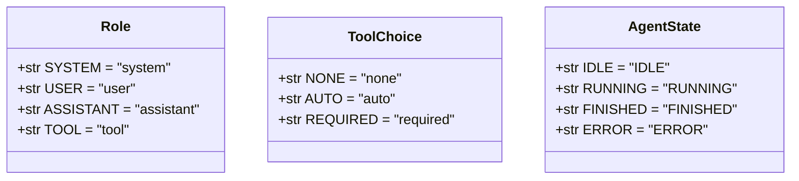
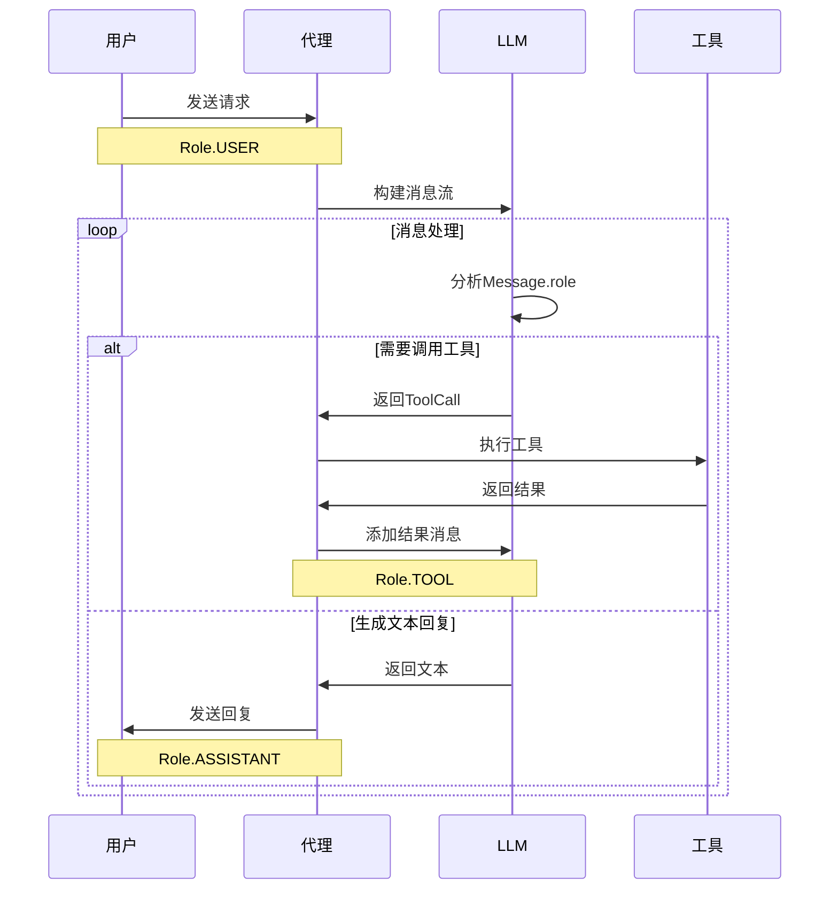
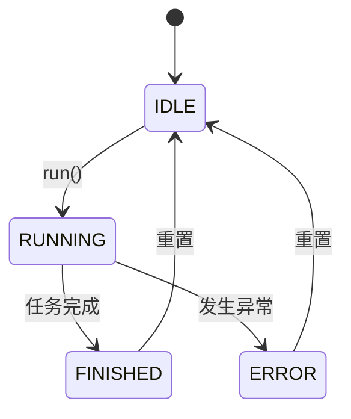

# 枚举类型模型

<cite>
**Referenced Files in This Document**   
- [schema.py](file://app/schema.py)
- [toolcall.py](file://app/agent/toolcall.py)
- [base.py](file://app/agent/base.py)
- [llm.py](file://app/llm.py)
- [config.example.toml](file://config/config.example.toml)
</cite>

## 目录
1. [引言](#引言)
2. [核心枚举类型定义](#核心枚举类型定义)
3. [Role枚举：对话角色与消息路由](#role枚举对话角色与消息路由)
4. [ToolChoice枚举：工具调用策略控制](#toolchoice枚举工具调用策略控制)
5. [AgentState枚举：代理生命周期管理](#agentstate枚举代理生命周期管理)
6. [序列化与配置应用](#序列化与配置应用)
7. [结论](#结论)

## 引言
本文档全面阐述了OpenManus项目中定义的核心枚举类型及其在系统架构中的业务语义。重点分析了`Role`、`ToolChoice`和`AgentState`三个枚举，它们分别在对话状态机、LLM工具调用策略和代理生命周期管理中扮演着关键角色。通过详细解释这些枚举的定义、作用、转换逻辑以及在配置文件和API中的实际应用，本文旨在为开发者提供一个清晰、深入的参考，以更好地理解和使用OpenManus的底层机制。

## 核心枚举类型定义

所有核心枚举均在`app/schema.py`文件中定义，它们继承自Python的`Enum`类，并通过`str`混入使其值可直接作为字符串使用，这极大地简化了序列化和API交互过程。



**Diagram sources**
- [schema.py](file://app/schema.py#L6-L37)

**Section sources**
- [schema.py](file://app/schema.py#L6-L37)

## Role枚举：对话角色与消息路由

`Role`枚举定义了对话中四种基本的消息角色，是构建对话状态机和实现消息路由的基础。

### 角色定义与作用
- **SYSTEM**: 代表系统指令或提示词（prompt），用于设定AI的行为、角色和任务目标。它通常作为对话的初始消息，为后续交互提供上下文。
- **USER**: 代表用户输入，是对话的起点和主要驱动力。所有来自用户的查询和指令都以该角色发送。
- **ASSISTANT**: 代表AI代理的回复。当LLM生成文本响应或决定调用工具时，其输出消息的角色为此。
- **TOOL**: 代表工具执行的结果。当一个工具（如代码解释器、网络搜索）被调用后，其返回的结果会以该角色的消息形式注入对话流，供LLM进行下一步推理。

### 在提示工程和消息路由中的应用
`Role`枚举在`Message`类中被直接使用，通过工厂方法（如`Message.user_message()`、`Message.assistant_message()`）来创建不同角色的消息，确保了消息创建的类型安全和一致性。

在消息路由方面，`Role`是决定消息如何被处理的关键。例如，在`LLM.format_messages`方法中，系统会检查每条消息的`role`字段，如果角色无效（不在`ROLE_VALUES`中），则会抛出`ValueError`，从而保证了发送给LLM的消息流的正确性。



**Diagram sources**
- [schema.py](file://app/schema.py#L98-L138)
- [llm.py](file://app/llm.py#L283-L301)
- [base.py](file://app/agent/base.py#L73-L113)

**Section sources**
- [schema.py](file://app/schema.py#L6-L12)
- [base.py](file://app/agent/base.py#L73-L113)

## ToolChoice枚举：工具调用策略控制

`ToolChoice`枚举用于控制LLM在响应时的工具调用行为，是实现精细化工具调用策略的核心。

### 枚举值与使用场景
- **NONE**: 禁用工具调用。在此模式下，即使LLM认为需要调用工具，系统也会忽略该请求，并将LLM的思考过程作为普通文本回复返回。这在需要纯文本交互或调试时非常有用。
- **AUTO**: 启用自动工具调用。这是默认模式，LLM可以根据需要自由选择是否调用工具。系统会根据LLM的决策来执行相应的工具调用流程。
- **REQUIRED**: 强制要求工具调用。在此模式下，LLM必须返回一个或多个工具调用，否则会被视为错误。这适用于必须通过工具（如代码执行）才能完成的任务。

### 配置方法与实现逻辑
在`ToolCallAgent`类中，`tool_choices`字段的默认值为`ToolChoice.AUTO`。开发者可以通过继承或实例化时传参来改变此行为。

其控制逻辑主要在`ToolCallAgent.think()`方法中实现：
1.  调用`self.llm.ask_tool()`时，将`self.tool_choices`作为`tool_choice`参数传递给LLM。
2.  接收到LLM响应后，根据当前的`tool_choices`模式进行处理：
    *   若为`NONE`且LLM返回了工具调用，则记录警告并仅将内容作为文本回复。
    *   若为`REQUIRED`但没有工具调用，则会触发一个逻辑，确保在后续的`act()`步骤中处理此错误。

```mermaid
flowchart TD
Start([开始 think()]) --> GetResponse["调用LLM.ask_tool()"]
GetResponse --> CheckMode{"检查 tool_choices 模式"}
CheckMode --> |NONE| HandleNone["忽略工具调用<br>仅返回文本内容"]
CheckMode --> |AUTO| HandleAuto{"有工具调用?"}
CheckMode --> |REQUIRED| HandleRequired{"有工具调用?"}
HandleAuto --> |是| CreateAssistantMsg["创建含tool_calls的ASSISTANT消息"]
HandleAuto --> |否| ReturnContent["返回内容继续"]
HandleRequired --> |是| CreateAssistantMsg
HandleRequired --> |否| ReturnTrue["返回True<br>等待act()处理"]
CreateAssistantMsg --> AddToMemory["添加消息到记忆"]
AddToMemory --> End([结束])
ReturnContent --> End
ReturnTrue --> End
HandleNone --> AddToMemory
```

**Diagram sources**
- [toolcall.py](file://app/agent/toolcall.py#L44-L114)
- [llm.py](file://app/llm.py#L636-L733)

**Section sources**
- [schema.py](file://app/schema.py#L19-L24)
- [toolcall.py](file://app/agent/toolcall.py#L44-L114)

## AgentState枚举：代理生命周期管理

`AgentState`枚举定义了代理（Agent）在其生命周期内的四种核心状态，是实现执行监控和错误恢复的基础。

### 状态流转机制
代理的状态流转遵循一个严格的控制流程：
1.  **IDLE**: 代理的初始和空闲状态。当代理完成任务或发生错误后，通常会回到此状态。
2.  **RUNNING**: 代理开始执行任务时的状态。通过`state_context`上下文管理器，代理在`run()`方法执行期间被安全地切换到此状态。
3.  **FINISHED**: 代理成功完成所有任务后的状态。例如，当一个`Terminate`工具被成功执行时，代理会将状态设置为`FINISHED`。
4.  **ERROR**: 当代理在执行过程中遇到未处理的异常时，状态会自动切换到`ERROR`。这是通过`state_context`的异常处理机制实现的。

### 执行监控与错误恢复
`AgentState`使得外部系统可以轻松监控代理的执行情况。例如，在`run()`方法中，主循环会检查`self.state != AgentState.FINISHED`作为继续执行的条件之一。

错误恢复主要通过上下文管理器实现。`BaseAgent.state_context()`方法确保了即使在`RUNNING`状态下发生异常，代理的状态也会被设置为`ERROR`，并且在`finally`块中，状态会恢复到进入上下文之前的状态，保证了状态机的健壮性。



**Diagram sources**
- [base.py](file://app/agent/base.py#L38-L71)
- [base.py](file://app/agent/base.py#L115-L153)

**Section sources**
- [schema.py](file://app/schema.py#L31-L37)
- [base.py](file://app/agent/base.py#L38-L71)

## 序列化与配置应用

### 序列化为字符串的实现原理
所有枚举类都继承自`str, Enum`。这意味着每个枚举成员的值（如`Role.USER`）本身就是一个字符串对象。当调用`Message.to_dict()`方法时，`self.role`（一个`Role`类型的枚举）会直接被转换为其对应的字符串值（如`"user"`），并作为字典的`"role"`键的值。这种设计使得序列化过程简单、高效且无歧义。

### 实际使用示例
- **配置文件**: 在`config.example.toml`中，虽然没有直接配置枚举值，但`llm`配置块中的`model`等字段的值，最终会与`ToolChoice`等策略结合使用。
- **API接口**: `LLM.ask_tool()`方法的`tool_choice`参数直接接受`ToolChoice`类型的枚举值，保证了API的类型安全。
- **日志输出**: 在`toolcall.py`中，日志会打印`self.tool_choices == ToolChoice.NONE`等判断，其输出为`tool_choices=none`，直接使用了枚举的字符串值。

**Section sources**
- [schema.py](file://app/schema.py#L63-L96)
- [config.example.toml](file://config/config.example.toml#L1-L106)

## 结论
`Role`、`ToolChoice`和`AgentState`这三个枚举是OpenManus系统架构的基石。它们通过清晰的语义定义和严格的类型约束，分别管理着对话流、工具交互策略和代理的执行生命周期。理解这些枚举的定义、作用和流转逻辑，对于深入掌握OpenManus的工作原理、进行二次开发或调试问题至关重要。其基于`str, Enum`的实现方式，不仅保证了代码的健壮性，也简化了与外部系统（如LLM API）的集成。