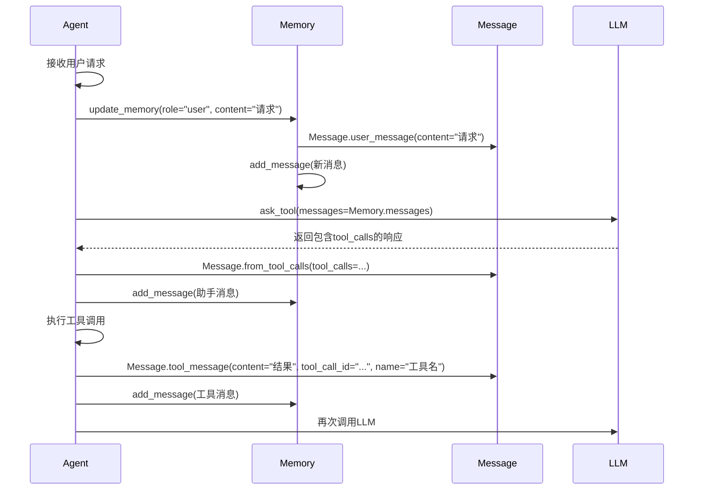

# 消息模型 (Message)

<cite>
**Referenced Files in This Document**   
- [app/schema.py](file://app/schema.py)
- [app/agent/base.py](file://app/agent/base.py)
- [app/agent/toolcall.py](file://app/agent/toolcall.py)
- [app/agent/react.py](file://app/agent/react.py)
</cite>

## 目录
1. [简介](#简介)
2. [核心字段详解](#核心字段详解)
3. [工厂方法](#工厂方法)
4. [魔术方法](#魔术方法)
5. [序列化方法](#序列化方法)
6. [与会话记忆的集成](#与会话记忆的集成)
7. [JSON序列化样例](#json序列化样例)
8. [约束与验证](#约束与验证)

## 简介
`Message` 类是 OpenManus 对话流中的核心数据结构，用于表示会话中的单条消息。它基于 Pydantic 模型构建，确保了数据的类型安全和结构化。该类不仅定义了消息的基本属性，还提供了便捷的工厂方法、操作符重载和序列化功能，以支持在代理（Agent）系统中高效地构建和管理对话历史。

**Section sources**
- [app/schema.py](file://app/schema.py#L53-L155)

## 核心字段详解
`Message` 类包含多个关键字段，每个字段都有其特定的语义和使用场景。

### role (角色)
`role` 字段是 `Message` 的核心标识，其类型为 `ROLE_TYPE`，该类型由 `Role` 枚举派生。`Role` 枚举定义了四种标准角色：
- **`Role.SYSTEM`**: 系统消息，用于向语言模型提供上下文、指令或规则。
- **`Role.USER`**: 用户消息，代表最终用户的输入。
- **`Role.ASSISTANT`**: 助手消息，代表代理（Agent）或语言模型的回复。
- **`Role.TOOL`**: 工具消息，代表工具执行的结果，由工具的名称和 `tool_call_id` 关联。

`role` 字段是必填的，它决定了消息在整个对话流程中的行为和处理方式。

### content (内容)
`content` 字段是可选的字符串，用于存储消息的文本内容。对于 `USER` 和 `SYSTEM` 角色，这是主要的输入信息。对于 `ASSISTANT` 角色，它可以是文本回复或为空（当仅包含 `tool_calls` 时）。对于 `TOOL` 角色，它包含工具执行的观察结果。

### tool_calls (工具调用)
`tool_calls` 字段是可选的 `ToolCall` 对象列表，仅在 `ASSISTANT` 角色的消息中使用。它表示代理请求执行的工具调用。每个 `ToolCall` 包含一个唯一的 `id`、`type`（通常为 "function"）和一个 `function` 对象（包含工具名和参数）。此字段的存在指示了代理希望调用外部工具。

### tool_call_id (工具调用ID)
`tool_call_id` 字段是可选的字符串，仅在 `TOOL` 角色的消息中使用。它必须与 `ASSISTANT` 消息中某个 `tool_calls` 的 `id` 完全匹配，以此来将工具的执行结果与原始的调用请求关联起来。

### name (名称)
`name` 字段是可选的字符串，仅在 `TOOL` 角色的消息中使用。它表示执行该工具调用的工具的名称，用于在日志和调试信息中进行识别。

### base64_image (Base64图像)
`base64_image` 字段是可选的字符串，用于嵌入以 Base64 编码的图像数据。它可以在任何角色的消息中使用，为多模态交互提供支持。

**Section sources**
- [app/schema.py](file://app/schema.py#L56-L61)

## 工厂方法
`Message` 类提供了多个类方法（工厂方法）来简化不同类型消息的创建，避免了直接实例化时的样板代码。

### user_message
```python
@classmethod
def user_message(cls, content: str, base64_image: Optional[str] = None) -> "Message":
    """Create a user message"""
    return cls(role=Role.USER, content=content, base64_image=base64_image)
```
此方法用于创建用户消息。它接受 `content`（必填）和可选的 `base64_image` 作为参数。

### system_message
```python
@classmethod
def system_message(cls, content: str) -> "Message":
    """Create a system message"""
    return cls(role=Role.SYSTEM, content=content)
```
此方法用于创建系统消息。它仅接受 `content` 参数。

### assistant_message
```python
@classmethod
def assistant_message(
    cls, content: Optional[str] = None, base64_image: Optional[str] = None
) -> "Message":
    """Create an assistant message"""
    return cls(role=Role.ASSISTANT, content=content, base64_image=base64_image)
```
此方法用于创建助手消息。`content` 和 `base64_image` 均为可选。

### tool_message
```python
@classmethod
def tool_message(
    cls, content: str, name, tool_call_id: str, base64_image: Optional[str] = None
) -> "Message":
    """Create a tool message"""
    return cls(
        role=Role.TOOL,
        content=content,
        name=name,
        tool_call_id=tool_call_id,
        base64_image=base64_image,
    )
```
此方法用于创建工具消息。它要求提供 `content`、`name`（工具名）和 `tool_call_id`。

### from_tool_calls
```python
@classmethod
def from_tool_calls(
    cls,
    tool_calls: List[Any],
    content: Union[str, List[str]] = "",
    base64_image: Optional[str] = None,
    **kwargs,
) -> "Message":
    """Create ToolCallsMessage from raw tool calls."""
    formatted_calls = [
        {"id": call.id, "function": call.function.model_dump(), "type": "function"}
        for call in tool_calls
    ]
    return cls(
        role=Role.ASSISTANT,
        content=content,
        tool_calls=formatted_calls,
        base64_image=base64_image,
        **kwargs,
    )
```
这是一个高级工厂方法，专门用于将语言模型返回的原始 `tool_calls` 列表（通常来自 LLM API 响应）转换为一个格式化的 `Message` 实例。它会将原始调用数据重新格式化为符合 `Message` 模型要求的结构。

**Section sources**
- [app/schema.py](file://app/schema.py#L99-L155)

## 魔术方法
`Message` 类实现了两个魔术方法，以支持更自然的列表操作。

### `__add__` 方法
```python
def __add__(self, other) -> List["Message"]:
    """支持 Message + list 或 Message + Message 的操作"""
    if isinstance(other, list):
        return [self] + other
    elif isinstance(other, Message):
        return [self, other]
    else:
        raise TypeError(...)
```
此方法允许 `Message` 实例与 `list` 或另一个 `Message` 实例进行 `+` 运算。其结果总是一个 `Message` 对象的列表。例如，`msg + [msg1, msg2]` 会返回 `[msg, msg1, msg2]`。

### `__radd__` 方法
```python
def __radd__(self, other) -> List["Message"]:
    """支持 list + Message 的操作"""
    if isinstance(other, list):
        return other + [self]
    else:
        raise TypeError(...)
```
此方法是 `__add__` 的反向版本，用于处理 `list + Message` 的情况。这使得 `Message` 可以作为 `sum()` 函数的初始值，从而方便地将多个消息累加成一个列表。

**Section sources**
- [app/schema.py](file://app/schema.py#L63-L72)

## 序列化方法
### to_dict
```python
def to_dict(self) -> dict:
    """Convert message to dictionary format"""
    message = {"role": self.role}
    if self.content is not None:
        message["content"] = self.content
    if self.tool_calls is not None:
        message["tool_calls"] = [tool_call.dict() for tool_call in self.tool_calls]
    if self.name is not None:
        message["name"] = self.name
    if self.tool_call_id is not None:
        message["tool_call_id"] = self.tool_call_id
    if self.base64_image is not None:
        message["base64_image"] = self.base64_image
    return message
```
`to_dict` 方法将 `Message` 实例转换为一个标准的 Python 字典。这是与外部系统（如 LLM API）交互的关键步骤，因为 API 通常期望接收字典格式的消息列表。该方法会智能地省略值为 `None` 的字段。

**Section sources**
- [app/schema.py](file://app/schema.py#L83-L96)

## 与会话记忆的集成
`Message` 实例的生命周期由 `Memory` 类管理，后者是代理（Agent）状态的核心组成部分。

### Memory 类
`Memory` 是一个 Pydantic 模型，其核心是一个 `messages` 列表，该列表的元素类型正是 `Message`。
```python
class Memory(BaseModel):
    messages: List[Message] = Field(default_factory=list)
    max_messages: int = Field(default=100)
```
`Memory` 提供了多种方法来管理 `Message`：
- `add_message(message: Message)`: 将单个消息添加到记忆中。
- `add_messages(messages: List[Message])`: 批量添加消息。
- `get_recent_messages(n: int)`: 获取最近的 `n` 条消息，常用于构建上下文窗口。
- `clear()`: 清空所有记忆。

### 在代理中的使用
在 `BaseAgent` 中，`Memory` 实例通过 `update_memory` 方法被间接操作。该方法根据 `role` 参数选择合适的 `Message` 工厂方法来创建消息，并将其添加到 `self.memory` 中。
```python
def update_memory(self, role: ROLE_TYPE, content: str, ...):
    # ... 根据 role 选择工厂方法 ...
    self.memory.add_message(message_map[role](content, **kwargs))
```
在 `ToolCallAgent` 等具体代理中，当工具执行完毕后，会使用 `tool_message` 工厂方法创建一个 `TOOL` 角色的消息，并通过 `memory.add_message` 将其添加到会话历史中，从而完成一个完整的“思考-行动”循环。



**Diagram sources**
- [app/schema.py](file://app/schema.py#L53-L155)
- [app/schema.py](file://app/schema.py#L158-L186)
- [app/agent/base.py](file://app/agent/base.py#L140-L155)
- [app/agent/toolcall.py](file://app/agent/toolcall.py#L100-L120)

**Section sources**
- [app/schema.py](file://app/schema.py#L158-L186)
- [app/agent/base.py](file://app/agent/base.py#L140-L155)
- [app/agent/toolcall.py](file://app/agent/toolcall.py#L100-L120)

## JSON序列化样例
以下是一个 `Message` 实例调用 `to_dict()` 方法后可能产生的 JSON 输出样例：

```json
[
  {
    "role": "system",
    "content": "你是一个有用的助手。"
  },
  {
    "role": "user",
    "content": "请帮我搜索一下OpenManus项目。",
    "base64_image": "data:image/png;base64,iVBORw0KGgoAAAANSUhEUgAA..."
  },
  {
    "role": "assistant",
    "content": "我将为您搜索OpenManus项目。",
    "tool_calls": [
      {
        "id": "call_123",
        "type": "function",
        "function": {
          "name": "web_search",
          "arguments": "{\"query\": \"OpenManus 项目\"}"
        }
      }
    ]
  },
  {
    "role": "tool",
    "content": "找到了关于OpenManus的GitHub仓库。",
    "tool_call_id": "call_123",
    "name": "web_search"
  }
]
```

**Section sources**
- [app/schema.py](file://app/schema.py#L83-L96)

## 约束与验证
`Message` 类的设计内置了多种约束和验证规则，以确保数据的完整性：

1.  **类型验证**: 通过 Pydantic 模型，所有字段的类型在实例化时都会被严格检查。
2.  **角色约束**: `role` 字段的类型 `ROLE_TYPE` 是一个由 `Role` 枚举值生成的字面量联合类型，确保了角色值只能是 `"system"`, `"user"`, `"assistant"`, 或 `"tool"` 之一。
3.  **字段存在性**: `role` 是必填字段，而其他字段均为可选，这符合 OpenAI 等主流 LLM API 的消息格式规范。
4.  **逻辑约束**: 虽然模型本身不强制，但业务逻辑要求 `tool_call_id` 必须与先前 `ASSISTANT` 消息中的 `tool_calls` ID 匹配，否则会破坏对话的连贯性。

**常见误用场景及解决方案**:
- **误用**: 在创建 `TOOL` 消息时，`tool_call_id` 与之前的 `ASSISTANT` 消息不匹配。
  - **解决方案**: 确保在调用 `tool_message` 时，传入的 `tool_call_id` 是从 `tool_calls` 列表中获取的正确 ID。
- **误用**: 尝试为 `SYSTEM` 或 `USER` 消息设置 `tool_calls` 字段。
  - **解决方案**: `tool_calls` 应仅由 `ASSISTANT` 角色的消息生成。如果需要，应使用 `from_tool_calls` 工厂方法。
- **误用**: 直接修改 `Memory.messages` 列表而绕过 `add_message` 方法。
  - **解决方案**: 始终使用 `Memory` 类提供的方法（如 `add_message`）来操作消息列表，以确保消息限制等逻辑得到正确执行。

**Section sources**
- [app/schema.py](file://app/schema.py#L53-L155)
- [app/schema.py](file://app/schema.py#L158-L186)