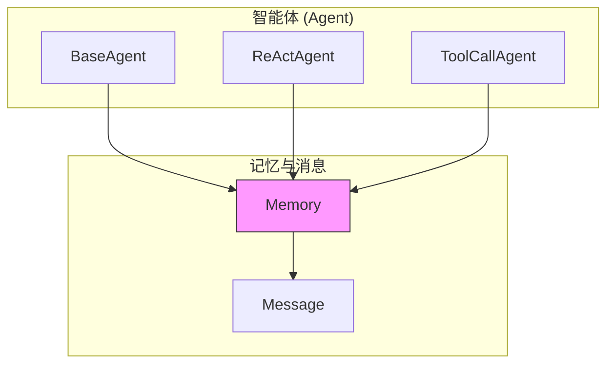
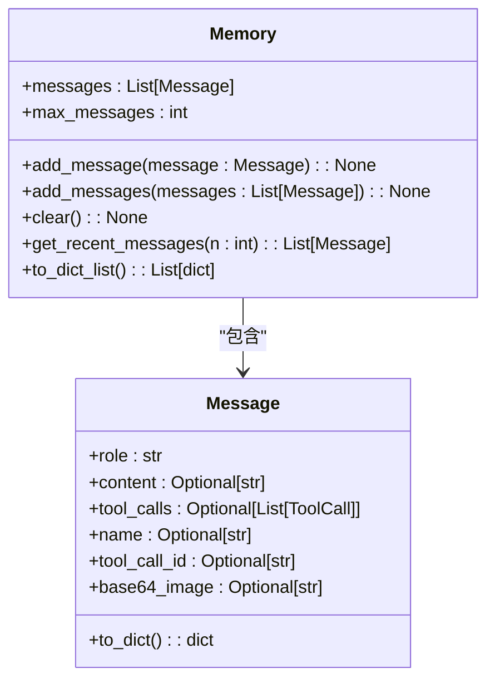
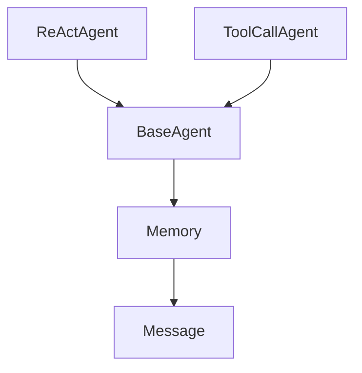

# 记忆模型 (Memory)

<cite>
**本文档中引用的文件**   
- [schema.py](file://app/schema.py)
- [base.py](file://app/agent/base.py)
- [toolcall.py](file://app/agent/toolcall.py)
- [react.py](file://app/agent/react.py)
</cite>

## 目录
1. [简介](#简介)
2. [核心组件](#核心组件)
3. [架构概述](#架构概述)
4. [详细组件分析](#详细组件分析)
5. [依赖分析](#依赖分析)
6. [性能考虑](#性能考虑)
7. [故障排除指南](#故障排除指南)
8. [结论](#结论)

## 简介
`Memory` 类是 OpenManus 框架中的核心会话记忆存储组件，负责管理对话过程中的消息历史记录。该类设计用于在多轮对话场景中持久化上下文信息，同时通过滑动窗口机制防止内存溢出。它被多个智能体（Agent）类广泛使用，作为其状态管理和上下文感知的基础。`Memory` 类提供了添加、检索、清除和序列化消息的完整功能集，支持与大型语言模型（LLM）API 的无缝集成。

## 核心组件

`Memory` 类的核心功能围绕 `messages` 列表和 `max_messages` 限制参数构建。`messages` 列表存储了按时间顺序排列的 `Message` 对象，构成了对话的完整历史。`max_messages` 参数则定义了该列表的最大容量，是实现内存保护机制的关键。类中提供的 `add_message`、`add_messages`、`get_recent_messages`、`clear` 和 `to_dict_list` 方法共同构成了一个高效、安全的消息管理接口。

**Section sources**
- [schema.py](file://app/schema.py#L158-L186)

## 架构概述

`Memory` 类作为数据模型，被集成在 `BaseAgent` 及其所有子类（如 `ReActAgent`、`ToolCallAgent`）的架构中。它位于智能体的核心，与 `LLM`（语言模型）和 `Message` 类紧密协作。当智能体与环境交互时，所有输入和输出消息都会通过 `Memory` 实例进行记录。这种设计实现了关注点分离，使得智能体的业务逻辑（在 `step` 方法中）可以专注于决策，而将状态持久化委托给 `Memory`。

**Diagram sources **
- [schema.py](file://app/schema.py#L158-L186)
- [base.py](file://app/agent/base.py#L33)

## 详细组件分析

### Memory 类分析

`Memory` 类的设计旨在提供一个线程安全、内存高效且易于使用的会话记忆解决方案。

#### 核心属性

**Diagram sources **
- [schema.py](file://app/schema.py#L158-L186)

#### 消息添加与滑动窗口清理
`add_message` 和 `add_messages` 方法是维护消息历史的主要入口。它们不仅将新消息追加到 `messages` 列表末尾，还立即检查列表长度是否超过了 `max_messages` 的限制。如果超出，会通过切片操作 `self.messages[-self.max_messages:]` 自动执行滑动窗口清理。此操作保留最新的 `max_messages` 条消息，丢弃最旧的消息，从而确保内存使用量恒定，有效防止了长对话导致的内存溢出问题。

**Section sources**
- [schema.py](file://app/schema.py#L162-L174)

#### 上下文截取与性能优化
`get_recent_messages` 方法在与 LLM API 交互时至关重要。它允许智能体仅提取最近的 `n` 条消息作为上下文发送给模型。在长对话场景下，这避免了将整个历史记录（可能非常庞大）传递给 LLM，从而显著降低了 API 调用的开销（token 消耗）和延迟，实现了关键的性能优化。

**Section sources**
- [schema.py](file://app/schema.py#L180-L182)

#### 重置与序列化
`clear` 方法提供了一种重置机制，通过调用 `self.messages.clear()` 来清空所有消息，将记忆恢复到初始状态。`to_dict_list` 方法则用于序列化，它遍历 `messages` 列表，调用每个 `Message` 对象的 `to_dict()` 方法，将其转换为字典列表。这种格式是与外部 LLM API 通信的标准数据格式，便于进行 JSON 序列化和网络传输。

**Section sources**
- [schema.py](file://app/schema.py#L176-L178)
- [schema.py](file://app/schema.py#L184-L186)

### 典型工作流示例
一个典型的记忆管理工作流如下：
1.  **初始化**：创建 `Memory` 实例，`max_messages` 默认为 100。
2.  **添加消息**：用户输入后，调用 `add_message` 将 `user` 消息加入记忆。
3.  **获取上下文**：调用 `get_recent_messages(n)` 获取最近的 `n` 条消息作为 LLM 的输入。
4.  **LLM 响应**：LLM 生成响应后，调用 `add_message` 将 `assistant` 消息加入记忆。
5.  **循环**：重复步骤 2-4 进行多轮对话。
6.  **清理**：在会话结束或需要重置时，调用 `clear()` 方法。

**Section sources**
- [base.py](file://app/agent/base.py#L107-L113)
- [toolcall.py](file://app/agent/toolcall.py#L65)

## 依赖分析

`Memory` 类的依赖关系清晰且内聚。其主要依赖是 `Message` 类，用于构成其内部列表的元素。`Memory` 类本身被 `BaseAgent` 类作为字段直接依赖，并通过继承关系被 `ReActAgent`、`ToolCallAgent` 等所有具体智能体类间接依赖。这种设计模式确保了所有智能体都拥有统一的记忆管理能力。

**Diagram sources **
- [schema.py](file://app/schema.py#L158-L186)
- [base.py](file://app/agent/base.py#L33)
- [react.py](file://app/agent/react.py#L18)

## 性能考虑

`Memory` 类的设计在性能方面表现良好。`append` 和 `extend` 操作在 Python 列表上是 O(1) 和 O(k) 的，效率很高。滑动窗口清理虽然涉及列表切片，但由于 `max_messages` 限制了列表的最大尺寸，因此该操作的时间和空间复杂度是常数级的 O(max_messages)，不会随对话无限增长而恶化。`get_recent_messages` 的切片操作同样高效。主要的性能瓶颈在于 `to_dict_list` 方法，它需要遍历整个消息列表并为每条消息调用 `to_dict()`，其复杂度为 O(n)，其中 n 是当前消息数量。在 `max_messages` 限制下，这个值是可控的。

## 故障排除指南

*   **问题**：对话历史似乎被截断或丢失。
    *   **检查**：确认 `max_messages` 的值是否过小。可以通过在初始化 `Memory` 时设置更高的 `max_messages` 值来解决。
*   **问题**：向 LLM 发送的上下文不完整。
    *   **检查**：确认调用 `get_recent_messages(n)` 时的 `n` 值是否足够大，以包含所需的上下文。
*   **问题**：内存使用量持续增长。
    *   **检查**：验证 `add_message` 和 `add_messages` 方法中的滑动窗口逻辑是否被正确执行。确保 `max_messages` 参数被正确设置。

**Section sources**
- [schema.py](file://app/schema.py#L166-L167)
- [schema.py](file://app/schema.py#L173-L174)

## 结论

`Memory` 类是一个设计精良、功能完备的会话记忆管理器。它通过 `messages` 列表和 `max_messages` 限制的组合，成功地在保留上下文和防止内存溢出之间取得了平衡。其提供的方法集覆盖了消息管理的全生命周期，从添加、检索到清除和序列化。该类被智能体架构深度集成，是实现复杂、多轮对话智能体的基石。其简单而有效的滑动窗口策略是处理长对话场景的最佳实践，确保了系统的稳定性和可预测性。