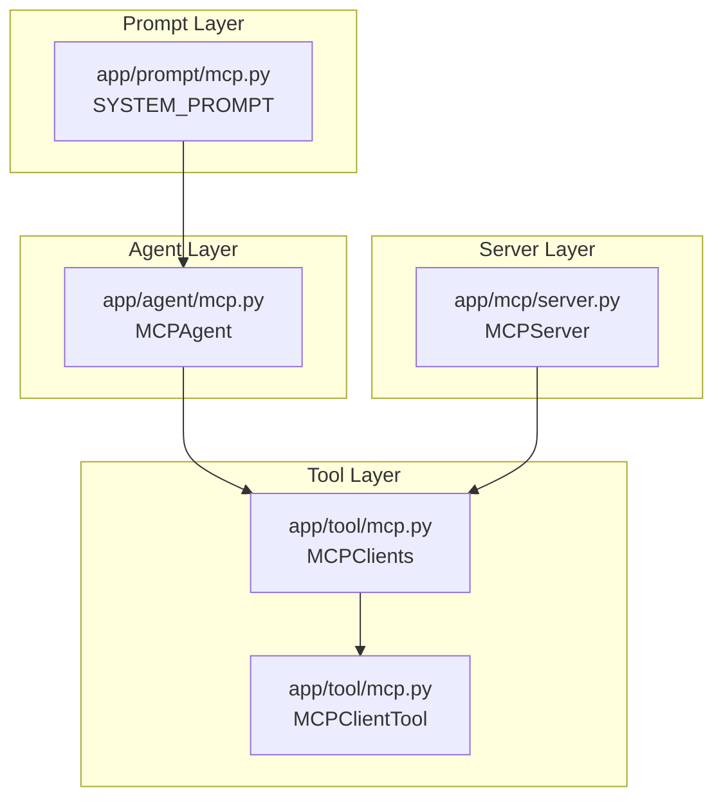
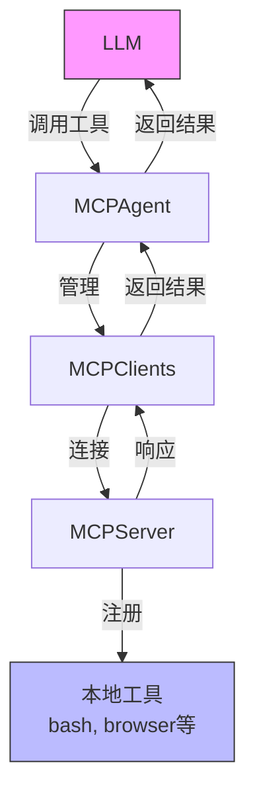
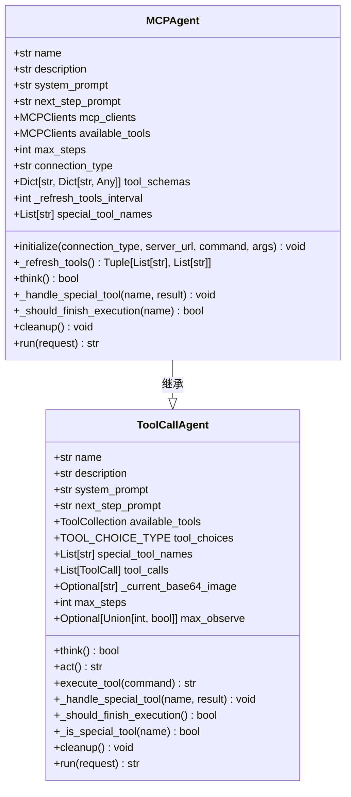
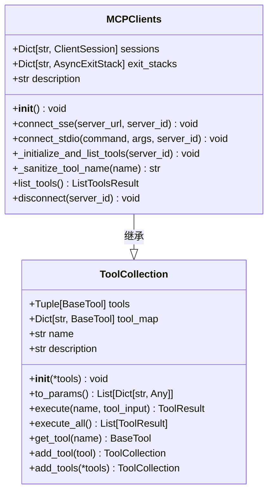
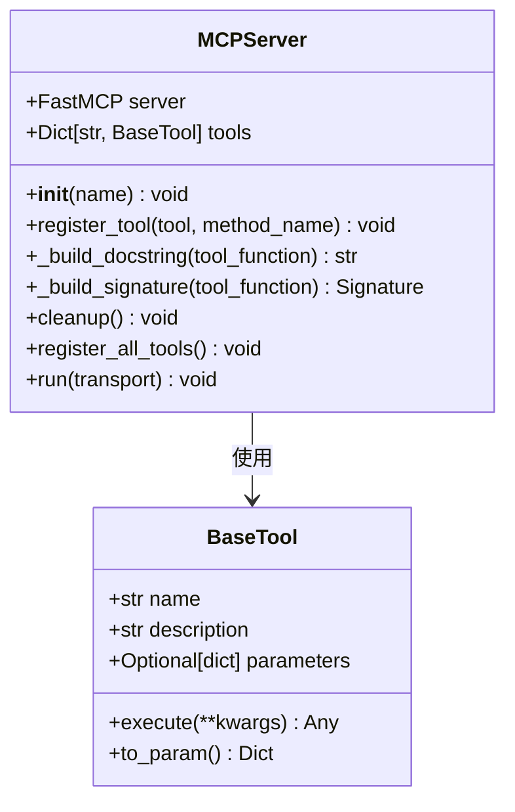
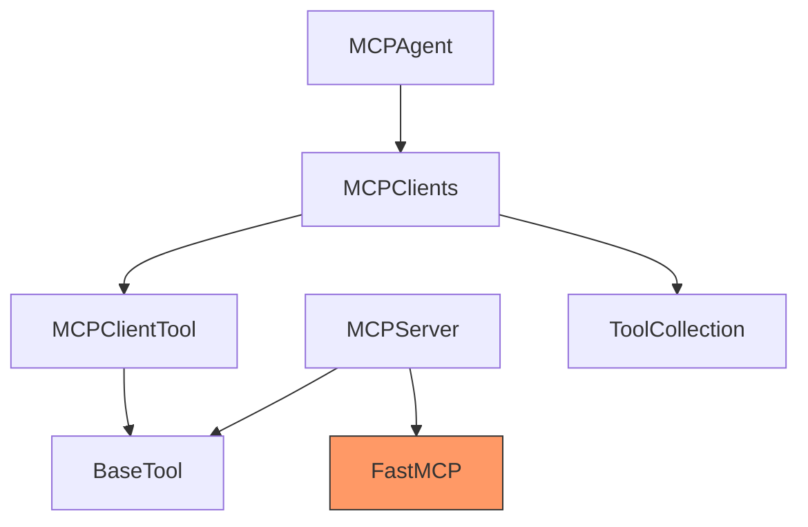

# MCP协议介绍

<cite>
**本文档引用的文件**   
- [mcp.py](file://app/agent/mcp.py)
- [mcp.py](file://app/tool/mcp.py)
- [server.py](file://app/mcp/server.py)
- [mcp.py](file://app/prompt/mcp.py)
- [base.py](file://app/tool/base.py)
- [tool_collection.py](file://app/tool/tool_collection.py)
- [toolcall.py](file://app/agent/toolcall.py)
</cite>

## 目录
1. [引言](#引言)
2. [项目结构](#项目结构)
3. [核心组件](#核心组件)
4. [架构概述](#架构概述)
5. [详细组件分析](#详细组件分析)
6. [依赖分析](#依赖分析)
7. [性能考虑](#性能考虑)
8. [故障排除指南](#故障排除指南)
9. [结论](#结论)

## 引言
MCP（Model Context Protocol）协议是OpenManus框架中的核心通信协议，它实现了LLM（大语言模型）与外部工具之间的标准化交互。该协议通过定义清晰的客户端-服务器架构，使得LLM能够动态发现、调用和管理各种外部工具，从而扩展其功能边界。在OpenManus框架中，MCP协议扮演着连接智能代理与工具生态系统的桥梁角色，支持SSE（Server-Sent Events）和stdio两种传输方式，确保了跨平台和跨环境的互操作性。本技术文档将深入探讨MCP协议的设计原理、实现细节和最佳实践，为开发者提供全面的技术参考。

## 项目结构
MCP协议在OpenManus框架中的实现分布在多个模块中，形成了清晰的分层架构。核心实现位于`app/agent/mcp.py`和`app/tool/mcp.py`中，分别负责代理端的MCP客户端实现和工具集合管理。服务器端实现位于`app/mcp/server.py`，提供了MCP服务器的完整功能。此外，`app/prompt/mcp.py`提供了与MCP协议相关的系统提示模板，指导LLM如何正确使用MCP工具。这种模块化设计使得MCP协议的各个组件职责分明，便于维护和扩展。

**图源**
- [mcp.py](file://app/agent/mcp.py)
- [mcp.py](file://app/tool/mcp.py)
- [server.py](file://app/mcp/server.py)
- [mcp.py](file://app/prompt/mcp.py)

**节源**
- [mcp.py](file://app/agent/mcp.py)
- [mcp.py](file://app/tool/mcp.py)
- [server.py](file://app/mcp/server.py)
- [mcp.py](file://app/prompt/mcp.py)

## 核心组件
MCP协议的核心组件包括MCPAgent、MCPClients和MCPServer。MCPAgent是LLM代理，负责与MCP服务器建立连接并使用其提供的工具。MCPClients是工具集合，管理与一个或多个MCP服务器的连接，并将远程工具暴露为本地可调用的接口。MCPServer是MCP服务器实现，负责注册和管理本地工具，并通过标准化协议与客户端通信。这三个组件共同构成了MCP协议的完整生态系统，实现了LLM与外部工具的无缝集成。

**节源**
- [mcp.py](file://app/agent/mcp.py)
- [mcp.py](file://app/tool/mcp.py)
- [server.py](file://app/mcp/server.py)

## 架构概述
MCP协议采用客户端-服务器架构，实现了LLM与外部工具的解耦。客户端（MCPAgent）通过SSE或stdio协议与服务器（MCPServer）建立连接，获取可用工具列表，并调用这些工具执行具体任务。服务器端注册本地工具，处理客户端的工具调用请求，并返回执行结果。这种架构设计使得工具的发现和调用过程完全动态化，LLM可以根据任务需求实时选择最合适的工具，而无需预先知道所有工具的详细信息。

**图源**
- [mcp.py](file://app/agent/mcp.py)
- [mcp.py](file://app/tool/mcp.py)
- [server.py](file://app/mcp/server.py)

## 详细组件分析
### MCPAgent分析
MCPAgent是MCP协议的客户端实现，它继承自ToolCallAgent，通过MCPClients与MCP服务器进行交互。MCPAgent的主要职责是初始化与MCP服务器的连接，管理可用工具列表，并在需要时调用这些工具。它通过system_prompt向LLM提供关于可用MCP工具的信息，指导LLM如何正确使用这些工具。

#### MCPAgent类图

**图源**
- [mcp.py](file://app/agent/mcp.py#L12-L184)
- [toolcall.py](file://app/agent/toolcall.py#L17-L249)

**节源**
- [mcp.py](file://app/agent/mcp.py#L12-L184)

### MCPClients分析
MCPClients是MCP协议的工具集合实现，它管理与一个或多个MCP服务器的连接，并将远程工具暴露为本地可调用的接口。MCPClients通过connect_sse和connect_stdio方法与MCP服务器建立连接，并通过_list_initialize_and_list_tools方法获取服务器上的工具列表，创建对应的MCPClientTool实例。

#### MCPClients类图

**图源**
- [mcp.py](file://app/tool/mcp.py#L36-L193)
- [tool_collection.py](file://app/tool/tool_collection.py#L8-L70)

**节源**
- [mcp.py](file://app/tool/mcp.py#L36-L193)

### MCPServer分析
MCPServer是MCP协议的服务器端实现，它负责注册和管理本地工具，并通过标准化协议与客户端通信。MCPServer通过register_tool方法注册本地工具，将工具的执行方法包装为符合MCP协议的异步函数，并设置相应的元数据。当客户端调用工具时，MCPServer会调用对应的执行方法，并返回执行结果。

#### MCPServer类图

**图源**
- [server.py](file://app/mcp/server.py#L10-L180)
- [base.py](file://app/tool/base.py#L100-L181)

**节源**
- [server.py](file://app/mcp/server.py#L10-L180)

## 依赖分析
MCP协议的实现依赖于多个核心组件，形成了复杂的依赖关系网络。MCPAgent依赖于MCPClients来管理与MCP服务器的连接，MCPClients又依赖于MCPClientTool来表示远程工具。MCPServer依赖于BaseTool来定义工具接口，并使用FastMCP库来实现MCP协议的核心功能。这些依赖关系确保了MCP协议的各个组件能够协同工作，实现LLM与外部工具的无缝集成。

**图源**
- [mcp.py](file://app/agent/mcp.py)
- [mcp.py](file://app/tool/mcp.py)
- [server.py](file://app/mcp/server.py)
- [base.py](file://app/tool/base.py)
- [tool_collection.py](file://app/tool/tool_collection.py)

**节源**
- [mcp.py](file://app/agent/mcp.py)
- [mcp.py](file://app/tool/mcp.py)
- [server.py](file://app/mcp/server.py)
- [base.py](file://app/tool/base.py)
- [tool_collection.py](file://app/tool/tool_collection.py)

## 性能考虑
MCP协议在设计时充分考虑了性能因素。通过定期刷新工具列表（_refresh_tools_interval），MCPAgent能够及时感知工具的变化，避免使用已失效的工具。MCPClients使用AsyncExitStack来管理连接资源，确保在断开连接时能够正确清理资源，避免资源泄漏。此外，MCP协议支持SSE和stdio两种传输方式，开发者可以根据具体场景选择最适合的传输方式，以获得最佳性能。

## 故障排除指南
在使用MCP协议时，可能会遇到一些常见问题。例如，连接MCP服务器失败可能是由于服务器URL或命令参数不正确。工具调用失败可能是由于参数格式不正确或工具已从服务器移除。在这种情况下，应检查工具的参数模式，并确保使用最新的工具列表。此外，如果发现工具调用响应缓慢，可以考虑优化工具的执行逻辑或调整连接超时设置。

**节源**
- [mcp.py](file://app/agent/mcp.py)
- [mcp.py](file://app/tool/mcp.py)
- [server.py](file://app/mcp/server.py)

## 结论
MCP协议是OpenManus框架中实现LLM与外部工具集成的核心技术。通过定义清晰的客户端-服务器架构和标准化的通信协议，MCP协议实现了LLM与工具生态系统的无缝对接。其动态工具发现、远程工具集成和多系统互操作性等特性，为构建功能强大的智能代理提供了坚实的基础。随着MCP协议的不断发展和完善，它将在更多场景中发挥重要作用，推动AI应用的创新和发展。