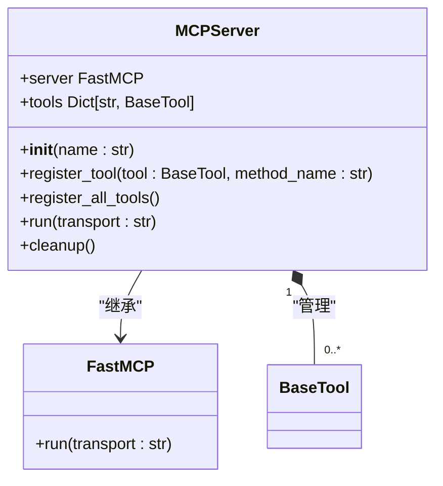
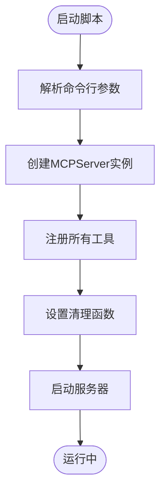
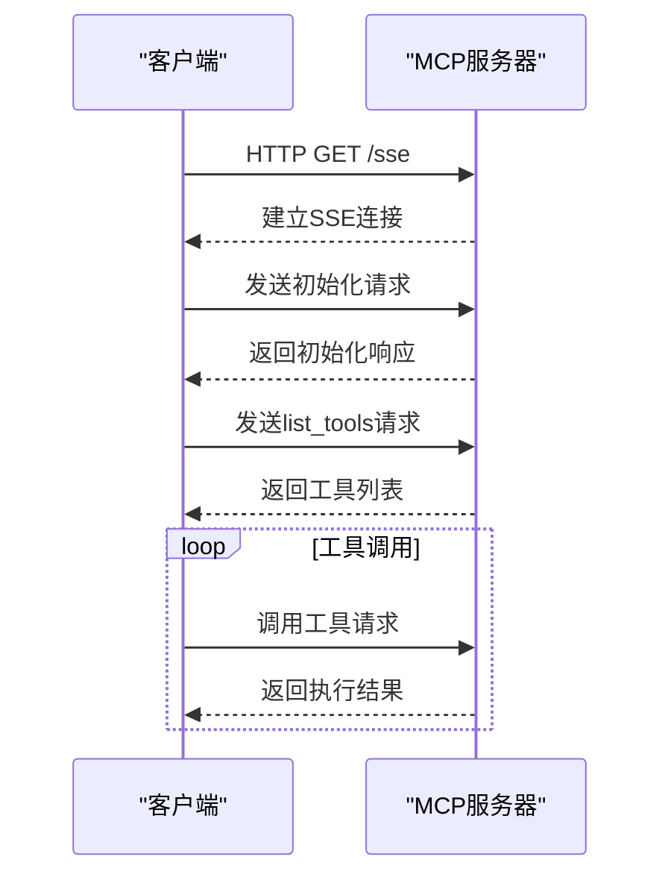
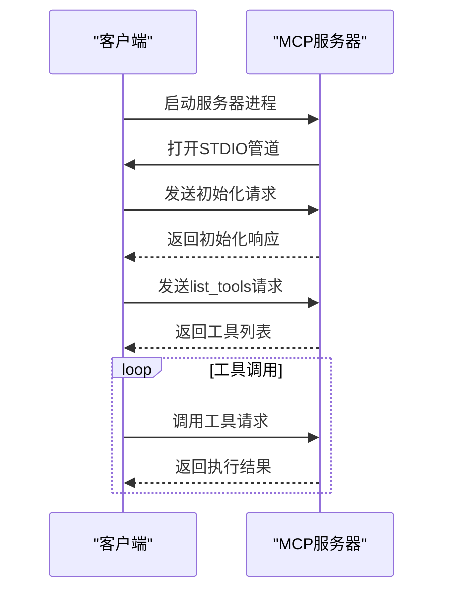
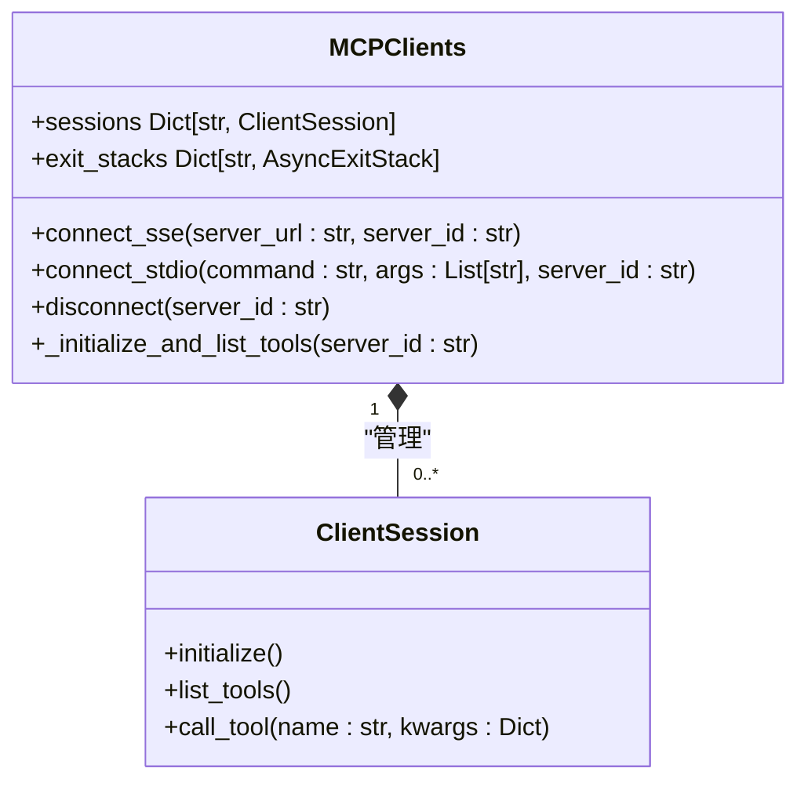
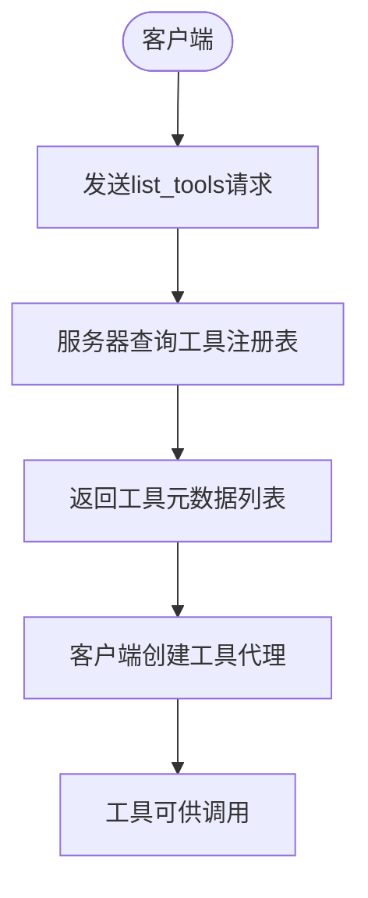
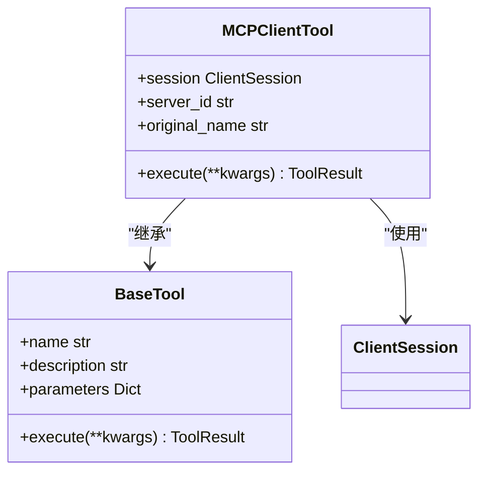

# MCP协议集成

<cite>
**本文档引用的文件**   
- [run_mcp_server.py](file://run_mcp_server.py)
- [app/mcp/server.py](file://app/mcp/server.py)
- [run_mcp.py](file://run_mcp.py)
- [app/tool/mcp.py](file://app/tool/mcp.py)
- [app/agent/mcp.py](file://app/agent/mcp.py)
- [config/mcp.example.json](file://config/mcp.example.json)
- [app/config.py](file://app/config.py)
</cite>

## 目录
1. [简介](#简介)
2. [MCP协议基础](#mcp协议基础)
3. [MCP服务器启动与管理](#mcp服务器启动与管理)
4. [连接MCP服务器](#连接mcp服务器)
5. [动态工具发现机制](#动态工具发现机制)
6. [远程工具集成](#远程工具集成)
7. [故障排除指南](#故障排除指南)
8. [性能优化建议](#性能优化建议)

## 简介
MCP（Model Context Protocol）协议是OpenManus系统中实现模型与外部工具交互的核心通信协议。该协议允许智能体通过标准化的方式连接到各种工具服务器，动态发现可用工具，并执行远程操作。本文档全面介绍MCP协议在OpenManus中的实现，包括服务器启动、客户端连接、工具发现与集成等关键环节，为开发者提供完整的集成指南。

## MCP协议基础
MCP协议是一种基于JSON-RPC的轻量级通信协议，用于在AI模型和外部工具之间建立双向通信。在OpenManus中，MCP协议实现了工具的动态发现和远程调用，使得智能体能够灵活地使用各种功能模块。协议支持两种传输方式：SSE（Server-Sent Events）和STDIO，适应不同的部署场景和网络环境。

**协议特点**：
- **动态发现**：客户端可以实时查询服务器上可用的工具列表
- **标准化接口**：所有工具都遵循统一的参数和返回值格式
- **异步通信**：支持非阻塞的工具调用和结果返回
- **多服务器支持**：可以同时连接多个MCP服务器

**Section sources**
- [app/tool/mcp.py](file://app/tool/mcp.py#L36-L193)
- [app/agent/mcp.py](file://app/agent/mcp.py#L12-L184)

## MCP服务器启动与管理
MCP服务器是协议的核心组件，负责管理本地工具并向客户端提供服务。在OpenManus中，MCP服务器通过`run_mcp_server.py`脚本启动，支持STDIO传输模式。

### 服务器实现
`MCPServer`类是MCP服务器的核心实现，它继承自`FastMCP`框架，负责工具注册、请求处理和资源管理。服务器在初始化时会自动注册一组标准工具，包括bash命令执行、浏览器操作、文本编辑和终止指令。



**Diagram sources**
- [app/mcp/server.py](file://app/mcp/server.py#L23-L159)

### 启动流程
服务器的启动流程如下：
1. 解析命令行参数，确定传输方式
2. 创建`MCPServer`实例
3. 注册所有本地工具
4. 启动服务器并监听连接

启动脚本`run_mcp_server.py`提供了一个便捷的入口，通过导入`MCPServer`和`parse_args`函数来简化启动过程。



**Diagram sources**
- [run_mcp_server.py](file://run_mcp_server.py#L1-L11)
- [app/mcp/server.py](file://app/mcp/server.py#L149-L159)

**Section sources**
- [app/mcp/server.py](file://app/mcp/server.py#L23-L159)
- [run_mcp_server.py](file://run_mcp_server.py#L1-L11)

## 连接MCP服务器
OpenManus支持两种方式连接MCP服务器：SSE（Server-Sent Events）和STDIO。客户端通过`MCPRunner`类管理连接过程，确保与服务器的稳定通信。

### SSE连接方式
SSE连接通过HTTP长连接实现，适用于网络环境中的远程服务器。客户端使用`sse_client`创建与服务器的连接，并通过`ClientSession`进行通信。



**Diagram sources**
- [app/tool/mcp.py](file://app/tool/mcp.py#L49-L68)

### STDIO连接方式
STDIO连接通过标准输入输出流实现，适用于本地进程间通信。这种方式通常用于在同一台机器上运行服务器和客户端的情况。



**Diagram sources**
- [app/tool/mcp.py](file://app/tool/mcp.py#L70-L94)

### 连接管理
`MCPClients`类负责管理与一个或多个MCP服务器的连接。它维护一个会话字典，每个服务器对应一个`ClientSession`实例。连接管理包括连接建立、工具发现和连接清理等操作。



**Diagram sources**
- [app/tool/mcp.py](file://app/tool/mcp.py#L36-L193)

**Section sources**
- [app/tool/mcp.py](file://app/tool/mcp.py#L36-L193)
- [run_mcp.py](file://run_mcp.py#L20-L34)

## 动态工具发现机制
动态工具发现是MCP协议的核心功能之一，它允许客户端在运行时获取服务器上可用的工具列表，并根据需要调用这些工具。

### 工具发现流程
工具发现流程如下：
1. 客户端连接到MCP服务器
2. 发送`list_tools`请求
3. 服务器返回所有已注册工具的元数据
4. 客户端根据返回的工具信息创建本地代理



### 工具元数据
每个工具的元数据包含以下信息：
- **名称**：工具的唯一标识符
- **描述**：工具功能的简要说明
- **参数**：输入参数的JSON Schema定义
- **返回值**：输出结果的结构描述

工具元数据通过`ListToolsResult`对象返回，客户端可以据此生成相应的工具代理。

**Section sources**
- [app/tool/mcp.py](file://app/tool/mcp.py#L96-L125)
- [app/tool/mcp.py](file://app/tool/mcp.py#L146-L152)

## 远程工具集成
远程工具集成是将MCP服务器上的工具无缝整合到本地工具集合中的过程。通过`MCPClientTool`和`MCPClients`类的协作，实现了远程工具的本地化访问。

### 工具代理创建
当客户端发现新的远程工具时，会为其创建一个`MCPClientTool`代理。这个代理封装了远程调用的细节，使本地代码可以像调用普通函数一样使用远程工具。



**Diagram sources**
- [app/tool/mcp.py](file://app/tool/mcp.py#L12-L33)

### 工具命名规范
为了避免工具名称冲突，系统采用特定的命名规则：`mcp_{server_id}_{original_name}`。同时，`_sanitize_tool_name`方法确保生成的工具名称符合标识符规范。

```python
def _sanitize_tool_name(self, name: str) -> str:
    # 替换无效字符为下划线
    sanitized = re.sub(r"[^a-zA-Z0-9_-]", "_", name)
    # 移除连续的下划线
    sanitized = re.sub(r"_+", "_", sanitized)
    # 移除首尾的下划线
    sanitized = sanitized.strip("_")
    # 截断到64个字符
    if len(sanitized) > 64:
        sanitized = sanitized[:64]
    return sanitized
```

**Section sources**
- [app/tool/mcp.py](file://app/tool/mcp.py#L127-L144)

## 故障排除指南
在使用MCP协议时可能会遇到各种问题，本节提供常见的故障排除方法。

### 连接问题
**症状**：无法连接到MCP服务器
**可能原因及解决方案**：
- **SSE连接**：检查服务器URL是否正确，确保服务器正在运行
- **STDIO连接**：检查命令路径是否正确，确保有执行权限
- **网络问题**：检查防火墙设置，确保端口开放

### 工具调用失败
**症状**：工具调用返回错误
**可能原因及解决方案**：
- **参数错误**：检查参数类型和格式是否符合工具要求
- **会话失效**：重新建立连接，确保会话处于活动状态
- **服务器错误**：查看服务器日志，检查是否有异常

### 配置问题
系统支持通过配置文件管理MCP服务器连接。配置文件`mcp.json`应位于`config`目录下，格式如下：

```json
{
    "mcpServers": {
        "server1": {
            "type": "sse",
            "url": "http://localhost:8000/sse"
        },
        "server2": {
            "type": "stdio",
            "command": "python",
            "args": ["-m", "app.mcp.server"]
        }
    }
}
```

**Section sources**
- [config/mcp.example.json](file://config/mcp.example.json#L1-L8)
- [app/config.py](file://app/config.py#L126-L159)

## 性能优化建议
为了确保MCP协议通信的稳定性和高效性，建议采取以下优化措施：

### 连接复用
避免频繁建立和断开连接，应尽量复用现有的连接。`MCPClients`类已经实现了连接池管理，可以同时维护多个服务器连接。

### 工具缓存
客户端应缓存工具元数据，避免重复调用`list_tools`。`MCPAgent`类中的`tool_schemas`字段用于存储工具模式，通过`_refresh_tools_interval`控制刷新频率。

### 异常处理
实现健壮的异常处理机制，确保在网络中断或服务器故障时能够优雅地恢复。`MCPClients`类的`disconnect`方法包含了完善的清理逻辑，包括会话关闭和资源释放。

### 日志监控
启用详细的日志记录，便于问题排查。系统使用标准的`logger`记录关键操作，包括连接建立、工具调用和错误信息。

**Section sources**
- [app/tool/mcp.py](file://app/tool/mcp.py#L154-L193)
- [app/agent/mcp.py](file://app/agent/mcp.py#L133-L151)