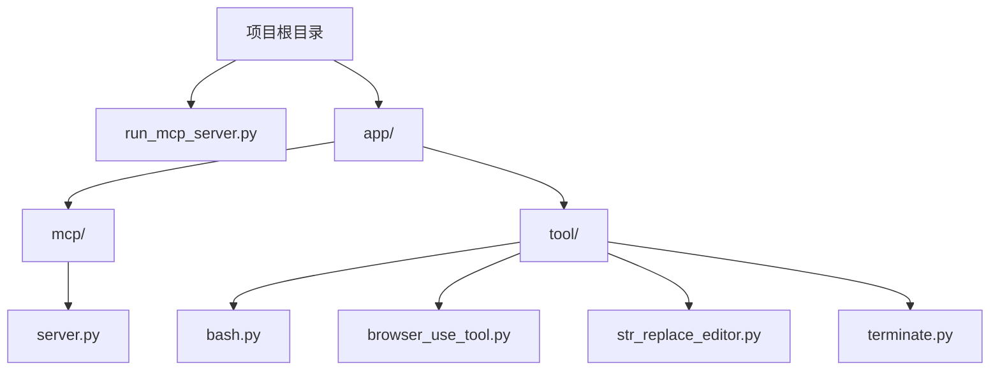
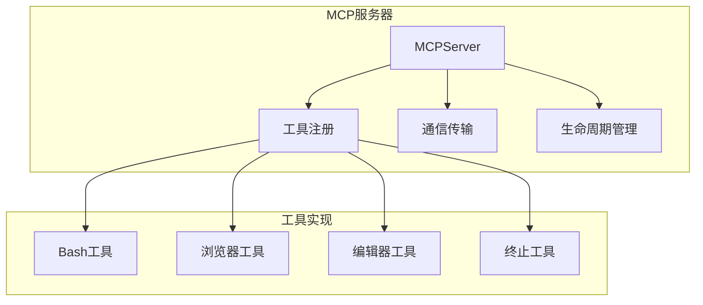
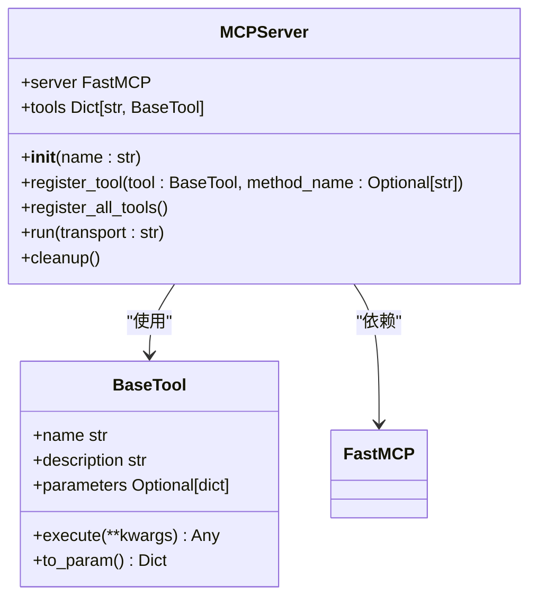
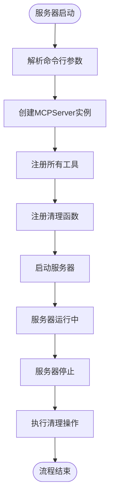
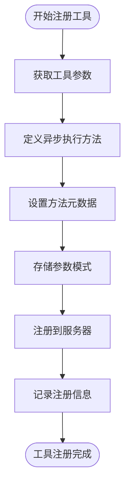
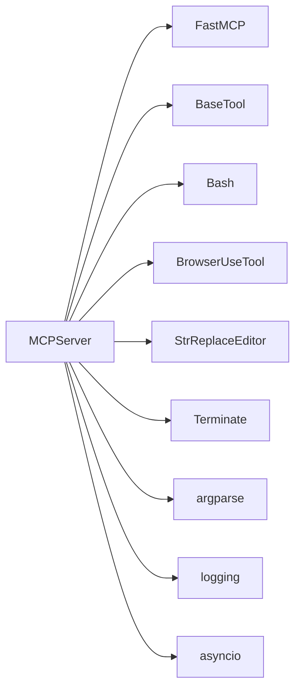

# MCP服务器管理

<cite>
**本文档引用的文件**   
- [run_mcp_server.py](file://run_mcp_server.py)
- [app/mcp/server.py](file://app/mcp/server.py)
- [config/mcp.example.json](file://config/mcp.example.json)
- [app/tool/base.py](file://app/tool/base.py)
</cite>

## 目录
1. [简介](#简介)
2. [项目结构](#项目结构)
3. [核心组件](#核心组件)
4. [架构概述](#架构概述)
5. [详细组件分析](#详细组件分析)
6. [依赖分析](#依赖分析)
7. [性能考虑](#性能考虑)
8. [故障排除指南](#故障排除指南)
9. [结论](#结论)

## 简介
本文档提供了基于`run_mcp_server.py`和`app/mcp/server.py`实现的MCP服务器启动和管理的完整操作指南。详细说明了MCP服务器的启动流程、运行模式配置、生命周期管理以及自定义服务器创建步骤。文档还涵盖了服务器部署的最佳实践和与OpenManus系统的集成方法。

## 项目结构
MCP服务器相关代码主要位于`app/mcp/`目录下，启动脚本位于项目根目录。服务器实现遵循模块化设计，将核心功能与工具实现分离。

**图示来源**
- [run_mcp_server.py](file://run_mcp_server.py)
- [app/mcp/server.py](file://app/mcp/server.py)

**章节来源**
- [run_mcp_server.py](file://run_mcp_server.py)
- [app/mcp/server.py](file://app/mcp/server.py)

## 核心组件
MCP服务器的核心组件包括`MCPServer`类、工具基类`BaseTool`以及各种具体工具实现。`MCPServer`负责管理工具注册和服务器生命周期，而`BaseTool`为所有工具提供了统一的接口和功能。

**章节来源**
- [app/mcp/server.py](file://app/mcp/server.py#L23-L159)
- [app/tool/base.py](file://app/tool/base.py#L77-L172)

## 架构概述
MCP服务器采用客户端-服务器架构，通过标准的通信协议与客户端进行交互。服务器启动后，会初始化并注册预定义的工具集，然后进入监听状态等待客户端请求。

**图示来源**
- [app/mcp/server.py](file://app/mcp/server.py#L23-L159)
- [app/tool/base.py](file://app/tool/base.py#L77-L172)

## 详细组件分析

### MCPServer类分析
`MCPServer`类是MCP服务器的核心实现，负责管理服务器的整个生命周期和工具注册。

#### 类图

**图示来源**
- [app/mcp/server.py](file://app/mcp/server.py#L23-L159)
- [app/tool/base.py](file://app/tool/base.py#L77-L172)

#### 启动流程

**图示来源**
- [run_mcp_server.py](file://run_mcp_server.py#L0-L10)
- [app/mcp/server.py](file://app/mcp/server.py#L149-L159)

**章节来源**
- [run_mcp_server.py](file://run_mcp_server.py#L0-L10)
- [app/mcp/server.py](file://app/mcp/server.py#L149-L159)

### 工具注册机制
MCP服务器通过`register_tool`方法将工具注册到服务器实例中，确保工具可以被客户端调用。

#### 工具注册流程

**图示来源**
- [app/mcp/server.py](file://app/mcp/server.py#L36-L75)

**章节来源**
- [app/mcp/server.py](file://app/mcp/server.py#L36-L75)

## 依赖分析
MCP服务器依赖于多个核心组件和外部库，这些依赖关系确保了服务器功能的完整性和稳定性。

**图示来源**
- [app/mcp/server.py](file://app/mcp/server.py#L0-L45)
- [app/tool/base.py](file://app/tool/base.py#L77-L172)

**章节来源**
- [app/mcp/server.py](file://app/mcp/server.py#L0-L45)
- [app/tool/base.py](file://app/tool/base.py#L77-L172)

## 性能考虑
MCP服务器在设计时考虑了性能优化，通过异步处理和资源管理来确保高效运行。服务器使用`atexit`注册清理函数，确保在程序退出时能够正确释放资源。

## 故障排除指南
当MCP服务器出现问题时，可以通过检查日志输出和配置文件来诊断问题。确保`mcp.json`配置文件格式正确，并且所有依赖的工具都能正常初始化。

**章节来源**
- [config/mcp.example.json](file://config/mcp.example.json)
- [app/config.py](file://app/config.py#L126-L159)

## 结论
MCP服务器提供了一个灵活且可扩展的框架，用于管理和执行各种工具。通过标准化的接口和清晰的架构设计，开发者可以轻松地创建自定义工具并将其集成到系统中。服务器的生命周期管理确保了资源的正确使用和释放，为稳定运行提供了保障。