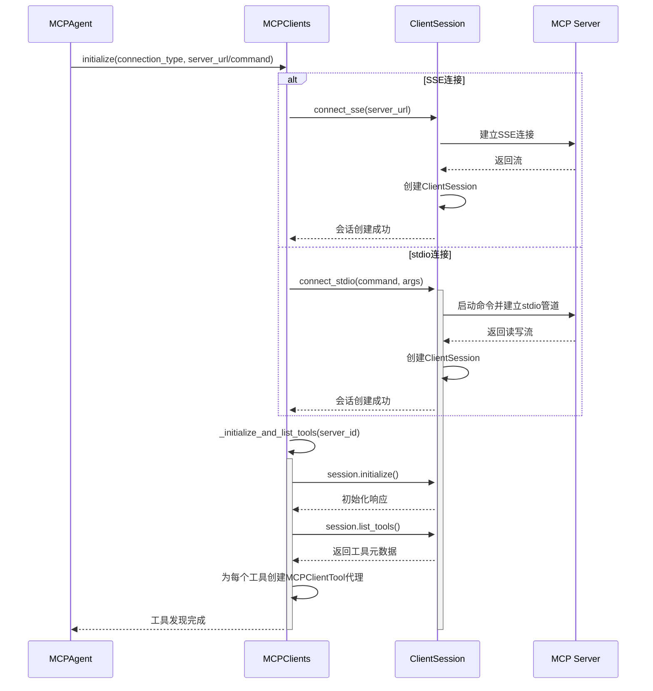
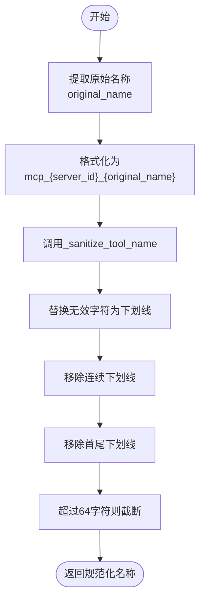
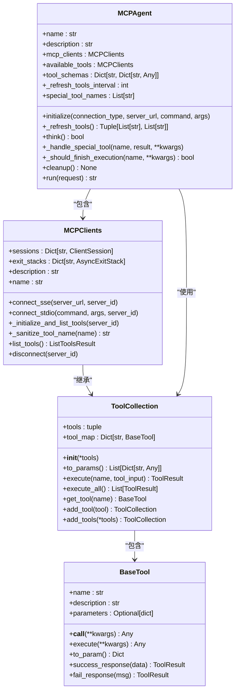
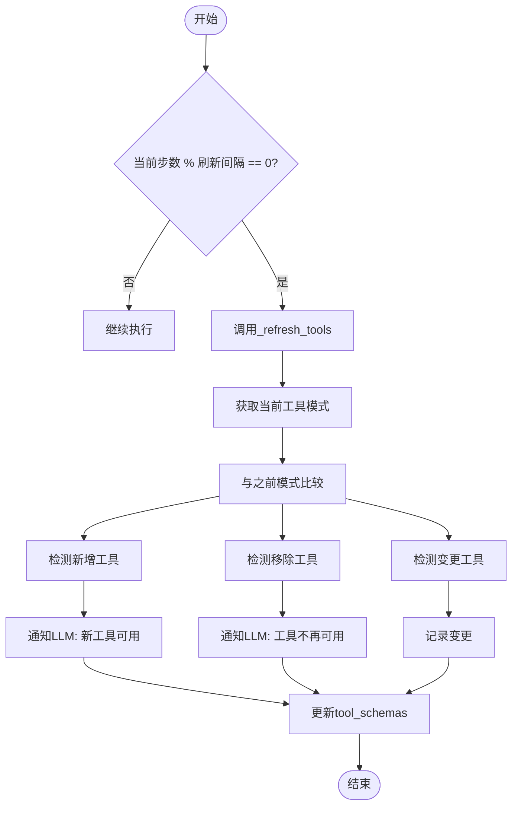

# 动态工具发现

<cite>
**Referenced Files in This Document**   
- [app/tool/mcp.py](file://app/tool/mcp.py)
- [app/agent/mcp.py](file://app/agent/mcp.py)
- [app/tool/base.py](file://app/tool/base.py)
- [app/tool/tool_collection.py](file://app/tool/tool_collection.py)
- [app/agent/toolcall.py](file://app/agent/toolcall.py)
</cite>

## 目录
1. [引言](#引言)
2. [核心组件](#核心组件)
3. [工具发现流程](#工具发现流程)
4. [工具名称规范化](#工具名称规范化)
5. [代理集成](#代理集成)
6. [定期刷新机制](#定期刷新机制)
7. [扩展点](#扩展点)

## 引言
OpenManus通过MCP（Model Context Protocol）协议实现了远程工具的动态发现和集成。该机制允许系统在运行时自动发现远程MCP服务器提供的工具，并将其无缝集成到代理的可用工具集合中。这种动态发现能力使得系统能够灵活适应工具集的变化，无需重启或重新配置即可使用新工具。

## 核心组件

动态工具发现机制主要由两个核心类构成：`MCPClients`和`MCPAgent`。`MCPClients`负责与MCP服务器建立连接、发现工具并创建代理实例，而`MCPAgent`则负责将这些工具集成到代理的工作流中。

**Section sources**
- [app/tool/mcp.py](file://app/tool/mcp.py#L1-L195)
- [app/agent/mcp.py](file://app/agent/mcp.py#L1-L186)

## 工具发现流程

工具发现流程始于与MCP服务器的连接建立。`MCPClients`类提供了两种连接方式：SSE（Server-Sent Events）和stdio。无论哪种方式，连接成功后都会调用`_initialize_and_list_tools`方法来初始化会话并获取工具列表。

**Diagram sources**
- [app/tool/mcp.py](file://app/tool/mcp.py#L49-L94)
- [app/tool/mcp.py](file://app/tool/mcp.py#L96-L125)

**Section sources**
- [app/tool/mcp.py](file://app/tool/mcp.py#L96-L125)

## 工具名称规范化

为了确保工具名称的兼容性和唯一性，系统实现了工具名称的规范化处理。当从远程服务器获取工具时，原始工具名称会经过`_sanitize_tool_name`方法处理，以符合MCPClientTool的要求。

规范化过程包括：
1. 将无效字符替换为下划线
2. 移除连续的下划线
3. 移除首尾的下划线
4. 如果名称超过64个字符，则进行截断

此外，系统还通过命名空间策略确保工具名称的全局唯一性。工具名称被格式化为`mcp_{server_id}_{original_name}`的形式，其中`server_id`标识了工具来源的服务器，`original_name`是工具的原始名称。

**Diagram sources**
- [app/tool/mcp.py](file://app/tool/mcp.py#L127-L144)

**Section sources**
- [app/tool/mcp.py](file://app/tool/mcp.py#L127-L144)

## 代理集成

工具发现完成后，需要将这些工具注入到代理的可用工具集合中。`MCPAgent`类的`_initialize`方法负责这一集成过程。该方法首先根据指定的连接类型建立与MCP服务器的连接，然后将`MCPClients`实例赋值给`available_tools`属性。

集成过程还包括向代理的记忆系统添加系统消息，告知LLM当前可用的工具列表。这使得LLM能够在后续的决策过程中考虑这些新发现的工具。

**Diagram sources**
- [app/agent/mcp.py](file://app/agent/mcp.py#L17-L184)
- [app/tool/mcp.py](file://app/tool/mcp.py#L1-L195)
- [app/tool/tool_collection.py](file://app/tool/tool_collection.py#L8-L70)
- [app/tool/base.py](file://app/tool/base.py#L77-L172)

**Section sources**
- [app/agent/mcp.py](file://app/agent/mcp.py#L39-L84)

## 定期刷新机制

为了检测远程工具集的变化，系统实现了定期刷新机制。`MCPAgent`类中的`_refresh_tools_interval`属性定义了刷新间隔（默认每5步刷新一次）。在`think`方法中，系统会定期调用`_refresh_tools`方法来检查工具集的变化。

`_refresh_tools`方法通过比较当前工具模式与之前存储的模式，检测工具的增删改变化。当发现新工具时，系统会向LLM发送系统消息通知"新工具可用"；当工具被移除时，则通知"工具不再可用"。这种机制确保了LLM始终对当前可用的工具集有准确的认知。

**Diagram sources**
- [app/agent/mcp.py](file://app/agent/mcp.py#L86-L131)

**Section sources**
- [app/agent/mcp.py](file://app/agent/mcp.py#L86-L131)

## 扩展点

开发者可以通过多种方式扩展工具发现逻辑：

1. **自定义连接方式**：通过继承`MCPClients`类并实现新的连接方法，可以支持其他传输协议。
2. **工具过滤**：在`_initialize_and_list_tools`方法中添加过滤逻辑，只选择特定类型的工具进行集成。
3. **命名策略**：重写`_sanitize_tool_name`方法以实现自定义的命名规范化策略。
4. **刷新策略**：修改`_refresh_tools_interval`值或实现更复杂的刷新条件判断。
5. **事件监听**：在工具增删改时触发自定义事件，实现更丰富的通知机制。

这些扩展点使得动态工具发现机制具有很高的灵活性，能够适应不同的应用场景和需求。

**Section sources**
- [app/tool/mcp.py](file://app/tool/mcp.py#L96-L125)
- [app/agent/mcp.py](file://app/agent/mcp.py#L86-L131)