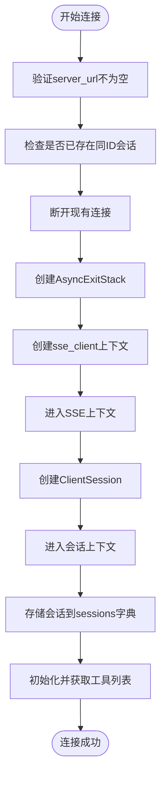
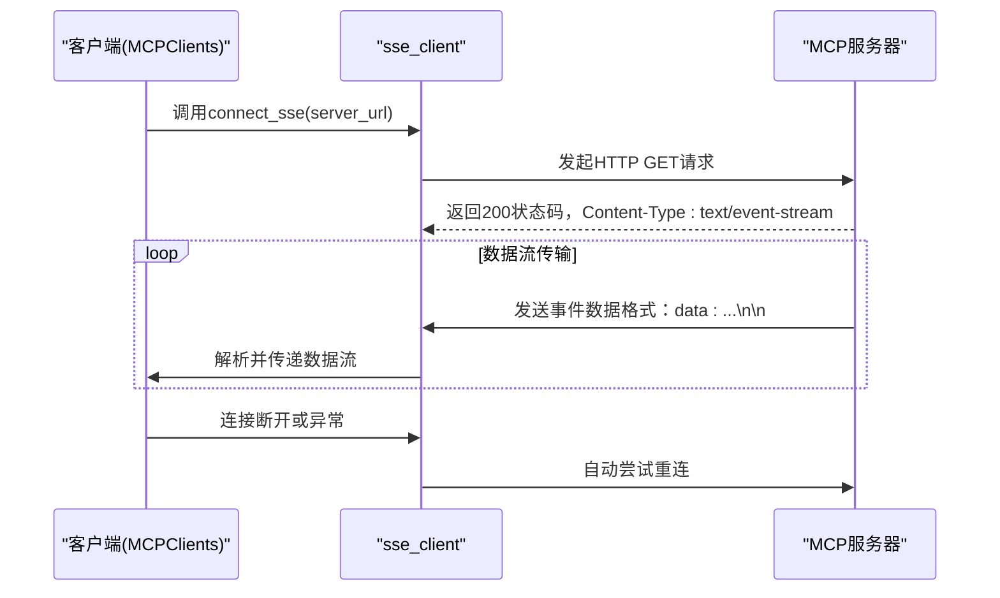
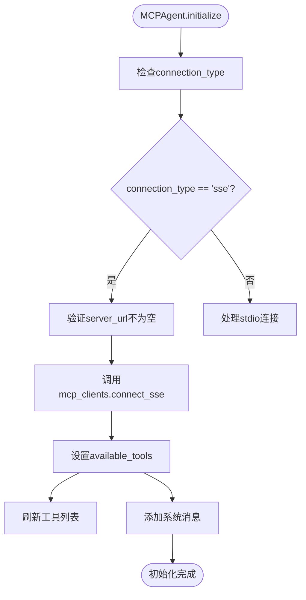
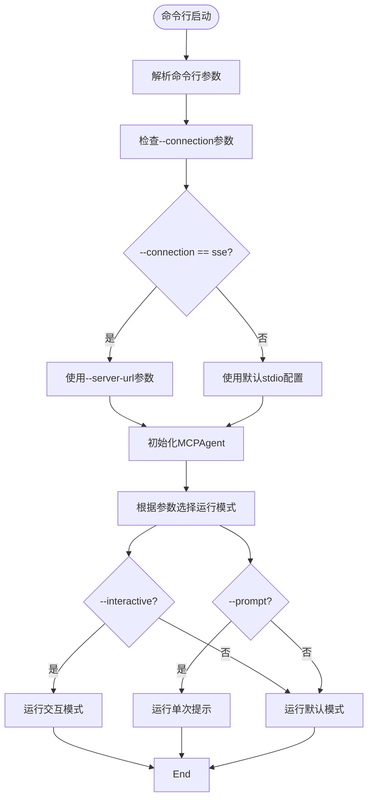
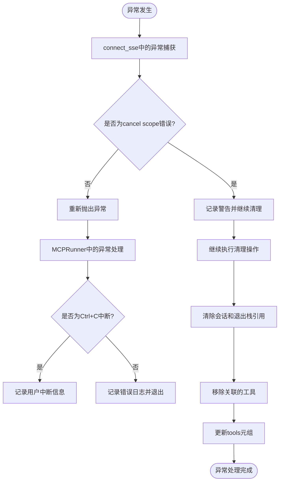

# SSE连接方式

<cite>
**本文档引用的文件**   
- [mcp.py](file://app/tool/mcp.py)
- [mcp.py](file://app/agent/mcp.py)
- [run_mcp.py](file://run_mcp.py)
</cite>

## 目录
1. [SSE连接概述](#sse连接概述)
2. [MCPClients类的connect_sse方法分析](#mcpcients类的connect_sse方法分析)
3. [SSE传输协议工作原理](#sse传输协议工作原理)
4. [MCPAgent初始化流程](#mcpagent初始化流程)
5. [MCPRunner命令行使用](#mcrunner命令行使用)
6. [异常处理策略](#异常处理策略)
7. [安全连接与扩展建议](#安全连接与扩展建议)

## SSE连接概述

SSE（Server-Sent Events）是一种基于HTTP的单向通信协议，允许服务器向客户端推送实时数据。在OpenManus项目中，SSE被用作MCP（Model Context Protocol）服务器与客户端之间的主要通信方式之一。通过SSE连接，客户端可以持续接收来自MCP服务器的工具列表、执行结果和其他上下文信息。

SSE连接具有以下优势：
- 基于标准HTTP协议，易于通过防火墙
- 服务器可以主动向客户端推送数据
- 连接保持持久化，减少重复建立连接的开销
- 支持自动重连机制

**Section sources**
- [mcp.py](file://app/tool/mcp.py#L49-L68)

## MCPClients类的connect_sse方法分析

`MCPClients`类中的`connect_sse`方法负责建立与MCP服务器的SSE连接。该方法接受两个参数：`server_url`和可选的`server_id`。



**Diagram sources**
- [mcp.py](file://app/tool/mcp.py#L49-L68)

**Section sources**
- [mcp.py](file://app/tool/mcp.py#L49-L68)

### server_url参数验证

`server_url`参数是必需的，方法首先检查其是否为空。如果为空，则抛出`ValueError`异常。这是确保连接能够正确建立的基本验证。

### server_id生成逻辑

`server_id`参数是可选的。如果未提供，则默认使用`server_url`作为`server_id`。这种设计允许开发者通过自定义ID来区分不同的服务器连接，同时也提供了简单的默认行为。

### 持久化连接管理

通过`sse_client`上下文管理器建立的连接是持久化的。`AsyncExitStack`用于管理异步资源的生命周期，确保在连接断开时能够正确清理相关资源。

**Section sources**
- [mcp.py](file://app/tool/mcp.py#L49-L68)

## SSE传输协议工作原理

SSE传输协议基于HTTP长连接，服务器可以持续向客户端发送数据流。在OpenManus实现中，SSE连接的工作流程如下：



**Diagram sources**
- [mcp.py](file://app/tool/mcp.py#L49-L68)

**Section sources**
- [mcp.py](file://app/tool/mcp.py#L49-L68)

SSE协议的关键特性包括：
- 使用`text/event-stream`作为MIME类型
- 数据以`data:`前缀开头，以`\n\n`结尾
- 支持`retry:`指令指定重连间隔
- 支持`event:`指定事件类型
- 支持`id:`指定消息ID用于断点续传

## MCPAgent初始化流程

当`connection_type`设置为'sse'时，`MCPAgent`的`initialize`方法会触发SSE连接的初始化过程。



**Diagram sources**
- [mcp.py](file://app/tool/mcp.py#L49-L68)
- [mcp.py](file://app/agent/mcp.py#L39-L84)

**Section sources**
- [mcp.py](file://app/agent/mcp.py#L39-L84)

### initialize方法执行步骤

1. 如果提供了`connection_type`参数，则更新实例的`connection_type`属性
2. 根据`connection_type`的值选择相应的连接方式
3. 对于SSE连接，验证`server_url`参数的存在性
4. 调用`mcp_clients.connect_sse`方法建立连接
5. 将`mcp_clients`实例赋值给`available_tools`属性
6. 调用`_refresh_tools`方法获取并更新可用工具列表
7. 向记忆系统添加包含可用工具信息的系统消息

**Section sources**
- [mcp.py](file://app/agent/mcp.py#L39-L84)

## MCPRunner命令行使用

`MCPRunner`类提供了命令行接口来启动MCP代理，并支持SSE连接方式。



**Diagram sources**
- [run_mcp.py](file://run_mcp.py#L18-L35)
- [run_mcp.py](file://run_mcp.py#L37-L45)
- [run_mcp.py](file://run_mcp.py#L51-L60)

**Section sources**
- [run_mcp.py](file://run_mcp.py#L18-L65)

### 命令行参数说明

- `--connection` 或 `-c`: 指定连接类型，可选值为'stdio'或'sse'，默认为'stdio'
- `--server-url`: 指定SSE连接的服务器URL，默认为`http://127.0.0.1:8000/sse`
- `--interactive` 或 `-i`: 启用交互模式
- `--prompt` 或 `-p`: 执行单次提示后退出

### 使用示例

```bash
# 使用SSE连接到本地服务器
python run_mcp.py --connection sse --server-url http://localhost:8000/sse

# 使用SSE连接并在交互模式下运行
python run_mcp.py --connection sse --server-url http://localhost:8000/sse --interactive

# 使用SSE连接并执行单次提示
python run_mcp.py --connection sse --server-url http://localhost:8000/sse --prompt "Hello, MCP!"
```

**Section sources**
- [run_mcp.py](file://run_mcp.py#L6-L27)

## 异常处理策略

系统实现了多层次的异常处理机制，以确保连接的稳定性和系统的健壮性。



**Diagram sources**
- [mcp.py](file://app/tool/mcp.py#L154-L193)
- [run_mcp.py](file://run_mcp.py#L88-L116)

**Section sources**
- [mcp.py](file://app/tool/mcp.py#L154-L193)
- [run_mcp.py](file://run_mcp.py#L88-L116)

### 连接超时处理

虽然代码中没有显式的超时设置，但可以通过以下方式实现连接超时控制：

1. 在`sse_client`上下文中添加超时参数
2. 使用`asyncio.wait_for`包装连接操作
3. 设置HTTP请求的超时时间

### 网络中断恢复

SSE协议本身支持自动重连机制。当网络中断时：
1. 客户端会检测到连接断开
2. 根据服务器发送的`retry:`指令等待指定时间
3. 自动重新发起连接请求
4. 从上次中断的消息ID继续接收数据

## 安全连接与扩展建议

为了提高连接的安全性并支持更多应用场景，提出以下扩展建议：

### HTTPS安全连接

推荐使用HTTPS协议来加密SSE通信，防止数据被窃听或篡改。配置方法：

1. 在服务器端配置SSL证书
2. 将`server_url`参数改为以`https://`开头
3. 可选地在客户端验证服务器证书

```python
# 示例：安全的SSE连接
await mcp_clients.connect_sse(
    server_url="https://secure-server.com:8443/sse",
    server_id="secure_server"
)
```

### 自定义HTTP头

在某些场景下，可能需要添加认证令牌或其他自定义头信息。可以通过扩展`sse_client`功能来实现：

```python
# 建议的扩展方式
streams_context = sse_client(
    url=server_url,
    headers={"Authorization": "Bearer token123", "X-Client-ID": "client1"}
)
```

### 连接池优化

对于需要连接多个MCP服务器的场景，建议实现连接池管理：
- 复用已建立的连接
- 限制并发连接数
- 实现连接健康检查
- 支持连接的优雅关闭

### 监控与日志

增强监控能力：
- 记录连接建立和断开的时间戳
- 监控消息传输速率
- 记录错误类型和频率
- 提供连接状态的健康检查接口

**Section sources**
- [mcp.py](file://app/tool/mcp.py#L49-L68)
- [mcp.py](file://app/tool/mcp.py#L154-L193)