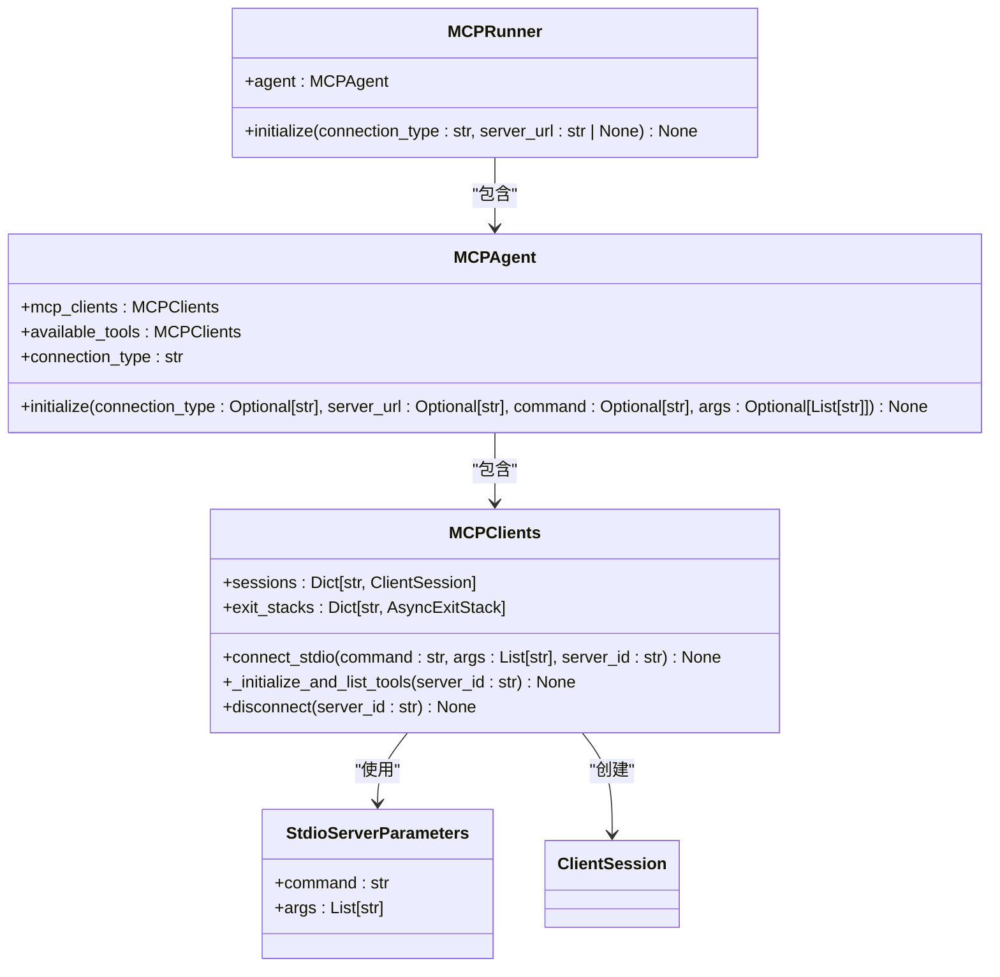
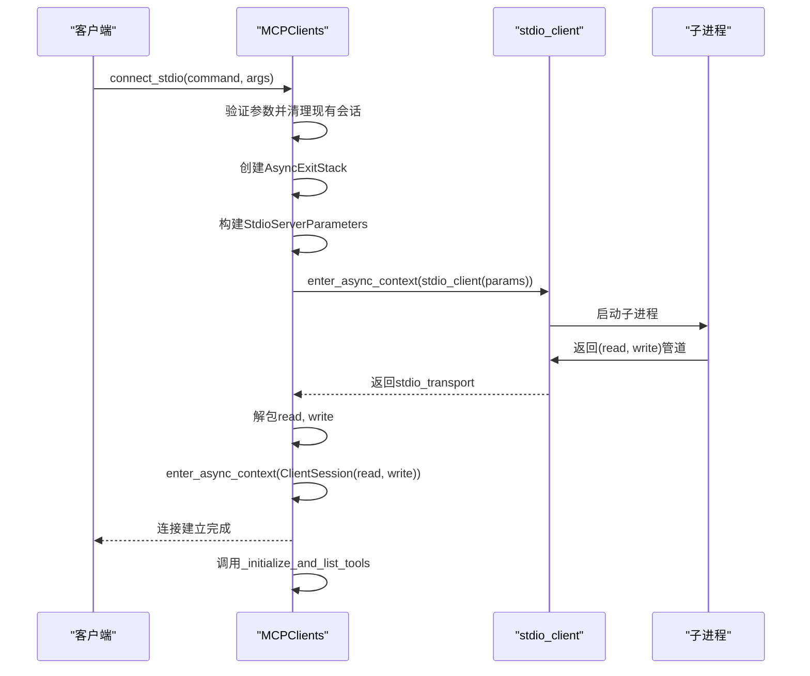
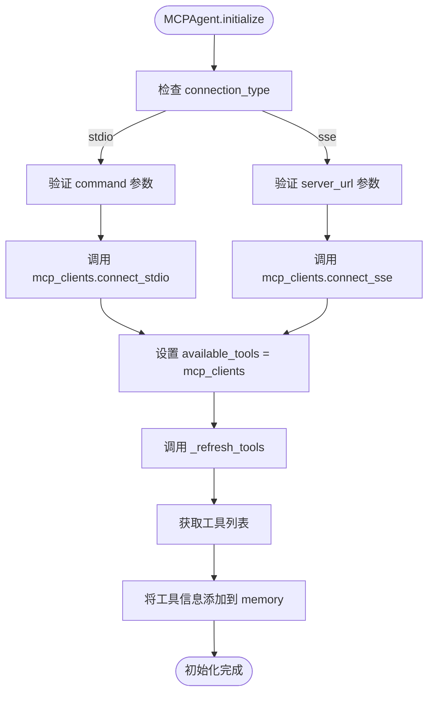
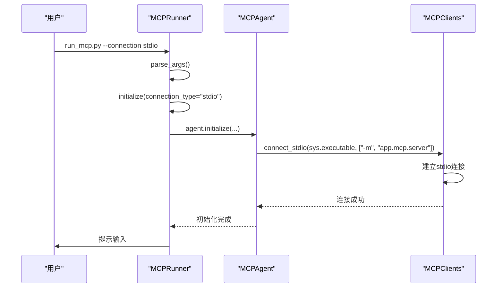

# Stdio连接方式

<cite>
**本文档中引用的文件**   
- [mcp.py](file://app/tool/mcp.py#L70-L103)
- [mcp.py](file://app/agent/mcp.py#L39-L67)
- [run_mcp.py](file://run_mcp.py#L18-L35)
- [mcp.py](file://app/tool/mcp.py#L96-L125)
- [mcp.py](file://app/tool/mcp.py#L154-L193)
- [server.py](file://app/mcp/server.py#L144-L179)
</cite>

## 目录
1. [简介](#简介)
2. [核心组件分析](#核心组件分析)
3. [Stdio连接实现机制](#stdio连接实现机制)
4. [MCPAgent初始化流程](#mcpagent初始化流程)
5. [MCPRunner启动流程](#mcrunner启动流程)
6. [子进程管理与安全机制](#子进程管理与安全机制)
7. [错误处理与资源清理](#错误处理与资源清理)
8. [跨平台兼容性与最佳实践](#跨平台兼容性与最佳实践)

## 简介
Stdio连接方式是OpenManus框架中用于与MCP（Model Context Protocol）服务器建立通信的核心机制之一。该文档深入解析了通过标准输入输出（stdio）与本地进程建立双向通信的技术实现，重点分析了`app/tool/mcp.py`中`MCPClients`类的`connect_stdio`方法。文档详细说明了如何配置Python子进程执行MCP服务器模块，阐述了`StdioServerParameters`对象的构建过程，以及读写管道的异步上下文管理机制。结合`app/agent/mcp.py`中`MCPAgent`的初始化方法和`run_mcp.py`中的`MCPRunner`类，全面展示了stdio连接的启动流程和最佳实践。

## 核心组件分析

本节分析实现Stdio连接的核心组件及其相互关系。



**图示来源**
- [mcp.py](file://app/tool/mcp.py#L36-L193)
- [mcp.py](file://app/agent/mcp.py#L12-L184)
- [run_mcp.py](file://run_mcp.py#L10-L65)

**本节来源**
- [mcp.py](file://app/tool/mcp.py#L36-L193)
- [mcp.py](file://app/agent/mcp.py#L12-L184)
- [run_mcp.py](file://run_mcp.py#L10-L65)

## Stdio连接实现机制

`MCPClients`类的`connect_stdio`方法是建立Stdio连接的核心。该方法通过`mcp.client.stdio.stdio_client`库与本地进程建立双向通信通道。

当调用`connect_stdio`方法时，首先验证`command`参数的有效性。随后，方法会检查是否存在同`server_id`的现有会话，若存在则先调用`disconnect`方法进行清理，确保连接的原子性和状态一致性。接着，创建一个`AsyncExitStack`实例用于管理异步资源的生命周期。

关键步骤是构建`StdioServerParameters`对象，该对象封装了启动子进程所需的所有信息，包括要执行的`command`和传递给该命令的`args`列表。`stdio_client`函数接收此参数对象，并返回一个包含读取器（read）和写入器（write）的元组，这两个对象分别对应子进程的标准输出和标准输入流。

最后，使用读写管道创建`ClientSession`实例，并将其存储在`sessions`字典中，完成连接的建立。整个过程通过`AsyncExitStack`进行上下文管理，确保资源的正确获取和释放。



**图示来源**
- [mcp.py](file://app/tool/mcp.py#L70-L103)

**本节来源**
- [mcp.py](file://app/tool/mcp.py#L70-L103)

## MCPAgent初始化流程

`MCPAgent`类负责管理与MCP服务器的连接。其`initialize`方法根据`connection_type`参数决定使用哪种连接方式。当`connection_type`为'stdio'时，该方法会调用其内部`mcp_clients`实例的`connect_stdio`方法。

初始化流程首先检查`connection_type`参数，若为'stdio'，则必须提供有效的`command`参数。该方法将`command`和`args`参数直接传递给`mcp_clients.connect_stdio`。在成功建立连接后，`MCPAgent`会将`available_tools`属性指向其`mcp_clients`实例，从而使其能够访问由MCP服务器提供的所有工具。

此外，`initialize`方法还会调用`_refresh_tools`方法来获取服务器上可用工具的初始列表，并将这些工具信息添加到代理的记忆（memory）中，以便在后续的交互中使用。这种设计实现了连接建立与工具发现的解耦，确保了代理状态的正确初始化。



**图示来源**
- [mcp.py](file://app/agent/mcp.py#L39-L67)

**本节来源**
- [mcp.py](file://app/agent/mcp.py#L39-L67)

## MCPRunner启动流程

`MCPRunner`类是启动MCP代理的入口点，它封装了命令行参数解析和代理初始化的逻辑。其`initialize`方法根据用户选择的`connection_type`来配置代理。

在默认的'stdio'连接模式下，`MCPRunner`会使用`sys.executable`作为`command`参数，这确保了子进程使用与主进程相同的Python解释器。`args`参数被设置为`["-m", self.server_reference]`，其中`self.server_reference`来自配置文件（默认为"app.mcp.server"）。`-m`参数指示Python解释器以模块的形式运行指定的包，这是启动MCP服务器模块的标准方式。

这种设计具有高度的可配置性。用户可以通过命令行参数`--connection`选择'stdio'或'sse'模式。在'stdio'模式下，系统自动处理Python解释器和模块路径，简化了用户的操作；在'sse'模式下，则需要提供`--server-url`参数来指定远程服务器的地址。



**图示来源**
- [run_mcp.py](file://run_mcp.py#L18-L35)

**本节来源**
- [run_mcp.py](file://run_mcp.py#L18-L35)

## 子进程管理与安全机制

Stdio连接方式通过精心设计的机制来管理子进程的生命周期和安全性。

**进程启动与模块执行**：通过`sys.executable`和`-m`参数组合，确保了子进程在正确的Python环境中运行指定的服务器模块（`app.mcp.server`）。这种方式避免了硬编码Python路径，提高了跨平台兼容性。

**命令注入防护**：`connect_stdio`方法对`command`和`args`参数进行了严格的分离。`command`指定可执行文件，而`args`作为独立的参数列表传递。这种分离有效防止了命令注入攻击，因为参数不会被shell解析。例如，即使`args`中包含特殊字符，它们也会被当作字面量参数传递给目标程序，而不是作为shell命令执行。

**异步上下文管理**：整个连接过程使用`AsyncExitStack`进行管理。`enter_async_context`方法确保了`stdio_client`和`ClientSession`的正确初始化和最终的资源清理。如果在建立连接的过程中发生异常，`AsyncExitStack`会自动回滚已获取的资源，防止资源泄漏。

**跨平台兼容性**：该机制在Windows、Linux和macOS上均能正常工作。`sys.executable`能正确指向当前Python解释器，`-m`参数是Python标准功能，`stdio`管道是操作系统提供的基础IPC机制，因此这套方案具有良好的跨平台特性。

## 错误处理与资源清理

系统实现了健壮的错误处理和资源清理机制，确保连接的可靠性和稳定性。

`MCPClients`类的`disconnect`方法是资源清理的核心。它接受一个可选的`server_id`参数，可以断开与特定服务器的连接或断开所有连接。该方法首先尝试通过`AsyncExitStack`的`aclose`方法优雅地关闭会话，这会触发所有已注册的清理上下文管理器。

在清理过程中，系统会捕获并处理特定的运行时错误（如"cancel scope"），避免因底层异步库的异常而中断清理流程。清理步骤包括：从`sessions`和`exit_stacks`字典中移除相关引用，以及从`tool_map`中删除与该服务器关联的所有工具，最后更新`tools`元组。

`MCPAgent`类的`cleanup`方法在代理运行结束后被调用（通过`run`方法的`finally`块保证），它会调用`mcp_clients.disconnect()`来关闭所有连接。这种分层的清理策略确保了即使在发生错误的情况下，也能最大程度地释放占用的系统资源。

```mermaid
flowchart TD
Start([disconnect(server_id)]) --> CheckServerId["检查 server_id 是否为空"]
CheckServerId --> |非空| GetExitStack["获取 server_id 对应的 exit_stack"]
GetExitStack --> CloseStack["调用 exit_stack.aclose()"]
CloseStack --> HandleError["捕获并处理 'cancel scope' 错误"]
HandleError --> CleanupRefs["清理 sessions 和 exit_stacks 引用"]
CleanupRefs --> RemoveTools["从 tool_map 中移除关联工具"]
RemoveTools --> UpdateTools["更新 tools 元组"]
UpdateTools --> LogSuccess["记录断开连接日志"]
CheckServerId --> |为空| LoopServers["遍历所有 sessions"]
LoopServers --> CallDisconnect["对每个 sid 调用 disconnect(sid)"]
CallDisconnect --> ResetMaps["重置 tool_map 和 tools"]
ResetMaps --> LogAllDisconnected["记录所有连接已断开"]
```

**图示来源**
- [mcp.py](file://app/tool/mcp.py#L154-L193)

**本节来源**
- [mcp.py](file://app/tool/mcp.py#L154-L193)

## 跨平台兼容性与最佳实践

### 最佳实践

1.  **配置驱动**：建议将MCP服务器的连接配置（如`server_reference`）放在`config.toml`文件中，而不是硬编码在代码里，以提高灵活性。
2.  **异常处理**：在调用`connect_stdio`时，应捕获`ValueError`等可能的异常，并提供清晰的错误信息给用户。
3.  **连接复用**：`MCPClients`支持管理多个连接。对于需要连接到多个MCP服务器的场景，应复用同一个`MCPClients`实例，而不是创建多个。
4.  **及时清理**：务必在代理生命周期结束时调用`cleanup`方法，或使用上下文管理器确保连接被正确关闭，防止子进程成为僵尸进程。

### 跨平台注意事项

-   **路径分隔符**：虽然`sys.executable`和`-m`参数能很好地处理路径，但在自定义`command`时，应使用`os.path.join`或`pathlib`来构建路径，以确保在不同操作系统上的兼容性。
-   **环境变量**：子进程会继承父进程的环境变量。在某些情况下，可能需要显式地设置或清理环境变量（如`PYTHONPATH`）以确保子进程能找到正确的模块。
-   **权限问题**：在某些系统（特别是Windows）上，启动子进程可能需要特定的权限。应确保运行程序的用户具有足够的权限。

通过遵循这些最佳实践，可以确保Stdio连接方式在各种环境下稳定、安全、高效地运行。