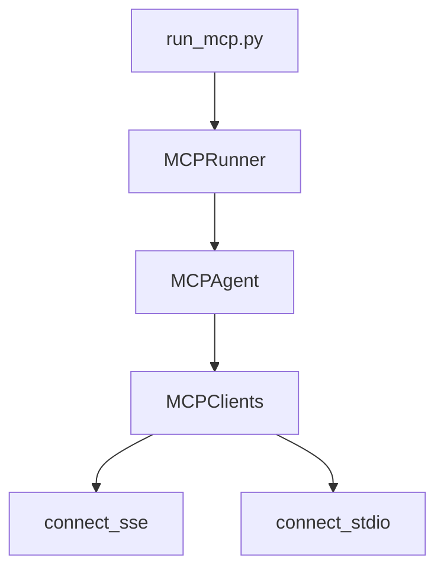
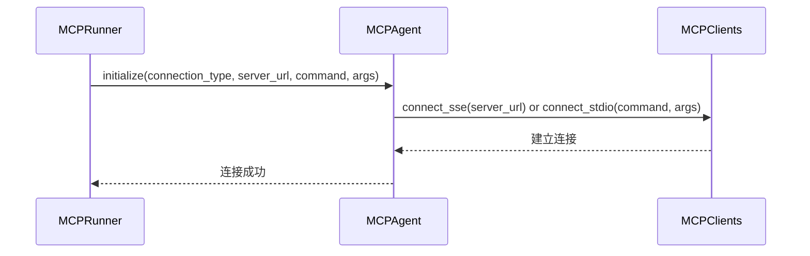
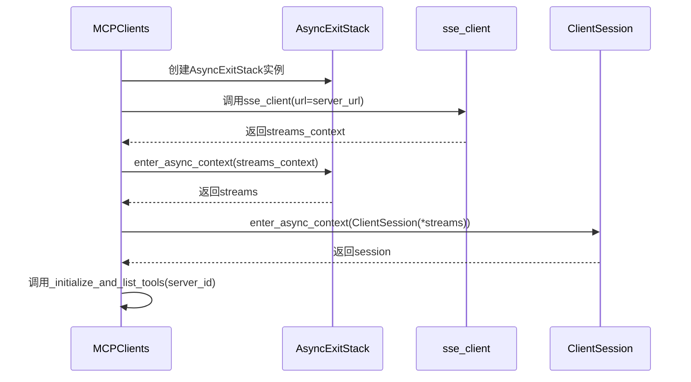
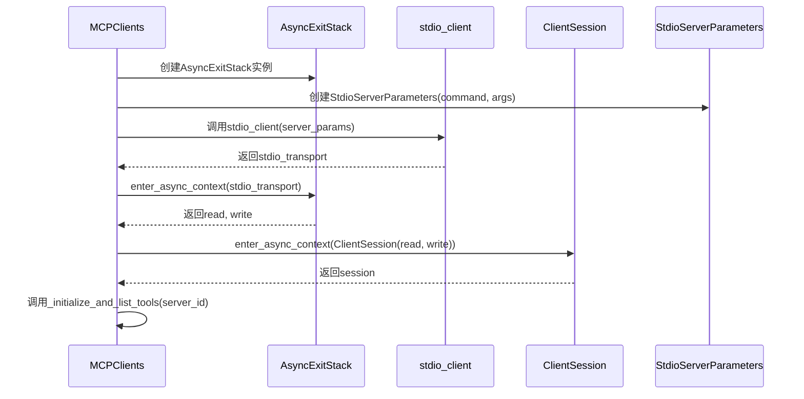
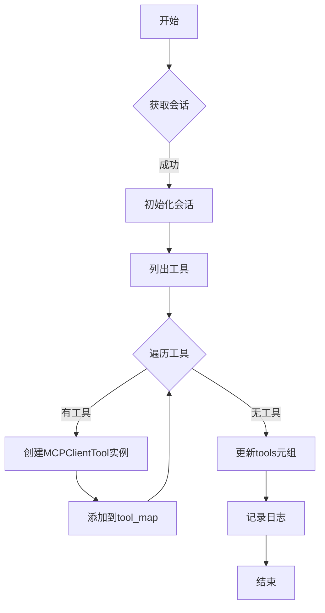
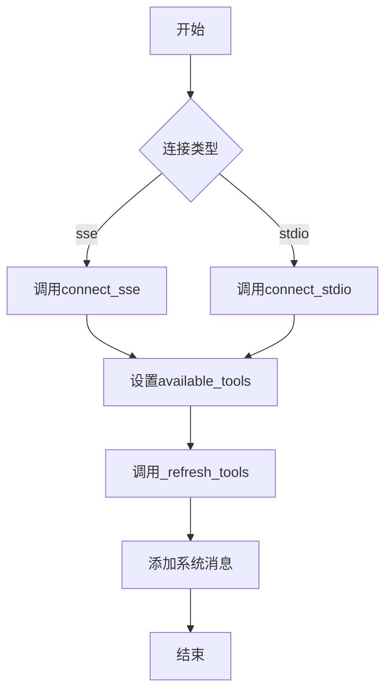
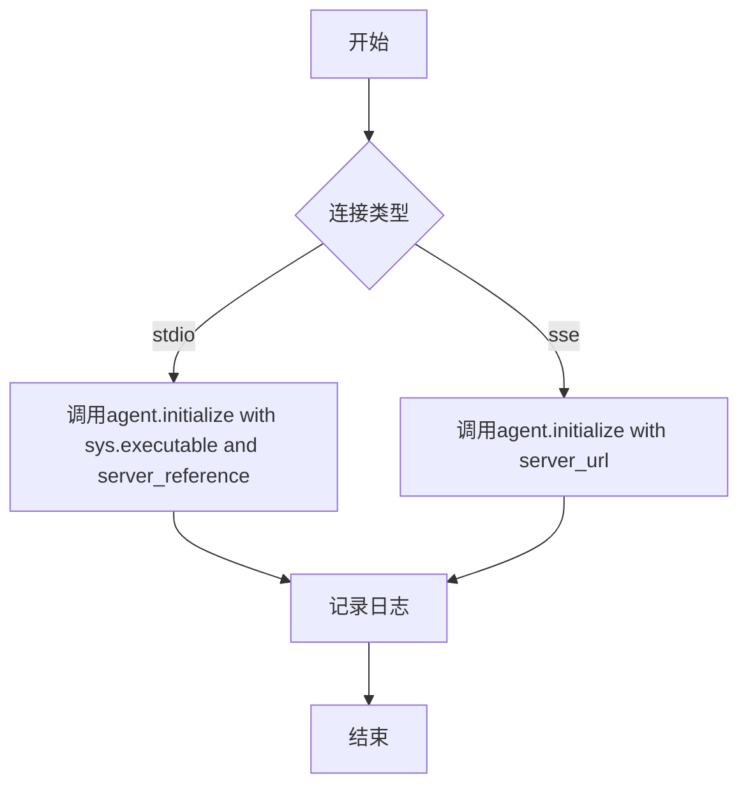
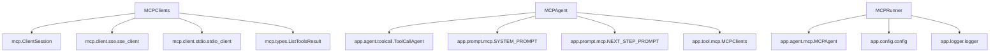

# 服务器连接管理

<cite>
**本文档引用的文件**  
- [mcp.py](file://app/tool/mcp.py)
- [mcp.py](file://app/agent/mcp.py)
- [run_mcp.py](file://run_mcp.py)
</cite>

## 目录
1. [项目结构](#项目结构)
2. [核心组件](#核心组件)
3. [架构概述](#架构概述)
4. [详细组件分析](#详细组件分析)
5. [依赖分析](#依赖分析)
6. [性能考虑](#性能考虑)
7. [故障排除指南](#故障排除指南)
8. [结论](#结论)

## 项目结构
项目结构中与MCP服务器连接机制相关的核心文件位于`app/tool/mcp.py`、`app/agent/mcp.py`和`run_mcp.py`。`app/tool/mcp.py`包含`MCPClients`类，负责管理与MCP服务器的连接和工具集合。`app/agent/mcp.py`包含`MCPAgent`类，用于初始化和管理MCP连接。`run_mcp.py`包含`MCPRunner`类，作为实际应用示例，展示命令行参数解析和连接配置。

**图表来源**  
- [run_mcp.py](file://run_mcp.py#L10-L65)
- [app/agent/mcp.py](file://app/agent/mcp.py#L12-L184)
- [app/tool/mcp.py](file://app/tool/mcp.py#L36-L193)

**章节来源**  
- [run_mcp.py](file://run_mcp.py#L10-L65)
- [app/agent/mcp.py](file://app/agent/mcp.py#L12-L184)
- [app/tool/mcp.py](file://app/tool/mcp.py#L36-L193)

## 核心组件
`MCPClients`类是管理MCP服务器连接的核心组件，提供`connect_sse`和`connect_stdio`方法用于建立连接。`MCPAgent`类通过`initialize`方法根据连接类型初始化会话。`MCPRunner`类作为实际应用示例，展示命令行参数解析、连接配置和错误处理流程。

**章节来源**  
- [app/tool/mcp.py](file://app/tool/mcp.py#L36-L193)
- [app/agent/mcp.py](file://app/agent/mcp.py#L12-L184)
- [run_mcp.py](file://run_mcp.py#L10-L65)

## 架构概述
系统架构包括`MCPRunner`、`MCPAgent`和`MCPClients`三个主要组件。`MCPRunner`负责解析命令行参数并初始化`MCPAgent`。`MCPAgent`根据连接类型调用`MCPClients`的相应方法建立连接。`MCPClients`使用异步上下文管理器和`AsyncExitStack`资源管理来管理连接。

**图表来源**  
- [run_mcp.py](file://run_mcp.py#L18-L35)
- [app/agent/mcp.py](file://app/agent/mcp.py#L39-L84)
- [app/tool/mcp.py](file://app/tool/mcp.py#L49-L68)
- [app/tool/mcp.py](file://app/tool/mcp.py#L70-L94)

## 详细组件分析
### MCPClients类分析
`MCPClients`类继承自`ToolCollection`，管理与多个MCP服务器的连接。它使用`sessions`字典存储`ClientSession`实例，`exit_stacks`字典存储`AsyncExitStack`实例。

#### connect_sse方法
`connect_sse`方法使用SSE传输连接到MCP服务器。它首先验证`server_url`参数，然后创建`AsyncExitStack`实例。使用`sse_client`上下文管理器建立SSE连接，然后使用`ClientSession`上下文管理器初始化会话。最后调用`_initialize_and_list_tools`方法初始化会话并列出可用工具。

**图表来源**  
- [app/tool/mcp.py](file://app/tool/mcp.py#L49-L68)

#### connect_stdio方法
`connect_stdio`方法使用stdio传输连接到MCP服务器。它首先验证`command`参数，然后创建`AsyncExitStack`实例。创建`StdioServerParameters`实例，然后使用`stdio_client`上下文管理器建立stdio连接。使用`ClientSession`上下文管理器初始化会话。最后调用`_initialize_and_list_tools`方法初始化会话并列出可用工具。

**图表来源**  
- [app/tool/mcp.py](file://app/tool/mcp.py#L70-L94)

#### _initialize_and_list_tools方法
`_initialize_and_list_tools`方法初始化会话并列出可用工具。它首先获取指定`server_id`的会话，然后调用`session.initialize()`初始化会话。调用`session.list_tools()`获取工具列表。为每个工具创建`MCPClientTool`实例，并将其添加到`tool_map`中。最后更新`tools`元组。

**图表来源**  
- [app/tool/mcp.py](file://app/tool/mcp.py#L96-L125)

**章节来源**  
- [app/tool/mcp.py](file://app/tool/mcp.py#L96-L125)

### MCPAgent类分析
`MCPAgent`类用于与MCP服务器交互。它通过`initialize`方法根据连接类型初始化会话。

#### initialize方法
`initialize`方法根据连接类型初始化MCP连接。如果`connection_type`为"sse"，则调用`mcp_clients.connect_sse`方法。如果`connection_type`为"stdio"，则调用`mcp_clients.connect_stdio`方法。设置`available_tools`为`mcp_clients`实例。调用`_refresh_tools`方法刷新工具列表。向内存中添加系统消息，包含可用工具信息。

**图表来源**  
- [app/agent/mcp.py](file://app/agent/mcp.py#L39-L84)

**章节来源**  
- [app/agent/mcp.py](file://app/agent/mcp.py#L39-L84)

### MCPRunner类分析
`MCPRunner`类作为实际应用示例，展示命令行参数解析、连接配置和错误处理流程。

#### initialize方法
`initialize`方法根据连接类型初始化MCP代理。如果`connection_type`为"stdio"，则使用`sys.executable`和`server_reference`作为命令和参数调用`agent.initialize`。如果`connection_type`为"sse"，则使用`server_url`调用`agent.initialize`。

**图表来源**  
- [run_mcp.py](file://run_mcp.py#L18-L35)

**章节来源**  
- [run_mcp.py](file://run_mcp.py#L18-L35)

## 依赖分析
`MCPClients`类依赖于`mcp.ClientSession`、`mcp.client.sse.sse_client`、`mcp.client.stdio.stdio_client`和`mcp.types.ListToolsResult`。`MCPAgent`类依赖于`app.agent.toolcall.ToolCallAgent`、`app.prompt.mcp.SYSTEM_PROMPT`、`app.prompt.mcp.NEXT_STEP_PROMPT`和`app.tool.mcp.MCPClients`。`MCPRunner`类依赖于`app.agent.mcp.MCPAgent`、`app.config.config`和`app.logger.logger`。

**图表来源**  
- [app/tool/mcp.py](file://app/tool/mcp.py#L1-L194)
- [app/agent/mcp.py](file://app/agent/mcp.py#L1-L185)
- [run_mcp.py](file://run_mcp.py#L1-L116)

**章节来源**  
- [app/tool/mcp.py](file://app/tool/mcp.py#L1-L194)
- [app/agent/mcp.py](file://app/agent/mcp.py#L1-L185)
- [run_mcp.py](file://run_mcp.py#L1-L116)

## 性能考虑
在连接MCP服务器时，应考虑以下性能因素：
- 使用适当的超时设置，避免长时间等待。
- 在连接失败时实现重试机制，提高可靠性。
- 定期刷新工具列表，确保使用最新的工具。
- 使用异步上下文管理器和`AsyncExitStack`资源管理，确保资源正确释放。

## 故障排除指南
### 常见连接问题
- **网络中断**：检查网络连接，确保服务器可访问。
- **服务未启动**：确保MCP服务器已启动并监听指定端口。
- **URL格式错误**：确保URL格式正确，包括协议、主机和端口。
- **命令参数错误**：确保命令和参数正确，特别是`sys.executable`和`server_reference`。

### 连接状态监控
- 使用`think`方法定期检查MCP会话和工具可用性。
- 如果会话或工具映射为空，则结束交互。
- 定期刷新工具列表，检测工具变化。

### 自动重连策略
- 在连接失败时，实现重试机制，例如使用指数退避算法。
- 在检测到服务关闭时，自动重新初始化连接。

**章节来源**  
- [app/agent/mcp.py](file://app/agent/mcp.py#L133-L151)
- [app/agent/mcp.py](file://app/agent/mcp.py#L86-L131)

## 结论
本文档详细介绍了MCP服务器连接机制的实现细节，包括SSE和stdio两种连接方式。通过分析`MCPClients`类的`connect_sse`和`connect_stdio`方法，解释了异步上下文管理器、`AsyncExitStack`资源管理和连接参数配置。结合`MCPAgent`的`initialize`方法，说明了代理如何根据连接类型初始化会话。使用`MCPRunner`类作为实际应用示例，展示了命令行参数解析、连接配置和错误处理流程。提供了连接配置的最佳实践和故障排除指南，帮助开发者更好地使用和维护MCP服务器连接。