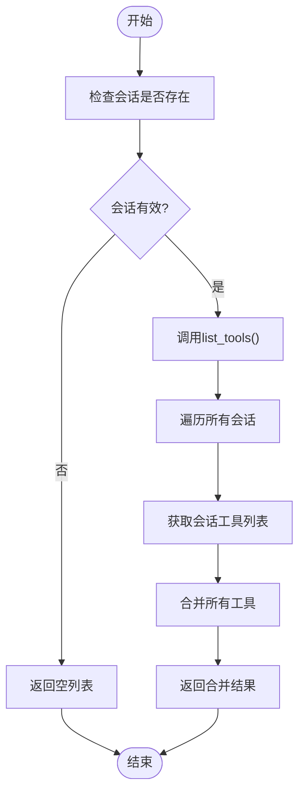

# MCP代理

<cite>
**本文档中引用的文件**   
- [mcp.py](file://app/agent/mcp.py)
- [mcp.py](file://app/tool/mcp.py)
- [server.py](file://app/mcp/server.py)
- [run_mcp.py](file://run_mcp.py)
- [mcp.example.json](file://config/mcp.example.json)
</cite>

## 目录
1. [简介](#简介)
2. [项目结构](#项目结构)
3. [核心组件](#核心组件)
4. [架构概述](#架构概述)
5. [详细组件分析](#详细组件分析)
6. [依赖分析](#依赖分析)
7. [性能考虑](#性能考虑)
8. [故障排除指南](#故障排除指南)
9. [结论](#结论)

## 简介
MCP代理（MCPAgent）是OpenManus系统中用于与MCP（Model Context Protocol）服务器通信的核心组件。该代理通过SSE或STDIO两种连接方式与外部MCP服务器建立连接，将服务器暴露的工具集动态映射为本地可用工具，并实现工具发现、状态监控和连接管理等关键功能。本文档详细说明MCP代理的工作机制、核心方法和配置方式。

## 项目结构
MCP相关功能分布在多个模块中，主要包含代理层、工具层和服务器实现。代理层负责与MCP服务器通信，工具层管理工具会话和调用，服务器层提供MCP服务端实现。


**图示来源**
- [mcp.py](file://app/agent/mcp.py#L12-L184)
- [mcp.py](file://app/tool/mcp.py#L36-L193)
- [server.py](file://app/mcp/server.py#L23-L159)
- [run_mcp.py](file://run_mcp.py#L20-L116)

**章节来源**
- [mcp.py](file://app/agent/mcp.py#L1-L185)
- [mcp.py](file://app/tool/mcp.py#L1-L194)
- [server.py](file://app/mcp/server.py#L1-L180)

## 核心组件
MCP代理系统由MCPAgent、MCPClients和MCPServer三个核心组件构成。MCPAgent作为客户端代理，通过MCPClients管理与MCP服务器的连接会话，并将服务器暴露的工具集映射为本地可用工具。MCPServer实现MCP协议的服务端，提供工具注册和调用功能。整个系统通过SSE或STDIO协议进行通信，支持动态工具发现和状态监控。

**章节来源**
- [mcp.py](file://app/agent/mcp.py#L12-L184)
- [mcp.py](file://app/tool/mcp.py#L36-L193)
- [server.py](file://app/mcp/server.py#L23-L159)

## 架构概述
MCP代理采用分层架构设计，分为代理层、会话管理层和传输层。代理层负责业务逻辑和状态管理，会话管理层处理多个MCP服务器连接，传输层实现SSE和STDIO两种通信协议。

```mermaid
graph TB
subgraph "代理层"
MCPAgent[MCPAgent]
ToolCallAgent[ToolCallAgent]
end
subgraph "会话管理层"
MCPClients[MCPClients]
MCPClientTool[MCPClientTool]
end
subgraph "传输层"
SSE[SSE传输]
STDIO[STDIO传输]
end
subgraph "服务器"
MCPServer[MCPServer]
end
MCPAgent --> MCPClients
MCPClients --> MCPClientTool
MCPClients --> SSE
MCPClients --> STDIO
SSE < --> MCPServer
STDIO < --> MCPServer
```

**图示来源**
- [mcp.py](file://app/agent/mcp.py#L12-L184)
- [mcp.py](file://app/tool/mcp.py#L36-L193)
- [server.py](file://app/mcp/server.py#L23-L159)

## 详细组件分析

### MCPAgent分析
MCPAgent是MCP协议客户端的核心实现，继承自ToolCallAgent，负责与MCP服务器建立连接、管理工具集和处理工具调用。

#### 类图


**图示来源**
- [mcp.py](file://app/agent/mcp.py#L12-L184)
- [toolcall.py](file://app/agent/toolcall.py#L17-L249)

#### 初始化流程


**图示来源**
- [mcp.py](file://app/agent/mcp.py#L39-L84)
- [mcp.py](file://app/tool/mcp.py#L49-L68)
- [mcp.py](file://app/tool/mcp.py#L70-L94)

**章节来源**
- [mcp.py](file://app/agent/mcp.py#L39-L84)

### MCPClients分析
MCPClients是MCP客户端会话管理器，负责管理与多个MCP服务器的连接会话，处理工具发现和会话生命周期。

#### 类图


**图示来源**
- [mcp.py](file://app/tool/mcp.py#L36-L193)
- [tool_collection.py](file://app/tool/tool_collection.py#L8-L70)
- [base.py](file://app/tool/base.py#L1-L100)

#### 工具发现流程


**图示来源**
- [mcp.py](file://app/tool/mcp.py#L146-L152)

**章节来源**
- [mcp.py](file://app/tool/mcp.py#L146-L152)

### MCPServer分析
MCPServer是MCP协议的服务端实现，负责注册工具、处理工具调用和管理服务器生命周期。

#### 类图


**图示来源**
- [server.py](file://app/mcp/server.py#L23-L159)
- [base.py](file://app/tool/base.py#L1-L100)

**章节来源**
- [server.py](file://app/mcp/server.py#L23-L159)

## 依赖分析
MCP代理系统依赖多个核心组件和外部库，形成复杂的依赖关系网络。


**图示来源**
- [mcp.py](file://app/agent/mcp.py#L12-L184)
- [mcp.py](file://app/tool/mcp.py#L36-L193)
- [server.py](file://app/mcp/server.py#L23-L159)
- [run_mcp.py](file://run_mcp.py#L20-L116)

**章节来源**
- [mcp.py](file://app/agent/mcp.py#L1-L185)
- [mcp.py](file://app/tool/mcp.py#L1-L194)
- [server.py](file://app/mcp/server.py#L1-L180)
- [run_mcp.py](file://run_mcp.py#L1-L116)

## 性能考虑
MCP代理在设计时考虑了多项性能优化策略：

1. **连接复用**：通过MCPClients管理会话，避免重复建立连接
2. **工具缓存**：在MCPAgent中缓存工具模式，减少重复查询
3. **异步处理**：所有I/O操作均采用异步方式，提高并发性能
4. **资源清理**：通过AsyncExitStack确保连接资源及时释放
5. **定期刷新**：通过_refresh_tools_interval控制工具刷新频率，平衡实时性和性能

## 故障排除指南

### 连接问题
当出现连接问题时，可按以下步骤排查：

1. **检查连接参数**：确保SSE连接提供了server_url，STDIO连接提供了command
2. **验证服务器状态**：确认MCP服务器正在运行且可访问
3. **检查网络配置**：对于SSE连接，确保防火墙允许相应端口通信
4. **查看日志信息**：检查系统日志中的连接错误详情

### 工具同步失败
工具同步失败的常见原因和解决方案：

1. **会话失效**：检查mcp_clients.sessions是否为空，重新初始化连接
2. **权限问题**：确保客户端有权限访问服务器的list_tools接口
3. **网络中断**：检查网络连接稳定性，重试连接
4. **版本不兼容**：确认客户端和服务器的MCP协议版本兼容

**章节来源**
- [mcp.py](file://app/agent/mcp.py#L133-L151)
- [mcp.py](file://app/tool/mcp.py#L146-L152)

## 结论
MCP代理作为OpenManus系统与外部MCP服务器通信的核心组件，实现了灵活的连接管理、动态的工具发现和可靠的资源清理机制。通过SSE和STDIO两种传输方式，支持多种部署场景。系统的分层架构设计确保了良好的扩展性和维护性，为构建基于MCP协议的智能代理系统提供了坚实基础。