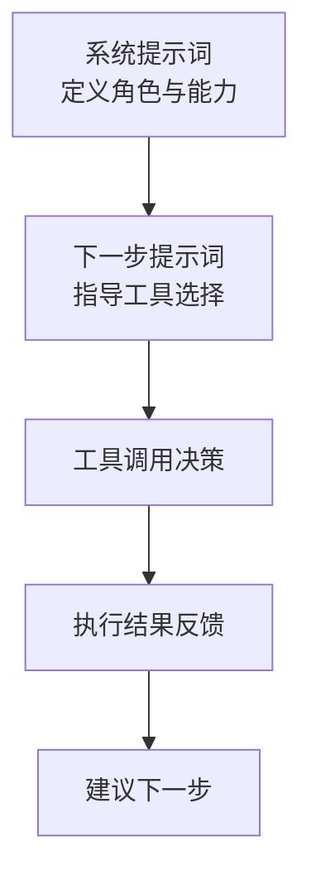
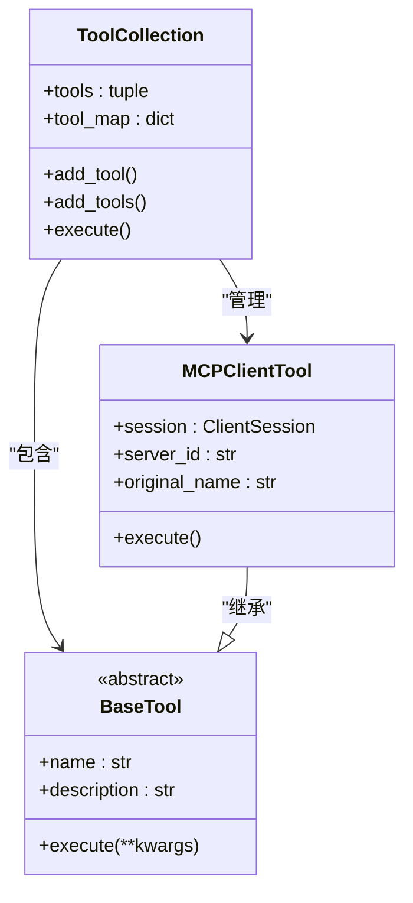
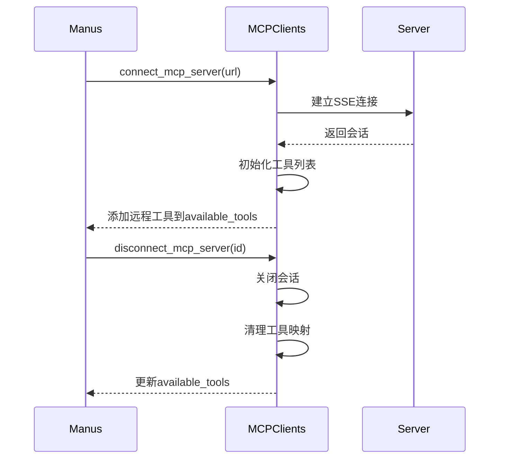

# Manus代理

<cite>
**本文档引用的文件**
- [manus.py](file://app/agent/manus.py)
- [toolcall.py](file://app/agent/toolcall.py)
- [mcp.py](file://app/agent/mcp.py)
- [mcp.py](file://app/tool/mcp.py)
- [tool_collection.py](file://app/tool/tool_collection.py)
- [manus.py](file://app/prompt/manus.py)
</cite>

## 目录
1. [简介](#简介)
2. [核心架构设计](#核心架构设计)
3. [系统提示词与下一步提示词](#系统提示词与下一步提示词)
4. [工具管理机制](#工具管理机制)
5. [MCP客户端连接管理](#mcp客户端连接管理)
6. [动态提示词调整](#动态提示词调整)
7. [性能优化与资源清理](#性能优化与资源清理)
8. [常见问题解决方案](#常见问题解决方案)
9. [总结](#总结)

## 简介

Manus代理是一个通用任务解决代理，继承自`ToolCallAgent`，具备处理多种复杂任务的能力。它通过集成本地工具和远程MCP（Model Context Protocol）工具，实现了灵活的任务执行框架。本文档详细说明其架构设计、工具管理、连接机制及性能优化策略。

## 核心架构设计

Manus代理基于`ToolCallAgent`构建，采用模块化设计，支持动态扩展工具集。其核心组件包括：
- 继承自`ToolCallAgent`的思维与执行逻辑
- 集成`ToolCollection`的工具管理系统
- 支持SSE/STDIO协议的MCP客户端连接管理
- 浏览器上下文辅助器用于Web交互

该架构允许Manus代理在不同环境和任务场景下保持高度适应性。

**Section sources**
- [manus.py](file://app/agent/manus.py#L1-L20)
- [toolcall.py](file://app/agent/toolcall.py#L1-L30)

## 系统提示词与下一步提示词

Manus代理使用两个关键提示词来引导其行为：

### 系统提示词 (system_prompt)
系统提示词定义了代理的基本角色和能力范围。它声明Manus是一个全能AI助手，能够调用多种工具完成编程、信息检索、文件处理、网页浏览等任务。提示词中还包含工作目录信息，通过格式化参数`{directory}`注入配置中的工作区根路径。

### 下一步提示词 (next_step_prompt)
下一步提示词指导代理如何选择合适的工具组合来解决问题。它鼓励代理主动选择最合适的工具或工具组合，对于复杂任务可以分步解决，并在每次工具调用后清晰解释结果并建议后续步骤。若需终止交互，可使用`terminate`工具。



**Diagram sources**
- [manus.py](file://app/agent/manus.py#L10-L15)
- [manus.py](file://app/prompt/manus.py#L1-L10)

**Section sources**
- [manus.py](file://app/agent/manus.py#L10-L15)
- [manus.py](file://app/prompt/manus.py#L1-L10)

## 工具管理机制

Manus代理通过`ToolCollection`类统一管理可用工具集。

### 本地工具集成
`available_tools`字段初始化时集成了多个本地工具：
- `PythonExecute`: 执行Python代码
- `BrowserUseTool`: 浏览器操作
- `StrReplaceEditor`: 字符串替换编辑
- `AskHuman`: 人工交互请求
- `Terminate`: 终止任务

这些工具通过`ToolCollection`进行封装和管理，确保统一的调用接口。

### 动态添加MCP远程工具
MCP服务器提供的工具通过`mcp_clients`动态添加到`available_tools`中。当连接新的MCP服务器时，系统会获取其工具列表，创建对应的`MCPClientTool`代理对象，并将其加入工具集合。这种设计实现了本地与远程工具的无缝集成。



**Diagram sources**
- [manus.py](file://app/agent/manus.py#L25-L35)
- [tool_collection.py](file://app/tool/tool_collection.py#L1-L70)
- [mcp.py](file://app/tool/mcp.py#L1-L50)

**Section sources**
- [manus.py](file://app/agent/manus.py#L25-L35)
- [tool_collection.py](file://app/tool/tool_collection.py#L1-L70)

## MCP客户端连接管理

Manus代理通过`MCPClients`类管理与多个MCP服务器的连接。

### 连接类型支持
支持两种连接方式：
- **SSE (Server-Sent Events)**: 通过URL连接HTTP流式服务器
- **STDIO**: 通过命令行启动并通信的本地进程

### 连接管理方法
#### connect_mcp_server
该方法根据连接类型建立与MCP服务器的连接：
- 使用`connect_sse`建立SSE连接
- 使用`connect_stdio`建立STDIO连接
- 记录连接信息到`connected_servers`字典
- 将新服务器的工具添加到`available_tools`

#### disconnect_mcp_server
断开指定或所有MCP服务器连接：
- 调用`mcp_clients.disconnect()`关闭会话
- 从`connected_servers`中移除记录
- 重建`available_tools`，排除已断开服务器的工具



**Diagram sources**
- [manus.py](file://app/agent/manus.py#L80-L120)
- [mcp.py](file://app/tool/mcp.py#L50-L150)

**Section sources**
- [manus.py](file://app/agent/manus.py#L80-L120)
- [mcp.py](file://app/tool/mcp.py#L50-L150)

## 动态提示词调整

`think`方法实现了根据上下文动态调整提示词的机制。

### 浏览器使用状态检测
通过检查最近三条消息中的工具调用历史，判断是否正在使用浏览器工具：
```python
browser_in_use = any(
    tc.function.name == BrowserUseTool().name
    for msg in recent_messages
    if msg.tool_calls
    for tc in msg.tool_calls
)
```

### 提示词动态切换
当检测到浏览器工具正在使用时：
1. 保存原始`next_step_prompt`
2. 使用`browser_context_helper`生成专门的浏览器上下文提示词
3. 执行父类的`think`方法
4. 恢复原始提示词

这种机制确保在浏览器交互场景下提供更合适的指导，提高任务执行效率。

**Section sources**
- [manus.py](file://app/agent/manus.py#L140-L160)

## 性能优化与资源清理

Manus代理实现了多项性能优化和资源管理机制。

### 步数限制
- `max_steps`: 设置最大执行步数为20步，防止无限循环
- `max_observe`: 限制观察结果长度，避免内存溢出

### 资源清理机制
`cleanup`方法确保资源的正确释放：
- 清理浏览器上下文
- 断开所有MCP服务器连接
- 标记未初始化状态以便重新初始化

初始化标志`_initialized`确保资源清理的幂等性，避免重复操作。

**Section sources**
- [manus.py](file://app/agent/manus.py#L125-L135)
- [manus.py](file://app/agent/manus.py#L137-L140)

## 常见问题解决方案

### MCP连接失败
#### 问题原因
- 服务器URL或命令配置错误
- 网络连接问题
- 服务器未启动或崩溃

#### 解决方案
1. 检查`config.mcp_config.servers`中的配置项
2. 验证服务器是否正常运行
3. 查看日志中的具体错误信息
4. 实现重试机制或备用连接方案

### 工具名称冲突
MCP工具名称通过`_sanitize_tool_name`方法进行规范化：
- 替换非法字符为下划线
- 移除连续下划线
- 限制长度不超过64字符
- 添加服务器ID前缀避免冲突

**Section sources**
- [manus.py](file://app/agent/manus.py#L70-L75)
- [mcp.py](file://app/tool/mcp.py#L170-L180)

## 总结

Manus代理通过继承`ToolCallAgent`并扩展MCP功能，构建了一个强大而灵活的任务解决框架。其核心优势在于：
- 统一的本地与远程工具管理
- 灵活的连接协议支持
- 动态的上下文感知能力
- 完善的资源管理和错误处理

这些特性使其能够适应各种复杂任务场景，为用户提供可靠的自动化解决方案。