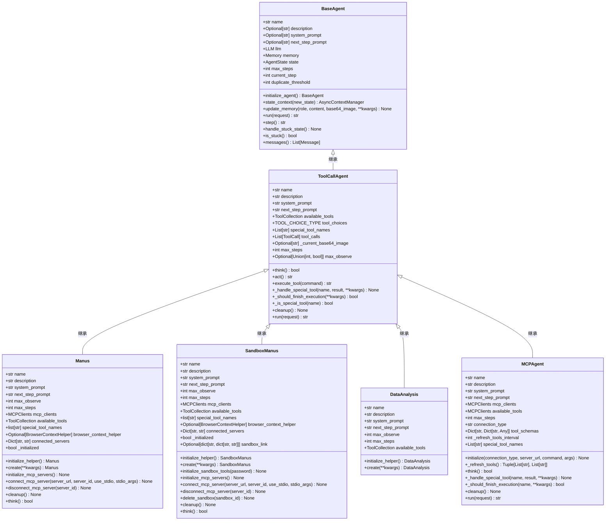
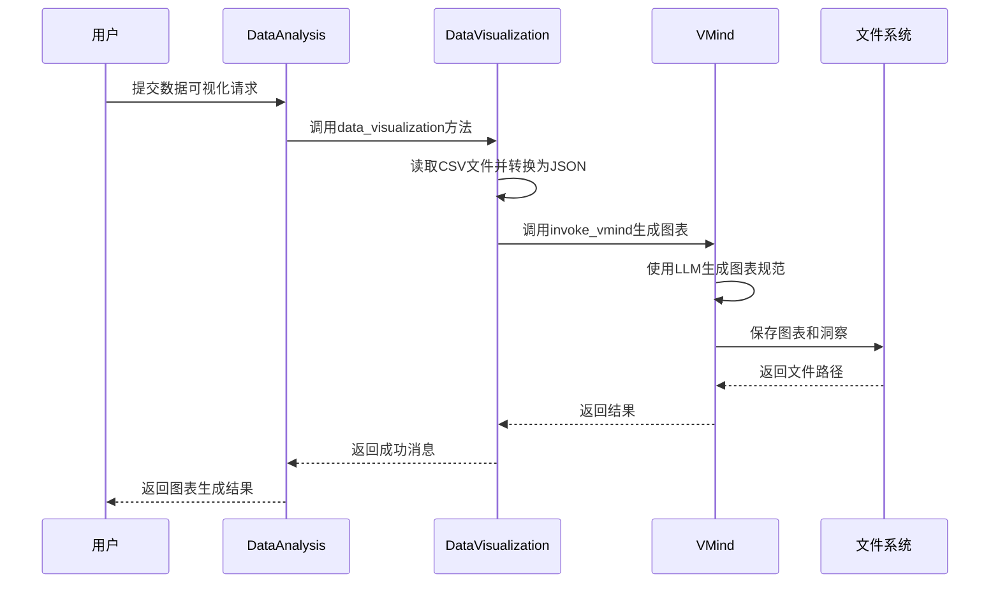
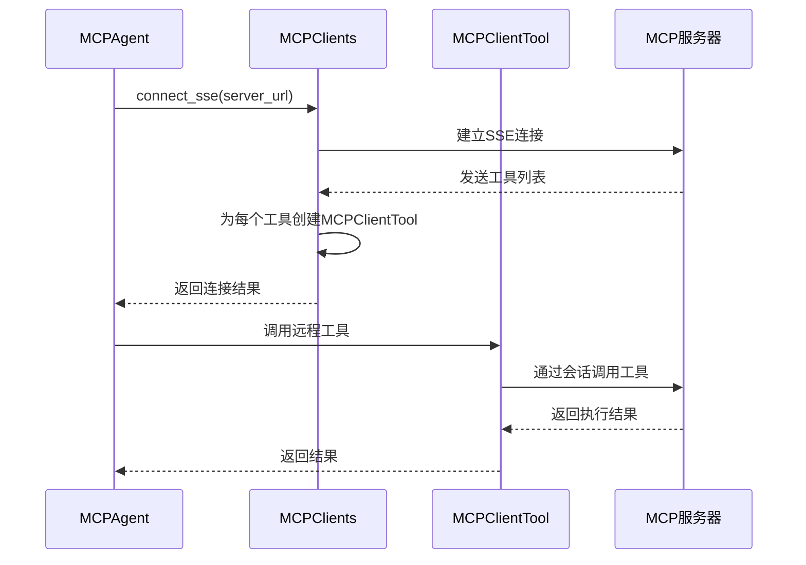

# 代理系统

<cite>
**本文档中引用的文件**  
- [base.py](file://app/agent/base.py)
- [toolcall.py](file://app/agent/toolcall.py)
- [manus.py](file://app/agent/manus.py)
- [sandbox_agent.py](file://app/agent/sandbox_agent.py)
- [mcp.py](file://app/agent/mcp.py)
- [data_analysis.py](file://app/agent/data_analysis.py)
- [data_visualization.py](file://app/tool/chart_visualization/data_visualization.py)
- [chart_prepare.py](file://app/tool/chart_visualization/chart_prepare.py)
- [python_execute.py](file://app/tool/chart_visualization/python_execute.py)
- [mcp.py](file://app/tool/mcp.py)
- [server.py](file://app/mcp/server.py)
</cite>

## 目录
1. [简介](#简介)
2. [代理类型与功能](#代理类型与功能)
3. [Manus代理](#manus代理)
4. [数据分析代理](#数据分析代理)
5. [MCP代理](#mcp代理)
6. [自定义代理开发](#自定义代理开发)
7. [性能优化与常见问题](#性能优化与常见问题)

## 简介
OpenManus系统提供了一套灵活的代理框架，支持多种类型的代理来处理不同的任务。这些代理基于统一的基类构建，通过继承和扩展实现特定功能。系统支持本地工具和通过MCP协议连接的远程工具，能够执行从数据处理到复杂分析的各种任务。本文档详细介绍了系统中所有类型的代理，包括它们的功能特性、使用方法、配置选项以及开发指导。

## 代理类型与功能
OpenManus中的代理系统采用分层架构，所有代理都继承自`BaseAgent`类，该类提供了状态管理、内存存储和执行循环等基础功能。`ToolCallAgent`作为中间层，实现了工具调用的核心逻辑，包括思考（think）和执行（act）两个阶段。在此基础上，系统实现了多种专用代理，每种代理都针对特定任务进行了优化。

**图示来源**  
- [base.py](file://app/agent/base.py#L12-L195)
- [toolcall.py](file://app/agent/toolcall.py#L17-L249)
- [manus.py](file://app/agent/manus.py#L17-L164)
- [sandbox_agent.py](file://app/agent/sandbox_agent.py#L20-L222)
- [data_analysis.py](file://app/agent/data_analysis.py#L11-L36)
- [mcp.py](file://app/agent/mcp.py#L12-L184)

## Manus代理
Manus代理是系统中的通用代理，能够通过本地工具和MCP服务器提供的远程工具解决各种任务。它继承自`ToolCallAgent`，并集成了浏览器上下文助手和MCP客户端，支持与外部服务的交互。

### 功能特性
Manus代理支持多种本地工具，包括Python代码执行、浏览器操作、文件编辑和人工询问。通过MCP客户端，它还能连接到外部MCP服务器，使用服务器提供的工具。代理在初始化时会自动连接配置文件中定义的所有MCP服务器，并将服务器的工具添加到可用工具集合中。

### 使用方法
使用Manus代理时，可以通过`create`类方法创建并初始化实例。代理会自动处理MCP服务器的连接和工具注册。在执行过程中，代理会根据当前状态决定下一步操作，包括调用工具或生成响应。

### 配置选项
Manus代理的配置主要通过`config.mcp_config.servers`进行，定义了要连接的MCP服务器及其连接方式（SSE或stdio）。代理还支持自定义系统提示和下一步提示，以指导其行为。

**本节来源**  
- [manus.py](file://app/agent/manus.py#L17-L164)

## 数据分析代理
数据分析代理专门用于处理数据可视化和报告生成任务，它集成了强大的数据处理和可视化工具，能够从原始数据生成图表和洞察。

### 数据可视化能力
数据分析代理通过`DataVisualization`工具实现数据可视化功能。该工具接收JSON格式的配置信息，包含CSV文件路径和图表标题，然后调用VMind库生成相应的图表。支持的输出格式包括PNG和HTML，可以生成静态或交互式图表。

**图示来源**  
- [data_analysis.py](file://app/agent/data_analysis.py#L11-L36)
- [data_visualization.py](file://app/tool/chart_visualization/data_visualization.py#L1-L263)
- [chartVisualize.ts](file://app/tool/chart_visualization/src/chartVisualize.ts#L1-L372)

### 报告生成能力
除了图表生成，数据分析代理还能生成包含洞察的报告。通过`VisualizationPrepare`工具，代理可以执行Python代码准备数据和生成元数据，然后使用`DataVisualization`工具生成图表和洞察。洞察信息会被保存为Markdown文件，并与图表一起返回给用户。

**本节来源**  
- [data_analysis.py](file://app/agent/data_analysis.py#L11-L36)
- [chart_prepare.py](file://app/tool/chart_visualization/chart_prepare.py#L1-L38)
- [python_execute.py](file://app/tool/chart_visualization/python_execute.py#L1-L36)

## MCP代理
MCP代理专门用于通过SSE或stdio连接与外部MCP服务器交互，它能够动态发现和使用服务器提供的工具。

### SSE与STDIO连接
MCP代理支持两种连接方式：SSE（Server-Sent Events）和stdio（标准输入输出）。SSE连接通过HTTP长连接实现，适用于Web服务；stdio连接通过进程间通信实现，适用于本地运行的服务。代理在初始化时根据配置选择连接方式，并建立与MCP服务器的会话。

### 工具管理
MCP代理通过`MCPClients`类管理与MCP服务器的连接和工具。当连接到服务器时，代理会获取服务器提供的工具列表，并为每个工具创建代理对象。这些代理对象被添加到可用工具集合中，使得主代理可以像调用本地工具一样调用远程工具。

**图示来源**  
- [mcp.py](file://app/agent/mcp.py#L12-L184)
- [mcp.py](file://app/tool/mcp.py#L1-L194)

### 动态工具刷新
MCP代理定期刷新工具列表，以检测服务器端工具的变化。通过`_refresh_tools_interval`参数控制刷新频率，默认每5步刷新一次。当检测到新工具、移除工具或工具模式变化时，代理会相应地更新可用工具集合，并通知用户。

**本节来源**  
- [mcp.py](file://app/agent/mcp.py#L12-L184)

## 自定义代理开发
开发者可以通过继承`BaseAgent`或`ToolCallAgent`创建新的代理类型，以满足特定需求。

### 继承BaseAgent
当需要完全自定义代理行为时，可以从`BaseAgent`继承。必须实现`step`抽象方法，定义代理的单步执行逻辑。`BaseAgent`提供了状态管理、内存存储和执行循环等基础功能，开发者可以在此基础上构建复杂的代理逻辑。

### 继承ToolCallAgent
对于大多数场景，推荐从`ToolCallAgent`继承，因为它已经实现了工具调用的核心逻辑。开发者只需定义代理的名称、描述、系统提示和可用工具集合。可以通过重写`think`和`act`方法来定制思考和执行过程。

### 工具集成
自定义代理可以集成现有工具或创建新工具。工具需要继承`BaseTool`类，并实现`execute`方法。工具的参数通过`parameters`属性定义，遵循JSON Schema格式。创建的工具可以添加到代理的`available_tools`集合中。

**本节来源**  
- [base.py](file://app/agent/base.py#L12-L195)
- [toolcall.py](file://app/agent/toolcall.py#L17-L249)

## 性能优化与常见问题
### 性能优化建议
1. 合理设置`max_steps`和`max_observe`参数，避免代理陷入无限循环或处理过大数据量。
2. 对于频繁调用的工具，考虑实现缓存机制，减少重复计算。
3. 使用`duplicate_threshold`参数检测和处理重复响应，提高代理效率。

### 常见问题解决方案
1. **工具调用失败**：检查工具参数是否符合要求，确保工具实现正确处理异常。
2. **MCP连接问题**：验证服务器URL或命令是否正确，检查网络连接和服务器状态。
3. **内存溢出**：定期清理代理内存，避免存储过多历史消息。

**本节来源**  
- [base.py](file://app/agent/base.py#L12-L195)
- [toolcall.py](file://app/agent/toolcall.py#L17-L249)
- [mcp.py](file://app/agent/mcp.py#L12-L184)