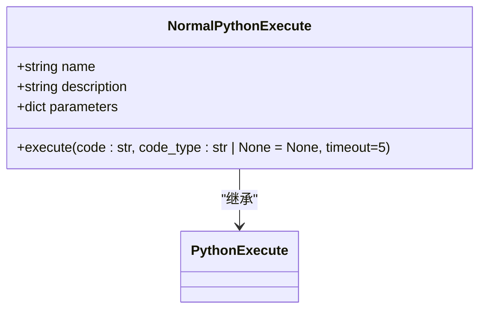
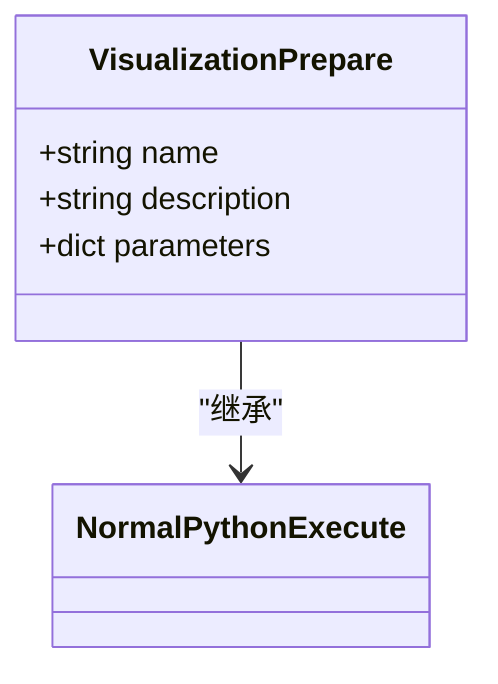
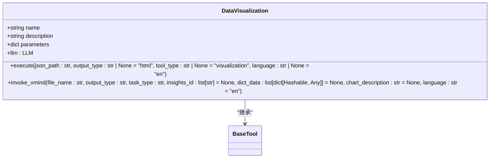
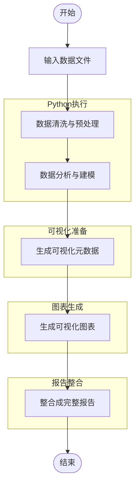
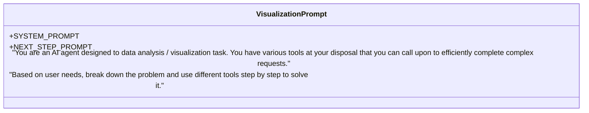
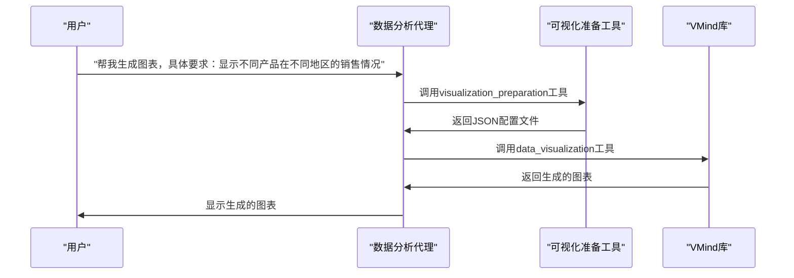
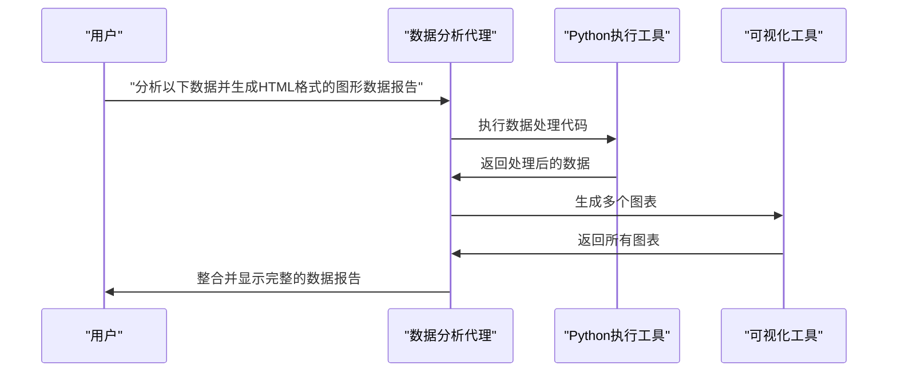

# 数据分析代理

<cite>
**本文档中引用的文件**
- [data_analysis.py](file://app/agent/data_analysis.py)
- [python_execute.py](file://app/tool/chart_visualization/python_execute.py)
- [chart_prepare.py](file://app/tool/chart_visualization/chart_prepare.py)
- [data_visualization.py](file://app/tool/chart_visualization/data_visualization.py)
- [visualization.py](file://app/prompt/visualization.py)
- [chartVisualize.ts](file://app/tool/chart_visualization/src/chartVisualize.ts)
- [chart_demo.py](file://app/tool/chart_visualization/test/chart_demo.py)
- [report_demo.py](file://app/tool/chart_visualization/test/report_demo.py)
- [README_zh.md](file://app/tool/chart_visualization/README_zh.md)
</cite>

## 目录
1. [简介](#简介)
2. [核心组件](#核心组件)
3. [工作流程](#工作流程)
4. [可视化提示词模板](#可视化提示词模板)
5. [实际使用示例](#实际使用示例)
6. [配置选项](#配置选项)
7. [性能考虑因素](#性能考虑因素)
8. [常见错误排查](#常见错误排查)
9. [结论](#结论)

## 简介
数据分析代理是一个专门用于执行数据分析、可视化和报告生成任务的智能代理。该代理利用多种工具协同工作，能够处理从数据清洗、分析建模到生成可视化图表和整合报告的完整流程。通过自然语言指令，用户可以驱动代理完成复杂的数据分析任务，而无需编写代码。

**Section sources**
- [data_analysis.py](file://app/agent/data_analysis.py#L1-L37)

## 核心组件

数据分析代理的核心功能由多个关键组件构成，这些组件协同工作以实现完整的数据分析流程。

### Python执行工具
`NormalPythonExecute` 工具用于执行Python代码，支持数据处理、数据报告生成和其他常规任务。该工具在安全限制下运行代码，并设置了超时机制以防止长时间运行。

**Diagram sources**
- [python_execute.py](file://app/tool/chart_visualization/python_execute.py#L4-L35)

### 可视化准备工具
`VisualizationPrepare` 工具负责生成数据可视化所需的元数据。它通过执行Python代码来准备CSV数据文件和图表描述，并将这些信息保存为JSON格式的配置文件。

**Diagram sources**
- [chart_prepare.py](file://app/tool/chart_visualization/chart_prepare.py#L3-L37)

### 数据可视化工具
`DataVisualization` 工具根据`VisualizationPrepare`生成的JSON配置文件，调用VMind库生成具体的可视化图表。支持PNG和HTML两种输出格式，并可选择添加数据洞察。

**Diagram sources**
- [data_visualization.py](file://app/tool/chart_visualization/data_visualization.py#L14-L262)

## 工作流程

数据分析代理的工作流程分为四个主要阶段：数据处理、可视化准备、图表生成和报告整合。

**Diagram sources**
- [data_analysis.py](file://app/agent/data_analysis.py#L1-L37)
- [python_execute.py](file://app/tool/chart_visualization/python_execute.py#L4-L35)
- [chart_prepare.py](file://app/tool/chart_visualization/chart_prepare.py#L3-L37)
- [data_visualization.py](file://app/tool/chart_visualization/data_visualization.py#L14-L262)

**Section sources**
- [data_analysis.py](file://app/agent/data_analysis.py#L1-L37)
- [python_execute.py](file://app/tool/chart_visualization/python_execute.py#L4-L35)
- [chart_prepare.py](file://app/tool/chart_visualization/chart_prepare.py#L3-L37)
- [data_visualization.py](file://app/tool/chart_visualization/data_visualization.py#L14-L262)

## 可视化提示词模板

可视化提示词模板定义了代理在执行数据分析任务时的行为准则和系统提示。这些模板指导代理如何分解问题、选择合适的工具并逐步解决问题。

**Diagram sources**
- [visualization.py](file://app/prompt/visualization.py#L0-L9)

**Section sources**
- [visualization.py](file://app/prompt/visualization.py#L0-L9)

## 实际使用示例

以下是两个实际使用示例，展示了如何通过自然语言指令驱动数据分析任务。

### 图表生成示例
此示例演示了如何生成多个不同类型的图表。

**Diagram sources**
- [chart_demo.py](file://app/tool/chart_visualization/test/chart_demo.py#L0-L191)

### 报告生成示例
此示例演示了如何生成包含多个图表的数据报告。

**Diagram sources**
- [report_demo.py](file://app/tool/chart_visualization/test/report_demo.py#L0-L27)

**Section sources**
- [chart_demo.py](file://app/tool/chart_visualization/test/chart_demo.py#L0-L191)
- [report_demo.py](file://app/tool/chart_visualization/test/report_demo.py#L0-L27)

## 配置选项

数据分析代理提供了多种配置选项，允许用户根据具体需求进行定制。

### 输出格式配置
支持两种输出格式：
- **PNG**: 静态图像格式，适合嵌入文档或演示文稿
- **HTML**: 交互式图表格式，支持用户与图表进行互动

### 语言配置
支持两种语言：
- **中文(zh)**: 生成中文版的图表和报告
- **英文(en)**: 生成英文版的图表和报告

### 主题配置
默认使用"light"主题，但可以通过配置更改图表的主题风格。

**Section sources**
- [data_visualization.py](file://app/tool/chart_visualization/data_visualization.py#L14-L262)
- [README_zh.md](file://app/tool/chart_visualization/README_zh.md#L0-L147)

## 性能考虑因素

在处理大型数据集时，需要考虑以下性能因素：

### 内存管理
代理在处理大型数据集时会占用大量内存。建议在处理前对数据进行适当的采样或分块处理。

### 执行时间
复杂的数据分析任务可能需要较长时间才能完成。代理设置了20步的最大执行限制，以防止无限循环。

### 并行处理
对于包含多个独立分析任务的情况，可以考虑并行执行以提高效率。

**Section sources**
- [data_analysis.py](file://app/agent/data_analysis.py#L1-L37)
- [python_execute.py](file://app/tool/chart_visualization/python_execute.py#L4-L35)

## 常见错误排查

### 依赖缺失
如果缺少必要的Node.js依赖，可能会导致图表生成失败。解决方法是按照README中的说明安装所有依赖。

### 数据格式错误
确保输入数据的格式正确，特别是CSV文件的分隔符和编码格式。

### 超时错误
如果分析任务过于复杂，可能会触发超时机制。可以通过简化任务或增加超时时间来解决。

**Section sources**
- [README_zh.md](file://app/tool/chart_visualization/README_zh.md#L0-L147)
- [data_visualization.py](file://app/tool/chart_visualization/data_visualization.py#L14-L262)

## 结论
数据分析代理通过整合多种工具和功能，提供了一个强大的平台来执行复杂的数据分析任务。从数据清洗到可视化再到报告生成，该代理能够自动化整个流程，使用户能够专注于数据分析本身而不是技术细节。通过自然语言指令，即使是非技术用户也能轻松地进行数据分析，大大降低了数据分析的门槛。