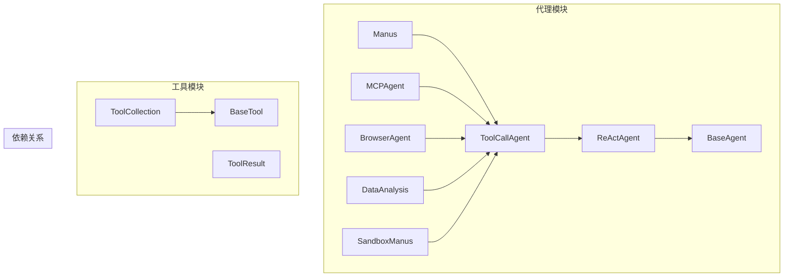
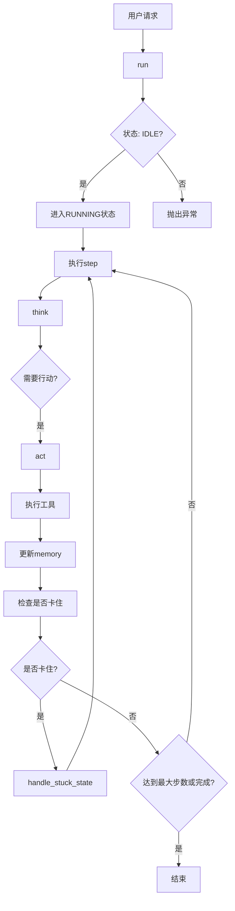
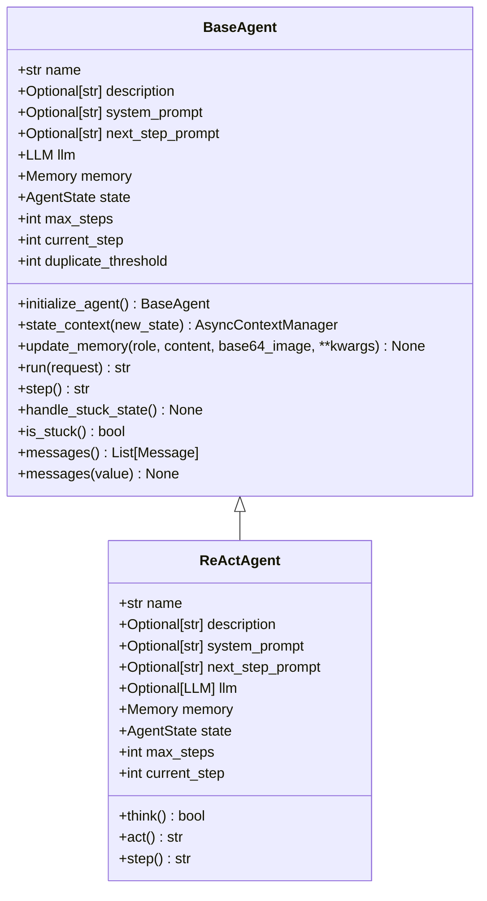
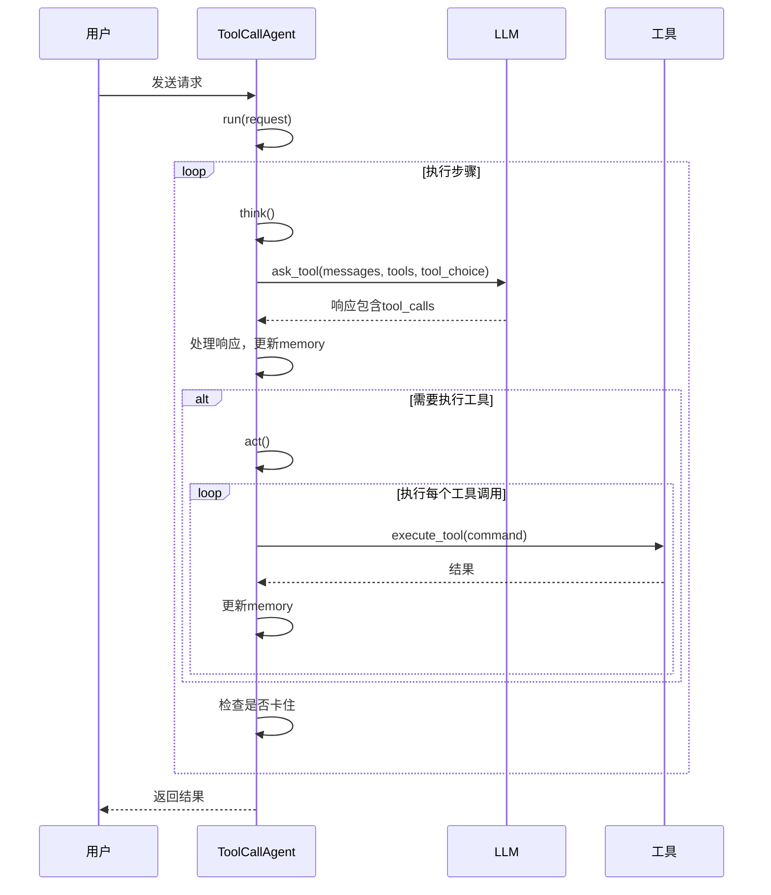
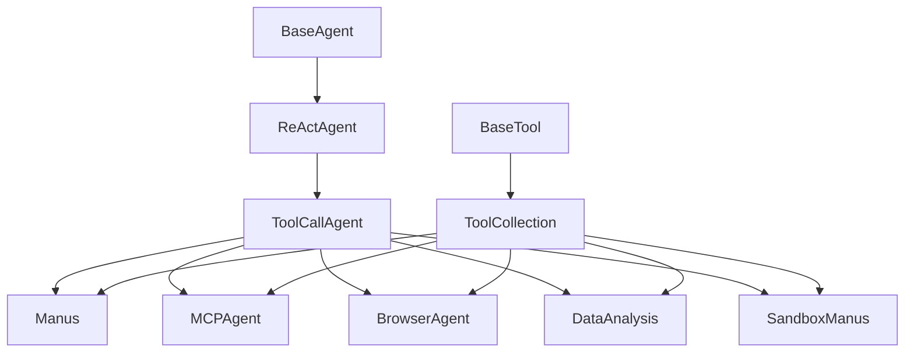

# 自定义代理开发

<cite>
**本文档引用的文件**  
- [base.py](file://app/agent/base.py)
- [toolcall.py](file://app/agent/toolcall.py)
- [manus.py](file://app/agent/manus.py)
- [mcp.py](file://app/agent/mcp.py)
- [browser.py](file://app/agent/browser.py)
- [data_analysis.py](file://app/agent/data_analysis.py)
- [sandbox_agent.py](file://app/agent/sandbox_agent.py)
- [react.py](file://app/agent/react.py)
- [base.py](file://app/tool/base.py)
- [tool_collection.py](file://app/tool/tool_collection.py)
</cite>

## 目录
1. [简介](#简介)
2. [项目结构](#项目结构)
3. [核心组件](#核心组件)
4. [架构概述](#架构概述)
5. [详细组件分析](#详细组件分析)
6. [依赖分析](#依赖分析)
7. [性能考虑](#性能考虑)
8. [故障排除指南](#故障排除指南)
9. [结论](#结论)

## 简介
本文档旨在为开发者提供基于OpenManus框架创建自定义代理的全面指南。文档详细说明了如何继承`BaseAgent`或`ToolCallAgent`来实现新的代理类型，包括重写`name`、`description`、`system_prompt`等属性的规范。同时，文档解释了如何通过`available_tools`集成现有工具或添加自定义工具，描述了`memory`管理、`think`决策循环和`state`状态机的扩展方式，并提供了从简单代理到复杂代理的渐进式开发示例。

## 项目结构
OpenManus框架的项目结构清晰地组织了代理、工具、提示、沙箱和流程等核心组件。代理类位于`app/agent`目录下，工具类位于`app/tool`目录下，提示模板位于`app/prompt`目录下，沙箱相关功能位于`app/sandbox`目录下，流程管理位于`app/flow`目录下。这种模块化设计使得开发者可以轻松地扩展和定制代理功能。

**图示来源**  
- [base.py](file://app/agent/base.py#L12-L195)
- [toolcall.py](file://app/agent/toolcall.py#L17-L249)
- [react.py](file://app/agent/react.py#L10-L37)
- [tool_collection.py](file://app/tool/tool_collection.py#L1-L71)
- [base.py](file://app/tool/base.py#L1-L181)

**本节来源**  
- [app/agent](file://app/agent)
- [app/tool](file://app/tool)
- [app/prompt](file://app/prompt)
- [app/sandbox](file://app/sandbox)
- [app/flow](file://app/flow)

## 核心组件
OpenManus框架的核心组件包括`BaseAgent`、`ReActAgent`、`ToolCallAgent`以及各种具体代理实现（如`Manus`、`MCPAgent`、`BrowserAgent`等）。`BaseAgent`是所有代理的抽象基类，提供了状态管理、内存管理和执行循环的基础功能。`ReActAgent`扩展了`BaseAgent`，引入了`think`和`act`方法，实现了“思考-行动”循环。`ToolCallAgent`进一步扩展了`ReActAgent`，专注于处理工具调用，是大多数具体代理的直接父类。

**本节来源**  
- [base.py](file://app/agent/base.py#L12-L195)
- [react.py](file://app/agent/react.py#L10-L37)
- [toolcall.py](file://app/agent/toolcall.py#L17-L249)

## 架构概述
OpenManus框架采用分层架构，顶层是具体的代理实现，中间层是`ToolCallAgent`和`ReActAgent`，底层是`BaseAgent`。代理通过`available_tools`属性管理可用的工具集合，通过`memory`属性管理对话历史，通过`state`属性管理代理的当前状态。代理的执行流程由`run`方法控制，该方法在`RUNNING`状态下循环调用`step`方法，`step`方法又调用`think`和`act`方法。

**图示来源**  
- [base.py](file://app/agent/base.py#L115-L153)
- [toolcall.py](file://app/agent/toolcall.py#L244-L249)
- [react.py](file://app/agent/react.py#L37-L37)

**本节来源**  
- [base.py](file://app/agent/base.py#L115-L153)
- [toolcall.py](file://app/agent/toolcall.py#L244-L249)
- [react.py](file://app/agent/react.py#L37-L37)

## 详细组件分析
### BaseAgent 分析
`BaseAgent`是所有代理的基类，它定义了代理的核心属性和方法。核心属性包括`name`、`description`、`system_prompt`、`llm`、`memory`和`state`。`run`方法是代理的主循环，它在`RUNNING`状态下循环调用`step`方法。`update_memory`方法用于向代理的记忆中添加消息。`is_stuck`和`handle_stuck_state`方法用于检测和处理代理卡住的情况。

**本节来源**  
- [base.py](file://app/agent/base.py#L12-L195)

### ReActAgent 分析
`ReActAgent`继承自`BaseAgent`，引入了`think`和`act`方法。`think`方法负责处理当前状态并决定下一步行动，返回一个布尔值表示是否需要执行行动。`act`方法负责执行已决定的行动。`step`方法将`think`和`act`组合在一起，形成一个完整的“思考-行动”循环。

**图示来源**  
- [base.py](file://app/agent/base.py#L12-L195)
- [react.py](file://app/agent/react.py#L10-L37)

**本节来源**  
- [react.py](file://app/agent/react.py#L10-L37)

### ToolCallAgent 分析
`ToolCallAgent`是创建自定义代理最常用的基类。它继承自`ReActAgent`，专注于处理工具调用。`think`方法调用LLM并处理工具调用，`act`方法执行工具调用并处理结果。`execute_tool`方法执行单个工具调用，具有强大的错误处理能力。`cleanup`方法用于清理代理使用的资源。

**图示来源**  
- [toolcall.py](file://app/agent/toolcall.py#L38-L128)
- [toolcall.py](file://app/agent/toolcall.py#L130-L163)
- [toolcall.py](file://app/agent/toolcall.py#L165-L207)

**本节来源**  
- [toolcall.py](file://app/agent/toolcall.py#L17-L249)

### 具体代理实现分析
#### Manus 代理
`Manus`代理是一个多功能通用代理，支持本地工具和MCP工具。它通过`mcp_clients`属性管理MCP客户端，通过`connect_mcp_server`方法连接MCP服务器，并将服务器的工具添加到`available_tools`中。`think`方法会根据浏览器是否在使用来动态调整`next_step_prompt`。

#### MCPAgent 代理
`MCPAgent`代理专门用于与MCP服务器交互。它通过`initialize`方法初始化MCP连接，支持SSE和stdio两种传输方式。`_refresh_tools`方法定期刷新可用工具列表，以检测工具的增删改。`_should_finish_execution`方法重写为当工具名为`terminate`时结束代理。

#### BrowserAgent 代理
`BrowserAgent`代理使用`BrowserUseTool`控制浏览器。它通过`BrowserContextHelper`类获取浏览器状态，并将其格式化为`next_step_prompt`，以便LLM能够根据当前浏览器状态做出决策。

#### DataAnalysis 代理
`DataAnalysis`代理专注于数据分析任务，集成了`NormalPythonExecute`、`VisualizationPrepare`和`DataVisualization`等工具，能够执行Python代码并生成可视化图表。

**本节来源**  
- [manus.py](file://app/agent/manus.py#L17-L164)
- [mcp.py](file://app/agent/mcp.py#L12-L184)
- [browser.py](file://app/agent/browser.py#L86-L128)
- [data_analysis.py](file://app/agent/data_analysis.py#L11-L36)

## 依赖分析
OpenManus框架的依赖关系清晰，`BaseAgent`是所有代理的基类，`ReActAgent`和`ToolCallAgent`逐层扩展其功能。具体代理实现（如`Manus`、`MCPAgent`等）都直接或间接继承自`ToolCallAgent`。工具通过`ToolCollection`进行管理，`ToolCollection`将多个`BaseTool`实例组织在一起，并提供`execute`方法来执行工具。

**图示来源**  
- [base.py](file://app/agent/base.py#L12-L195)
- [react.py](file://app/agent/react.py#L10-L37)
- [toolcall.py](file://app/agent/toolcall.py#L17-L249)
- [manus.py](file://app/agent/manus.py#L17-L164)
- [mcp.py](file://app/agent/mcp.py#L12-L184)
- [browser.py](file://app/agent/browser.py#L86-L128)
- [data_analysis.py](file://app/agent/data_analysis.py#L11-L36)
- [sandbox_agent.py](file://app/agent/sandbox_agent.py#L20-L222)
- [tool_collection.py](file://app/tool/tool_collection.py#L1-L71)

**本节来源**  
- [app/agent](file://app/agent)
- [app/tool/tool_collection.py](file://app/tool/tool_collection.py#L1-L71)

## 性能考虑
在开发自定义代理时，应注意以下性能优化建议：
- 合理设置`max_steps`以防止无限循环。
- 使用`max_observe`限制工具输出的长度，避免token超限。
- 在`cleanup`方法中及时释放资源，如关闭浏览器、断开MCP连接等。
- 对于复杂的工具，考虑实现缓存机制以避免重复计算。

## 故障排除指南
在开发和使用自定义代理时，可能会遇到以下常见问题：
- **Token超限**：当LLM响应的token数量超过限制时，`think`方法会捕获`TokenLimitExceeded`异常，并将代理状态设置为`FINISHED`。
- **工具调用失败**：`execute_tool`方法具有强大的错误处理能力，能够捕获JSON解析错误和工具执行异常，并返回相应的错误信息。
- **代理卡住**：`is_stuck`方法通过检测重复的响应来判断代理是否卡住，`handle_stuck_state`方法会添加提示以改变策略。

**本节来源**  
- [toolcall.py](file://app/agent/toolcall.py#L38-L128)
- [toolcall.py](file://app/agent/toolcall.py#L165-L207)
- [base.py](file://app/agent/base.py#L169-L185)
- [base.py](file://app/agent/base.py#L162-L167)

## 结论
OpenManus框架提供了一个强大而灵活的代理开发平台。通过继承`BaseAgent`或`ToolCallAgent`，开发者可以轻松创建各种类型的自定义代理。框架的模块化设计和清晰的架构使得扩展和定制变得简单。遵循本文档中的最佳实践，开发者可以构建出稳定高效的自定义代理，以解决各种复杂的任务。