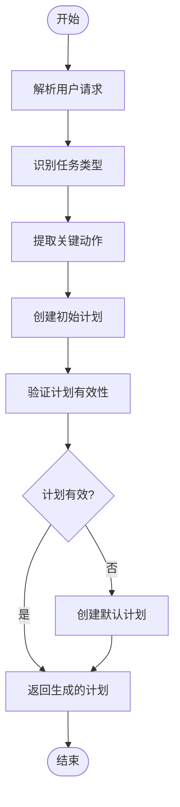
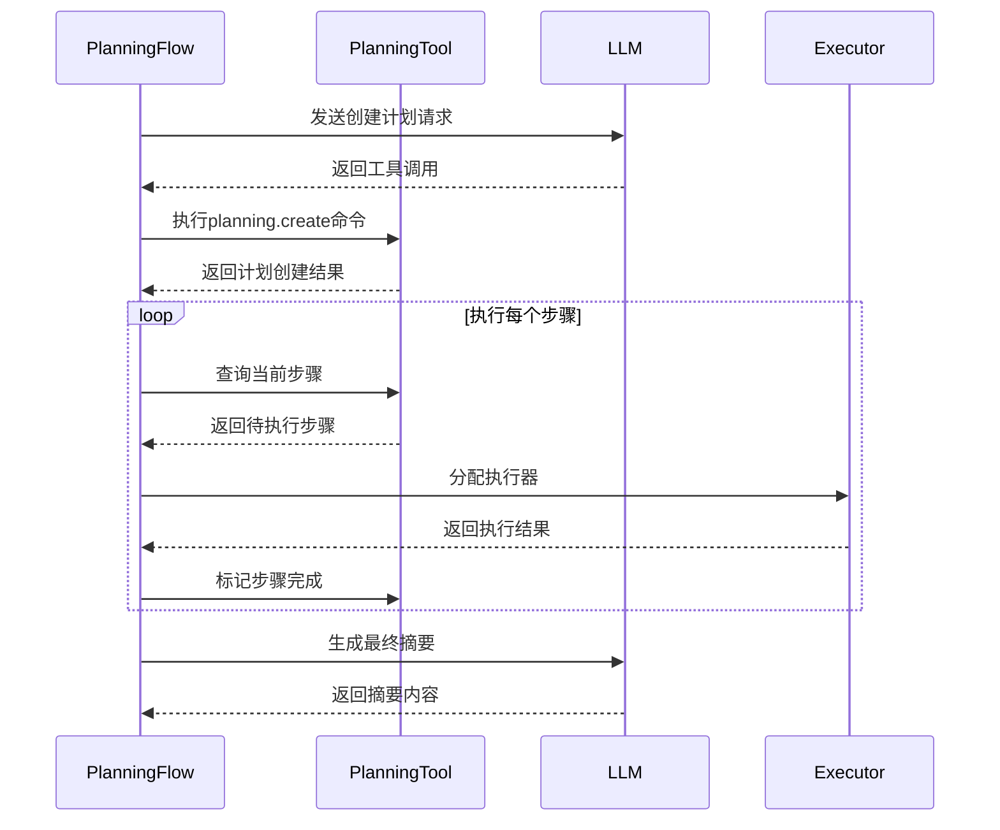
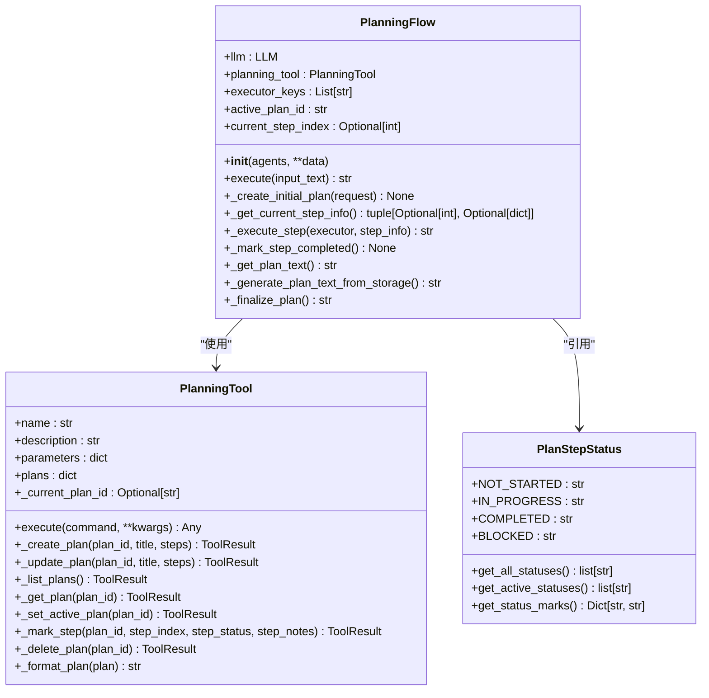
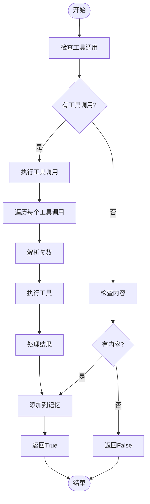
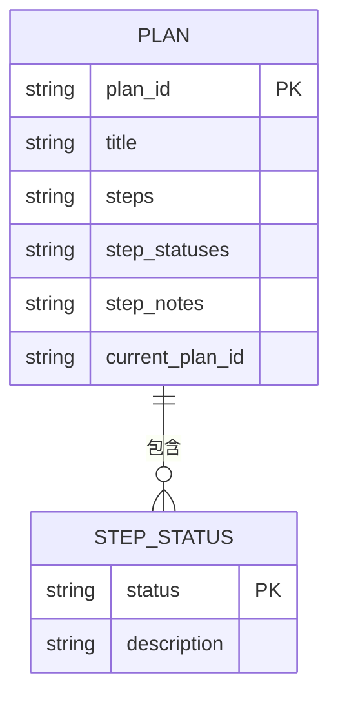

# 任务分解

<cite>
**本文档中引用的文件**   
- [planning.py](file://app/flow/planning.py)
- [planning.py](file://app/tool/planning.py)
- [planning.py](file://app/prompt/planning.py)
- [toolcall.py](file://app/agent/toolcall.py)
- [react.py](file://app/agent/react.py)
</cite>

## 目录
1. [简介](#简介)
2. [任务边界识别与关键动作提取](#任务边界识别与关键动作提取)
3. [执行顺序建立机制](#执行顺序建立机制)
4. [基于语义理解的任务切分策略](#基于语义理解的任务切分策略)
5. [工具调用能力映射](#工具调用能力映射)
6. [资源需求与执行环境评估](#资源需求与执行环境评估)
7. [自定义分解规则扩展方法](#自定义分解规则扩展方法)
8. [典型成功与失败案例](#典型成功与失败案例)
9. [结论](#结论)

## 简介
任务分解是OpenManus系统中的核心功能，通过`PlanningFlow`类和`PlanningTool`工具实现复杂任务的自动化处理。系统采用基于语义理解的规划方法，将用户请求分解为可执行的步骤序列，并通过多代理协作完成任务。该机制结合了大语言模型的推理能力和工具调用的执行能力，实现了从任务分析到执行完成的完整闭环。

**Section sources**
- [planning.py](file://app/flow/planning.py#L1-L50)
- [planning.py](file://app/tool/planning.py#L1-L20)

## 任务边界识别与关键动作提取

任务边界识别通过`_create_initial_plan`方法实现，该方法利用大语言模型分析用户请求并生成初始计划。系统通过正则表达式匹配`[SEARCH]`、`[CODE]`等标记来识别任务类型，从而确定任务边界。例如，在`_get_current_step_info`方法中，通过`re.search(r"\[([A-Z_]+)\]", step)`提取步骤类型，实现对搜索、代码执行等不同任务类别的识别。

关键动作提取依赖于`PlanningTool`的`create`命令，该命令要求提供明确的步骤列表。系统通过分析请求语义，将复杂任务分解为"Analyze request"、"Execute task"、"Verify results"等关键动作。当LLM未能生成有效计划时，系统会创建包含这些默认步骤的备用计划。

**Diagram sources **
- [planning.py](file://app/flow/planning.py#L135-L210)
- [planning.py](file://app/flow/planning.py#L212-L274)

**Section sources**
- [planning.py](file://app/flow/planning.py#L135-L210)
- [planning.py](file://app/flow/planning.py#L212-L274)

## 执行顺序建立机制

执行顺序的建立通过`PlanningFlow`的执行循环实现。系统维护一个状态机，使用`PlanStepStatus`枚举类管理步骤状态，包括"not_started"、"in_progress"、"completed"和"blocked"四种状态。`_get_current_step_info`方法负责查找第一个非完成状态的步骤，确保按顺序执行。

执行流程由`execute`方法控制，采用while循环逐个处理步骤。每个步骤执行前会被标记为"in_progress"状态，完成后更新为"completed"状态。这种机制确保了执行顺序的严格性，避免了步骤的跳过或重复执行。当所有步骤完成后，系统调用`_finalize_plan`生成最终摘要。

**Diagram sources **
- [planning.py](file://app/flow/planning.py#L93-L133)
- [planning.py](file://app/flow/planning.py#L276-L303)

**Section sources**
- [planning.py](file://app/flow/planning.py#L93-L133)
- [planning.py](file://app/flow/planning.py#L276-L303)

## 基于语义理解的任务切分策略

任务切分策略由`PLANNING_SYSTEM_PROMPT`定义，指导LLM作为"专家规划代理"进行问题解决。系统提示强调创建"简洁、可操作的计划"，聚焦于"关键里程碑而非详细子步骤"。这种策略避免了过度细化，确保生成的计划具有实际可执行性。

`PlanningFlow`通过`_create_initial_plan`方法实现语义理解，结合系统消息和用户请求调用LLM。系统消息中包含可用代理的描述信息，当存在多个执行器时，会提示LLM在创建步骤时指定代理名称，如`[agent_name]`格式。这种设计实现了基于语义的任务分配，确保不同类型的任务由最适合的代理处理。

**Diagram sources **
- [planning.py](file://app/flow/planning.py#L44-L441)
- [planning.py](file://app/tool/planning.py#L13-L362)
- [planning.py](file://app/flow/planning.py#L15-L41)

**Section sources**
- [planning.py](file://app/flow/planning.py#L135-L210)
- [planning.py](file://app/prompt/planning.py#L1-L27)

## 工具调用能力映射

工具调用能力映射通过`ToolCallAgent`实现，该代理继承自`ReActAgent`，支持工具/函数调用的增强抽象。系统通过`available_tools`字段管理可用工具集合，包括`CreateChatCompletion`、`Terminate`等基本工具。`think`方法负责决策下一步动作，`act`方法执行工具调用。

`PlanningTool`提供了完整的计划管理功能，包括创建、更新、列出、获取、设置激活、标记步骤和删除等命令。这些命令通过`execute`方法分发到相应的处理函数，如`_create_plan`、`_update_plan`等。系统通过`ToolCollection`统一管理工具，确保工具调用的一致性和可靠性。

**Diagram sources **
- [toolcall.py](file://app/agent/toolcall.py#L17-L249)
- [planning.py](file://app/tool/planning.py#L71-L117)

**Section sources**
- [toolcall.py](file://app/agent/toolcall.py#L17-L249)
- [planning.py](file://app/tool/planning.py#L71-L117)

## 资源需求与执行环境评估

资源需求与执行环境评估主要通过代理的配置和工具可用性检查实现。`PlanningFlow`在初始化时通过`executor_keys`确定可用的执行器，确保任务分配到具有相应能力的代理。系统通过`get_executor`方法根据步骤类型选择合适的执行器，实现了基于资源需求的任务分配。

执行环境评估体现在`PlanningTool`的状态管理中。系统通过`step_statuses`和`step_notes`跟踪每个步骤的状态和备注，当步骤执行失败时会标记为"blocked"状态。`_mark_step`方法在更新步骤状态时会进行严格的参数验证，包括步骤索引范围检查和状态值有效性验证，确保执行环境的稳定性。

**Diagram sources **
- [planning.py](file://app/tool/planning.py#L68-L69)
- [planning.py](file://app/tool/planning.py#L256-L303)

**Section sources**
- [planning.py](file://app/flow/planning.py#L76-L91)
- [planning.py](file://app/tool/planning.py#L256-L303)

## 自定义分解规则扩展方法

自定义分解规则的扩展可以通过继承`PlanningFlow`类并重写相关方法实现。开发者可以扩展`get_executor`方法以支持基于步骤类型或需求的更复杂的执行器选择逻辑。通过重写`_create_initial_plan`方法，可以实现自定义的计划创建策略，如引入领域特定的模板或规则。

另一种扩展方式是通过修改`PLANNING_SYSTEM_PROMPT`来调整LLM的规划行为。开发者可以添加特定领域的约束条件或优化目标，引导LLM生成符合特定需求的计划。此外，通过扩展`PlanningTool`的命令集，可以添加新的计划管理功能，如优先级设置、依赖关系管理等。

**Section sources**
- [planning.py](file://app/flow/planning.py#L76-L91)
- [planning.py](file://app/flow/planning.py#L135-L210)
- [planning.py](file://app/prompt/planning.py#L1-L27)

## 典型成功与失败案例

典型成功案例包括简单的任务请求，如"创建一个Python脚本来分析销售数据"。系统能够正确识别任务类型为代码生成，创建包含分析、执行和验证步骤的计划，并由合适的代理完成任务。当LLM成功生成有效的工具调用时，`_create_initial_plan`方法能够正确处理并创建计划。

典型失败案例包括LLM未能生成有效工具调用的情况。此时系统会创建默认计划，但可能缺乏针对性。另一种失败情况是计划ID冲突，当尝试创建已存在的计划时，`_create_plan`方法会抛出`ToolError`异常。此外，当步骤索引超出范围或状态值无效时，`_mark_step`方法也会抛出相应的验证错误。

**Section sources**
- [planning.py](file://app/flow/planning.py#L135-L210)
- [planning.py](file://app/tool/planning.py#L119-L157)
- [planning.py](file://app/tool/planning.py#L256-L303)

## 结论
任务分解机制通过`PlanningFlow`和`PlanningTool`的协同工作，实现了复杂任务的自动化处理。系统采用基于语义理解的规划方法，结合大语言模型的推理能力和工具调用的执行能力，形成了完整的任务处理闭环。通过状态机管理、执行顺序控制和资源评估，确保了任务执行的可靠性和效率。开发者可以通过扩展核心类或修改提示词来自定义分解规则，适应不同的应用场景需求。