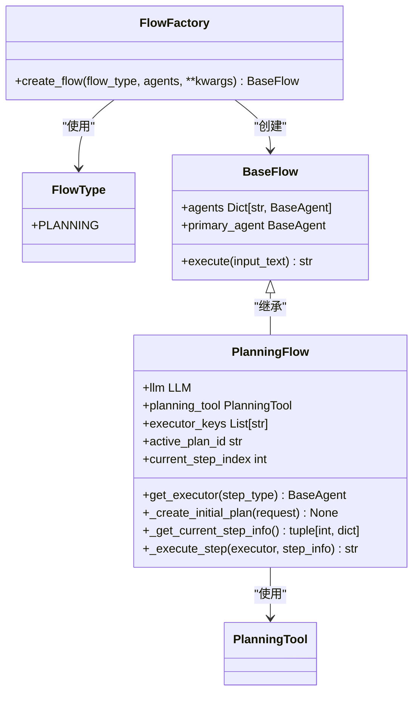

# 多代理协作

<cite>
**本文档中引用的文件**  
- [flow_factory.py](file://app/flow/flow_factory.py)
- [planning.py](file://app/flow/planning.py)
- [base.py](file://app/flow/base.py)
- [manus.py](file://app/agent/manus.py)
- [data_analysis.py](file://app/agent/data_analysis.py)
- [mcp.py](file://app/agent/mcp.py)
- [tool_collection.py](file://app/tool/tool_collection.py)
- [planning.py](file://app/tool/planning.py)
- [toolcall.py](file://app/agent/toolcall.py)
</cite>

## 目录
1. [多代理协作机制概述](#多代理协作机制概述)
2. [FlowFactory工作流工厂](#flowfactory工作流工厂)
3. [代理间通信与状态同步](#代理间通信与状态同步)
4. [任务交接与执行流程](#任务交接与执行流程)
5. [角色分配与冲突解决](#角色分配与冲突解决)
6. [容错设计与性能优化](#容错设计与性能优化)
7. [实际协作场景配置示例](#实际协作场景配置示例)

## 多代理协作机制概述

OpenManus系统采用多代理协作架构，通过专用代理（如Manus、数据分析、MCP代理）协同完成复杂任务。系统核心是基于规划的协作机制，其中PlanningFlow作为主要执行流程，协调多个代理按步骤完成任务。每个代理具有特定的专业能力，如Manus代理具备通用任务处理能力，数据分析代理专注于数据处理与可视化，MCP代理则负责与外部MCP服务器交互。这些代理通过统一的通信协议和状态同步机制进行协作，确保任务的高效执行。

**Section sources**
- [planning.py](file://app/flow/planning.py#L44-L441)
- [manus.py](file://app/agent/manus.py#L1-L165)
- [data_analysis.py](file://app/agent/data_analysis.py#L1-L37)

## FlowFactory工作流工厂

FlowFactory是系统的工作流工厂，负责根据任务类型动态创建和配置不同的执行流程。它采用工厂模式，通过create_flow方法根据指定的FlowType创建相应的流程实例。目前系统主要支持PLANNING类型的流程，对应PlanningFlow类。FlowFactory接收代理集合作为参数，可以是单个代理、代理列表或代理字典，然后将其传递给相应流程的构造函数。这种设计实现了流程创建的抽象化，使系统能够灵活扩展新的流程类型。



**Diagram sources**
- [flow_factory.py](file://app/flow/flow_factory.py#L12-L29)
- [base.py](file://app/flow/base.py#L8-L56)
- [planning.py](file://app/flow/planning.py#L44-L441)

## 代理间通信与状态同步

系统通过PlanningTool作为共享状态存储，实现代理间的通信与状态同步。PlanningTool提供了一套完整的规划管理API，包括创建、更新、获取和标记计划步骤等操作。当PlanningFlow执行任务时，它首先使用LLM和PlanningTool创建初始计划，将计划存储在PlanningTool的共享状态中。各个代理在执行过程中，通过访问PlanningTool获取当前计划状态，了解整体任务进度。PlanningFlow在执行每个步骤前，会将当前步骤状态标记为"进行中"，执行完成后标记为"已完成"，从而实现状态的同步更新。这种基于共享工具的状态管理机制，确保了所有代理对任务进度有一致的认知。

**Section sources**
- [planning.py](file://app/flow/planning.py#L135-L210)
- [planning.py](file://app/flow/planning.py#L212-L274)
- [planning.py](file://app/flow/planning.py#L305-L334)

## 任务交接与执行流程

任务交接流程由PlanningFlow的execute方法驱动，采用迭代方式逐个执行计划中的步骤。流程首先创建初始计划，然后进入循环，每次迭代获取当前待执行的步骤，选择合适的执行代理，执行该步骤，并更新状态。代理选择策略由get_executor方法实现，优先根据步骤类型选择匹配的代理，若无匹配则按顺序选择可用的执行代理。步骤执行通过_execute_step方法完成，该方法为执行代理提供包含当前计划状态的上下文，确保代理在正确的上下文中执行任务。这种分步执行和状态更新的机制，实现了任务在代理间的有序交接。

```mermaid
sequenceDiagram
participant PlanningFlow
participant PlanningTool
participant Agent
PlanningFlow->>PlanningTool : _create_initial_plan()
PlanningTool-->>PlanningFlow : 创建计划
loop 执行每个步骤
PlanningFlow->>PlanningTool : _get_current_step_info()
PlanningTool-->>PlanningFlow : 返回当前步骤
alt 有步骤需要执行
PlanningFlow->>PlanningFlow : get_executor()
PlanningFlow->>PlanningFlow : _execute_step()
PlanningFlow->>Agent : run(step_prompt)
Agent-->>PlanningFlow : 执行结果
PlanningFlow->>PlanningTool : _mark_step_completed()
else 无更多步骤
PlanningFlow->>PlanningFlow : _finalize_plan()
break 结束
end
end
```

**Diagram sources**
- [planning.py](file://app/flow/planning.py#L93-L133)
- [planning.py](file://app/flow/planning.py#L276-L303)
- [planning.py](file://app/flow/planning.py#L76-L91)

## 角色分配与冲突解决

系统采用基于步骤类型的动态角色分配策略。在创建计划时，PlanningFlow会向LLM提供所有可用代理的描述信息，指导LLM在计划步骤中指定合适的代理。例如，LLM可能会创建"[data_analysis] 分析销售数据"这样的步骤，明确指定由数据分析代理执行。在执行时，get_executor方法会解析步骤中的代理标识，优先选择匹配的代理。若无明确指定，则按配置的执行器顺序选择代理。这种机制有效解决了代理间的角色冲突，确保每个任务由最合适的代理执行。对于MCP代理，系统还实现了工具动态发现和刷新机制，定期检查MCP服务器的可用工具，确保代理始终使用最新的工具集。

**Section sources**
- [planning.py](file://app/flow/planning.py#L135-L210)
- [planning.py](file://app/flow/planning.py#L76-L91)
- [mcp.py](file://app/agent/mcp.py#L1-L185)

## 容错设计与性能优化

系统在多个层面实现了容错设计。在代理层面，BaseAgent提供了状态上下文管理器，确保状态转换的安全性；在工具执行层面，ToolCallAgent实现了异常捕获和错误处理，防止单个工具失败导致整个流程中断。PlanningFlow本身也包含错误处理机制，在执行过程中捕获异常并返回有意义的错误信息。性能优化方面，系统通过异步执行、工具结果截断（max_observe）和执行步骤限制（max_steps）等机制，防止无限循环和资源耗尽。此外，系统还实现了代理资源清理机制，在代理执行完成后自动清理其使用的资源，确保系统的稳定运行。

**Section sources**
- [base.py](file://app/agent/base.py#L100-L120)
- [toolcall.py](file://app/agent/toolcall.py#L17-L249)
- [planning.py](file://app/flow/planning.py#L93-L133)

## 实际协作场景配置示例

在实际应用中，可以通过配置文件定义MCP服务器，然后使用FlowFactory创建PlanningFlow来协调多个代理完成复杂任务。例如，一个典型的数据分析任务可能涉及Manus代理接收用户请求，PlanningFlow创建包含数据获取、分析和可视化步骤的计划，然后依次由MCP代理调用外部API获取数据，由数据分析代理处理数据并生成图表，最后由Manus代理整合结果并返回给用户。这种协作模式通过清晰的职责划分和有序的任务交接，实现了复杂任务的高效处理。

**Section sources**
- [manus.py](file://app/agent/manus.py#L1-L165)
- [data_analysis.py](file://app/agent/data_analysis.py#L1-L37)
- [mcp.py](file://app/agent/mcp.py#L1-L185)