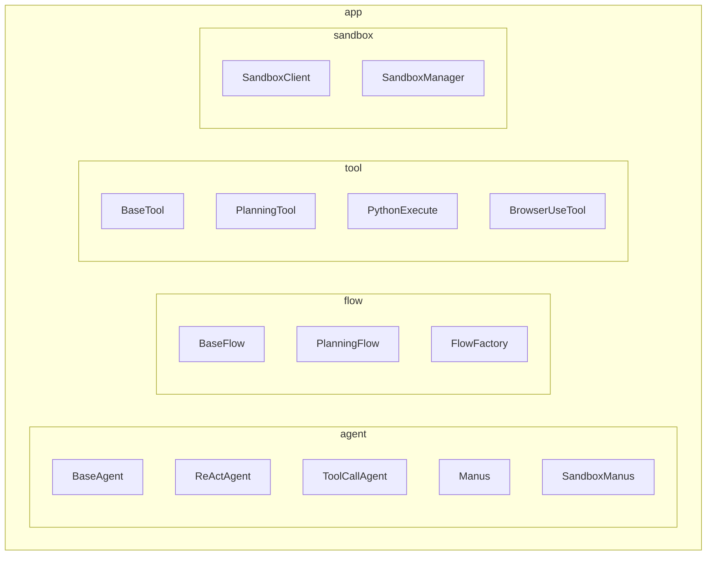
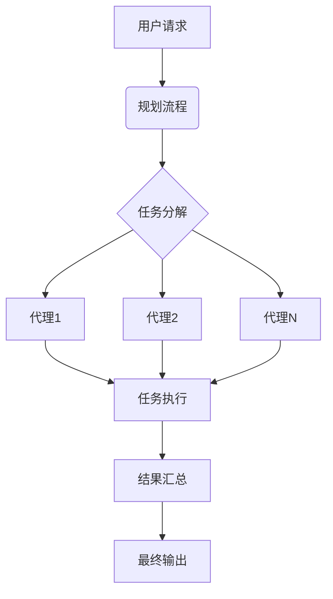
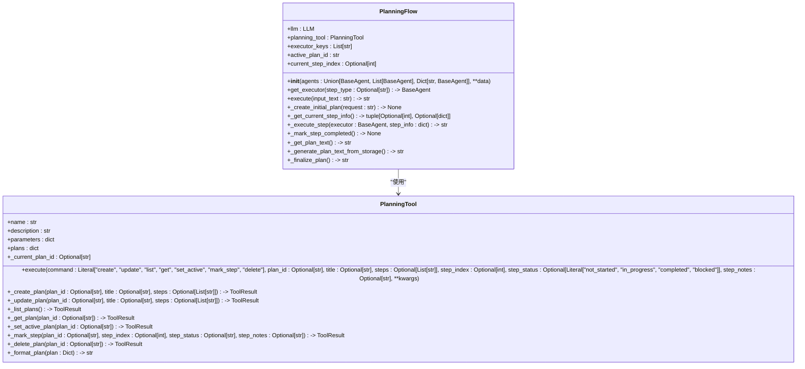
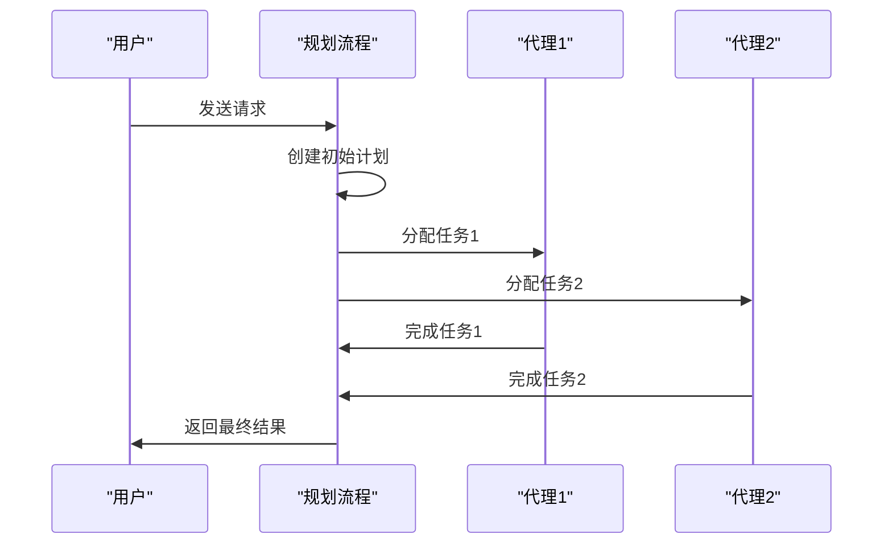
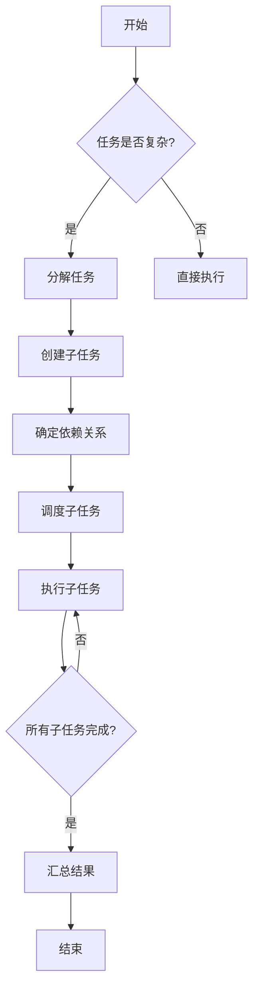
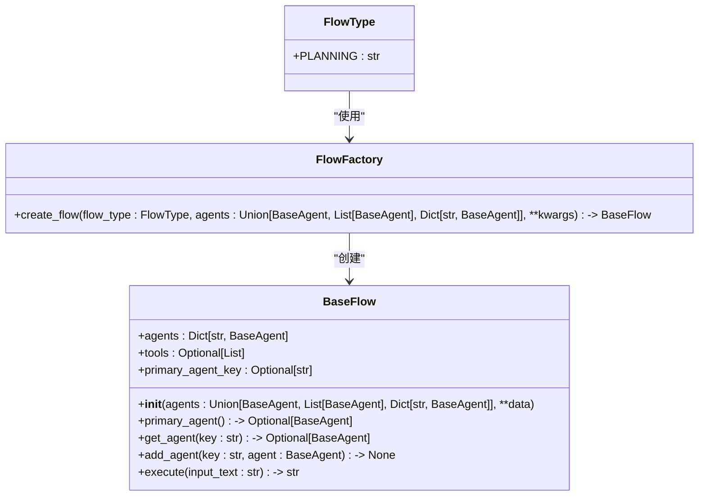
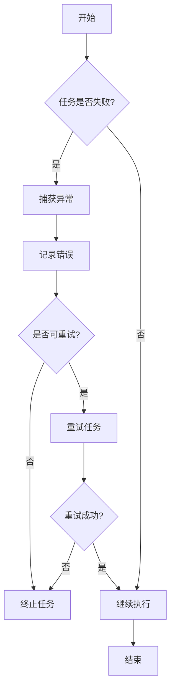
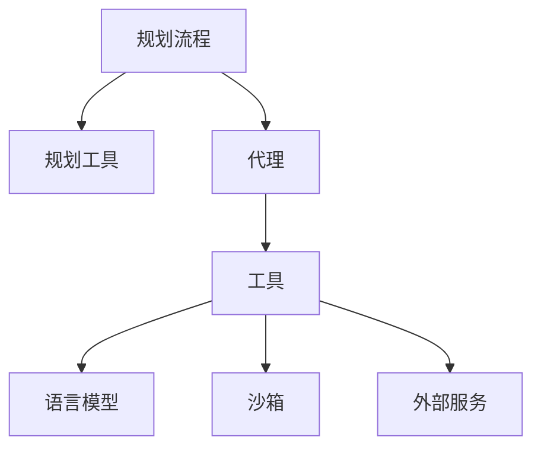

# 工作流系统

<cite>
**本文档引用的文件**   
- [planning.py](file://app/flow/planning.py)
- [flow_factory.py](file://app/flow/flow_factory.py)
- [base.py](file://app/flow/base.py)
- [PlanningTool.py](file://app/tool/planning.py)
- [BaseAgent.py](file://app/agent/base.py)
</cite>

## 目录
1. [简介](#简介)
2. [项目结构](#项目结构)
3. [核心组件](#核心组件)
4. [架构概述](#架构概述)
5. [详细组件分析](#详细组件分析)
6. [依赖分析](#依赖分析)
7. [性能考虑](#性能考虑)
8. [故障排除指南](#故障排除指南)
9. [结论](#结论)

## 简介
本工作流系统旨在支持复杂任务的规划与执行。系统通过规划流程将用户请求分解为可执行步骤，并利用多代理协作模式完成任务。代理间的通信机制和任务分配策略确保了高效的任务处理。系统还实现了任务分解算法和依赖管理，以确保任务的可靠执行。通过FlowFactory，用户可以创建新的工作流类型，实现自定义工作流开发。此外，系统提供了性能优化技巧和错误处理策略，以确保工作流的稳定运行。

## 项目结构
项目结构清晰地组织了各个模块，包括代理、工具、流程和沙箱等。每个模块都有明确的职责，便于维护和扩展。

**图表来源**
- [base.py](file://app/agent/base.py)
- [base.py](file://app/flow/base.py)
- [base.py](file://app/tool/base.py)

**章节来源**
- [app/agent](file://app/agent)
- [app/flow](file://app/flow)
- [app/tool](file://app/tool)
- [app/sandbox](file://app/sandbox)

## 核心组件
工作流系统的核心组件包括规划流程、多代理协作、任务分解算法和依赖管理。这些组件共同作用，确保复杂任务的高效执行。

**章节来源**
- [planning.py](file://app/flow/planning.py)
- [flow_factory.py](file://app/flow/flow_factory.py)
- [base.py](file://app/flow/base.py)

## 架构概述
系统架构采用模块化设计，各组件之间通过明确定义的接口进行交互。规划流程负责任务的分解和调度，多代理协作模式确保任务的并行处理，任务分解算法和依赖管理保证任务的正确执行顺序。

**图表来源**
- [planning.py](file://app/flow/planning.py)
- [base.py](file://app/flow/base.py)

## 详细组件分析

### 规划流程分析
规划流程是工作流系统的核心，负责将用户请求分解为可执行的步骤。它通过调用规划工具创建初始计划，并根据计划的状态逐步执行每个步骤。

#### 规划流程类图

**图表来源**
- [planning.py](file://app/flow/planning.py#L44-L441)
- [planning.py](file://app/tool/planning.py#L13-L362)

### 多代理协作模式分析
多代理协作模式通过多个代理的协同工作，实现任务的并行处理。每个代理负责特定的任务，通过通信机制共享信息和协调行动。

#### 多代理协作序列图

**图表来源**
- [planning.py](file://app/flow/planning.py#L93-L133)
- [base.py](file://app/agent/base.py#L115-L153)

### 任务分解算法和依赖管理分析
任务分解算法将复杂任务分解为多个子任务，并通过依赖管理确保子任务的正确执行顺序。依赖管理通过跟踪任务的状态和依赖关系，避免任务间的冲突和死锁。

#### 任务分解和依赖管理流程图

**图表来源**
- [planning.py](file://app/flow/planning.py#L212-L268)
- [planning.py](file://app/tool/planning.py#L256-L303)

### 自定义工作流开发指导
通过FlowFactory，用户可以轻松创建新的工作流类型。FlowFactory提供了一个工厂模式，允许用户根据需要创建不同类型的流程。

#### 自定义工作流开发类图

**图表来源**
- [flow_factory.py](file://app/flow/flow_factory.py#L12-L29)
- [base.py](file://app/flow/base.py#L8-L56)

### 性能优化技巧和错误处理策略
系统提供了多种性能优化技巧和错误处理策略，以确保工作流的可靠执行。性能优化技巧包括任务并行处理和资源管理，错误处理策略包括异常捕获和重试机制。

#### 性能优化和错误处理流程图

**图表来源**
- [planning.py](file://app/flow/planning.py#L305-L334)
- [base.py](file://app/agent/base.py#L162-L167)

**章节来源**
- [planning.py](file://app/flow/planning.py#L44-L441)
- [base.py](file://app/agent/base.py#L12-L195)

## 依赖分析
系统各组件之间的依赖关系清晰，确保了模块间的松耦合和高内聚。规划流程依赖于规划工具和代理，代理依赖于工具和语言模型，工具依赖于底层系统和外部服务。

**图表来源**
- [planning.py](file://app/flow/planning.py)
- [base.py](file://app/agent/base.py)
- [base.py](file://app/tool/base.py)

**章节来源**
- [planning.py](file://app/flow/planning.py)
- [base.py](file://app/agent/base.py)
- [base.py](file://app/tool/base.py)

## 性能考虑
为了确保系统的高性能，采用了多种优化策略。任务并行处理和资源管理是主要的性能优化手段。此外，系统还通过缓存和异步处理进一步提升性能。

**章节来源**
- [planning.py](file://app/flow/planning.py)
- [base.py](file://app/agent/base.py)

## 故障排除指南
当系统出现故障时，可以通过以下步骤进行排查：
1. 检查日志文件，查找错误信息。
2. 确认各组件的依赖关系是否正确。
3. 验证配置文件是否正确。
4. 重启相关服务，尝试恢复。

**章节来源**
- [planning.py](file://app/flow/planning.py)
- [base.py](file://app/agent/base.py)

## 结论
本工作流系统通过规划流程、多代理协作、任务分解算法和依赖管理，实现了复杂任务的高效执行。通过FlowFactory，用户可以轻松创建自定义工作流。系统还提供了性能优化技巧和错误处理策略，确保了工作流的可靠运行。未来的工作将集中在进一步优化性能和扩展功能上。