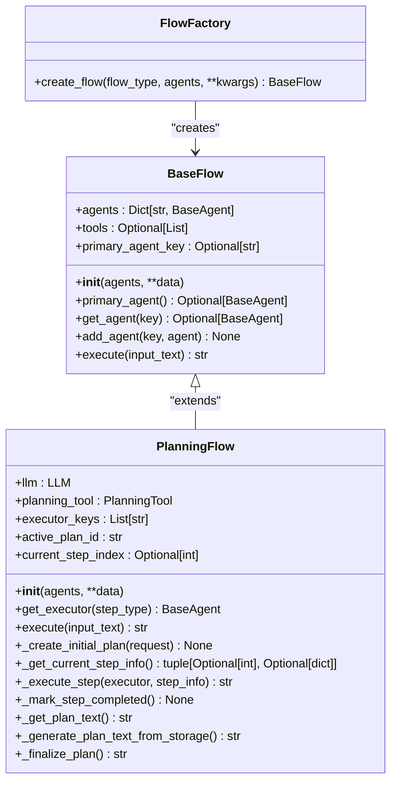
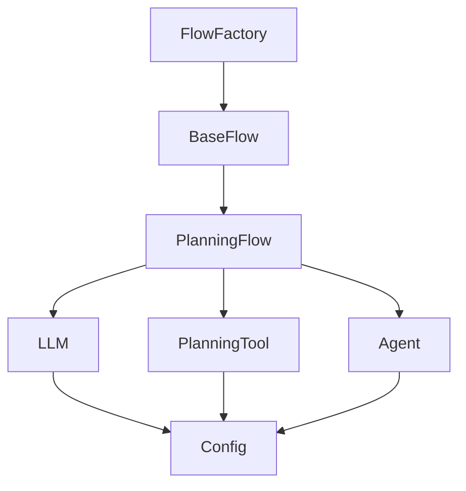

# 自定义工作流开发

<cite>
**本文档引用的文件**   
- [base.py](file://app/flow/base.py)
- [flow_factory.py](file://app/flow/flow_factory.py)
- [planning.py](file://app/flow/planning.py)
- [run_flow.py](file://run_flow.py)
- [config.py](file://app/config.py)
- [manus.py](file://app/agent/manus.py)
</cite>

## 目录
1. [简介](#简介)
2. [项目结构](#项目结构)
3. [核心组件](#核心组件)
4. [架构概述](#架构概述)
5. [详细组件分析](#详细组件分析)
6. [依赖分析](#依赖分析)
7. [性能考虑](#性能考虑)
8. [故障排除指南](#故障排除指南)
9. [结论](#结论)

## 简介
本文档旨在为开发者提供一个完整的指南，介绍如何通过继承`FlowFactory`基类来创建新的工作流类型。文档将涵盖从注册新工作流、定义执行逻辑到集成自定义代理和工具的全过程。此外，还将解释配置文件与程序代码之间的联动机制，并展示如何使用`run_flow.py`启动自定义流程。最后，文档会涵盖测试验证、异常处理和日志追踪的最佳实践，以确保新工作流的稳定性和可维护性。

## 项目结构
本项目遵循模块化设计原则，主要分为以下几个部分：`app`目录下包含了应用的核心逻辑，包括代理（agent）、流程（flow）、提示（prompt）、沙箱（sandbox）和工具（tool）等子模块；`config`目录存放了各种配置文件；`examples`目录提供了使用案例；`tests`目录则包含了单元测试代码。此外，根目录下的`run_flow.py`和`run_mcp.py`等脚本文件用于启动不同的服务。

**Section sources**
- [main.py](file://main.py)
- [run_flow.py](file://run_flow.py)
- [run_mcp.py](file://run_mcp.py)

## 核心组件

### FlowFactory 类
`FlowFactory`类是创建不同类型流程的工厂，支持多代理模式。它通过静态方法`create_flow`根据指定的流程类型和代理列表生成相应的流程实例。

**Section sources**
- [flow_factory.py](file://app/flow/flow_factory.py#L12-L29)

### BaseFlow 类
`BaseFlow`是所有执行流程的基础类，支持多个代理。该类定义了流程的基本属性和方法，如代理字典、工具列表、主代理键等，并提供了初始化方法和获取特定代理的方法。

**Section sources**
- [base.py](file://app/flow/base.py#L8-L56)

### PlanningFlow 类
`PlanningFlow`类继承自`BaseFlow`，专门用于管理和执行基于代理的任务规划。它包含了一个语言模型（LLM）实例、一个规划工具（PlanningTool）实例以及执行者键列表等属性。此类还实现了创建初始计划、获取当前步骤信息、执行当前步骤等功能。

**Section sources**
- [planning.py](file://app/flow/planning.py#L44-L441)

## 架构概述



**Diagram sources **
- [flow_factory.py](file://app/flow/flow_factory.py#L12-L29)
- [base.py](file://app/flow/base.py#L8-L56)
- [planning.py](file://app/flow/planning.py#L44-L441)

## 详细组件分析

### FlowFactory 分析
`FlowFactory`类提供了一个静态方法`create_flow`，该方法接收流程类型、代理列表和其他参数，返回一个具体的流程实例。此方法首先查找对应的流程类，如果找不到则抛出异常，然后调用该类的构造函数并返回实例。

#### 创建流程实例
```python
flow = FlowFactory.create_flow(
    flow_type=FlowType.PLANNING,
    agents=agents,
)
```

**Section sources**
- [flow_factory.py](file://app/flow/flow_factory.py#L16-L29)

### BaseFlow 分析
`BaseFlow`类作为所有流程的基类，定义了流程的基本结构和行为。它通过`__init__`方法处理不同形式的代理输入，并设置主代理键。此外，还提供了访问和修改代理的方法。

#### 初始化代理
```python
def __init__(
    self, agents: Union[BaseAgent, List[BaseAgent], Dict[str, BaseAgent]], **data
):
    if isinstance(agents, BaseAgent):
        agents_dict = {"default": agents}
    elif isinstance(agents, list):
        agents_dict = {f"agent_{i}": agent for i, agent in enumerate(agents)}
    else:
        agents_dict = agents

    primary_key = data.get("primary_agent_key")
    if not primary_key and agents_dict:
        primary_key = next(iter(agents_dict))
        data["primary_agent_key"] = primary_key

    data["agents"] = agents_dict
    super().__init__(**data)
```

**Section sources**
- [base.py](file://app/flow/base.py#L12-L56)

### PlanningFlow 分析
`PlanningFlow`类扩展了`BaseFlow`的功能，增加了任务规划和执行的能力。它通过`execute`方法驱动整个流程的执行，包括创建初始计划、获取当前步骤、执行当前步骤等。

#### 执行流程
```python
async def execute(self, input_text: str) -> str:
    try:
        if not self.primary_agent:
            raise ValueError("No primary agent available")

        if input_text:
            await self._create_initial_plan(input_text)

            if self.active_plan_id not in self.planning_tool.plans:
                logger.error(
                    f"Plan creation failed. Plan ID {self.active_plan_id} not found in planning tool."
                )
                return f"Failed to create plan for: {input_text}"

        result = ""
        while True:
            self.current_step_index, step_info = await self._get_current_step_info()

            if self.current_step_index is None:
                result += await self._finalize_plan()
                break

            step_type = step_info.get("type") if step_info else None
            executor = self.get_executor(step_type)
            step_result = await self._execute_step(executor, step_info)
            result += step_result + "\n"

            if hasattr(executor, "state") and executor.state == AgentState.FINISHED:
                break

        return result
    except Exception as e:
        logger.error(f"Error in PlanningFlow: {str(e)}")
        return f"Execution failed: {str(e)}"
```

**Section sources**
- [planning.py](file://app/flow/planning.py#L93-L133)

## 依赖分析



**Diagram sources **
- [flow_factory.py](file://app/flow/flow_factory.py#L12-L29)
- [base.py](file://app/flow/base.py#L8-L56)
- [planning.py](file://app/flow/planning.py#L44-L441)
- [config.py](file://app/config.py#L1-L372)

## 性能考虑
在设计和实现自定义工作流时，应考虑以下性能因素：
- **异步处理**：利用异步编程模型提高响应速度和资源利用率。
- **缓存机制**：对于频繁访问的数据或计算结果，可以采用缓存策略减少重复计算。
- **资源管理**：合理分配和释放系统资源，避免内存泄漏和资源耗尽。
- **错误处理**：及时捕获和处理异常，防止程序崩溃。

## 故障排除指南
当遇到问题时，可以参考以下步骤进行排查：
1. 检查配置文件是否正确，特别是API密钥和URL等敏感信息。
2. 查看日志输出，定位错误发生的具体位置。
3. 使用调试工具逐步执行代码，观察变量的变化。
4. 确认所有依赖项都已正确安装且版本兼容。

**Section sources**
- [logger.py](file://app/logger.py)
- [exceptions.py](file://app/exceptions.py)

## 结论
通过继承`FlowFactory`基类并实现具体的流程逻辑，开发者可以轻松地创建新的工作流类型。结合配置文件和程序代码的联动机制，能够灵活地调整工作流的行为。同时，遵循最佳实践进行测试验证、异常处理和日志追踪，有助于确保新工作流的稳定性和可维护性。