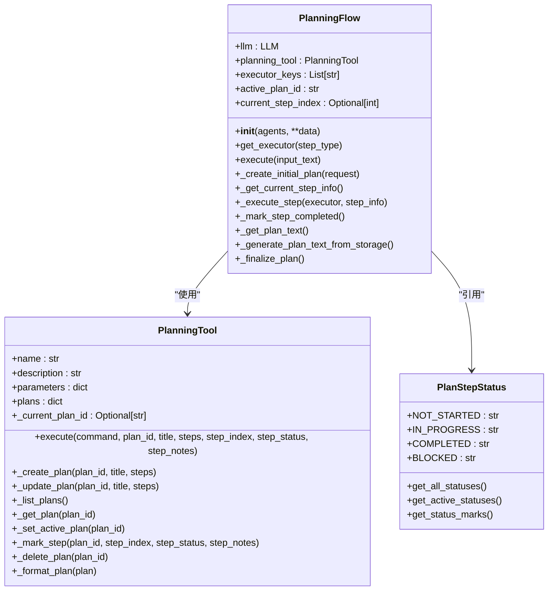
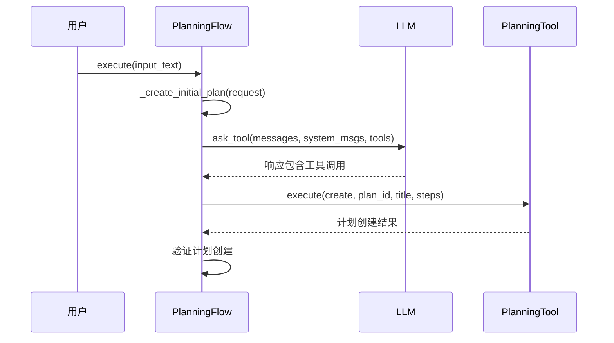
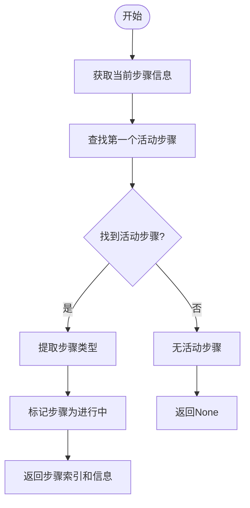
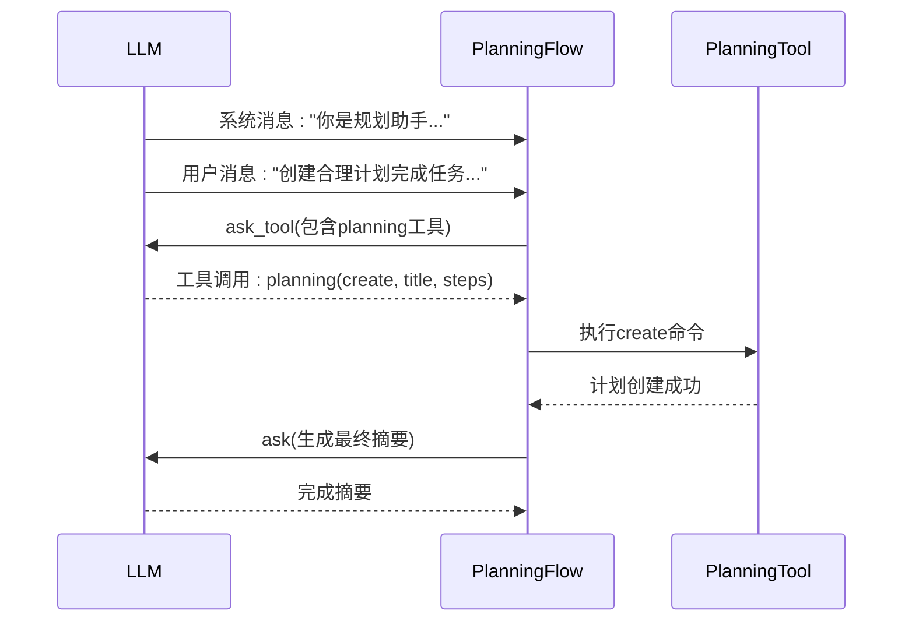
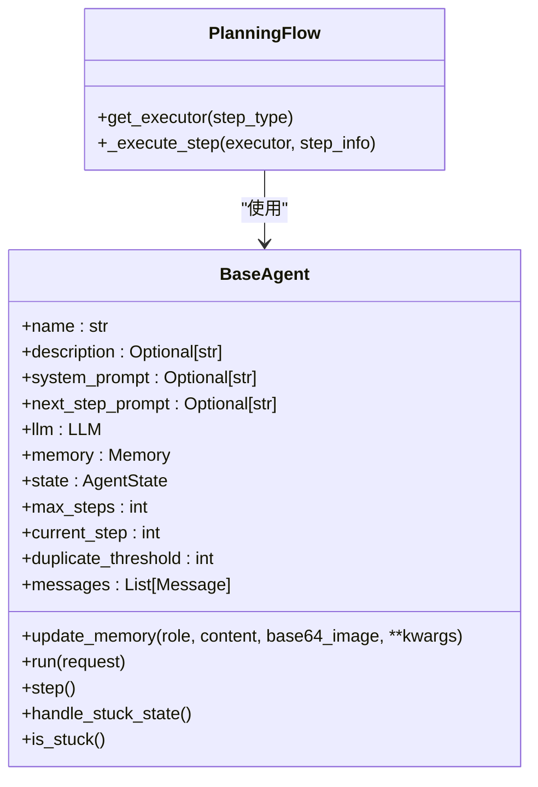
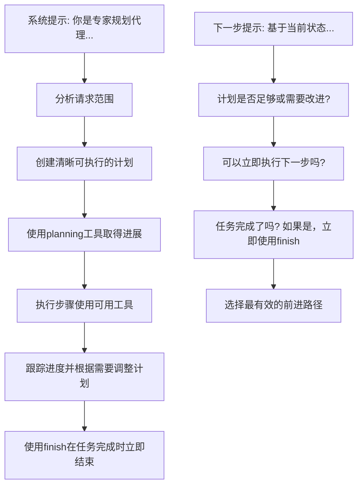
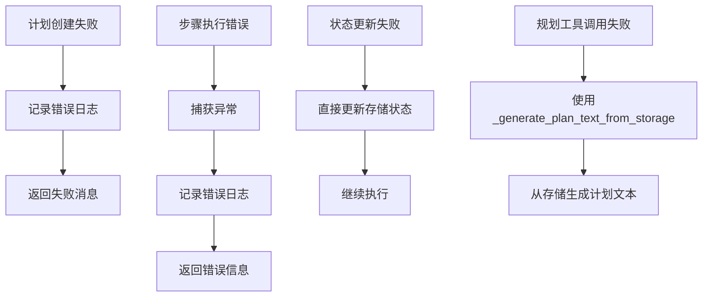

# 规划流程

<cite>
**本文档中引用的文件**  
- [planning.py](file://app/flow/planning.py)
- [base.py](file://app/flow/base.py)
- [PlanningTool.py](file://app/tool/planning.py)
- [planning.py](file://app/prompt/planning.py)
- [base.py](file://app/agent/base.py)
- [llm.py](file://app/llm.py)
</cite>

## 目录
1. [简介](#简介)
2. [核心组件分析](#核心组件分析)
3. [任务解析与目标设定](#任务解析与目标设定)
4. [步骤生成与依赖关系推导](#步骤生成与依赖关系推导)
5. [LLM参与决策机制](#llm参与决策机制)
6. [Agent系统集成](#agent系统集成)
7. [提示工程引导](#提示工程引导)
8. [常见规划失败场景与调试](#常见规划失败场景与调试)
9. [优化建议](#优化建议)

## 简介
本系统通过`PlanningFlow`类实现高级任务到可执行子任务序列的分解。该流程利用大语言模型（LLM）和规划工具（PlanningTool）协同工作，将用户请求转化为结构化执行计划。系统通过状态管理、步骤跟踪和多代理协作，确保复杂任务的有序执行。规划流程从任务解析开始，经过目标设定、步骤生成和依赖关系推导，最终形成可执行的子任务序列。

**Section sources**
- [planning.py](file://app/flow/planning.py#L44-L441)

## 核心组件分析

`PlanningFlow`类继承自`BaseFlow`，是规划流程的核心控制器。它管理LLM实例、规划工具和执行代理的协调工作。`PlanningTool`作为专用工具，提供创建、更新和跟踪计划的功能。系统通过`PlanStepStatus`枚举定义步骤状态，包括未开始、进行中、已完成和阻塞。`execute`方法是主执行循环，负责创建初始计划、获取当前步骤、执行步骤并最终完成计划。

**Diagram sources**
- [planning.py](file://app/flow/planning.py#L44-L441)
- [planning.py](file://app/tool/planning.py#L13-L362)

**Section sources**
- [planning.py](file://app/flow/planning.py#L44-L441)
- [planning.py](file://app/tool/planning.py#L13-L362)

## 任务解析与目标设定

任务解析通过`_create_initial_plan`方法实现，该方法利用LLM和规划工具创建初始计划。系统首先构建系统消息，包含代理描述和格式要求，然后调用LLM生成计划。如果LLM响应包含工具调用，则执行规划工具创建计划；否则创建默认计划。目标设定过程中，系统会验证计划创建结果，确保计划ID存在于规划工具中。

**Diagram sources**
- [planning.py](file://app/flow/planning.py#L135-L210)

**Section sources**
- [planning.py](file://app/flow/planning.py#L135-L210)

## 步骤生成与依赖关系推导

步骤生成通过LLM的工具调用能力实现，规划工具的`create`命令用于创建包含多个步骤的计划。依赖关系推导隐含在步骤顺序中，系统按顺序执行步骤，前一步骤的完成是后一步骤开始的前提。`_get_current_step_info`方法负责查找第一个未完成的步骤，返回步骤索引和信息。该方法还会提取步骤类型（如[SEARCH]或[CODE]），并标记当前步骤为进行中。

**Diagram sources**
- [planning.py](file://app/flow/planning.py#L212-L274)

**Section sources**
- [planning.py](file://app/flow/planning.py#L212-L274)

## LLM参与决策机制

LLM通过`ask_tool`方法参与决策过程，该方法支持工具调用。在计划创建阶段，LLM接收系统消息和用户请求，返回包含规划工具调用的响应。系统解析工具调用参数，执行规划工具创建计划。LLM还参与最终计划的总结，通过`_finalize_plan`方法调用LLM生成完成摘要。如果LLM调用失败，则回退到使用代理生成摘要。

**Diagram sources**
- [planning.py](file://app/flow/planning.py#L135-L210)
- [planning.py](file://app/flow/planning.py#L405-L441)

**Section sources**
- [planning.py](file://app/flow/planning.py#L135-L210)
- [planning.py](file://app/flow/planning.py#L405-L441)

## Agent系统集成

规划流程与Agent系统通过`BaseAgent`类集成。`PlanningFlow`使用代理运行`run`方法执行步骤。`get_executor`方法根据步骤类型选择适当的执行代理，优先使用匹配类型名称的代理，否则使用第一个可用的执行器或主代理。执行步骤时，系统准备包含当前计划状态的上下文，然后调用代理的`run`方法执行当前步骤。

**Diagram sources**
- [planning.py](file://app/flow/planning.py#L76-L91)
- [planning.py](file://app/flow/planning.py#L276-L303)
- [base.py](file://app/agent/base.py#L34-L195)

**Section sources**
- [planning.py](file://app/flow/planning.py#L76-L91)
- [planning.py](file://app/flow/planning.py#L276-L303)
- [base.py](file://app/agent/base.py#L34-L195)

## 提示工程引导

提示工程通过`PLANNING_SYSTEM_PROMPT`和`NEXT_STEP_PROMPT`实现，引导大模型进行有效规划。系统提示定义了规划代理的角色和职责，包括分析请求、创建可操作计划、执行步骤、跟踪进度和适时结束。下一步提示指导模型根据当前状态选择最有效的行动路径，包括检查计划是否充分、是否可以立即执行下一步或任务是否完成。

**Diagram sources**
- [planning.py](file://app/prompt/planning.py#L1-L27)

**Section sources**
- [planning.py](file://app/prompt/planning.py#L1-L27)

## 常见规划失败场景与调试

常见规划失败场景包括计划创建失败、步骤执行错误和状态更新失败。系统通过日志记录和异常处理机制进行调试。当计划创建失败时，系统记录错误并返回失败消息。步骤执行中发生异常时，捕获异常并返回错误信息。状态更新失败时，直接更新规划工具存储中的状态。系统还提供`_generate_plan_text_from_storage`方法作为备用方案，当规划工具调用失败时直接从存储生成计划文本。

**Diagram sources**
- [planning.py](file://app/flow/planning.py#L93-L133)
- [planning.py](file://app/flow/planning.py#L276-L303)
- [planning.py](file://app/flow/planning.py#L347-L403)

**Section sources**
- [planning.py](file://app/flow/planning.py#L93-L133)
- [planning.py](file://app/flow/planning.py#L276-L303)
- [planning.py](file://app/flow/planning.py#L347-L403)

## 优化建议

为优化规划流程，建议确保代理描述清晰准确，以便LLM正确选择执行代理。合理设置步骤粒度，避免过度详细或过于笼统。监控LLM调用的token使用情况，防止超出限制。定期清理已完成的计划，避免内存泄漏。对于复杂任务，考虑实现更精细的依赖关系管理，而不仅仅是顺序执行。此外，可以扩展`get_executor`方法以支持基于步骤需求的更智能代理选择。

**Section sources**
- [planning.py](file://app/flow/planning.py#L44-L441)