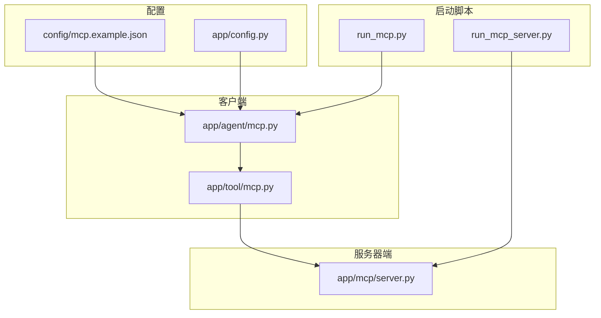
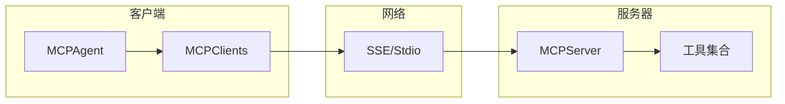
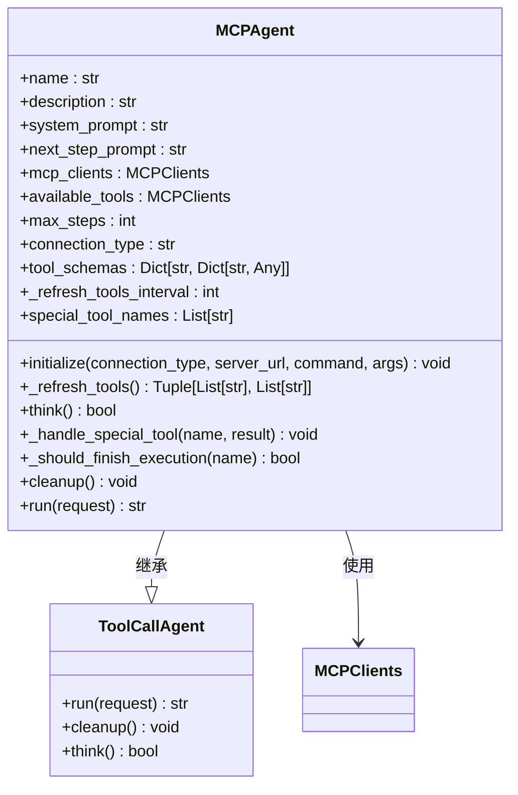
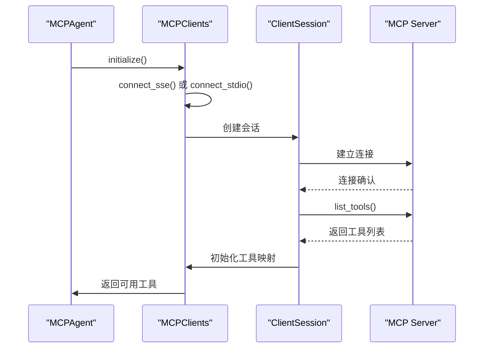
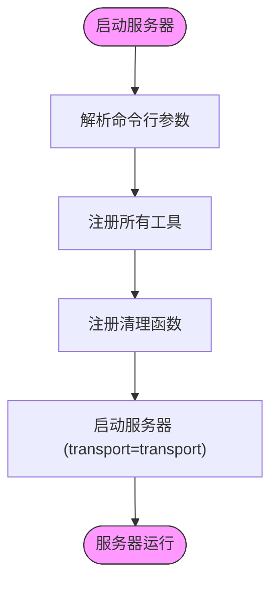
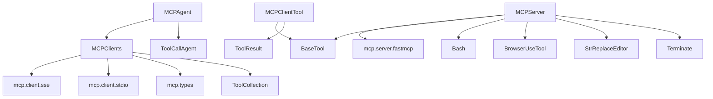

# MCP工具

<cite>
**本文档中引用的文件**  
- [mcp.py](file://app/agent/mcp.py)
- [mcp.py](file://app/tool/mcp.py)
- [server.py](file://app/mcp/server.py)
- [mcp.example.json](file://config/mcp.example.json)
- [config.py](file://app/config.py)
- [run_mcp.py](file://run_mcp.py)
- [run_mcp_server.py](file://run_mcp_server.py)
</cite>

## 目录
1. [简介](#简介)
2. [项目结构](#项目结构)
3. [核心组件](#核心组件)
4. [架构概述](#架构概述)
5. [详细组件分析](#详细组件分析)
6. [依赖分析](#依赖分析)
7. [性能考虑](#性能考虑)
8. [故障排除指南](#故障排除指南)
9. [结论](#结论)

## 简介
MCP（Model Context Protocol）工具是OpenManus框架中的关键通信组件，作为AI代理之间的桥梁，实现跨服务的功能调用。该工具通过SSE（Server-Sent Events）或stdio两种连接模式，使本地代理能够发现并调用远程MCP服务器提供的功能。MCP协议确保了不同AI系统间的互操作性，支持动态工具发现、标准化消息格式和可靠的错误处理机制。本文档详细说明了MCP工具的实现原理、配置方法、集成示例以及相关的性能和安全考虑。

## 项目结构
MCP工具在OpenManus项目中分布在多个模块中，形成了一个完整的客户端-服务器架构。核心实现位于`app/agent/mcp.py`和`app/tool/mcp.py`，分别负责代理层和工具层的逻辑。服务器端实现在`app/mcp/server.py`，而配置文件位于`config/`目录下。这种分层结构确保了关注点分离，便于维护和扩展。

**图示来源**  
- [mcp.py](file://app/agent/mcp.py)
- [mcp.py](file://app/tool/mcp.py)
- [server.py](file://app/mcp/server.py)
- [mcp.example.json](file://config/mcp.example.json)
- [config.py](file://app/config.py)
- [run_mcp.py](file://run_mcp.py)
- [run_mcp_server.py](file://run_mcp_server.py)

**章节来源**  
- [mcp.py](file://app/agent/mcp.py)
- [mcp.py](file://app/tool/mcp.py)
- [server.py](file://app/mcp/server.py)

## 核心组件
MCP工具的核心由三个主要组件构成：MCP代理（MCPAgent）、MCP客户端工具集合（MCPClients）和MCP服务器（MCPServer）。MCP代理作为AI代理与远程服务之间的中介，负责管理连接和协调工具调用。MCP客户端工具集合实现了与远程服务器的通信逻辑，支持SSE和stdio两种传输模式。MCP服务器则暴露了一组可被远程调用的工具，如bash、浏览器和编辑器等。这些组件共同实现了MCP协议，确保了跨平台的互操作性和功能的动态发现。

**章节来源**  
- [mcp.py](file://app/agent/mcp.py#L1-L185)
- [mcp.py](file://app/tool/mcp.py#L1-L194)
- [server.py](file://app/mcp/server.py#L1-L180)

## 架构概述
MCP工具的架构遵循客户端-服务器模式，其中客户端（AI代理）通过标准化协议与服务器（MCP服务）通信。客户端通过`MCPClients`类管理与一个或多个MCP服务器的连接，而服务器通过`MCPServer`类注册和暴露其工具。通信协议基于MCP规范，支持JSON格式的消息交换。该架构支持两种连接模式：SSE用于HTTP长连接，stdio用于进程间通信。这种设计使得MCP工具既可以在分布式环境中运行，也可以在本地以子进程形式运行。

**图示来源**  
- [mcp.py](file://app/agent/mcp.py)
- [mcp.py](file://app/tool/mcp.py)
- [server.py](file://app/mcp/server.py)

## 详细组件分析

### MCP代理分析
MCP代理（MCPAgent）是集成MCP功能的核心类，继承自`ToolCallAgent`。它通过`mcp_clients`字段管理与远程MCP服务器的连接，并在初始化时根据配置的连接类型（SSE或stdio）建立连接。代理定期刷新可用工具列表，以检测远程服务器上工具的变化。当特殊工具（如`terminate`）被调用时，代理会相应地终止执行。`think`方法在每次决策循环中检查MCP服务的可用性，并在必要时刷新工具列表。

#### MCP代理类图

**图示来源**  
- [mcp.py](file://app/agent/mcp.py#L1-L185)

**章节来源**  
- [mcp.py](file://app/agent/mcp.py#L1-L185)

### MCP客户端工具分析
MCP客户端工具集合（MCPClients）负责与远程MCP服务器建立和管理连接。它支持两种连接模式：`connect_sse`用于通过HTTP SSE连接到远程服务器，`connect_stdio`用于通过stdio与本地子进程通信。每个连接都有一个唯一的`server_id`，用于区分不同的服务器实例。当连接建立后，客户端会初始化会话并获取服务器上可用的工具列表，然后为每个远程工具创建一个本地代理（MCPClientTool），并将其添加到工具映射中。

#### MCP客户端工具序列图

**图示来源**  
- [mcp.py](file://app/tool/mcp.py#L1-L194)

**章节来源**  
- [mcp.py](file://app/tool/mcp.py#L1-L194)

### MCP服务器分析
MCP服务器（MCPServer）是一个可执行的Python模块，用于暴露一组工具供远程代理调用。服务器通过`register_tool`方法注册工具，该方法将`BaseTool`实例转换为符合MCP协议的异步函数。服务器支持通过命令行参数指定传输模式（目前仅支持stdio）。在启动时，服务器会注册一组标准工具，如`bash`、`browser`、`editor`和`terminate`。`run`方法负责启动服务器并处理清理逻辑。

#### MCP服务器流程图

**图示来源**  
- [server.py](file://app/mcp/server.py#L1-L180)

**章节来源**  
- [server.py](file://app/mcp/server.py#L1-L180)

## 依赖分析
MCP工具的依赖关系清晰地展示了其模块化设计。`MCPAgent`依赖于`MCPClients`来管理远程连接，而`MCPClients`又依赖于底层的MCP库（`mcp.client.sse`和`mcp.client.stdio`）来处理具体的传输逻辑。服务器端的`MCPServer`依赖于`FastMCP`库来实现MCP协议的核心功能。此外，MCP工具与OpenManus框架的其他组件（如`BaseTool`、`ToolCollection`和`ToolResult`）紧密集成，确保了在整个系统中的一致性。

**图示来源**  
- [mcp.py](file://app/agent/mcp.py)
- [mcp.py](file://app/tool/mcp.py)
- [server.py](file://app/mcp/server.py)

**章节来源**  
- [mcp.py](file://app/agent/mcp.py)
- [mcp.py](file://app/tool/mcp.py)
- [server.py](file://app/mcp/server.py)

## 性能考虑
使用MCP工具时需要考虑几个性能因素。网络延迟是SSE模式下的主要开销，特别是在跨网络调用时。序列化开销存在于所有模式中，因为请求和响应都需要在JSON格式和Python对象之间转换。对于stdio模式，子进程的启动时间和进程间通信的开销也需要考虑。为了优化性能，建议在可能的情况下重用连接，并批量处理相关操作。此外，定期刷新工具列表的频率（默认每5步）可以根据具体应用场景进行调整，以平衡实时性和性能。

## 故障排除指南
在使用MCP工具时，可能会遇到连接失败、工具调用错误或服务器无响应等问题。首先，检查配置文件（`mcp.json`）中的服务器URL或命令是否正确。对于SSE连接，确保服务器正在运行且网络可达。对于stdio连接，验证命令路径和参数是否正确。如果工具调用失败，检查日志以获取详细的错误信息。如果服务器意外关闭，MCP代理会检测到工具列表为空并自动终止。在调试时，可以启用详细的日志记录来跟踪连接和调用过程。

**章节来源**  
- [mcp.py](file://app/agent/mcp.py#L1-L185)
- [mcp.py](file://app/tool/mcp.py#L1-L194)
- [server.py](file://app/mcp/server.py#L1-L180)

## 结论
MCP工具为OpenManus框架提供了一个强大而灵活的机制，用于集成和调用远程AI服务。通过标准化的协议和清晰的架构，它实现了不同AI代理之间的无缝协作。无论是通过SSE进行分布式部署，还是通过stdio进行本地集成，MCP工具都展示了其在构建复杂AI系统中的价值。随着MCP生态系统的不断发展，该工具将成为连接各种AI能力的关键枢纽。