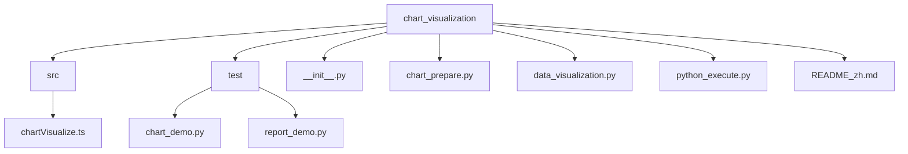
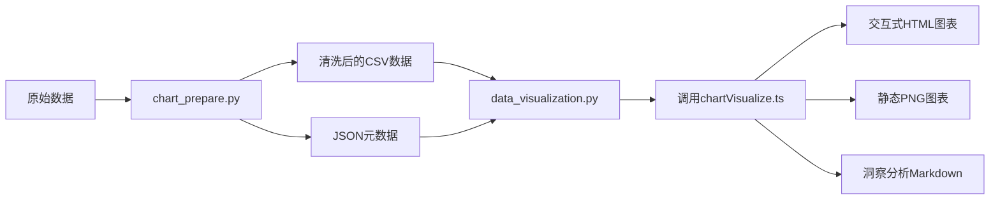
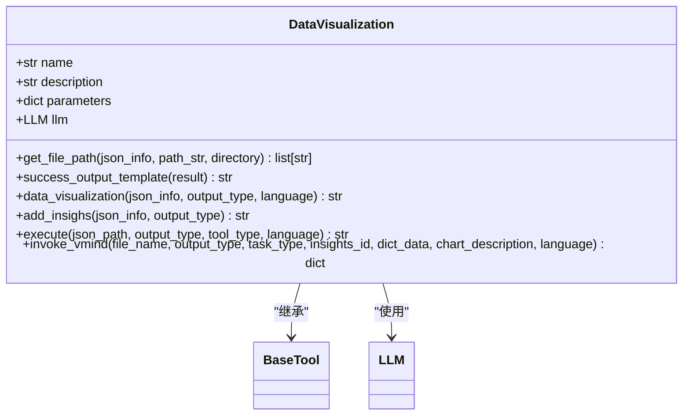
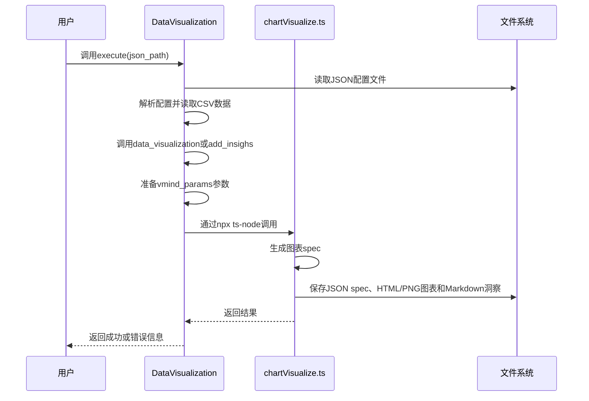
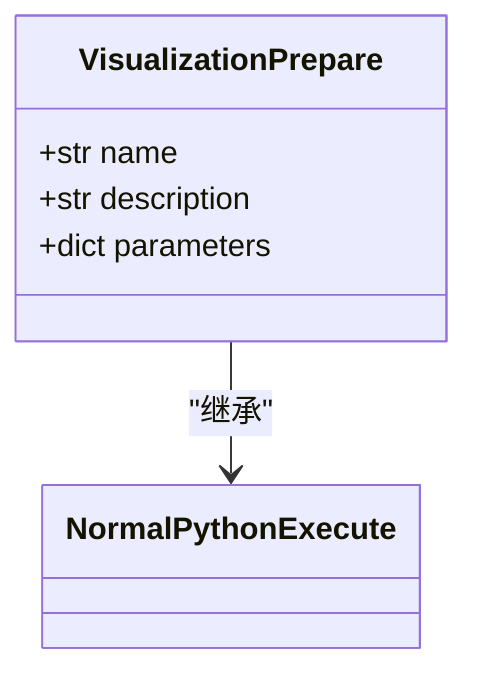
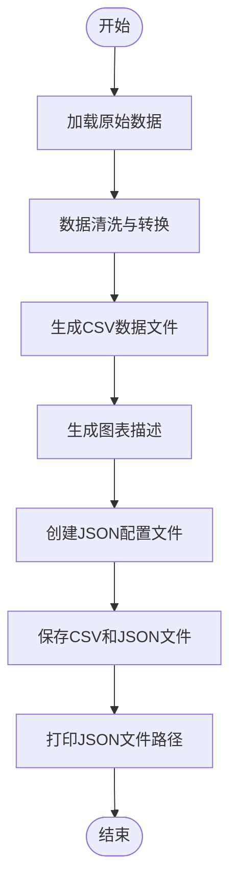
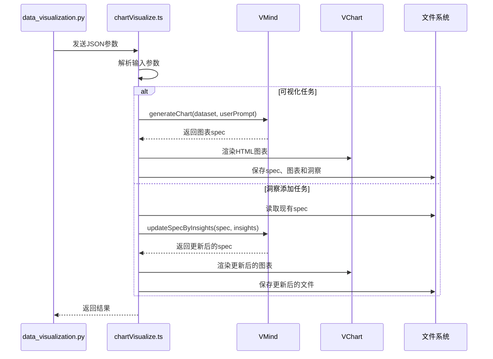
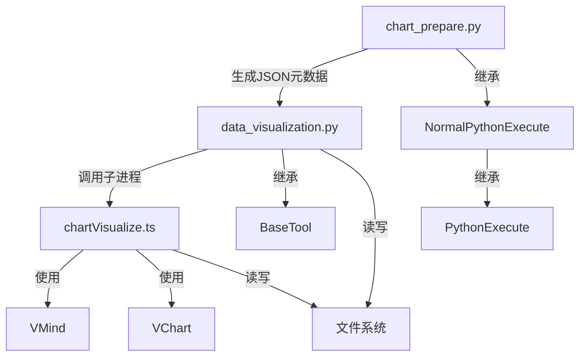

# 可视化工具

<cite>
**本文档引用的文件**  
- [data_visualization.py](file://app/tool/chart_visualization/data_visualization.py)
- [chart_prepare.py](file://app/tool/chart_visualization/chart_prepare.py)
- [chartVisualize.ts](file://app/tool/chart_visualization/src/chartVisualize.ts)
- [python_execute.py](file://app/tool/chart_visualization/python_execute.py)
- [README_zh.md](file://app/tool/chart_visualization/README_zh.md)
- [chart_demo.py](file://app/tool/chart_visualization/test/chart_demo.py)
- [report_demo.py](file://app/tool/chart_visualization/test/report_demo.py)
</cite>

## 目录
1. [简介](#简介)
2. [项目结构](#项目结构)
3. [核心组件](#核心组件)
4. [架构概述](#架构概述)
5. [详细组件分析](#详细组件分析)
6. [依赖分析](#依赖分析)
7. [性能考虑](#性能考虑)
8. [故障排除指南](#故障排除指南)
9. [结论](#结论)

## 简介
可视化工具是一个集成的数据可视化系统，通过Python和TypeScript的协同工作实现从原始数据到交互式图表的完整流程。系统采用分层架构，首先通过`chart_prepare.py`进行数据预处理和元数据生成，然后由`data_visualization.py`调用前端`chartVisualize.ts`完成图表渲染。该工具支持多种图表类型，并能自动生成数据洞察，提供HTML和PNG两种输出格式，满足不同场景下的可视化需求。

## 项目结构
可视化工具位于`app/tool/chart_visualization`目录下，采用模块化设计，各组件职责明确。主要包含Python后端处理模块和TypeScript前端渲染模块，以及测试用例和配置文件。

**图表来源**  
- [README_zh.md](file://app/tool/chart_visualization/README_zh.md#L1-L147)

**章节来源**  
- [README_zh.md](file://app/tool/chart_visualization/README_zh.md#L1-L147)

## 核心组件
系统由三个核心组件构成：`chart_prepare.py`负责数据预处理和格式转换，`data_visualization.py`处理数据可视化逻辑和图表生成，`chartVisualize.ts`实现前端交互式图表展示。这些组件通过JSON配置文件和子进程通信机制紧密协作，形成完整的可视化流水线。

**章节来源**  
- [data_visualization.py](file://app/tool/chart_visualization/data_visualization.py#L14-L262)
- [chart_prepare.py](file://app/tool/chart_visualization/chart_prepare.py#L3-L37)
- [chartVisualize.ts](file://app/tool/chart_visualization/src/chartVisualize.ts#L1-L372)

## 架构概述
系统采用前后端分离的架构模式，Python后端负责数据处理和业务逻辑，TypeScript前端负责图表渲染和交互。数据流从原始数据开始，经过预处理生成CSV文件和JSON元数据，再通过子进程调用Node.js环境执行图表生成，最终输出可视化结果。

**图表来源**  
- [data_visualization.py](file://app/tool/chart_visualization/data_visualization.py#L216-L262)
- [chartVisualize.ts](file://app/tool/chart_visualization/src/chartVisualize.ts#L345-L372)

## 详细组件分析

### data_visualization.py 分析
该模块是数据可视化的核心处理单元，负责协调整个可视化流程。它接收来自`chart_prepare.py`的JSON配置，读取相应的CSV数据文件，并通过异步子进程调用TypeScript前端代码生成图表。

#### 类图

**图表来源**  
- [data_visualization.py](file://app/tool/chart_visualization/data_visualization.py#L14-L262)

#### 执行流程

**图表来源**  
- [data_visualization.py](file://app/tool/chart_visualization/data_visualization.py#L195-L214)
- [chartVisualize.ts](file://app/tool/chart_visualization/src/chartVisualize.ts#L345-L372)

**章节来源**  
- [data_visualization.py](file://app/tool/chart_visualization/data_visualization.py#L14-L262)

### chart_prepare.py 分析
该模块负责数据预处理和可视化准备，通过执行Python代码生成后续可视化所需的元数据和清洗后的数据文件。

#### 类图

**图表来源**  
- [chart_prepare.py](file://app/tool/chart_visualization/chart_prepare.py#L3-L37)

#### 数据处理流程

**图表来源**  
- [chart_prepare.py](file://app/tool/chart_visualization/chart_prepare.py#L8-L37)

**章节来源**  
- [chart_prepare.py](file://app/tool/chart_visualization/chart_prepare.py#L3-L37)

### chartVisualize.ts 分析
该TypeScript模块在Node.js环境中运行，利用VMind和VChart库实现智能图表生成和渲染，是整个可视化系统的前端引擎。

#### 核心功能流程

**图表来源**  
- [chartVisualize.ts](file://app/tool/chart_visualization/src/chartVisualize.ts#L345-L372)

**章节来源**  
- [chartVisualize.ts](file://app/tool/chart_visualization/src/chartVisualize.ts#L1-L372)

## 依赖分析
系统各组件之间通过明确的接口和数据格式进行交互，依赖关系清晰。Python模块通过继承机制复用代码，前后端通过标准输入输出进行通信，降低了耦合度。

**图表来源**  
- [data_visualization.py](file://app/tool/chart_visualization/data_visualization.py#L216-L262)
- [chart_prepare.py](file://app/tool/chart_visualization/chart_prepare.py#L3-L37)

**章节来源**  
- [data_visualization.py](file://app/tool/chart_visualization/data_visualization.py#L14-L262)
- [chart_prepare.py](file://app/tool/chart_visualization/chart_prepare.py#L3-L37)

## 性能考虑
系统在处理大数据集时采用了异步并发处理机制，`data_visualization.py`中的`data_visualization`方法使用`asyncio.gather`并行处理多个图表生成任务，提高了整体效率。对于大文件的处理，系统通过流式读取和分块处理来降低内存占用。前端渲染使用Puppeteer生成PNG图像，确保了图表质量的同时也考虑了性能平衡。

## 故障排除指南
系统实现了完善的错误处理机制。在`data_visualization.py`中，`execute`方法包含try-catch块捕获异常，`data_visualization`和`add_insighs`方法会收集每个任务的错误信息并返回详细的错误报告。子进程通信中的错误会被捕获并包装成JSON格式返回。对于无效数据格式，系统在读取CSV文件时会进行验证，发现问题时抛出异常。建议检查JSON配置文件路径是否正确、CSV文件格式是否符合要求、Node.js环境是否正确安装配置。

**章节来源**  
- [data_visualization.py](file://app/tool/chart_visualization/data_visualization.py#L195-L214)
- [chartVisualize.ts](file://app/tool/chart_visualization/src/chartVisualize.ts#L250-L340)

## 结论
可视化工具通过精心设计的架构实现了高效的数据可视化功能。系统将数据预处理、可视化生成和前端渲染分离到不同的组件中，既保证了职责单一性，又通过标准化的接口实现了良好的集成。Python和TypeScript的结合充分利用了各自的优势：Python在数据处理方面的强大能力，以及TypeScript在前端交互式可视化方面的优势。该工具不仅能够生成静态图表，还能添加智能洞察，为数据分析提供了全面的支持。