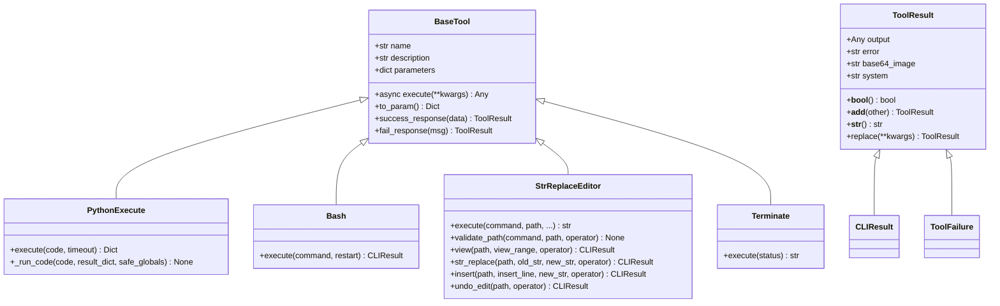
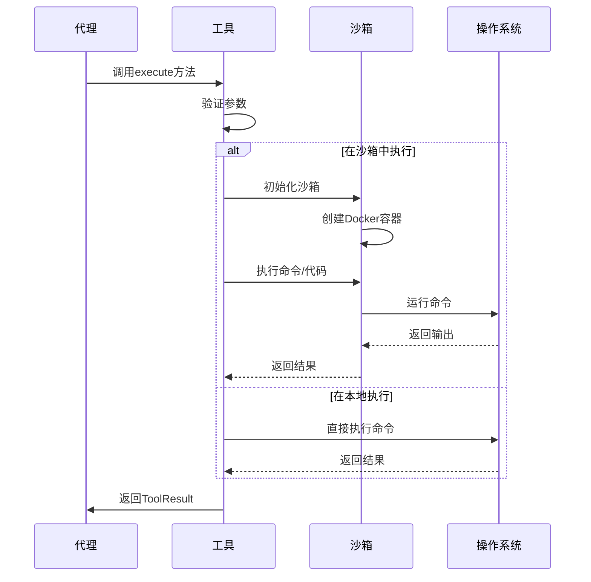
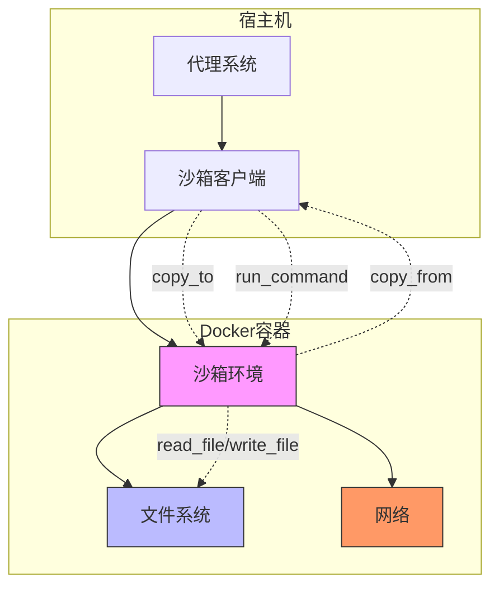
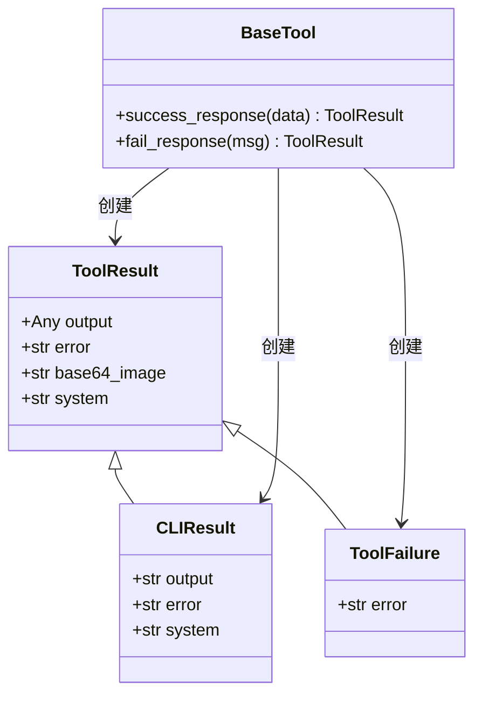
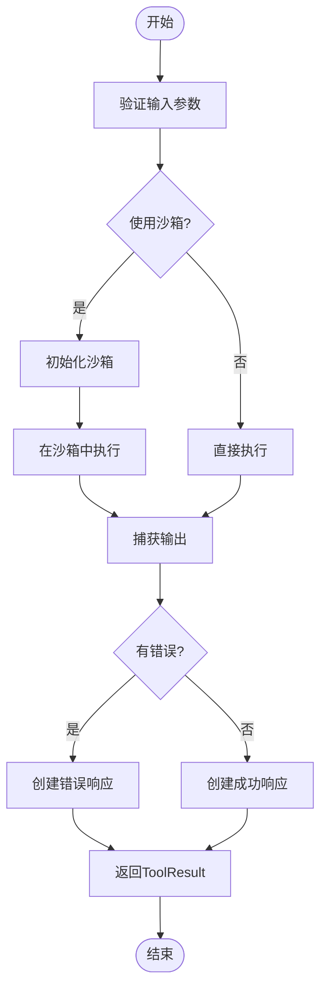

# 基础工具

<cite>
**本文档中引用的文件**  
- [python_execute.py](file://app/tool/python_execute.py)
- [bash.py](file://app/tool/bash.py)
- [file_operators.py](file://app/tool/file_operators.py)
- [str_replace_editor.py](file://app/tool/str_replace_editor.py)
- [terminate.py](file://app/tool/terminate.py)
- [base.py](file://app/tool/base.py)
- [client.py](file://app/sandbox/client.py)
- [sandbox.py](file://app/sandbox/core/sandbox.py)
- [config.py](file://app/config.py)
</cite>

## 目录
1. [简介](#简介)
2. [基础工具架构](#基础工具架构)
3. [核心工具详解](#核心工具详解)
4. [执行机制与参数验证](#执行机制与参数验证)
5. [沙箱环境交互](#沙箱环境交互)
6. [返回值结构与错误处理](#返回值结构与错误处理)
7. [性能考量与安全限制](#性能考量与安全限制)
8. [工具调用示例](#工具调用示例)
9. [总结](#总结)

## 简介
本项目提供了一套基础工具，用于支持代理系统执行各种任务。这些工具涵盖了Python代码执行、Bash命令执行、文件操作、字符串替换编辑和任务终止等功能。所有工具都继承自`BaseTool`类，实现了统一的接口和行为规范。工具的设计考虑了安全性、可靠性和可扩展性，能够在沙箱环境中安全地执行代码和命令。

## 基础工具架构

**图示来源**
- [base.py](file://app/tool/base.py#L77-L172)
- [python_execute.py](file://app/tool/python_execute.py#L1-L75)
- [bash.py](file://app/tool/bash.py#L1-L158)
- [str_replace_editor.py](file://app/tool/str_replace_editor.py#L1-L432)
- [terminate.py](file://app/tool/terminate.py#L1-L25)

## 核心工具详解

### Python执行工具
`python_execute`工具允许在安全的环境中执行Python代码。它使用多进程机制来隔离代码执行，防止恶意代码影响主程序。工具会捕获代码的输出，但不会捕获函数的返回值，因此需要使用`print`语句来查看结果。

**工具来源**
- [python_execute.py](file://app/tool/python_execute.py#L1-L75)

### Bash命令执行工具
`bash`工具提供了一个持久的Bash会话，可以执行各种shell命令。它支持长时间运行的命令、交互式命令和超时处理。对于可能无限期运行的命令，建议在后台运行并将输出重定向到文件。

**工具来源**
- [bash.py](file://app/tool/bash.py#L1-L158)

### 文件操作工具
`file_operators`模块提供了文件操作的接口和实现。它包括`LocalFileOperator`和`SandboxFileOperator`两个实现，分别用于本地文件系统和沙箱环境中的文件操作。这些操作包括读取、写入、检查文件是否存在等。

**工具来源**
- [file_operators.py](file://app/tool/file_operators.py#L1-L158)

### 字符串替换编辑工具
`str_replace_editor`工具提供了强大的文件编辑功能，支持查看、创建、编辑和撤销文件更改。它可以在文件中进行字符串替换、插入文本等操作，并且支持查看文件的特定行范围。

**工具来源**
- [str_replace_editor.py](file://app/tool/str_replace_editor.py#L1-L432)

### 终止工具
`terminate`工具用于结束代理的交互。当所有任务完成或无法继续时，可以调用此工具来终止工作流。它接受一个状态参数，指示交互是成功还是失败。

**工具来源**
- [terminate.py](file://app/tool/terminate.py#L1-L25)

## 执行机制与参数验证

**图示来源**
- [base.py](file://app/tool/base.py#L77-L172)
- [python_execute.py](file://app/tool/python_execute.py#L1-L75)
- [bash.py](file://app/tool/bash.py#L1-L158)
- [sandbox.py](file://app/sandbox/core/sandbox.py#L1-L462)

## 沙箱环境交互

**图示来源**
- [client.py](file://app/sandbox/client.py#L1-L201)
- [sandbox.py](file://app/sandbox/core/sandbox.py#L1-L462)
- [config.py](file://app/config.py#L1-L372)

## 返回值结构与错误处理

**图示来源**
- [base.py](file://app/tool/base.py#L37-L74)
- [python_execute.py](file://app/tool/python_execute.py#L1-L75)
- [bash.py](file://app/tool/bash.py#L1-L158)

## 性能考量与安全限制

### 性能考量
- **超时设置**：所有代码和命令执行都有默认的超时限制，防止无限循环或长时间运行的任务阻塞系统。
- **资源限制**：沙箱环境对内存和CPU使用进行了限制，确保不会耗尽系统资源。
- **异步执行**：所有工具方法都是异步的，可以并发执行多个任务，提高整体效率。

### 安全限制
- **路径限制**：文件操作受到严格限制，防止路径遍历攻击。所有路径都经过安全验证。
- **网络限制**：沙箱环境默认禁用网络访问，防止恶意代码与外部通信。
- **代码隔离**：Python代码在独立的进程中执行，与主程序完全隔离。

**工具来源**
- [config.py](file://app/config.py#L1-L372)
- [sandbox.py](file://app/sandbox/core/sandbox.py#L1-L462)
- [python_execute.py](file://app/tool/python_execute.py#L1-L75)

## 工具调用示例

**图示来源**
- [base.py](file://app/tool/base.py#L77-L172)
- [python_execute.py](file://app/tool/python_execute.py#L1-L75)
- [bash.py](file://app/tool/bash.py#L1-L158)

## 总结
本项目的基础工具集为代理系统提供了强大的功能支持。通过继承`BaseTool`类，所有工具都遵循统一的接口规范，确保了代码的一致性和可维护性。工具的设计充分考虑了安全性和性能，能够在沙箱环境中安全地执行代码和命令。返回值结构`ToolResult`提供了灵活的结果表示方式，支持输出、错误信息、系统消息等多种类型的数据。这些工具共同构成了一个可靠、安全、高效的执行环境，为复杂的任务自动化提供了坚实的基础。