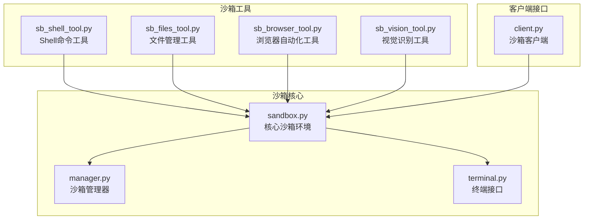
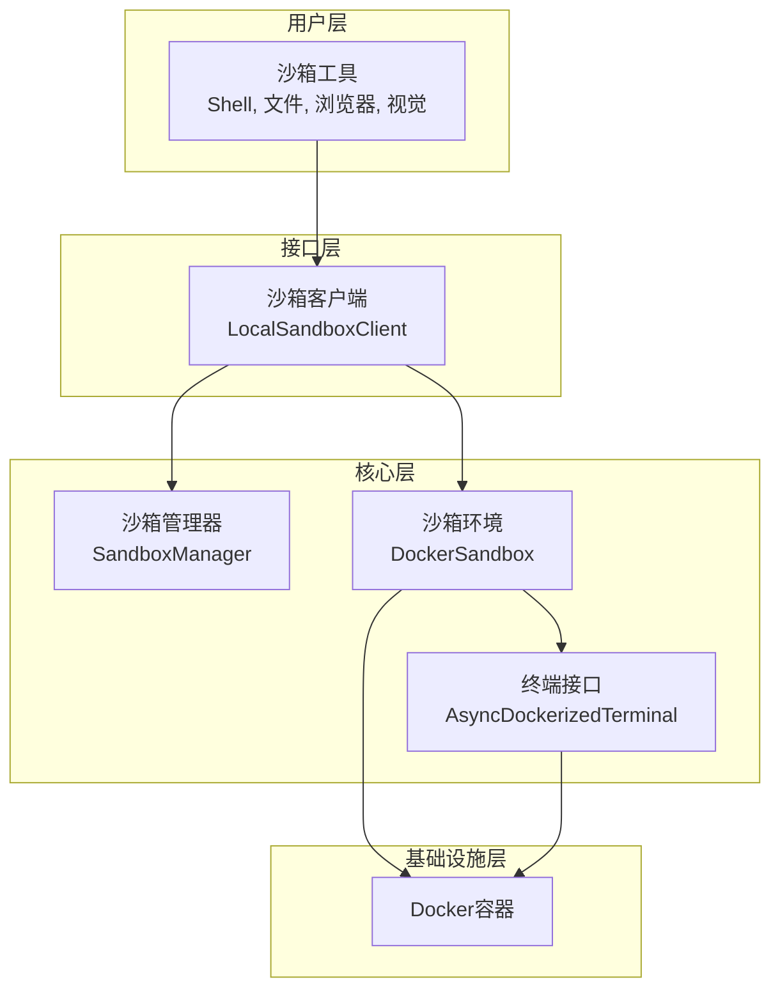
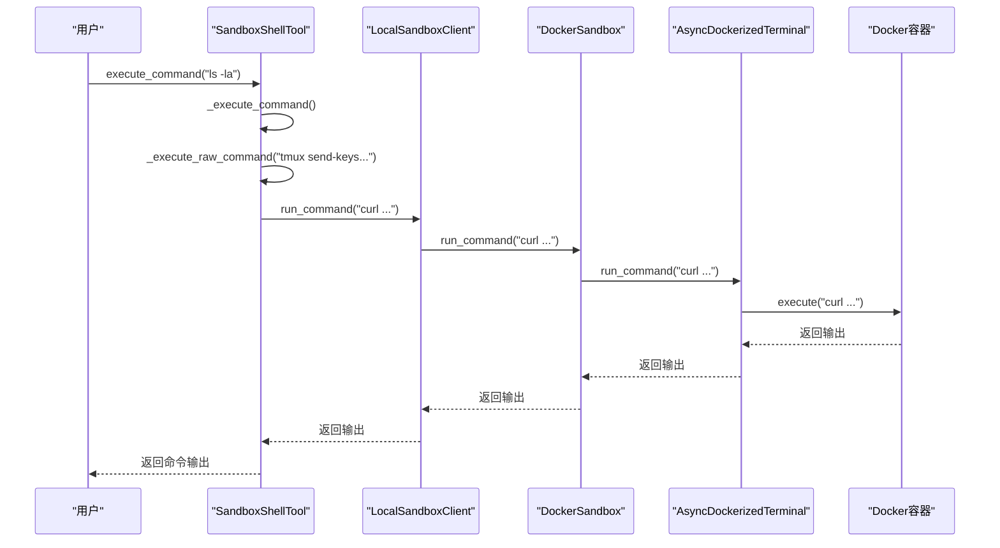
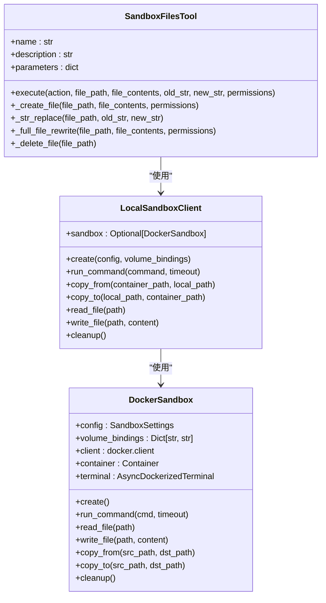
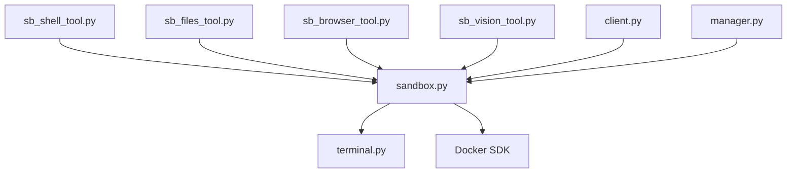

# 沙箱工具

<cite>
**本文档引用的文件**   
- [sb_shell_tool.py](file://app/tool/sandbox/sb_shell_tool.py)
- [sb_files_tool.py](file://app/tool/sandbox/sb_files_tool.py)
- [sb_browser_tool.py](file://app/tool/sandbox/sb_browser_tool.py)
- [sb_vision_tool.py](file://app/tool/sandbox/sb_vision_tool.py)
- [sandbox.py](file://app/sandbox/core/sandbox.py)
- [manager.py](file://app/sandbox/core/manager.py)
- [terminal.py](file://app/sandbox/core/terminal.py)
- [client.py](file://app/sandbox/client.py)
</cite>

## 目录
1. [简介](#简介)
2. [项目结构](#项目结构)
3. [核心组件](#核心组件)
4. [架构概述](#架构概述)
5. [详细组件分析](#详细组件分析)
6. [依赖分析](#依赖分析)
7. [性能考虑](#性能考虑)
8. [故障排除指南](#故障排除指南)
9. [结论](#结论)

## 简介
本文档详细介绍了OpenManus项目中的沙箱工具系统，重点阐述了在隔离环境中执行操作的安全机制。文档解释了`sb_shell_tool.py`如何在Docker沙箱中执行命令，`sb_files_tool.py`如何管理沙箱内的文件系统，`sb_browser_tool.py`如何在受控环境中进行网页浏览，以及`sb_vision_tool.py`如何处理图像识别任务。文档还说明了这些工具与主沙箱核心（`sandbox.py`）的交互协议，包括命令序列化、结果传输和状态同步。此外，文档提供了安全特性、故障排除指南，并强调了这些工具在保障系统安全方面的重要性及其性能开销。

## 项目结构
该项目的沙箱功能主要集中在`app/sandbox`和`app/tool/sandbox`目录下。`app/sandbox/core`包含沙箱的核心实现，如`sandbox.py`（沙箱环境）、`manager.py`（沙箱管理器）和`terminal.py`（终端接口）。`app/tool/sandbox`目录包含了面向用户的工具类，如`sb_shell_tool.py`、`sb_files_tool.py`、`sb_browser_tool.py`和`sb_vision_tool.py`。`app/sandbox/client.py`提供了与沙箱交互的客户端接口。



**图源**
- [sandbox.py](file://app/sandbox/core/sandbox.py#L1-L462)
- [manager.py](file://app/sandbox/core/manager.py#L1-L313)
- [terminal.py](file://app/sandbox/core/terminal.py#L1-L346)
- [sb_shell_tool.py](file://app/tool/sandbox/sb_shell_tool.py#L1-L419)
- [sb_files_tool.py](file://app/tool/sandbox/sb_files_tool.py#L1-L361)
- [sb_browser_tool.py](file://app/tool/sandbox/sb_browser_tool.py#L1-L450)
- [sb_vision_tool.py](file://app/tool/sandbox/sb_vision_tool.py#L1-L178)
- [client.py](file://app/sandbox/client.py#L1-L201)

**节源**
- [sandbox.py](file://app/sandbox/core/sandbox.py#L1-L462)
- [manager.py](file://app/sandbox/core/manager.py#L1-L313)
- [terminal.py](file://app/sandbox/core/terminal.py#L1-L346)
- [client.py](file://app/sandbox/client.py#L1-L201)

## 核心组件
沙箱系统的核心组件是`DockerSandbox`类，它提供了一个容器化的执行环境。该类负责创建和管理Docker容器，执行命令，以及进行文件操作。`SandboxManager`类负责管理多个`DockerSandbox`实例的生命周期，包括创建、监控和清理。`AsyncDockerizedTerminal`类提供了与Docker容器进行异步交互的终端接口。`LocalSandboxClient`类作为客户端接口，封装了与沙箱核心的交互，为上层工具提供了一个统一的API。

**节源**
- [sandbox.py](file://app/sandbox/core/sandbox.py#L17-L461)
- [manager.py](file://app/sandbox/core/manager.py#L13-L312)
- [terminal.py](file://app/sandbox/core/terminal.py#L250-L345)
- [client.py](file://app/sandbox/client.py#L85-L188)

## 架构概述
沙箱系统的架构采用分层设计。最底层是Docker容器，提供隔离的执行环境。中间层是沙箱核心，由`DockerSandbox`、`SandboxManager`和`AsyncDockerizedTerminal`组成，负责与Docker API交互，管理容器生命周期和执行命令。上层是沙箱工具，如`SandboxShellTool`、`SandboxFilesTool`等，它们通过`LocalSandboxClient`与沙箱核心交互，为用户提供特定功能。这种分层设计确保了系统的模块化和可维护性。



**图源**
- [sb_shell_tool.py](file://app/tool/sandbox/sb_shell_tool.py#L20-L418)
- [sb_files_tool.py](file://app/tool/sandbox/sb_files_tool.py#L27-L360)
- [sb_browser_tool.py](file://app/tool/sandbox/sb_browser_tool.py#L35-L449)
- [sb_vision_tool.py](file://app/tool/sandbox/sb_vision_tool.py#L31-L177)
- [client.py](file://app/sandbox/client.py#L85-L188)
- [sandbox.py](file://app/sandbox/core/sandbox.py#L17-L461)
- [manager.py](file://app/sandbox/core/manager.py#L13-L312)
- [terminal.py](file://app/sandbox/core/terminal.py#L250-L345)

## 详细组件分析

### Shell命令工具分析
`SandboxShellTool`类允许在沙箱中执行Shell命令。它使用`tmux`会话来维护命令状态，支持非阻塞和阻塞执行模式。该工具通过`_execute_raw_command`方法发送`curl`命令与沙箱进程通信，从而执行Shell命令。



**图源**
- [sb_shell_tool.py](file://app/tool/sandbox/sb_shell_tool.py#L113-L135)
- [client.py](file://app/sandbox/client.py#L109-L124)
- [sandbox.py](file://app/sandbox/core/sandbox.py#L139-L163)
- [terminal.py](file://app/sandbox/core/terminal.py#L315-L331)

**节源**
- [sb_shell_tool.py](file://app/tool/sandbox/sb_shell_tool.py#L20-L418)

### 文件管理工具分析
`SandboxFilesTool`类提供了对沙箱内文件系统的管理功能，包括创建、读取、修改和删除文件。该工具通过`LocalSandboxClient`的`read_file`和`write_file`方法与沙箱核心交互。



**图源**
- [sb_files_tool.py](file://app/tool/sandbox/sb_files_tool.py#L27-L360)
- [client.py](file://app/sandbox/client.py#L85-L188)
- [sandbox.py](file://app/sandbox/core/sandbox.py#L17-L461)

**节源**
- [sb_files_tool.py](file://app/tool/sandbox/sb_files_tool.py#L27-L360)

### 浏览器自动化工具分析
`SandboxBrowserTool`类允许在沙箱中进行浏览器自动化操作，如导航、点击元素和输入文本。该工具通过向`http://localhost:8003/api/automation/`发送`curl`命令来控制沙箱内的浏览器。

```mermaid
flowchart TD
A[用户调用 execute("navigate_to", url="https://example.com")] --> B[SandboxBrowserTool._execute_browser_action]
B --> C[构建 curl 命令]
C --> D[通过 LocalSandboxClient.run_command 执行 curl]
D --> E[DockerSandbox 执行 curl 命令]
E --> F[沙箱内进程接收请求]
F --> G[控制浏览器执行操作]
G --> H[返回结果]
H --> I[解析 JSON 响应]
I --> J[返回 ToolResult]
```

**图源**
- [sb_browser_tool.py](file://app/tool/sandbox/sb_browser_tool.py#L194-L275)
- [client.py](file://app/sandbox/client.py#L109-L124)
- [sandbox.py](file://app/sandbox/core/sandbox.py#L139-L163)

**节源**
- [sb_browser_tool.py](file://app/tool/sandbox/sb_browser_tool.py#L35-L449)

### 视觉识别工具分析
`SandboxVisionTool`类用于处理沙箱内的图像文件。它支持读取和压缩图像，并将结果以Base64编码的形式返回。

```mermaid
flowchart TD
A[用户调用 execute("see_image", file_path="image.png")] --> B[SandboxVisionTool.execute]
B --> C[调用 sandbox.fs.download_file]
C --> D[下载图像文件]
D --> E[调用 compress_image]
E --> F[压缩图像]
F --> G[转换为 Base64]
G --> H[返回 ToolResult]
```

**图源**
- [sb_vision_tool.py](file://app/tool/sandbox/sb_vision_tool.py#L106-L177)
- [sandbox.py](file://app/sandbox/core/sandbox.py#L165-L195)

**节源**
- [sb_vision_tool.py](file://app/tool/sandbox/sb_vision_tool.py#L31-L177)

## 依赖分析
沙箱工具系统具有清晰的依赖关系。`sb_shell_tool.py`、`sb_files_tool.py`、`sb_browser_tool.py`和`sb_vision_tool.py`都依赖于`app/sandbox/core/sandbox.py`提供的核心功能。这些工具通过`app/sandbox/client.py`中的`LocalSandboxClient`与核心沙箱进行交互。`sandbox.py`本身依赖于`docker`库来管理Docker容器，并依赖于`app/sandbox/core/terminal.py`来提供终端功能。`app/sandbox/core/manager.py`依赖于`sandbox.py`来管理多个沙箱实例。



**图源**
- [sb_shell_tool.py](file://app/tool/sandbox/sb_shell_tool.py#L20-L418)
- [sb_files_tool.py](file://app/tool/sandbox/sb_files_tool.py#L27-L360)
- [sb_browser_tool.py](file://app/tool/sandbox/sb_browser_tool.py#L35-L449)
- [sb_vision_tool.py](file://app/tool/sandbox/sb_vision_tool.py#L31-L177)
- [client.py](file://app/sandbox/client.py#L85-L188)
- [manager.py](file://app/sandbox/core/manager.py#L13-L312)
- [sandbox.py](file://app/sandbox/core/sandbox.py#L17-L461)
- [terminal.py](file://app/sandbox/core/terminal.py#L250-L345)

**节源**
- [sb_shell_tool.py](file://app/tool/sandbox/sb_shell_tool.py#L20-L418)
- [sb_files_tool.py](file://app/tool/sandbox/sb_files_tool.py#L27-L360)
- [sb_browser_tool.py](file://app/tool/sandbox/sb_browser_tool.py#L35-L449)
- [sb_vision_tool.py](file://app/tool/sandbox/sb_vision_tool.py#L31-L177)
- [client.py](file://app/sandbox/client.py#L85-L188)
- [manager.py](file://app/sandbox/core/manager.py#L13-L312)
- [sandbox.py](file://app/sandbox/core/sandbox.py#L17-L461)
- [terminal.py](file://app/sandbox/core/terminal.py#L250-L345)

## 性能考虑
沙箱工具的性能开销主要来自Docker容器的创建和销毁、网络通信以及文件I/O操作。`SandboxManager`通过复用沙箱实例和自动清理空闲沙箱来优化性能。命令执行的性能受`tmux`会话和`curl`命令的影响。文件操作的性能受`tar`归档和解归档操作的影响。视觉工具的性能受图像压缩算法的影响。总体而言，系统设计考虑了性能优化，但在高并发场景下仍需注意资源消耗。

## 故障排除指南
### 常见的沙箱连接问题
- **问题**: 无法创建沙箱。
  - **原因**: Docker服务未运行或Docker镜像拉取失败。
  - **解决方案**: 确保Docker服务正在运行，并检查网络连接。
- **问题**: 工具无法与沙箱通信。
  - **原因**: `LocalSandboxClient`未正确初始化或沙箱已停止。
  - **解决方案**: 检查`_ensure_sandbox`方法的调用，并确保沙箱处于运行状态。

### 执行超时情况
- **问题**: 命令执行超时。
  - **原因**: 命令执行时间过长或沙箱资源不足。
  - **解决方案**: 增加`timeout`参数的值，或优化命令逻辑。
- **问题**: 文件操作超时。
  - **原因**: 文件过大或网络延迟。
  - **解决方案**: 分块处理大文件，或检查网络状况。

**节源**
- [sandbox.py](file://app/sandbox/core/sandbox.py#L139-L163)
- [manager.py](file://app/sandbox/core/manager.py#L113-L156)
- [sb_shell_tool.py](file://app/tool/sandbox/sb_shell_tool.py#L137-L255)

## 结论
OpenManus的沙箱工具系统通过Docker容器提供了强大的隔离执行环境。`sb_shell_tool.py`、`sb_files_tool.py`、`sb_browser_tool.py`和`sb_vision_tool.py`等工具为用户提供了丰富的功能，同时通过`sandbox.py`核心和`SandboxManager`确保了安全性和资源管理。该系统在保障系统安全方面至关重要，通过权限隔离、资源限制和网络访问控制等机制，有效防止了潜在的安全风险。尽管存在一定的性能开销，但其设计合理，能够满足大多数应用场景的需求。