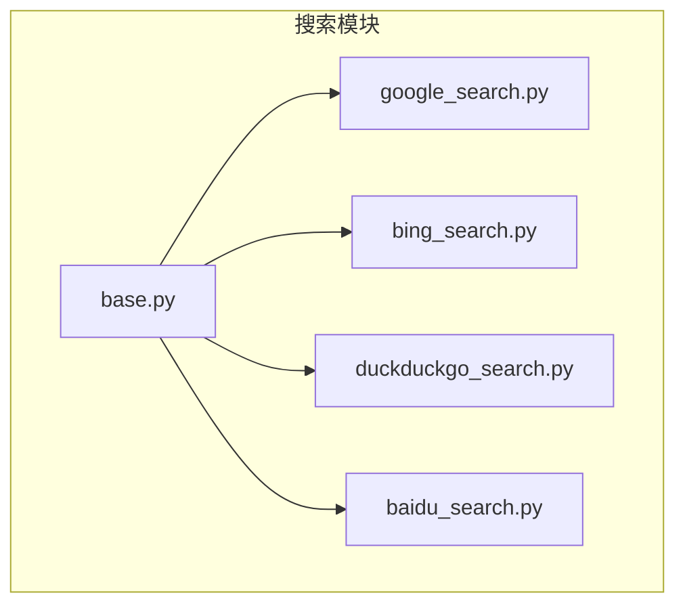
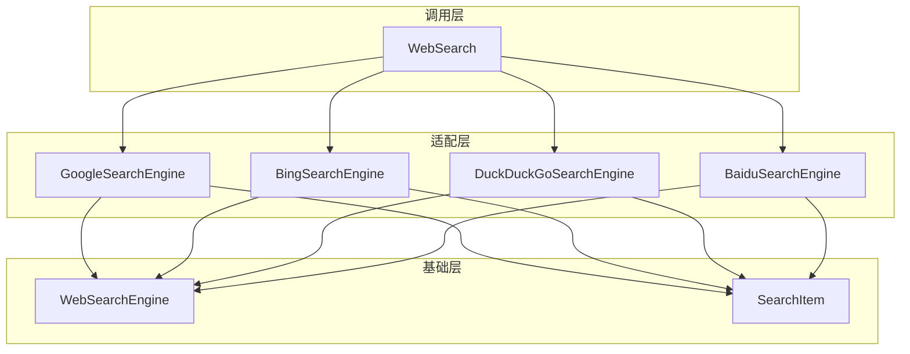
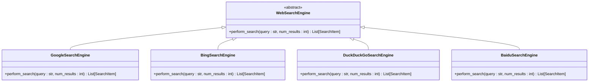
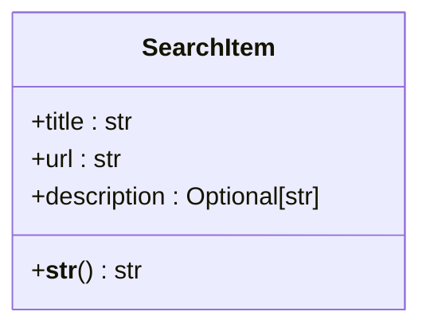
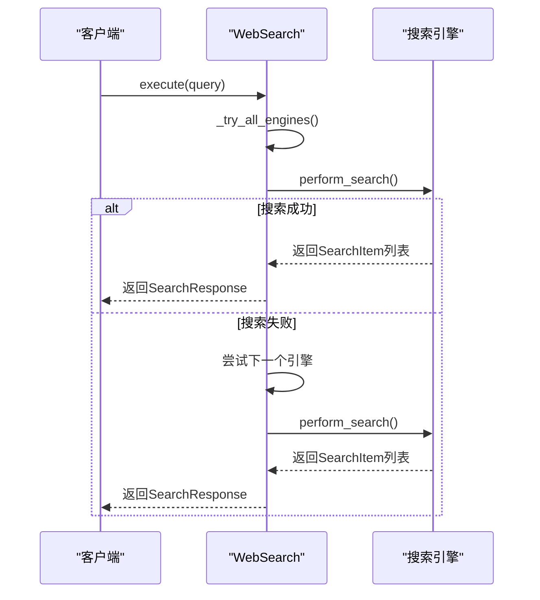
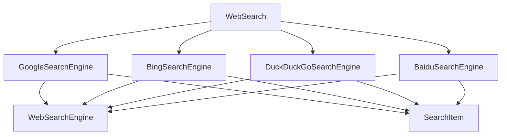

# 搜索基础接口

<cite>
**Referenced Files in This Document**   
- [base.py](file://app/tool/search/base.py)
- [schema.py](file://app/schema.py)
- [web_search.py](file://app/tool/web_search.py)
- [google_search.py](file://app/tool/search/google_search.py)
- [bing_search.py](file://app/tool/search/bing_search.py)
- [duckduckgo_search.py](file://app/tool/search/duckduckgo_search.py)
- [baidu_search.py](file://app/tool/search/baidu_search.py)
</cite>

## 目录
1. [简介](#简介)
2. [项目结构](#项目结构)
3. [核心组件](#核心组件)
4. [架构概述](#架构概述)
5. [详细组件分析](#详细组件分析)
6. [依赖分析](#依赖分析)
7. [性能考虑](#性能考虑)
8. [故障排除指南](#故障排除指南)
9. [结论](#结论)

## 简介
本文档详细记录了`BaseSearch`类作为所有搜索引擎的抽象基类的设计与实现。该基类通过定义统一的搜索接口（如`perform_search`方法）来规范各搜索引擎的行为，并通过抽象方法强制子类实现特定功能，同时提供可复用的公共逻辑。文档还解释了`SearchItem`数据模型的结构及其在不同搜索引擎间的通用性，以及如何继承`BaseSearch`创建新的搜索引擎适配器。此外，文档讨论了类型注解和Pydantic模型的使用如何提升类型安全和文档可读性，并分析了该设计模式如何支持未来扩展新的搜索引擎而无需修改核心调用逻辑。

## 项目结构
搜索功能模块位于`app/tool/search/`目录下，包含一个抽象基类文件`base.py`和多个具体搜索引擎实现文件。该设计采用模块化结构，将通用逻辑与具体实现分离，便于维护和扩展。

**Diagram sources**
- [base.py](file://app/tool/search/base.py)
- [google_search.py](file://app/tool/search/google_search.py)
- [bing_search.py](file://app/tool/search/bing_search.py)
- [duckduckgo_search.py](file://app/tool/search/duckduckgo_search.py)
- [baidu_search.py](file://app/tool/search/baidu_search.py)

**Section sources**
- [base.py](file://app/tool/search/base.py)
- [google_search.py](file://app/tool/search/google_search.py)

## 核心组件
本系统的核心组件包括`WebSearchEngine`抽象基类、`SearchItem`数据模型以及具体的搜索引擎实现类。`WebSearchEngine`定义了所有搜索引擎必须实现的`perform_search`方法，确保了接口的一致性。`SearchItem`模型则提供了标准化的搜索结果表示，使得不同搜索引擎返回的数据可以统一处理。

**Section sources**
- [base.py](file://app/tool/search/base.py#L5-L40)
- [schema.py](file://app/schema.py#L1-L188)

## 架构概述
系统采用分层架构设计，上层为`WebSearch`工具类，负责协调多个搜索引擎；中层为具体的搜索引擎适配器；底层为`WebSearchEngine`抽象基类和`SearchItem`数据模型。这种设计实现了关注点分离，提高了代码的可维护性和可扩展性。

**Diagram sources**
- [base.py](file://app/tool/search/base.py)
- [web_search.py](file://app/tool/web_search.py)
- [google_search.py](file://app/tool/search/google_search.py)

## 详细组件分析

### WebSearchEngine 抽象基类分析
`WebSearchEngine`类作为所有搜索引擎的抽象基类，通过继承`BaseModel`并定义`perform_search`抽象方法，强制子类实现具体的搜索逻辑。该设计模式确保了所有搜索引擎都遵循相同的接口规范。

**Diagram sources**
- [base.py](file://app/tool/search/base.py#L24-L39)
- [google_search.py](file://app/tool/search/google_search.py#L8-L32)
- [bing_search.py](file://app/tool/search/bing_search.py#L46-L74)
- [duckduckgo_search.py](file://app/tool/search/duckduckgo_search.py#L8-L56)
- [baidu_search.py](file://app/tool/search/baidu_search.py#L8-L53)

### SearchItem 数据模型分析
`SearchItem`数据模型定义了搜索结果的标准结构，包含标题、URL和描述三个核心字段。通过使用Pydantic的`Field`装饰器，每个字段都附带了详细的描述信息，提高了代码的可读性和自文档化能力。

**Diagram sources**
- [base.py](file://app/tool/search/base.py#L5-L16)

### WebSearch 工具类分析
`WebSearch`类作为高层协调器，管理多个搜索引擎实例，并提供统一的搜索接口。它实现了故障转移机制，当首选搜索引擎失败时，会自动尝试备用引擎，提高了系统的可靠性。

**Diagram sources**
- [web_search.py](file://app/tool/web_search.py#L200-L287)
- [base.py](file://app/tool/search/base.py#L24-L39)

## 依赖分析
系统通过清晰的依赖关系实现了模块化设计。`WebSearch`类依赖于具体的搜索引擎实现，而所有搜索引擎实现都依赖于`WebSearchEngine`基类和`SearchItem`模型。这种依赖结构确保了代码的可测试性和可维护性。

**Diagram sources**
- [web_search.py](file://app/tool/web_search.py#L192-L197)
- [base.py](file://app/tool/search/base.py)

## 性能考虑
系统在性能方面进行了多项优化。首先，通过异步执行和线程池调度，避免了I/O操作阻塞事件循环。其次，实现了结果缓存机制，减少了重复搜索的开销。最后，对获取的网页内容进行了大小限制和清理，防止内存占用过高。

## 故障排除指南
当搜索功能出现问题时，应首先检查网络连接和API密钥配置。其次，查看日志中的错误信息，确定是特定搜索引擎故障还是通用问题。对于频繁失败的搜索引擎，可以调整其在`_get_engine_order`方法中的优先级，或暂时将其从可用引擎列表中移除。

**Section sources**
- [web_search.py](file://app/tool/web_search.py#L200-L287)
- [bing_search.py](file://app/tool/search/bing_search.py#L109-L152)

## 结论
本文档详细分析了搜索基础接口的设计与实现。通过抽象基类和数据模型的组合，系统实现了高度的可扩展性和一致性。Pydantic模型的使用不仅提升了类型安全，还增强了代码的自文档化能力。未来添加新的搜索引擎只需实现`WebSearchEngine`接口，无需修改现有代码，充分体现了开闭原则的设计理念。