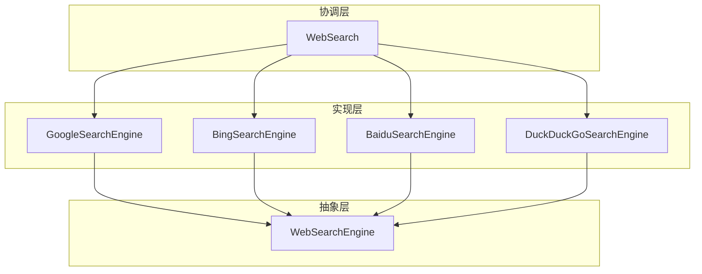
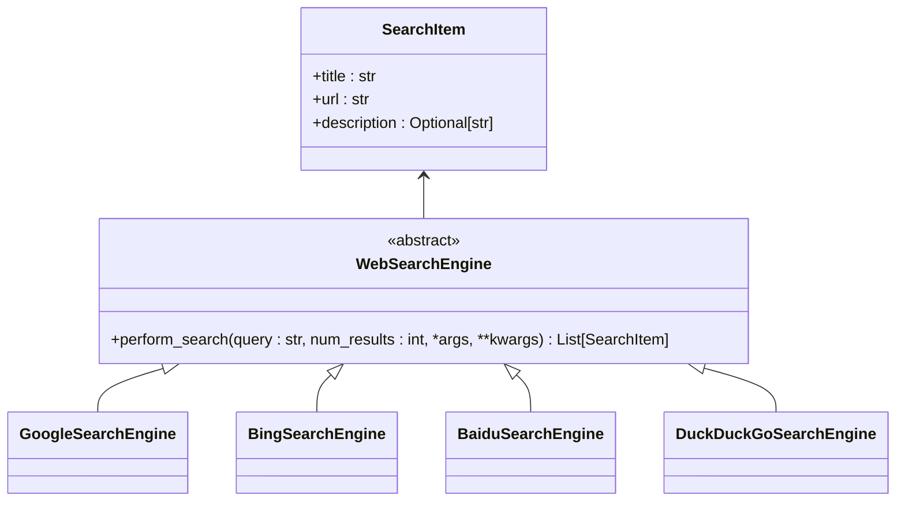
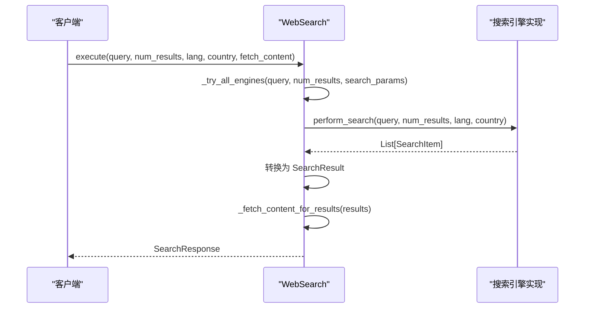
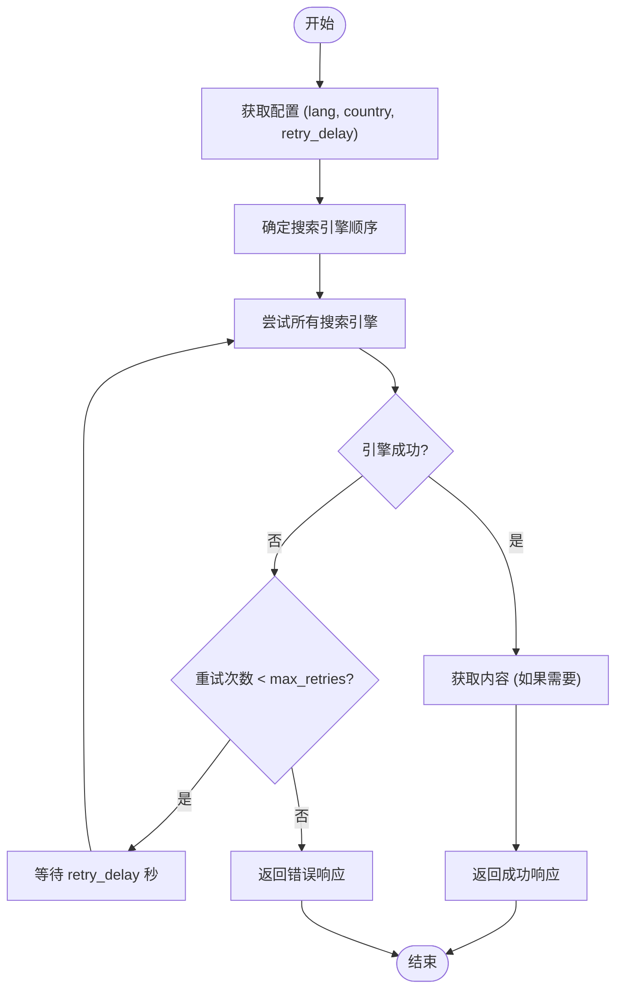
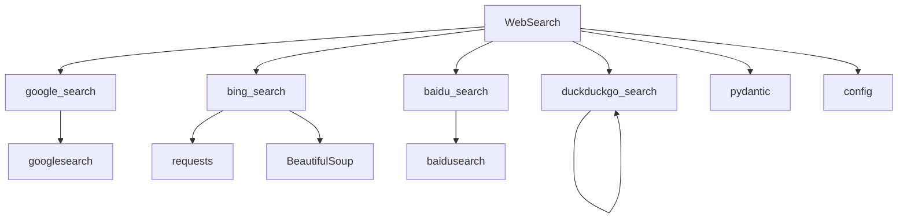

# 搜索工具

<cite>
**本文档引用的文件**
- [web_search.py](file://app/tool/web_search.py)
- [base.py](file://app/tool/search/base.py)
- [config.py](file://app/config.py)
- [google_search.py](file://app/tool/search/google_search.py)
- [bing_search.py](file://app/tool/search/bing_search.py)
- [baidu_search.py](file://app/tool/search/baidu_search.py)
- [duckduckgo_search.py](file://app/tool/search/duckduckgo_search.py)
</cite>

## 目录
1. [简介](#简介)
2. [核心组件](#核心组件)
3. [架构概述](#架构概述)
4. [详细组件分析](#详细组件分析)
5. [依赖分析](#依赖分析)
6. [性能考虑](#性能考虑)
7. [故障排除指南](#故障排除指南)
8. [结论](#结论)

## 简介
本系统是一个多搜索引擎集成工具，旨在通过统一的接口协调多个不同的搜索引擎（Google、Bing、百度、DuckDuckGo）并聚合搜索结果。该系统采用抽象基类模式，定义了标准化的搜索接口，并通过具体的实现类来适配各个搜索引擎的API。`web_search.py` 文件作为核心协调器，负责管理搜索流程、聚合结果以及处理错误。系统支持灵活的搜索参数配置，包括结果数量、内容提取选项和语言设置。此外，系统还实现了完善的错误处理机制，以应对API限流、网络超时和结果解析失败等常见问题。

## 核心组件

本系统的核心组件包括 `BaseSearch` 抽象基类、各搜索引擎的具体实现类以及 `web_search.py` 中的协调器。`BaseSearch` 类定义了统一的搜索接口，确保所有搜索引擎实现的一致性。各具体实现类（如 `GoogleSearchEngine`、`BingSearchEngine` 等）负责适配不同搜索引擎的API。`WebSearch` 类作为协调器，负责调用这些搜索引擎并聚合结果。

**Section sources**
- [base.py](file://app/tool/search/base.py#L1-L41)
- [web_search.py](file://app/tool/web_search.py#L155-L407)

## 架构概述

该系统采用分层架构，分为抽象层、实现层和协调层。抽象层由 `WebSearchEngine` 基类构成，定义了所有搜索引擎必须实现的 `perform_search` 方法。实现层包含各个具体搜索引擎的实现类，它们继承自 `WebSearchEngine` 并提供具体的搜索逻辑。协调层由 `WebSearch` 类构成，负责管理搜索流程、处理配置和聚合结果。

**Diagram sources**
- [web_search.py](file://app/tool/web_search.py#L155-L407)
- [base.py](file://app/tool/search/base.py#L1-L41)

## 详细组件分析

### BaseSearch 抽象基类分析

`WebSearchEngine` 是一个抽象基类，定义了所有搜索引擎必须遵循的接口。它继承自 `BaseModel`，并声明了一个抽象方法 `perform_search`，该方法接收搜索查询、结果数量和其他参数，并返回一个 `SearchItem` 对象列表。

**Diagram sources**
- [base.py](file://app/tool/search/base.py#L1-L41)

**Section sources**
- [base.py](file://app/tool/search/base.py#L1-L41)

### 具体搜索引擎实现分析

每个具体搜索引擎实现类都继承自 `WebSearchEngine`，并提供自己的 `perform_search` 方法实现。这些实现类使用各自的第三方库（如 `googlesearch`、`baidusearch`、`duckduckgo_search`）来执行实际的搜索操作，并将结果转换为 `SearchItem` 对象。

#### Google 搜索引擎
`GoogleSearchEngine` 使用 `googlesearch` 库进行搜索。它调用 `search` 函数获取原始结果，并将其转换为 `SearchItem` 对象列表。

#### Bing 搜索引擎
`BingSearchEngine` 使用 `requests` 和 `BeautifulSoup` 库直接抓取 Bing 搜索结果页面。它通过解析 HTML 内容来提取标题、URL 和描述信息。

#### 百度搜索引擎
`BaiduSearchEngine` 使用 `baidusearch` 库进行搜索。它处理不同类型的返回结果（字符串、字典或对象），并将其统一转换为 `SearchItem` 对象。

#### DuckDuckGo 搜索引擎
`DuckDuckGoSearchEngine` 使用 `duckduckgo_search` 库进行搜索。它调用 `DDGS().text()` 方法获取文本搜索结果，并将结果转换为 `SearchItem` 对象。

**Diagram sources**
- [google_search.py](file://app/tool/search/google_search.py#L1-L34)
- [bing_search.py](file://app/tool/search/bing_search.py#L1-L145)
- [baidu_search.py](file://app/tool/search/baidu_search.py#L1-L55)
- [duckduckgo_search.py](file://app/tool/search/duckduckgo_search.py#L1-L58)

**Section sources**
- [google_search.py](file://app/tool/search/google_search.py#L1-L34)
- [bing_search.py](file://app/tool/search/bing_search.py#L1-L145)
- [baidu_search.py](file://app/tool/search/baidu_search.py#L1-L55)
- [duckduckgo_search.py](file://app/tool/search/duckduckgo_search.py#L1-L58)

### WebSearch 协调器分析

`WebSearch` 类是整个系统的协调中心。它负责管理多个搜索引擎实例，并根据配置决定搜索顺序。它还处理搜索参数配置、结果聚合和错误处理。

**Diagram sources**
- [web_search.py](file://app/tool/web_search.py#L155-L407)

**Section sources**
- [web_search.py](file://app/tool/web_search.py#L155-L407)

## 依赖分析

该系统依赖于多个外部库和内部模块。主要依赖包括 `googlesearch`、`baidusearch`、`duckduckgo_search` 用于具体的搜索引擎功能，`requests` 和 `BeautifulSoup` 用于网页抓取，以及 `pydantic` 用于数据模型验证。

**Diagram sources**
- [web_search.py](file://app/tool/web_search.py#L1-L418)
- [config.py](file://app/config.py#L1-L373)

**Section sources**
- [web_search.py](file://app/tool/web_search.py#L1-L418)
- [config.py](file://app/config.py#L1-L373)

## 性能考虑

该系统在性能方面进行了多项优化。首先，它使用异步编程模型（`asyncio`）来提高并发处理能力。其次，它实现了重试机制和回退策略，以确保在某个搜索引擎失败时能够继续搜索。此外，内容提取功能是可选的，避免了不必要的网络请求和处理开销。

## 故障排除指南

当系统遇到问题时，可以参考以下常见问题及其解决方案：

1. **所有搜索引擎都失败**：检查网络连接，确认第三方库是否正确安装，查看日志中的具体错误信息。
2. **搜索结果不准确**：检查搜索查询是否正确，确认语言和国家代码设置是否合适。
3. **内容提取失败**：检查目标网页是否可访问，确认 `WebContentFetcher` 是否能正确解析网页内容。
4. **API 限流**：调整 `retry_delay` 和 `max_retries` 配置，避免过于频繁的请求。

**Section sources**
- [web_search.py](file://app/tool/web_search.py#L155-L407)
- [config.py](file://app/config.py#L1-L373)

## 结论

该多搜索引擎集成系统通过抽象基类和具体实现的模式，成功地统一了不同搜索引擎的接口。`web_search.py` 作为协调器，有效地管理了搜索流程、聚合了结果并处理了错误。系统支持灵活的配置选项，能够适应不同的使用场景。通过合理的架构设计和错误处理机制，该系统提供了稳定可靠的搜索服务。