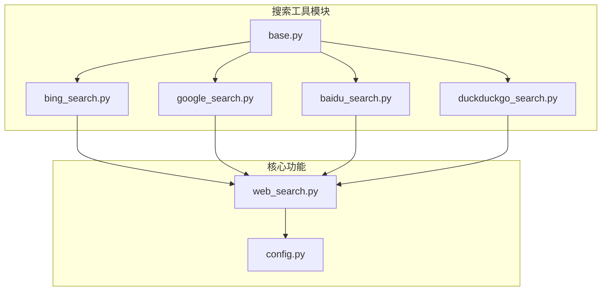
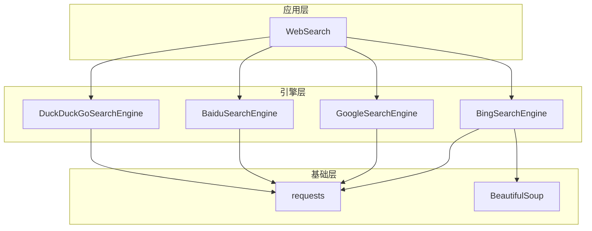
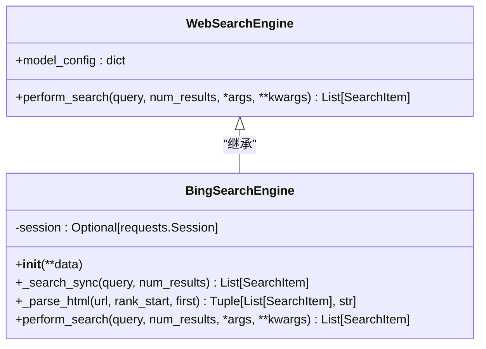
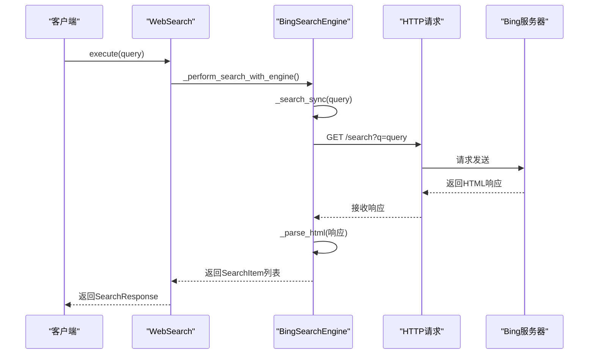
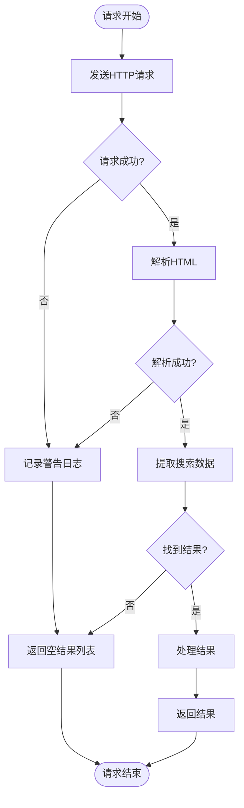
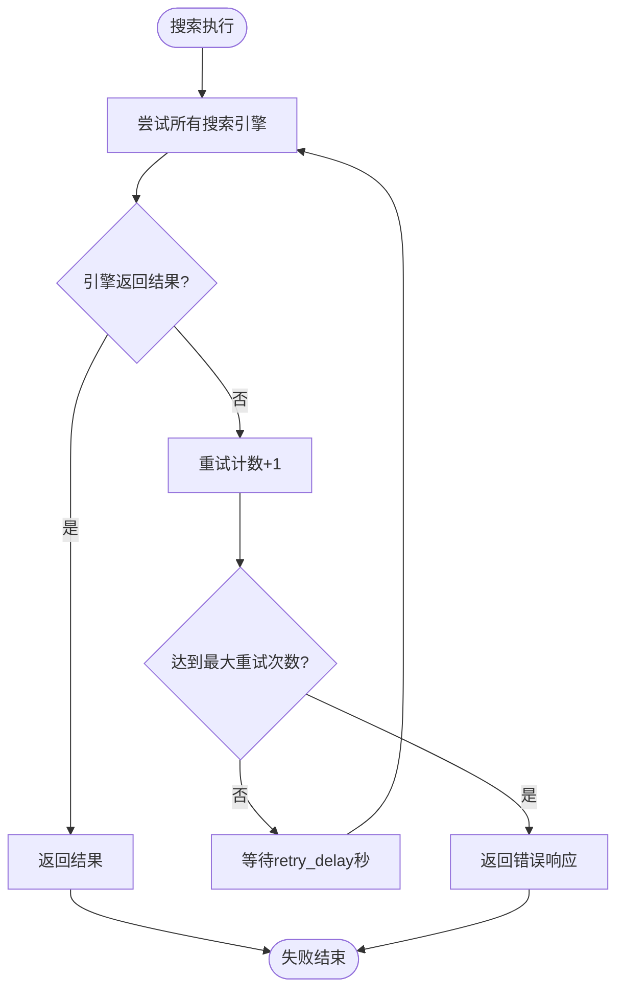
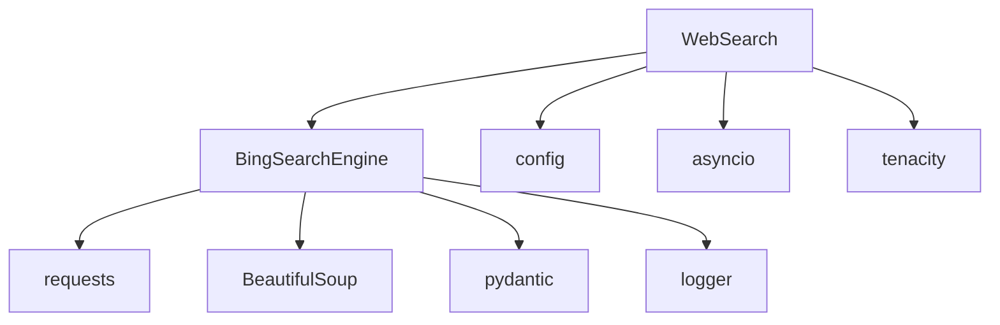

# Bing搜索实现

<cite>
**Referenced Files in This Document**   
- [bing_search.py](file://app/tool/search/bing_search.py)
- [base.py](file://app/tool/search/base.py)
- [web_search.py](file://app/tool/web_search.py)
- [config.py](file://app/config.py)
</cite>

## 目录
1. [简介](#简介)
2. [项目结构](#项目结构)
3. [核心组件](#核心组件)
4. [架构概述](#架构概述)
5. [详细组件分析](#详细组件分析)
6. [依赖分析](#依赖分析)
7. [性能考虑](#性能考虑)
8. [故障排除指南](#故障排除指南)
9. [结论](#结论)

## 简介
本文档深入分析了BingSearchEngine类的具体实现机制，详细说明其如何集成Bing搜索API，处理请求配额管理、错误处理和响应解析。文档解释了perform_search方法中对Bing API端点的调用流程，包括查询参数设置、结果过滤和SearchItem转换逻辑。同时讨论了该实现与BaseSearch接口的兼容性设计，以及在企业级应用中的可靠性保障措施。

## 项目结构
Bing搜索功能位于`app/tool/search/`目录下，作为搜索工具模块的一部分。该实现与其他搜索引擎（如Google、Baidu、DuckDuckGo）并列，遵循统一的接口规范。核心文件`bing_search.py`实现了Bing特定的搜索逻辑，而`base.py`定义了所有搜索引擎共享的基础模型和接口。



**Diagram sources**
- [bing_search.py](file://app/tool/search/bing_search.py)
- [base.py](file://app/tool/search/base.py)
- [web_search.py](file://app/tool/web_search.py)
- [config.py](file://app/config.py)

**Section sources**
- [bing_search.py](file://app/tool/search/bing_search.py)
- [base.py](file://app/tool/search/base.py)

## 核心组件
BingSearchEngine类是Bing搜索功能的核心实现，它继承自WebSearchEngine基类，实现了perform_search方法。该类通过HTTP请求直接与Bing搜索页面交互，解析HTML响应来提取搜索结果。SearchItem模型用于标准化搜索结果的表示，确保与其他搜索引擎的输出格式一致。

**Section sources**
- [bing_search.py](file://app/tool/search/bing_search.py#L37-L143)
- [base.py](file://app/tool/search/base.py#L5-L16)

## 架构概述
Bing搜索实现采用分层架构，上层由WebSearch工具协调多个搜索引擎，中层是BingSearchEngine的具体实现，底层依赖requests库进行HTTP通信和BeautifulSoup进行HTML解析。这种设计实现了搜索引擎的可插拔性，允许系统在主引擎失败时自动切换到备用引擎。



**Diagram sources**
- [web_search.py](file://app/tool/web_search.py#L192-L197)
- [bing_search.py](file://app/tool/search/bing_search.py#L37-L143)

## 详细组件分析

### BingSearchEngine分析
BingSearchEngine类通过模拟浏览器行为与Bing搜索服务交互，避免了使用官方API的复杂认证和配额限制。该实现直接解析Bing搜索结果页面的HTML结构，提取关键信息并转换为标准化格式。

#### 类结构与继承关系


**Diagram sources**
- [bing_search.py](file://app/tool/search/bing_search.py#L37-L143)
- [base.py](file://app/tool/search/base.py#L19-L39)

#### 搜索执行流程


**Diagram sources**
- [web_search.py](file://app/tool/web_search.py#L389-L407)
- [bing_search.py](file://app/tool/search/bing_search.py#L46-L74)

#### 结果解析逻辑
```mermaid
flowchart TD
Start([开始解析HTML]) --> FindResults["查找id='b_results'的ol元素"]
FindResults --> ResultsFound{"结果元素存在?"}
ResultsFound --> |否| ReturnEmpty["返回空结果"]
ResultsFound --> |是| ProcessLi["遍历每个li.b_algo元素"]
ProcessLi --> ExtractTitle["提取h2中的标题"]
ProcessLi --> ExtractUrl["提取a标签的href"]
ProcessLi --> ExtractAbstract["提取p标签的摘要"]
ExtractAbstract --> CheckLength{"摘要长度>300?"}
CheckLength --> |是| Truncate["截断至300字符"]
CheckLength --> |否| KeepOriginal["保留原文"]
Truncate --> CreateItem
KeepOriginal --> CreateItem
CreateItem["创建SearchItem对象"] --> AddToList["添加到结果列表"]
AddToList --> NextLi{"还有更多li元素?"}
NextLi --> |是| ProcessLi
NextLi --> |否| FindNext["查找\"下一页\"链接"]
FindNext --> HasNext{"存在下一页?"}
HasNext --> |是| ReturnWithNext["返回结果和下一页URL"]
HasNext --> |否| ReturnWithoutNext["返回结果和空URL"]
ReturnWithNext --> End([结束])
ReturnWithoutNext --> End
ReturnEmpty --> End
```

**Diagram sources**
- [bing_search.py](file://app/tool/search/bing_search.py#L76-L133)

### 错误处理与速率限制
Bing搜索实现通过多层机制保障可靠性。在单个请求层面，使用try-catch块捕获HTML解析异常；在系统层面，WebSearch工具通过重试机制和备用引擎策略处理服务不可用情况。

#### 错误处理流程


**Diagram sources**
- [bing_search.py](file://app/tool/search/bing_search.py#L105-L143)

#### 速率限制与重试策略


**Diagram sources**
- [web_search.py](file://app/tool/web_search.py#L200-L239)
- [web_search.py](file://app/tool/web_search.py#L271-L304)

**Section sources**
- [bing_search.py](file://app/tool/search/bing_search.py#L105-L143)
- [web_search.py](file://app/tool/web_search.py#L200-L304)
- [config.py](file://app/config.py#L100-L115)

## 依赖分析
Bing搜索实现依赖于多个外部库和内部模块。主要依赖包括requests用于HTTP通信，BeautifulSoup用于HTML解析，以及pydantic用于数据模型验证。这些依赖通过清晰的接口隔离，确保了代码的可维护性和可测试性。



**Diagram sources**
- [bing_search.py](file://app/tool/search/bing_search.py)
- [web_search.py](file://app/tool/web_search.py)

**Section sources**
- [bing_search.py](file://app/tool/search/bing_search.py)
- [web_search.py](file://app/tool/web_search.py)

## 性能考虑
Bing搜索实现通过会话复用和连接池优化网络性能。BingSearchEngine在初始化时创建requests.Session对象，该会话对象会自动管理TCP连接，支持HTTP Keep-Alive，减少了重复建立连接的开销。此外，通过限制摘要长度（ABSTRACT_MAX_LENGTH=300）和合理设置用户代理，优化了数据传输和处理效率。

## 故障排除指南
当Bing搜索功能出现问题时，应首先检查网络连接和Bing服务状态。查看日志中的警告信息可以定位HTML解析失败的具体原因。如果持续失败，系统会自动尝试备用搜索引擎。配置文件中的search_config参数（如retry_delay和max_retries）可以根据实际需求调整重试策略。

**Section sources**
- [bing_search.py](file://app/tool/search/bing_search.py#L105-L143)
- [web_search.py](file://app/tool/web_search.py#L271-L304)
- [config.py](file://app/config.py#L100-L115)

## 结论
BingSearchEngine实现了一个稳健的Bing搜索集成方案，通过直接解析搜索结果页面而非使用官方API，避免了API密钥管理和配额限制问题。该实现与系统中的其他搜索引擎保持接口一致，支持无缝切换和故障转移。通过分层错误处理和重试机制，确保了在企业级应用中的高可用性和可靠性。未来可考虑增加缓存机制以进一步优化性能和减少对Bing服务的请求压力。