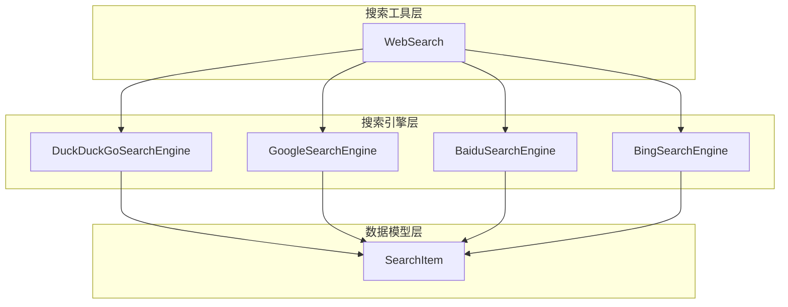
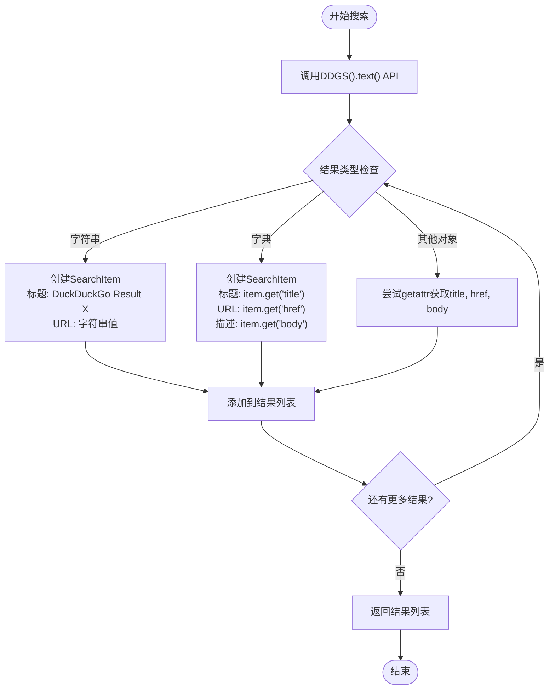
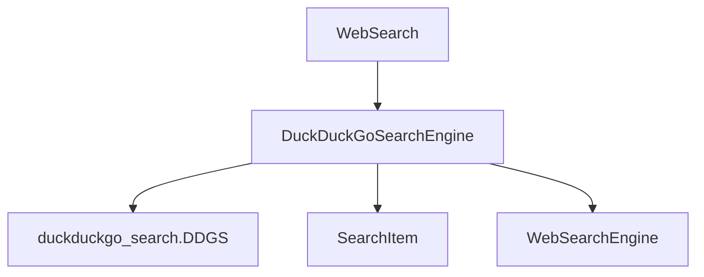

# DuckDuckGo搜索实现

<cite>
**Referenced Files in This Document**   
- [duckduckgo_search.py](file://app/tool/search/duckduckgo_search.py)
- [base.py](file://app/tool/search/base.py)
- [web_search.py](file://app/tool/web_search.py)
- [__init__.py](file://app/tool/search/__init__.py)
</cite>

## 目录
1. [简介](#简介)
2. [核心组件](#核心组件)
3. [架构概述](#架构概述)
4. [详细组件分析](#详细组件分析)
5. [依赖分析](#依赖分析)
6. [性能考量](#性能考量)
7. [故障排除指南](#故障排除指南)
8. [结论](#结论)

## 简介
本文档深入分析了DuckDuckGoSearchEngine类的具体实现机制。该类作为OpenManus项目中Web搜索功能的一部分，实现了通过DuckDuckGo的公开API进行无追踪搜索的能力。文档详细说明了其如何处理轻量级请求和隐私保护特性，解释了perform_search方法中对即时答案（Instant Answers）和常规搜索结果的整合逻辑，并讨论了该实现在注重隐私保护的应用场景中的适用性和性能特点。

## 核心组件

DuckDuckGoSearchEngine类是本实现的核心，它继承自WebSearchEngine基类，实现了perform_search方法以执行具体的搜索操作。该类利用duckduckgo_search库的DDGS接口与DuckDuckGo服务进行通信，获取原始搜索结果，并将其转换为统一的SearchItem对象列表。SearchItem类定义了搜索结果的标准数据结构，包含标题、URL和描述三个核心字段。

**Section sources**
- [duckduckgo_search.py](file://app/tool/search/duckduckgo_search.py#L7-L56)
- [base.py](file://app/tool/search/base.py#L5-L16)

## 架构概述

整个搜索功能的架构采用分层设计模式。顶层是WebSearch工具类，负责协调整个搜索流程，包括参数处理、引擎选择和结果聚合。中间层是具体的搜索引擎实现，如DuckDuckGoSearchEngine、GoogleSearchEngine等，它们各自封装了与特定搜索引擎交互的逻辑。底层是SearchItem数据模型，为所有搜索引擎提供统一的结果表示。

**Diagram sources **
- [web_search.py](file://app/tool/web_search.py#L158-L198)
- [duckduckgo_search.py](file://app/tool/search/duckduckgo_search.py#L7-L56)
- [base.py](file://app/tool/search/base.py#L5-L16)

## 详细组件分析

### DuckDuckGoSearchEngine 分析

DuckDuckGoSearchEngine类的实现机制主要体现在其perform_search方法中。该方法首先调用DDGS().text()接口向DuckDuckGo发起搜索请求，获取原始结果。原始结果可能以字符串、字典或对象的形式返回，因此方法中包含了对这三种类型的处理逻辑。

**Diagram sources **
- [duckduckgo_search.py](file://app/tool/search/duckduckgo_search.py#L16-L56)

**Section sources**
- [duckduckgo_search.py](file://app/tool/search/duckduckgo_search.py#L7-L56)

### 整合逻辑分析

perform_search方法中的整合逻辑设计得非常健壮，能够处理DuckDuckGo API返回的各种数据格式。对于字典类型的响应，它会提取"title"、"href"和"body"字段，这些字段分别对应搜索结果的标题、链接和摘要。这种设计确保了即使API响应格式发生变化，只要关键字段存在，就能成功解析并转换为标准的SearchItem对象。

**Section sources**
- [duckduckgo_search.py](file://app/tool/search/duckduckgo_search.py#L30-L44)

## 依赖分析

DuckDuckGoSearchEngine的实现依赖于多个外部和内部组件。外部依赖主要是duckduckgo_search库，它提供了与DuckDuckGo API通信的接口。内部依赖包括SearchItem数据模型和WebSearchEngine基类，前者定义了结果的结构，后者规定了所有搜索引擎必须实现的接口。

**Diagram sources **
- [duckduckgo_search.py](file://app/tool/search/duckduckgo_search.py#L1-L56)
- [base.py](file://app/tool/search/base.py#L5-L16)

**Section sources**
- [duckduckgo_search.py](file://app/tool/search/duckduckgo_search.py#L1-L56)
- [base.py](file://app/tool/search/base.py#L5-L16)
- [web_search.py](file://app/tool/web_search.py#L158-L198)

## 性能考量

DuckDuckGoSearchEngine的性能特点主要体现在其轻量级和异步兼容性上。由于使用了第三方库进行API调用，避免了直接解析HTML的开销，使得请求处理非常高效。此外，该实现被设计为可在异步环境中运行，通过WebSearch工具类的_execute_with_engine方法在执行器中运行，从而不会阻塞主事件循环，适合在高并发的应用场景中使用。

## 故障排除指南

当DuckDuckGo搜索功能出现问题时，应首先检查duckduckgo_search库是否正确安装和配置。其次，验证网络连接是否正常，因为该实现依赖于外部API调用。如果返回结果为空或格式异常，可能是API响应格式发生了变化，需要检查perform_search方法中的解析逻辑是否仍然适用。

**Section sources**
- [duckduckgo_search.py](file://app/tool/search/duckduckgo_search.py#L16-L56)
- [web_search.py](file://app/tool/web_search.py#L373-L417)

## 结论

DuckDuckGoSearchEngine的实现充分利用了DuckDuckGo的隐私保护特性，通过其公开API实现了无追踪搜索。其设计简洁而健壮，能够处理多种响应格式，并通过统一的SearchItem模型与其他搜索引擎保持接口一致性。该实现在注重用户隐私的应用场景中具有很高的适用性，同时其轻量级和异步友好的特性也保证了良好的性能表现。