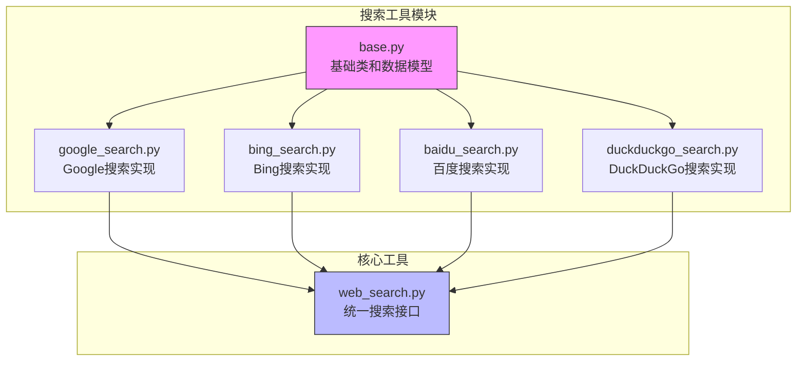
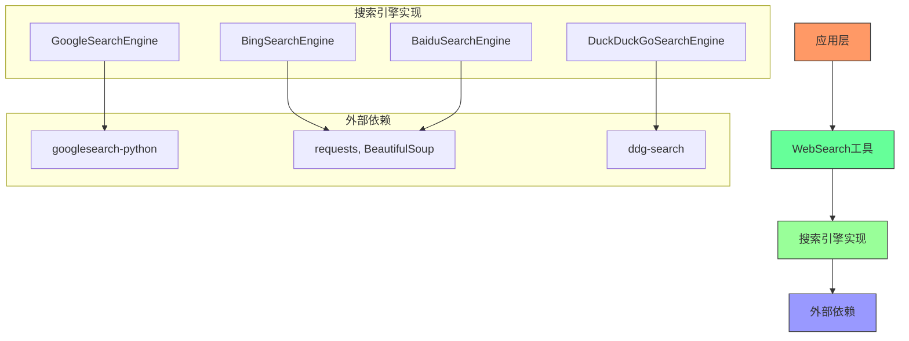
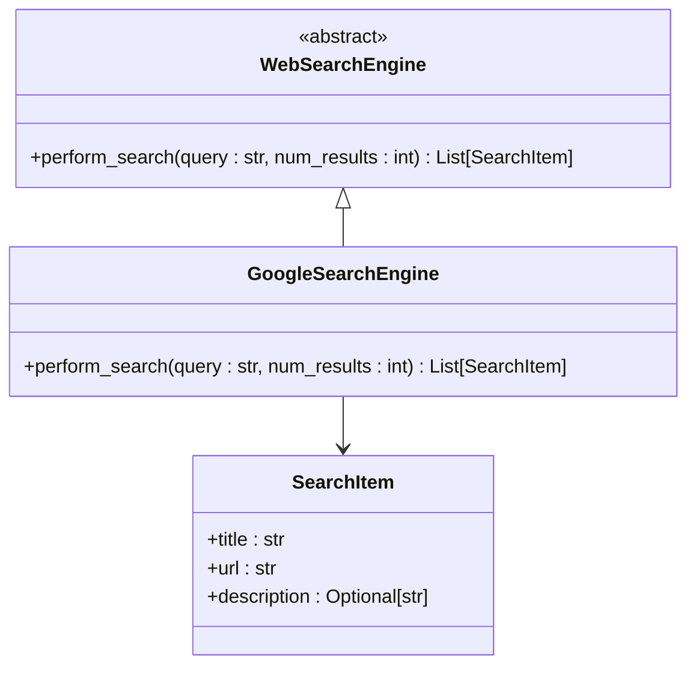
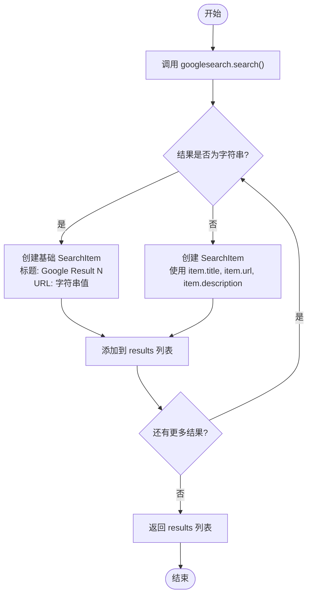
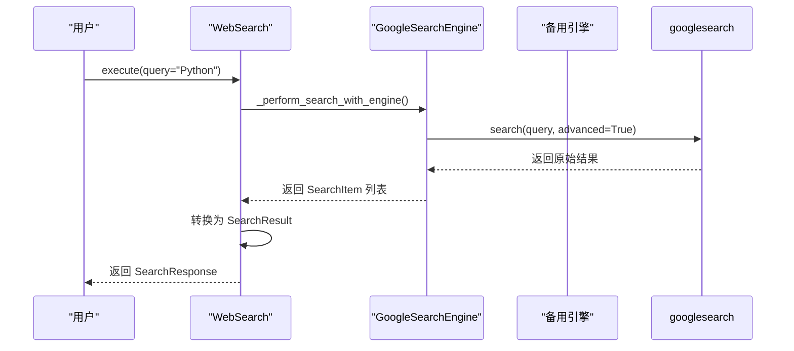
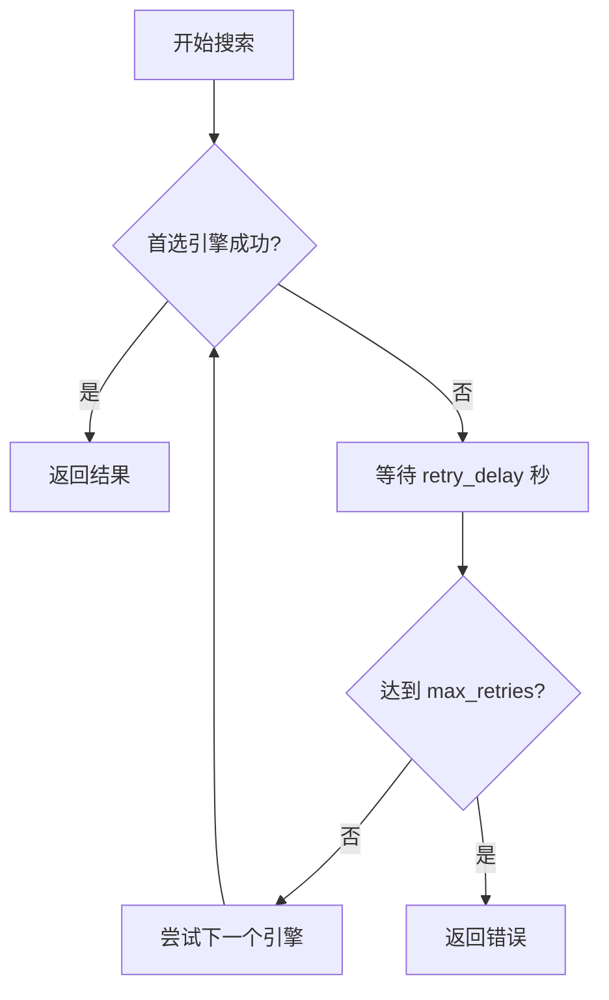
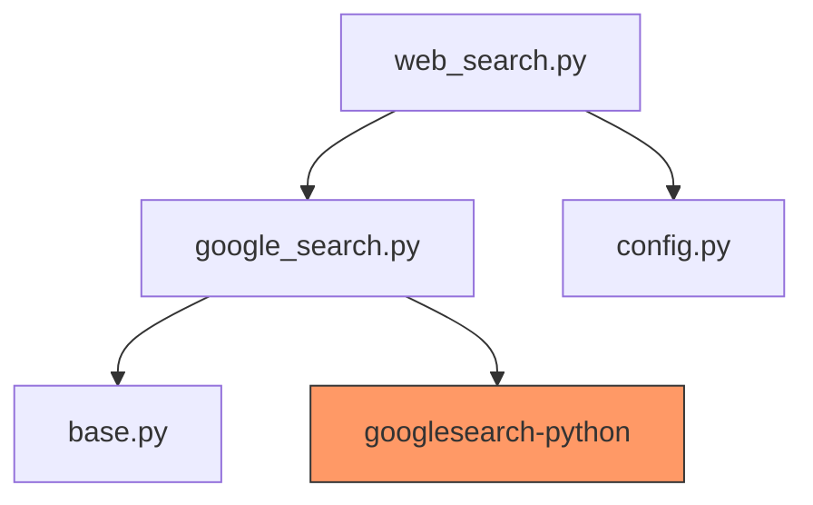

# Google搜索实现

<cite>
**Referenced Files in This Document**   
- [google_search.py](file://app/tool/search/google_search.py)
- [base.py](file://app/tool/search/base.py)
- [web_search.py](file://app/tool/web_search.py)
- [config.py](file://app/config.py)
- [setup.py](file://setup.py)
</cite>

## 目录
1. [简介](#简介)
2. [项目结构](#项目结构)
3. [核心组件](#核心组件)
4. [架构概述](#架构概述)
5. [详细组件分析](#详细组件分析)
6. [依赖分析](#依赖分析)
7. [性能考虑](#性能考虑)
8. [故障排除指南](#故障排除指南)
9. [结论](#结论)

## 简介
本文档深入分析了OpenManus项目中GoogleSearchEngine类的具体实现机制。该实现通过第三方库与Google搜索服务进行交互，提供了一种无需直接处理复杂网页抓取和反爬虫机制的搜索解决方案。文档详细说明了其如何通过googlesearch-python库与Google搜索交互，解释了perform_search方法的实现逻辑，包括查询参数构造、结果处理和SearchItem对象生成过程。同时，讨论了该实现与WebSearchEngine基类的接口一致性，以及在高并发场景下的错误重试机制。

## 项目结构
OpenManus项目的搜索功能被组织在`app/tool/search/`目录下，采用模块化设计，每个搜索引擎都有独立的实现文件。这种结构使得添加新的搜索引擎或修改现有实现变得简单而直观。

**Diagram sources**
- [google_search.py](file://app/tool/search/google_search.py)
- [base.py](file://app/tool/search/base.py)
- [web_search.py](file://app/tool/web_search.py)

**Section sources**
- [google_search.py](file://app/tool/search/google_search.py)
- [base.py](file://app/tool/search/base.py)

## 核心组件
Google搜索功能的核心组件包括`GoogleSearchEngine`类，它继承自`WebSearchEngine`基类，并实现了`perform_search`方法。该类利用`googlesearch-python`库来执行实际的搜索操作，避免了直接的网页抓取和复杂的HTML解析。`SearchItem`模型用于标准化搜索结果的输出格式，确保不同搜索引擎返回的数据具有一致的结构。`WebSearch`工具类作为统一的入口点，负责协调不同搜索引擎的调用和结果聚合。

**Section sources**
- [google_search.py](file://app/tool/search/google_search.py#L7-L32)
- [base.py](file://app/tool/search/base.py#L5-L16)

## 架构概述
系统的搜索架构采用分层设计，从上到下分为工具接口层、搜索引擎实现层和外部依赖层。`WebSearch`工具类位于最上层，为外部提供统一的搜索接口。中间层由多个具体的搜索引擎实现类组成，如`GoogleSearchEngine`、`BingSearchEngine`等，它们都实现了`WebSearchEngine`接口。最底层是外部依赖，如`googlesearch-python`库，负责与搜索引擎的API或网页进行实际交互。

**Diagram sources**
- [web_search.py](file://app/tool/web_search.py#L158-L198)
- [google_search.py](file://app/tool/search/google_search.py#L7-L32)
- [bing_search.py](file://app/tool/search/bing_search.py#L37-L143)

## 详细组件分析

### GoogleSearchEngine 实现分析
`GoogleSearchEngine`类的实现相对简洁，它通过封装`googlesearch-python`库来提供Google搜索功能。这种方法避免了直接处理Google复杂的反爬虫机制和JavaScript渲染问题，降低了实现的复杂性。

#### 类结构与继承关系

**Diagram sources**
- [google_search.py](file://app/tool/search/google_search.py#L7-L32)
- [base.py](file://app/tool/search/base.py#L19-L39)

#### perform_search 方法执行流程
`perform_search`方法的执行流程清晰明了，主要分为三个步骤：调用外部库执行搜索、处理原始结果、格式化输出。

**Diagram sources**
- [google_search.py](file://app/tool/search/google_search.py#L8-L32)

**Section sources**
- [google_search.py](file://app/tool/search/google_search.py#L8-L32)

### WebSearch 工具协调机制
`WebSearch`工具类负责协调多个搜索引擎的调用，提供了更高级的功能，如失败重试和内容提取。

#### 搜索引擎调用序列
当执行搜索时，`WebSearch`会按照配置的优先级顺序尝试不同的搜索引擎。

**Diagram sources**
- [web_search.py](file://app/tool/web_search.py#L200-L287)
- [google_search.py](file://app/tool/search/google_search.py#L8-L32)

#### 错误重试与回退机制
系统实现了稳健的错误处理机制，当首选搜索引擎失败时，会自动尝试备用引擎。

**Diagram sources**
- [web_search.py](file://app/tool/web_search.py#L200-L239)
- [config.py](file://app/config.py#L100-L117)

## 依赖分析
Google搜索功能的实现依赖于多个内部和外部组件。内部依赖包括`WebSearchEngine`基类和`SearchItem`数据模型，确保了代码的可维护性和一致性。外部依赖主要是`googlesearch-python`库，它封装了与Google搜索的交互细节。

**Diagram sources**
- [google_search.py](file://app/tool/search/google_search.py)
- [setup.py](file://setup.py#L31)
- [config.py](file://app/config.py)

**Section sources**
- [google_search.py](file://app/tool/search/google_search.py)
- [setup.py](file://setup.py#L31)

## 性能考虑
虽然`GoogleSearchEngine`的实现本身不直接处理高并发问题，但其性能受到外部库和Google服务的限制。由于使用了同步的`googlesearch`库，大量并发请求可能会导致性能瓶颈。建议在高并发场景下使用异步的搜索引擎实现，如`BingSearchEngine`，或者实现请求队列和速率限制来保护服务。

## 故障排除指南
当Google搜索功能出现问题时，可以按照以下步骤进行排查：

1. **检查依赖安装**：确保`googlesearch-python`库已正确安装。
2. **验证网络连接**：确认运行环境可以访问Google服务。
3. **检查配置**：查看`config.toml`中的搜索引擎配置是否正确。
4. **查看日志**：检查应用日志中是否有相关的错误信息。
5. **测试备用引擎**：如果Google搜索失败，系统会自动尝试备用引擎，这可以作为临时解决方案。

**Section sources**
- [config.py](file://app/config.py#L100-L117)
- [web_search.py](file://app/tool/web_search.py#L200-L287)

## 结论
`GoogleSearchEngine`类通过巧妙地利用第三方库`googlesearch-python`，提供了一种简单而有效的Google搜索集成方案。这种设计避免了复杂的网页抓取和反爬虫对抗，降低了开发和维护成本。然而，它也依赖于外部库的稳定性和Google服务的可用性。对于需要更高可靠性和性能的应用，建议考虑使用官方API或更复杂的网页抓取技术。