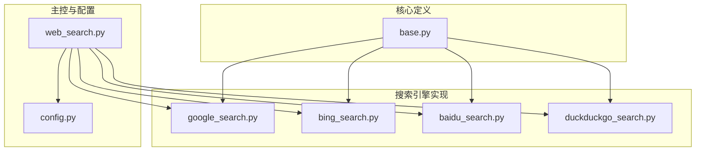
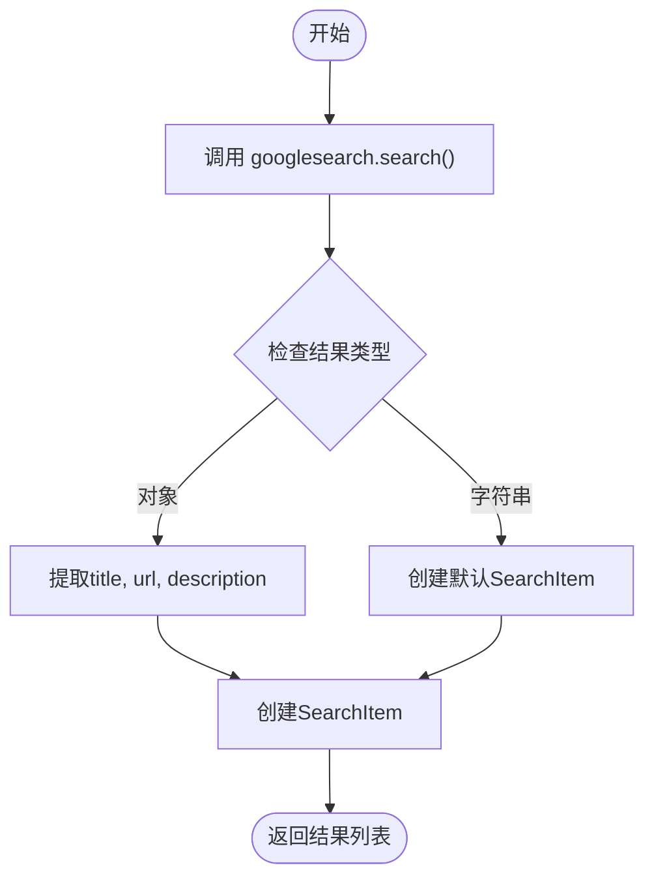
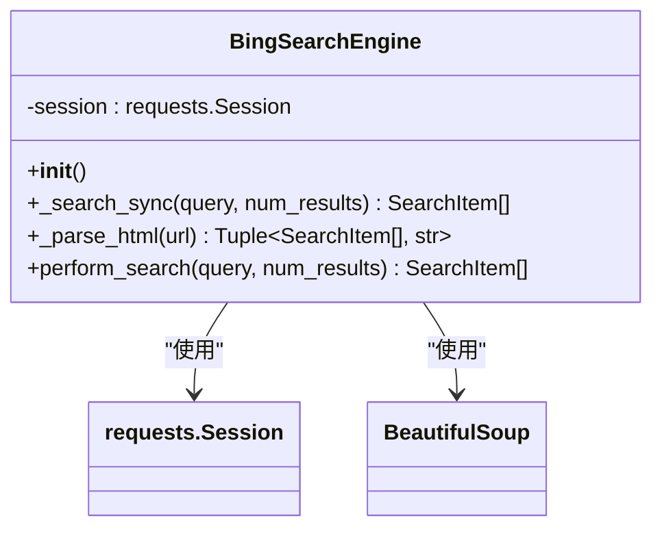
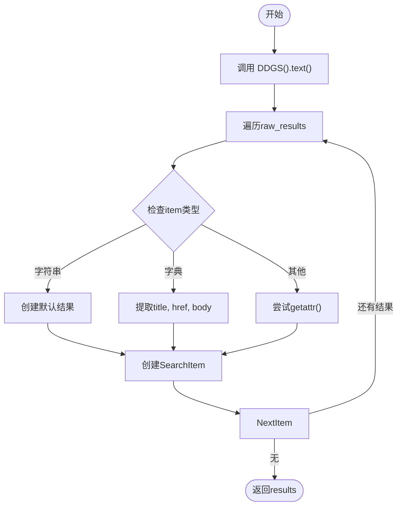
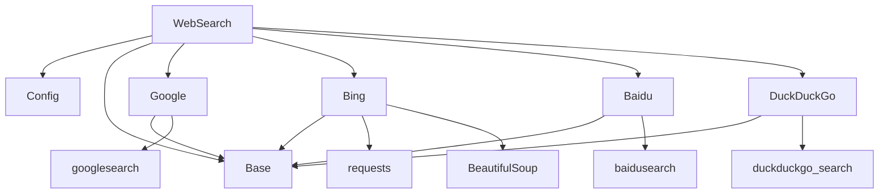

# 搜索引擎实现

<cite>
**本文档中引用的文件**  
- [base.py](file://app/tool/search/base.py)
- [google_search.py](file://app/tool/search/google_search.py)
- [bing_search.py](file://app/tool/search/bing_search.py)
- [baidu_search.py](file://app/tool/search/baidu_search.py)
- [duckduckgo_search.py](file://app/tool/search/duckduckgo_search.py)
- [web_search.py](file://app/tool/web_search.py)
- [config.py](file://app/config.py)
- [config.example.toml](file://config/config.example.toml)
</cite>

## 目录
1. [简介](#简介)
2. [项目结构](#项目结构)
3. [核心组件](#核心组件)
4. [架构概述](#架构概述)
5. [详细组件分析](#详细组件分析)
6. [依赖分析](#依赖分析)
7. [性能考量](#性能考量)
8. [故障排除指南](#故障排除指南)
9. [结论](#结论)

## 简介
本文档深入分析了 OpenManus 项目中集成的主流搜索引擎（Google、Bing、百度、DuckDuckGo）的具体实现机制。文档详细说明了每个搜索引擎如何适配其私有 API 或网页抓取策略，处理认证、请求频率限制和响应解析。通过对比各实现的差异，如百度搜索对中国本地化内容的支持、Google 搜索的高级查询参数处理、Bing 的网页抓取方式等，揭示了不同引擎的技术特点。文档还提供了实际代码片段展示每个引擎如何重写 `perform_search` 方法并处理特定错误类型，解释了各实现如何保持与 `BaseSearch` 接口的一致性，同时处理各自特有的异常情况和数据格式。最后，讨论了选择特定搜索引擎的适用场景和性能考量。

## 项目结构
项目中的搜索引擎功能主要集中在 `app/tool/search` 目录下，该目录包含了所有搜索引擎的具体实现。每个搜索引擎（Google、Bing、百度、DuckDuckGo）都有独立的 Python 文件（`google_search.py`、`bing_search.py`、`baidu_search.py`、`duckduckgo_search.py`），这些文件实现了统一的 `WebSearchEngine` 基类。`base.py` 文件定义了搜索结果的数据模型 `SearchItem` 和所有搜索引擎必须继承的抽象基类 `WebSearchEngine`。`web_search.py` 文件则作为统一的入口工具，负责协调和调用这些具体的搜索引擎实现。`config.py` 和配置文件（如 `config.example.toml`）定义了搜索引擎的全局配置，如默认引擎、备用引擎列表、语言和国家代码等。



**图示来源**
- [base.py](file://app/tool/search/base.py)
- [google_search.py](file://app/tool/search/google_search.py)
- [bing_search.py](file://app/tool/search/bing_search.py)
- [baidu_search.py](file://app/tool/search/baidu_search.py)
- [duckduckgo_search.py](file://app/tool/search/duckduckgo_search.py)
- [web_search.py](file://app/tool/web_search.py)
- [config.py](file://app/config.py)

**章节来源**
- [app/tool/search](file://app/tool/search)

## 核心组件
本系统的核心组件是 `WebSearchEngine` 基类和其四个具体实现：`GoogleSearchEngine`、`BingSearchEngine`、`BaiduSearchEngine` 和 `DuckDuckGoSearchEngine`。`WebSearchEngine` 定义了所有搜索引擎必须实现的 `perform_search` 方法接口，确保了行为的一致性。`SearchItem` 模型则标准化了搜索结果的结构，包含标题、URL 和描述。`WebSearch` 工具类是用户与搜索引擎交互的统一接口，它封装了引擎选择、失败重试、内容抓取等复杂逻辑，对外提供一个简洁的 `execute` 方法。

**章节来源**
- [base.py](file://app/tool/search/base.py#L19-L39)
- [web_search.py](file://app/tool/web_search.py#L158-L198)

## 架构概述
系统的整体架构遵循了策略模式和依赖注入原则。`WebSearch` 类在初始化时，会创建所有可用搜索引擎（Google、Bing、百度、DuckDuckGo）的实例，并将它们存储在一个字典中。当执行搜索时，`WebSearch` 会根据配置文件（`config.py`）中定义的首选引擎和备用引擎顺序，依次尝试调用各个引擎的 `perform_search` 方法。如果某个引擎返回了有效结果，则立即返回；如果所有引擎都失败，则会根据配置的重试次数和延迟进行重试。这种设计实现了引擎间的无缝切换和高可用性。

```mermaid
sequenceDiagram
participant User as "用户"
participant WebSearch as "WebSearch"
participant Config as "配置"
participant Engine as "搜索引擎"
User->>WebSearch : execute(query="Python")
WebSearch->>Config : 获取引擎顺序
loop 尝试每个引擎
WebSearch->>Engine : perform_search(query, num_results)
alt 成功
Engine-->>WebSearch : 返回SearchItem列表
break 返回结果
else 失败
WebSearch->>WebSearch : 记录失败，尝试下一个
end
end
WebSearch->>User : 返回SearchResponse
```

**图示来源**
- [web_search.py](file://app/tool/web_search.py#L200-L304)
- [config.py](file://app/config.py#L38-L65)

## 详细组件分析

### Google 搜索引擎分析
`GoogleSearchEngine` 使用了 `googlesearch` 第三方库来执行搜索。其 `perform_search` 方法调用该库的 `search` 函数，并设置 `advanced=True` 以获取包含标题、URL 和描述的丰富结果。对于返回的每个结果项，它会检查其类型：如果是字符串（仅URL），则创建一个带有默认标题的 `SearchItem`；如果是包含详细信息的对象，则直接提取其属性并创建 `SearchItem`。这种方法简单高效，但依赖于第三方库的稳定性和可用性。



**图示来源**
- [google_search.py](file://app/tool/search/google_search.py#L8-L32)

**章节来源**
- [google_search.py](file://app/tool/search/google_search.py#L7-L32)

### Bing 搜索引擎分析
`BingSearchEngine` 采用网页抓取（Web Scraping）的方式，直接向 Bing 的搜索 URL 发送 HTTP 请求，并使用 `BeautifulSoup` 解析返回的 HTML 页面。它维护了一个 `requests.Session` 对象来管理会话和请求头，模拟真实浏览器行为以避免被反爬虫机制拦截。`_parse_html` 方法负责解析 HTML，定位搜索结果列表（`ol#b_results`），并遍历每个结果项（`li.b_algo`）来提取标题、链接和摘要。它还实现了分页逻辑，通过解析“下一页”按钮的链接来获取更多结果。这种方法不依赖官方 API，但对网页结构的变化非常敏感。



**图示来源**
- [bing_search.py](file://app/tool/search/bing_search.py#L37-L143)

**章节来源**
- [bing_search.py](file://app/tool/search/bing_search.py#L37-L143)

### 百度搜索引擎分析
`BaiduSearchEngine` 使用了 `baidusearch` 第三方库。其 `perform_search` 方法的实现与其他引擎类似，但特别之处在于它对返回结果的处理更为灵活。它能处理三种类型的结果：纯字符串（URL）、字典（包含 title, url, abstract）和具有属性的对象。这种设计增强了代码的健壮性，能够适应库返回格式的微小变化。对于字典类型，它使用 `get` 方法安全地提取值，并为摘要（abstract）字段提供默认值 `None`，这体现了对中国本地化内容和数据格式的适配。

```mermaid
flowchart TD
A[调用 baidusearch.search()] --> B{结果类型?}
B --> |字符串| C[创建默认SearchItem]
B --> |字典| D[使用get()提取title/url/abstract]
B --> |对象| E[使用getattr()提取属性]
C --> F[添加到结果列表]
D --> F
E --> F
F --> G[返回结果列表]
```

**图示来源**
- [baidu_search.py](file://app/tool/search/baidu_search.py#L8-L53)

**章节来源**
- [baidu_search.py](file://app/tool/search/baidu_search.py#L7-L53)

### DuckDuckGo 搜索引擎分析
`DuckDuckGoSearchEngine` 使用了 `duckduckgo_search` 库的 `DDGS().text()` 方法。与 Google 和百度类似，它也对返回结果进行了类型检查和安全提取。一个关键的差异在于，它从字典中提取的字段名是 `href` 和 `body`，而不是 `url` 和 `description`，这反映了 DuckDuckGo API 的响应格式。这种实现方式展示了如何根据特定搜索引擎的 API 文档来调整数据解析逻辑。



**图示来源**
- [duckduckgo_search.py](file://app/tool/search/duckduckgo_search.py#L8-L56)

**章节来源**
- [duckduckgo_search.py](file://app/tool/search/duckduckgo_search.py#L7-L56)

## 依赖分析
系统依赖关系清晰，层次分明。`WebSearch` 工具是顶层组件，它直接依赖于 `config.py` 获取配置，并依赖于 `base.py` 中定义的 `SearchItem` 和 `WebSearchEngine` 接口。四个具体的搜索引擎实现（`google_search.py` 等）都依赖于 `base.py` 来继承 `WebSearchEngine` 基类。此外，它们还依赖于各自的第三方库（`googlesearch`, `baidusearch`, `duckduckgo_search`），而 `BingSearchEngine` 则直接依赖于 `requests` 和 `BeautifulSoup` 进行底层的 HTTP 通信和 HTML 解析。这种设计将核心逻辑与具体实现解耦，便于维护和扩展。



**图示来源**
- [web_search.py](file://app/tool/web_search.py#L158-L198)
- [google_search.py](file://app/tool/search/google_search.py#L1-L34)
- [bing_search.py](file://app/tool/search/bing_search.py#L1-L145)
- [baidu_search.py](file://app/tool/search/baidu_search.py#L1-L55)
- [duckduckgo_search.py](file://app/tool/search/duckduckgo_search.py#L1-L58)

**章节来源**
- [web_search.py](file://app/tool/web_search.py#L158-L198)

## 性能考量
性能考量主要体现在三个方面：请求延迟、失败重试和内容抓取。直接使用 API 的引擎（Google、百度、DuckDuckGo）通常比网页抓取（Bing）更快，因为后者需要下载和解析完整的 HTML 页面。`WebSearch` 类内置了重试机制（`max_retries` 和 `retry_delay`），在所有引擎都失败时会暂停并重试，这增加了搜索的鲁棒性，但也可能显著增加总耗时。可选的 `fetch_content` 功能会为每个搜索结果发起额外的 HTTP 请求来抓取页面内容，这极大地增加了网络 I/O 开销，应谨慎使用。选择搜索引擎时，应权衡速度、准确性和功能需求。

## 故障排除指南
常见的故障包括搜索引擎返回空结果、第三方库调用失败或网络连接问题。系统通过日志记录（`logger`）来帮助诊断问题，例如 `BingSearchEngine` 会在 HTML 解析出错时发出警告。`WebSearch` 的失败重试和备用引擎机制是主要的容错手段。如果首选引擎（如 Google）因网络问题无法访问，系统会自动切换到配置的备用引擎（如 DuckDuckGo）。开发者应检查 `config.toml` 文件中的 `engine` 和 `fallback_engines` 配置是否正确，并确保所有第三方库已正确安装。对于网页抓取类引擎（Bing），还需注意其对 User-Agent 和请求头的依赖，这些设置在 `HEADERS` 常量中定义。

**章节来源**
- [web_search.py](file://app/tool/web_search.py#L271-L304)
- [bing_search.py](file://app/tool/search/bing_search.py#L100-L110)

## 结论
OpenManus 项目通过一个精心设计的模块化架构，成功集成了多个主流搜索引擎。通过定义统一的 `WebSearchEngine` 接口和 `SearchItem` 数据模型，系统实现了不同搜索引擎实现之间的互换性。每个引擎根据其特性（API 或网页抓取）采用了不同的实现策略，同时 `WebSearch` 工具提供了统一的入口、失败重试和内容抓取等高级功能。这种设计既保证了灵活性，又提供了高可用性。在选择搜索引擎时，可以根据具体需求进行权衡：Google 和 DuckDuckGo 适合追求隐私和速度的通用搜索；Bing 的网页抓取方式提供了更大的控制力但稳定性稍差；百度则是获取中文和中国本地化内容的最佳选择。