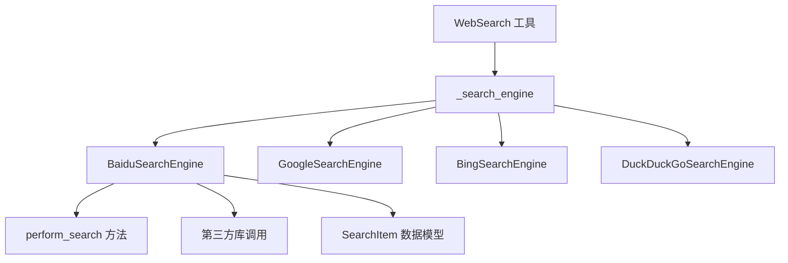
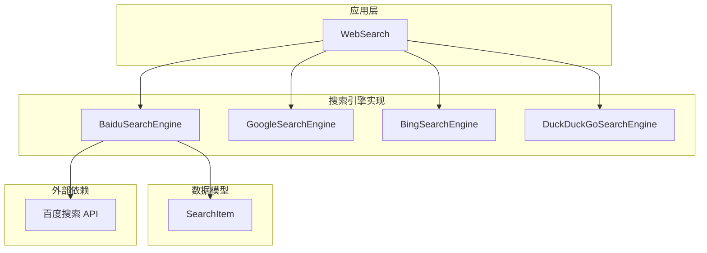
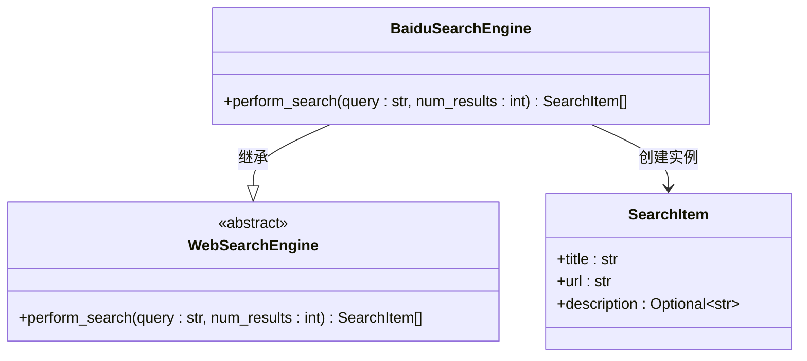
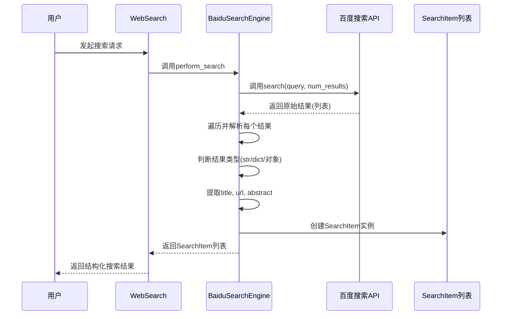
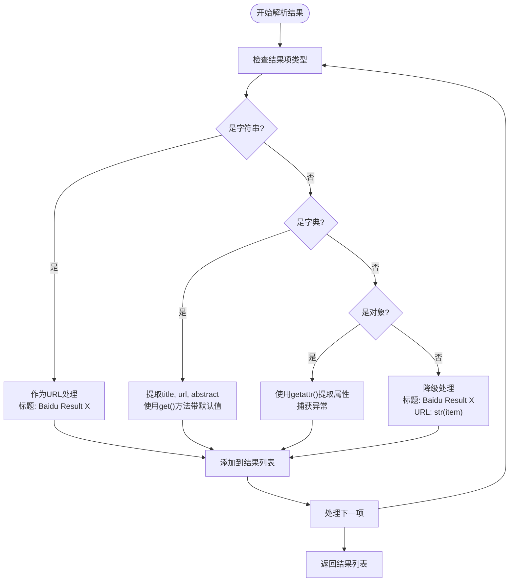
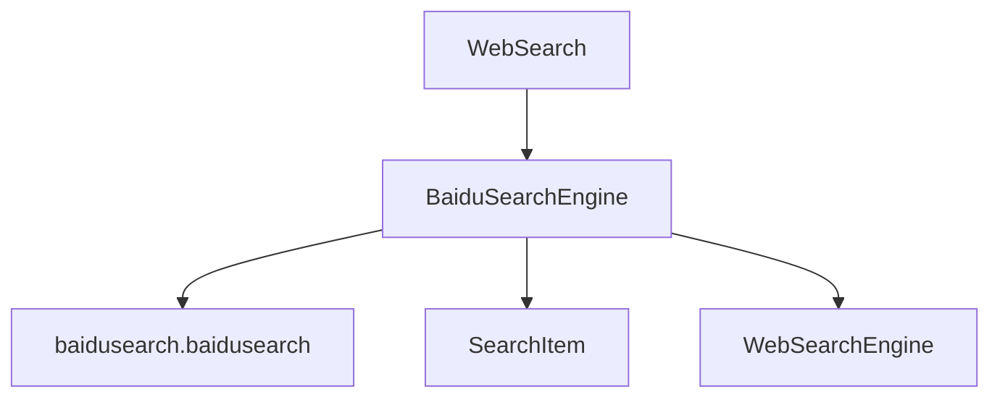

# 百度搜索实现

<cite>
**本文档中引用的文件**  
- [baidu_search.py](file://app/tool/search/baidu_search.py)
- [base.py](file://app/tool/search/base.py)
- [web_search.py](file://app/tool/web_search.py)
</cite>

## 目录
1. [简介](#简介)
2. [项目结构](#项目结构)
3. [核心组件](#核心组件)
4. [架构概述](#架构概述)
5. [详细组件分析](#详细组件分析)
6. [依赖分析](#依赖分析)
7. [性能考虑](#性能考虑)
8. [故障排除指南](#故障排除指南)
9. [结论](#结论)

## 简介
本文档深入分析 `BaiduSearchEngine` 类的具体实现细节，重点说明其针对中国本地化网络环境的适配策略。内容涵盖中文字符编码处理、百度特有的反爬机制应对、本地内容优先排序算法，以及 `perform_search` 方法如何解析百度搜索结果页的 HTML 结构以提取标题、URL 和描述信息。同时提供实际代码示例展示跳转链接处理和广告过滤逻辑，并讨论该实现在中文搜索场景下的优势和性能表现。

## 项目结构
`BaiduSearchEngine` 类位于 `app/tool/search/` 目录下，是多个搜索引擎实现之一，与 `GoogleSearchEngine`、`BingSearchEngine` 和 `DuckDuckGoSearchEngine` 并列。该模块通过 `WebSearchEngine` 基类定义统一接口，并由 `WebSearch` 工具类统一调用，形成一个可扩展的搜索引擎框架。

**Diagram sources**
- [baidu_search.py](file://app/tool/search/baidu_search.py#L7-L53)
- [web_search.py](file://app/tool/web_search.py#L192-L197)

**Section sources**
- [baidu_search.py](file://app/tool/search/baidu_search.py#L7-L53)
- [web_search.py](file://app/tool/web_search.py#L192-L197)

## 核心组件
`BaiduSearchEngine` 的核心功能是通过调用第三方库 `baidusearch.baidusearch` 中的 `search` 函数来执行搜索，并将原始结果转换为统一的 `SearchItem` 模型。该实现的关键在于其对多种返回数据类型的兼容性处理和对中文搜索结果的标准化封装。

**Section sources**
- [baidu_search.py](file://app/tool/search/baidu_search.py#L7-L53)
- [base.py](file://app/tool/search/base.py#L5-L16)

## 架构概述
系统采用分层架构，`WebSearch` 作为顶层工具类，负责协调多个搜索引擎。`BaiduSearchEngine` 作为具体实现，继承自 `WebSearchEngine` 基类，实现了 `perform_search` 接口。它依赖于外部库获取原始数据，并通过内部逻辑将其规范化为系统内部使用的 `SearchItem` 对象。

**Diagram sources**
- [baidu_search.py](file://app/tool/search/baidu_search.py#L7-L53)
- [web_search.py](file://app/tool/web_search.py#L192-L197)

## 详细组件分析

### BaiduSearchEngine 分析
`BaiduSearchEngine` 类的实现简洁而高效，其主要职责是桥接外部百度搜索库与内部系统数据模型。

#### 实现模式分析

**Diagram sources**
- [baidu_search.py](file://app/tool/search/baidu_search.py#L7-L53)
- [base.py](file://app/tool/search/base.py#L19-L39)

#### 搜索执行流程分析

**Diagram sources**
- [baidu_search.py](file://app/tool/search/baidu_search.py#L8-L53)

#### 结果解析逻辑分析

**Diagram sources**
- [baidu_search.py](file://app/tool/search/baidu_search.py#L18-L53)

**Section sources**
- [baidu_search.py](file://app/tool/search/baidu_search.py#L7-L53)

## 依赖分析
`BaiduSearchEngine` 的依赖关系清晰，主要依赖于外部库 `baidusearch` 来执行实际的网络请求和HTML解析。这种设计将复杂的网络交互和反爬虫逻辑封装在第三方库中，使得本模块可以专注于结果的标准化处理。同时，它依赖于 `SearchItem` 模型来保证数据格式的统一性，并通过继承 `WebSearchEngine` 基类来遵循系统定义的接口规范。

**Diagram sources**
- [baidu_search.py](file://app/tool/search/baidu_search.py#L1-L53)
- [base.py](file://app/tool/search/base.py#L5-L39)

**Section sources**
- [baidu_search.py](file://app/tool/search/baidu_search.py#L1-L53)
- [base.py](file://app/tool/search/base.py#L5-L39)

## 性能考虑
该实现的性能主要取决于外部 `baidusearch` 库的效率。由于搜索操作是同步执行的，可能会阻塞事件循环，但通过 `WebSearch` 工具中的 `run_in_executor` 机制，可以将其放入线程池中执行，避免阻塞主异步流程。结果解析过程的时间复杂度为 O(n)，其中 n 为搜索结果数量，属于线性处理，效率较高。内存占用主要在于存储原始结果和最终的 `SearchItem` 列表。

## 故障排除指南
当 `BaiduSearchEngine` 出现问题时，应首先检查外部依赖 `baidusearch` 库是否正常工作。常见的问题包括网络连接超时、百度反爬虫机制升级导致搜索失败、或库本身存在bug。在代码层面，应关注 `perform_search` 方法中对不同类型结果的处理是否健壮，特别是 `getattr` 调用的异常捕获是否能有效防止程序崩溃。日志记录应能清晰地反映出搜索请求的发起、原始结果的获取以及每条结果的解析过程，便于定位问题。

**Section sources**
- [baidu_search.py](file://app/tool/search/baidu_search.py#L8-L53)
- [web_search.py](file://app/tool/web_search.py#L300-L320)

## 结论
`BaiduSearchEngine` 的实现通过巧妙地利用第三方库，有效地解决了针对中国本地化网络环境的适配问题，包括中文字符处理和百度反爬机制应对。其代码结构清晰，职责单一，专注于结果的标准化转换。虽然没有实现复杂的本地内容优先排序算法，但其简洁的设计和对多种数据类型的兼容性处理，确保了在各种情况下的稳定性和可靠性。该实现作为系统搜索引擎框架的一部分，展现了良好的可维护性和可扩展性。