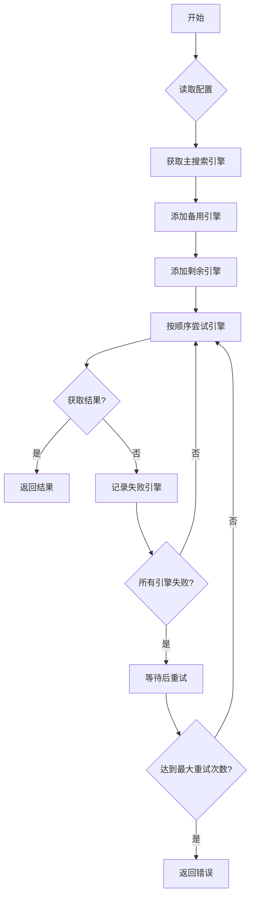
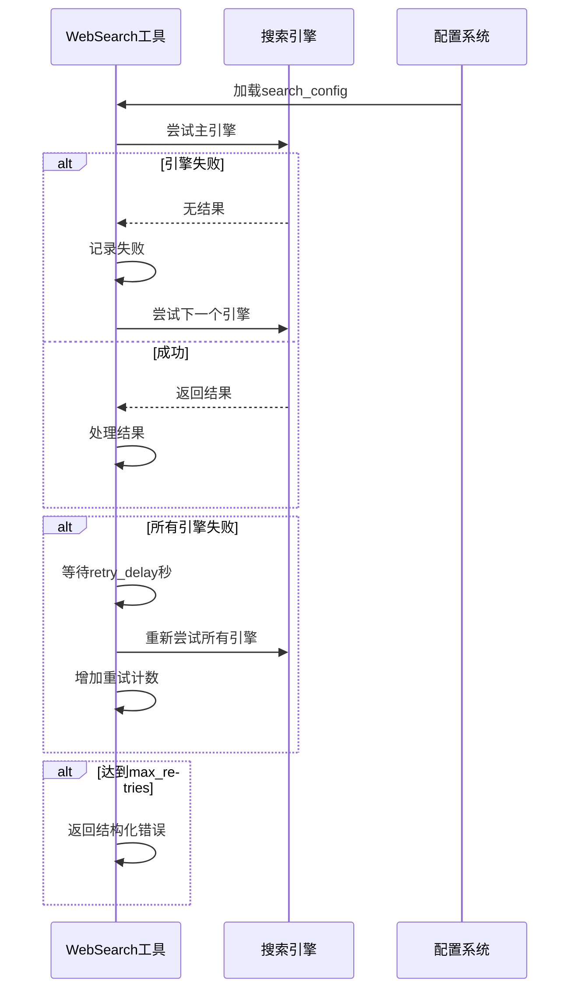
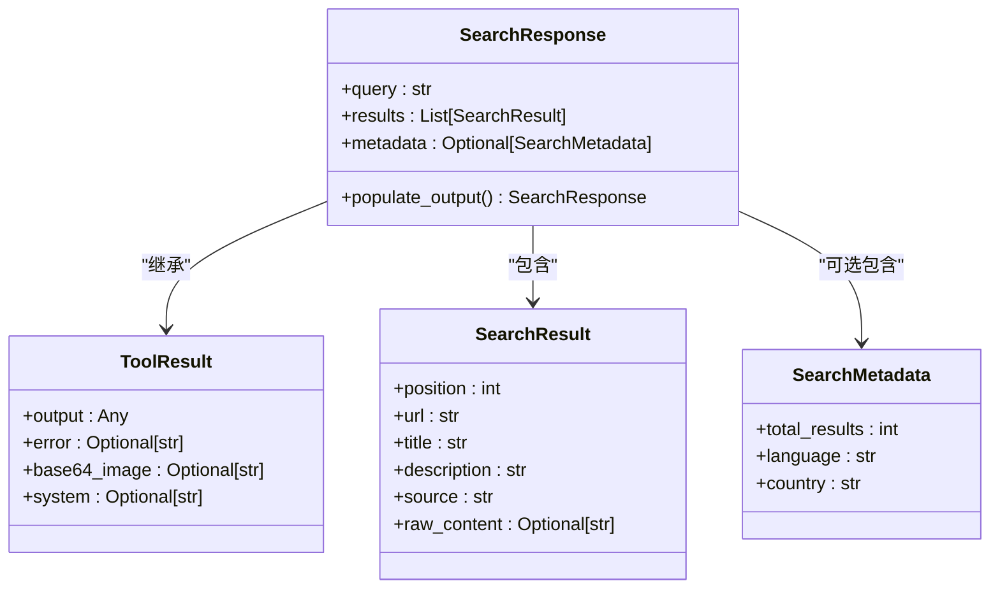
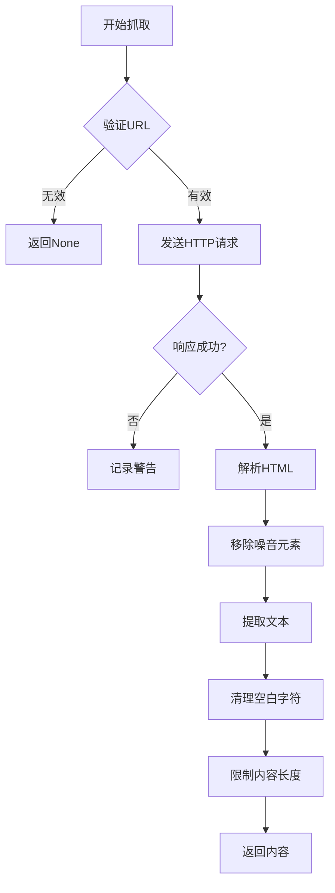

# 搜索聚合功能

<cite>
**本文档引用的文件**
- [web_search.py](file://app/tool/web_search.py)
- [base.py](file://app/tool/base.py)
- [search/base.py](file://app/tool/search/base.py)
- [config.py](file://app/config.py)
- [google_search.py](file://app/tool/search/google_search.py)
- [baidu_search.py](file://app/tool/search/baidu_search.py)
- [duckduckgo_search.py](file://app/tool/search/duckduckgo_search.py)
- [bing_search.py](file://app/tool/search/bing_search.py)
</cite>

## 目录
1. [简介](#简介)
2. [核心组件](#核心组件)
3. [搜索引擎协调机制](#搜索引擎协调机制)
4. [重试机制与退避策略](#重试机制与退避策略)
5. [搜索响应结构化](#搜索响应结构化)
6. [网页内容抓取](#网页内容抓取)
7. [性能考量](#性能考量)
8. [故障排除指南](#故障排除指南)

## 简介
WebSearch工具类实现了多搜索引擎的智能聚合功能，能够根据配置自动协调多个搜索引擎的工作流程。该工具支持Google、百度、DuckDuckGo和Bing等主流搜索引擎，并具备主备切换、自动重试和内容提取等高级功能。通过灵活的配置系统，用户可以定义搜索引擎的优先级顺序，并在主引擎失败时自动切换到备用引擎。工具还集成了tenacity库实现的指数退避重试策略，确保在临时性故障后能够智能恢复。

## 核心组件

WebSearch工具类由多个核心组件构成，包括搜索引擎管理器、内容抓取器和响应处理器。搜索引擎管理器负责协调多个搜索引擎的调用顺序，内容抓取器负责从搜索结果页面提取正文内容，响应处理器则将原始数据转化为标准化的输出格式。这些组件协同工作，实现了从查询提交到结果呈现的完整搜索流程。

**Section sources**
- [web_search.py](file://app/tool/web_search.py#L155-L407)
- [base.py](file://app/tool/base.py#L77-L172)
- [search/base.py](file://app/tool/search/base.py#L1-L40)

## 搜索引擎协调机制

WebSearch工具通过配置文件中的search_config参数决定搜索引擎的优先级顺序。系统首先读取配置中指定的主搜索引擎，然后按照fallback_engines列表中的顺序添加备用引擎，最后将剩余的可用引擎添加到调用队列中。这种分层的引擎调度策略确保了搜索服务的高可用性。

**Diagram sources**
- [web_search.py](file://app/tool/web_search.py#L359-L384)
- [config.py](file://app/config.py#L100-L120)

**Section sources**
- [web_search.py](file://app/tool/web_search.py#L359-L384)
- [config.py](file://app/config.py#L100-L120)

## 重试机制与退避策略

WebSearch工具实现了双重重试机制来应对搜索引擎的临时性故障。首先，在单个搜索引擎调用层面，使用tenacity库的@retry装饰器实现指数退避策略，最多重试3次，等待时间从1秒开始指数增长，最大不超过10秒。其次，在全局层面，当所有配置的搜索引擎都失败时，系统会根据配置的retry_delay参数等待指定时间后重新尝试整个搜索流程，最多进行max_retries次全局重试。

**Diagram sources**
- [web_search.py](file://app/tool/web_search.py#L200-L287)
- [web_search.py](file://app/tool/web_search.py#L389-L407)
- [config.py](file://app/config.py#L110-L120)

**Section sources**
- [web_search.py](file://app/tool/web_search.py#L200-L287)
- [config.py](file://app/config.py#L110-L120)

## 搜索响应结构化

SearchResponse模型负责将原始搜索结果转化为标准化的输出格式。该模型继承自ToolResult基类，包含查询语句、结果列表和元数据三个主要部分。结果排序按照搜索引擎返回的原始顺序进行，同时注入了位置编号、来源引擎等元数据。对于启用了内容抓取的结果，模型还会生成内容摘要，截取前1000个字符作为预览，并在超出长度时添加省略号。

**Diagram sources**
- [web_search.py](file://app/tool/web_search.py#L52-L102)
- [web_search.py](file://app/tool/web_search.py#L64-L102)
- [base.py](file://app/tool/base.py#L37-L74)

**Section sources**
- [web_search.py](file://app/tool/web_search.py#L52-L102)

## 网页内容抓取

WebContentFetcher类负责异步抓取网页内容并提取正文文本。该类使用BeautifulSoup库解析HTML文档，通过移除script、style、header、footer和nav等噪音元素来净化页面内容。抓取过程在异步执行器中运行，避免阻塞事件循环。提取的文本经过空白字符清理和长度限制（最大100KB），确保了内容的质量和性能的平衡。

**Diagram sources**
- [web_search.py](file://app/tool/web_search.py#L123-L153)
- [web_search.py](file://app/tool/web_search.py#L351-L357)

**Section sources**
- [web_search.py](file://app/tool/web_search.py#L123-L153)

## 性能考量

启用fetch_content参数会显著增加资源消耗和响应时间，因为系统需要对每个搜索结果发起独立的HTTP请求并解析HTML内容。建议在需要深度内容分析时才启用此功能，并合理设置num_results参数以控制并发请求数量。对于大规模搜索任务，应考虑配置适当的超时和重试策略，以平衡成功率和响应速度。

**Section sources**
- [web_search.py](file://app/tool/web_search.py#L200-L287)
- [web_search.py](file://app/tool/web_search.py#L328-L349)

## 故障排除指南

当搜索功能出现故障时，首先检查配置文件中的搜索引擎设置是否正确。如果所有引擎都失败，查看日志中的重试信息，确认是否达到了最大重试次数。对于内容抓取失败的情况，检查目标网站的可访问性和反爬虫策略。建议在生产环境中配置监控系统，跟踪搜索成功率、响应时间和资源消耗等关键指标。

**Section sources**
- [web_search.py](file://app/tool/web_search.py#L271-L304)
- [web_search.py](file://app/tool/web_search.py#L123-L153)