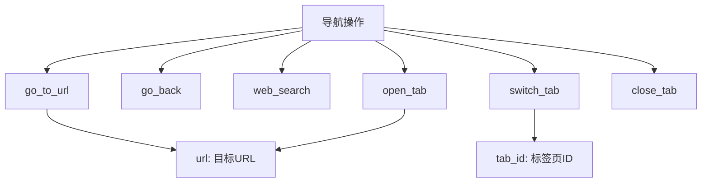
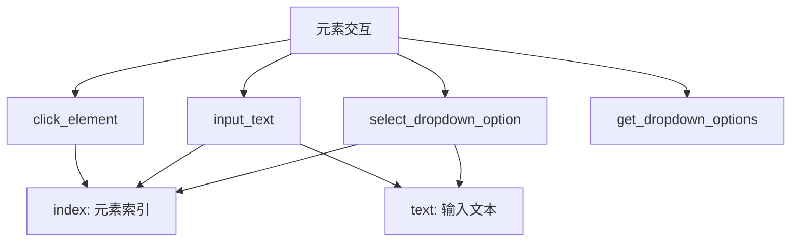
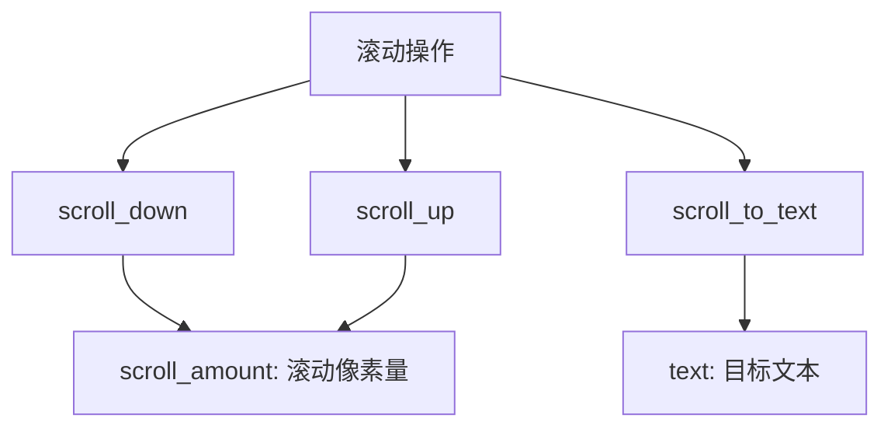
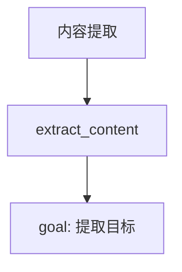
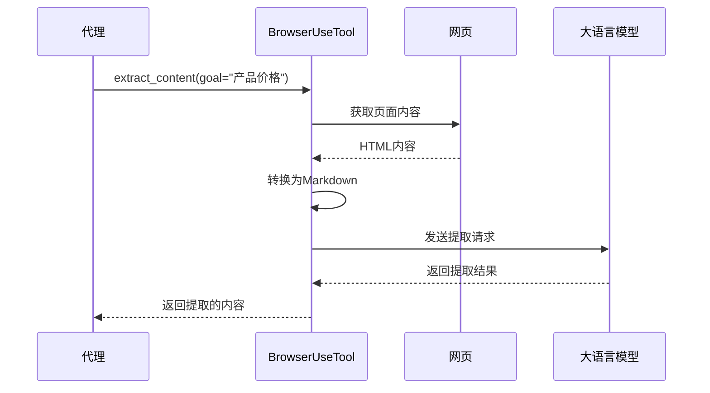
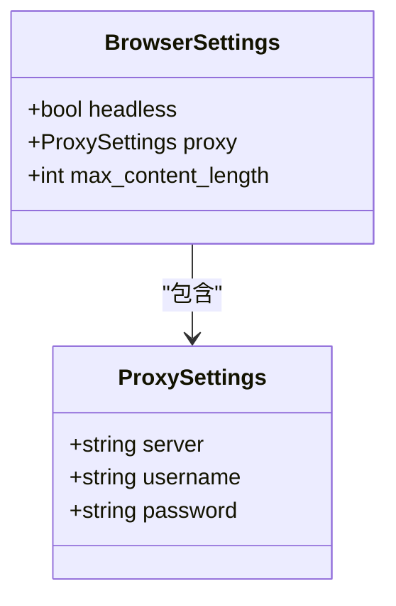
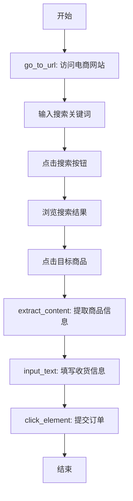
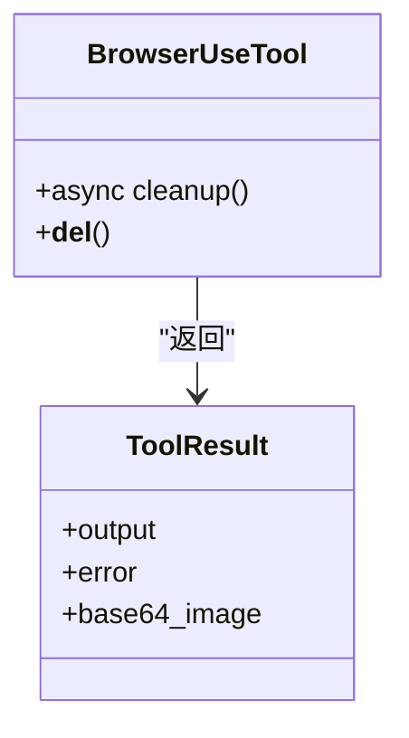
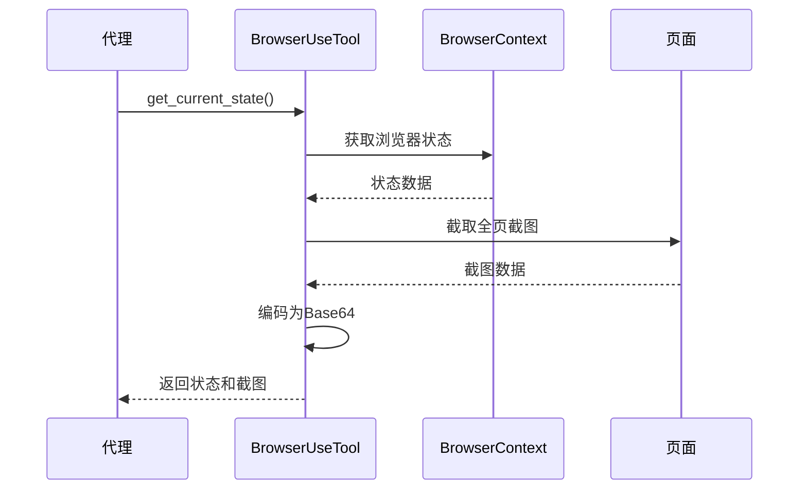
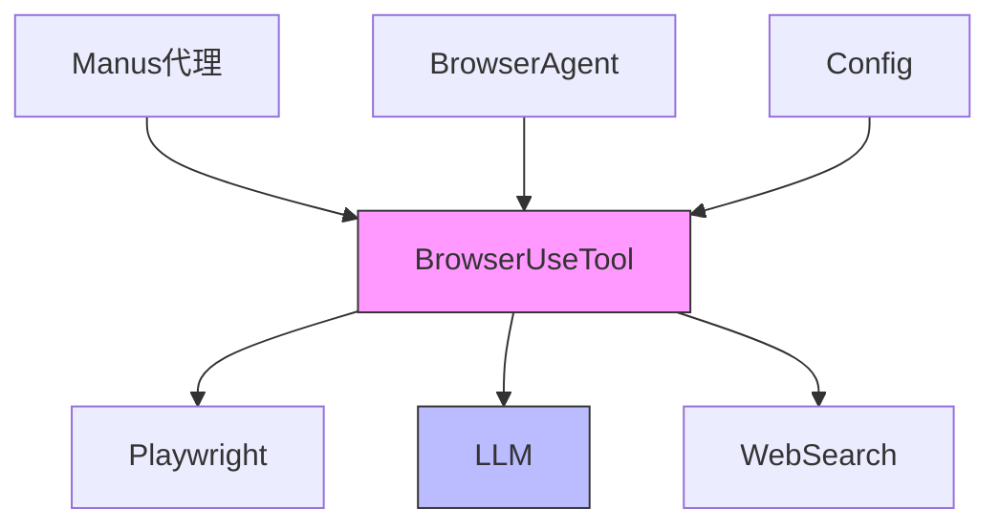

# 浏览器工具

<cite>
**Referenced Files in This Document**   
- [browser_use_tool.py](file://app/tool/browser_use_tool.py)
- [base.py](file://app/tool/base.py)
- [llm.py](file://app/llm.py)
- [web_search.py](file://app/tool/web_search.py)
- [config.py](file://app/config.py)
- [browser.py](file://app/agent/browser.py)
- [manus.py](file://app/agent/manus.py)
</cite>

## 目录
1. [简介](#简介)
2. [核心功能](#核心功能)
3. [操作类型](#操作类型)
4. [DOM元素定位](#dom元素定位)
5. [智能内容提取](#智能内容提取)
6. [配置机制](#配置机制)
7. [使用示例](#使用示例)
8. [异常处理与资源管理](#异常处理与资源管理)
9. [状态可视化](#状态可视化)
10. [架构关系](#架构关系)

## 简介

BrowserUseTool 是一个基于 Playwright 实现的浏览器自动化工具，为代理系统提供全面的网页交互能力。该工具允许代理执行各种浏览器操作，包括页面导航、元素交互、内容提取和标签页管理。通过将浏览器操作封装为标准化工具，它使代理能够像人类用户一样浏览和操作网页，从而完成复杂的网络任务。

**Section sources**
- [browser_use_tool.py](file://app/tool/browser_use_tool.py#L38-L566)

## 核心功能

BrowserUseTool 提供了完整的浏览器自动化功能集，支持从基本导航到复杂交互的各种操作。工具通过 Playwright 底层库与浏览器实例进行通信，确保操作的稳定性和可靠性。每个操作都设计为原子性动作，可以被代理系统按需调用和组合，以完成复杂的任务流程。

工具的核心功能包括：
- **页面导航**：支持跳转到指定URL、返回上一页、刷新页面
- **元素交互**：支持点击元素、输入文本、选择下拉选项
- **滚动控制**：支持按像素量上下滚动或滚动到特定文本
- **内容提取**：支持基于目标的智能内容提取
- **标签页管理**：支持切换、打开和关闭标签页
- **键盘操作**：支持发送键盘按键

**Section sources**
- [browser_use_tool.py](file://app/tool/browser_use_tool.py#L38-L566)

## 操作类型

BrowserUseTool 支持多种浏览器操作类型，每种操作都有其特定的参数要求和执行逻辑。

### 导航操作
导航操作允许代理控制浏览器的页面跳转行为。



**Diagram sources**
- [browser_use_tool.py](file://app/tool/browser_use_tool.py#L56-L121)

### 元素交互操作
元素交互操作允许代理与页面上的具体元素进行交互。



**Diagram sources**
- [browser_use_tool.py](file://app/tool/browser_use_tool.py#L56-L121)

### 滚动操作
滚动操作允许代理控制页面的滚动行为。



**Diagram sources**
- [browser_use_tool.py](file://app/tool/browser_use_tool.py#L56-L121)

### 内容提取操作
内容提取操作允许代理从页面中提取相关信息。



**Diagram sources**
- [browser_use_tool.py](file://app/tool/browser_use_tool.py#L56-L121)

## DOM元素定位

BrowserUseTool 通过基于索引的DOM元素定位机制实现精准的元素交互。当代理需要与页面元素交互时，它使用一个整数索引来引用特定元素，而不是直接使用CSS选择器或XPath。

这种定位机制的工作流程如下：
1. 工具维护一个当前页面的可点击元素列表
2. 每个可点击元素被分配一个唯一的整数索引
3. 代理通过索引引用元素来执行操作
4. 工具根据索引查找对应的DOM元素并执行操作

这种设计简化了代理的决策过程，使代理只需关注"点击第几个元素"而不是复杂的元素选择器。

**Section sources**
- [browser_use_tool.py](file://app/tool/browser_use_tool.py#L189-L476)

## 智能内容提取

BrowserUseTool 的 `extract_content` 操作结合了LLM（大语言模型）实现智能内容提取。当代理需要从网页中提取特定信息时，该功能可以理解提取目标并从页面内容中提取相关信息。



**Diagram sources**
- [browser_use_tool.py](file://app/tool/browser_use_tool.py#L340-L398)
- [llm.py](file://app/llm.py#L400-L500)

## 配置机制

BrowserUseTool 支持多种配置选项，允许用户根据需求定制浏览器行为。

### 配置参数
工具支持以下主要配置参数：

| 配置项 | 类型 | 默认值 | 描述 |
|-------|------|-------|------|
| headless | 布尔值 | False | 是否以无头模式运行浏览器 |
| proxy | 对象 | None | 代理服务器设置 |
| max_content_length | 整数 | 2000 | 内容提取的最大长度 |
| disable_security | 布尔值 | True | 是否禁用浏览器安全特性 |

**Section sources**
- [config.py](file://app/config.py#L68-L94)

### 代理设置
工具支持通过配置文件设置代理服务器，包括服务器地址、用户名和密码。



**Diagram sources**
- [config.py](file://app/config.py#L45-L66)
- [config.py](file://app/config.py#L68-L94)

## 使用示例

BrowserUseTool 可以用于各种代理任务，如网页浏览、表单填写和信息抓取。

### 代理任务示例
一个典型的代理任务可能包含以下步骤：



**Diagram sources**
- [browser_use_tool.py](file://app/tool/browser_use_tool.py#L189-L476)

## 异常处理与资源管理

BrowserUseTool 实现了完善的异常处理和资源管理机制，确保浏览器操作的稳定性和资源的正确释放。

### 异常处理
所有浏览器操作都包裹在异常处理块中，捕获并返回有意义的错误信息：

```python
try:
    # 执行浏览器操作
    await page.goto(url)
except Exception as e:
    return ToolResult(error=f"Browser action '{action}' failed: {str(e)}")
```

### 资源清理
工具实现了资源清理机制，确保浏览器实例在使用后被正确关闭。



**Diagram sources**
- [browser_use_tool.py](file://app/tool/browser_use_tool.py#L540-L549)
- [base.py](file://app/tool/base.py#L37-L74)

### 线程安全锁
工具使用 asyncio.Lock 确保多线程环境下的操作安全：

```python
async with self.lock:
    # 确保同一时间只有一个操作在执行
    context = await self._ensure_browser_initialized()
    # 执行操作...
```

**Section sources**
- [browser_use_tool.py](file://app/tool/browser_use_tool.py#L123-L123)

## 状态可视化

BrowserUseTool 的 `get_current_state` 方法生成包含截图和交互元素的可视化状态输出，支持代理决策。

### 状态输出结构
状态输出包含以下关键信息：

```json
{
  "url": "https://example.com",
  "title": "示例页面",
  "tabs": [...],
  "help": "[0], [1], [2]... 表示可点击的元素索引",
  "interactive_elements": "可点击元素列表",
  "scroll_info": {
    "pixels_above": 0,
    "pixels_below": 1000,
    "total_height": 2000
  },
  "viewport_height": 1000
}
```

### 状态获取流程


**Diagram sources**
- [browser_use_tool.py](file://app/tool/browser_use_tool.py#L478-L538)
- [browser.py](file://app/agent/browser.py#L30-L60)

## 架构关系

BrowserUseTool 与其他组件紧密集成，形成完整的代理系统。



**Diagram sources**
- [manus.py](file://app/agent/manus.py#L30-L50)
- [browser.py](file://app/agent/browser.py#L80-L100)
- [llm.py](file://app/llm.py#L100-L200)
- [web_search.py](file://app/tool/web_search.py#L100-L200)
- [config.py](file://app/config.py#L100-L200)

**Section sources**
- [manus.py](file://app/agent/manus.py#L30-L165)
- [browser.py](file://app/agent/browser.py#L80-L129)