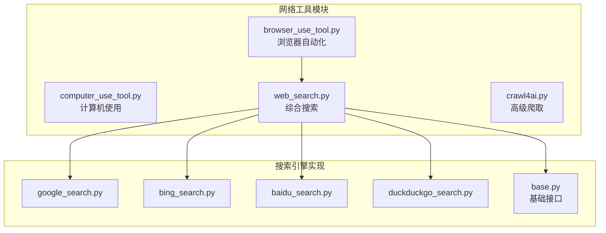
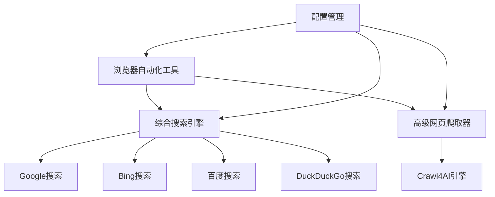
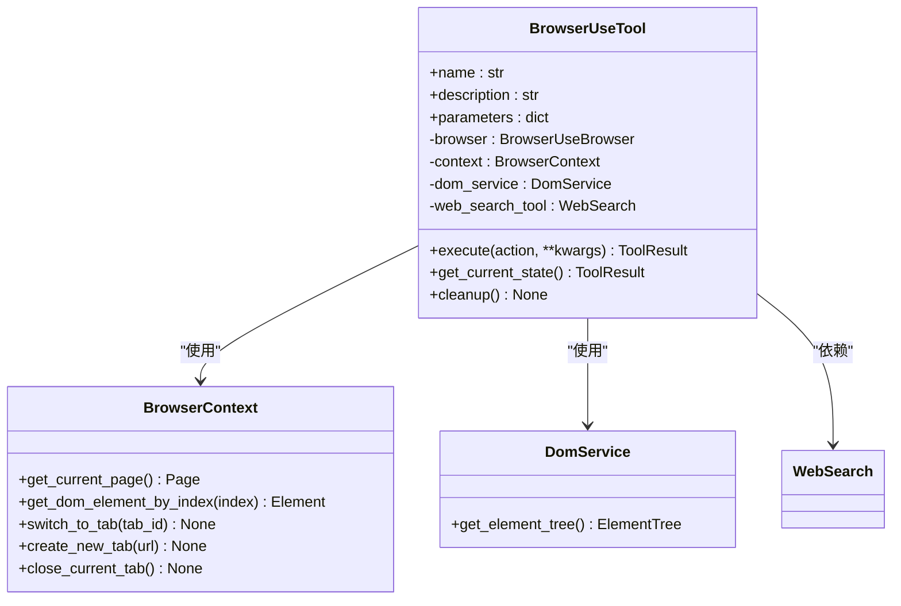
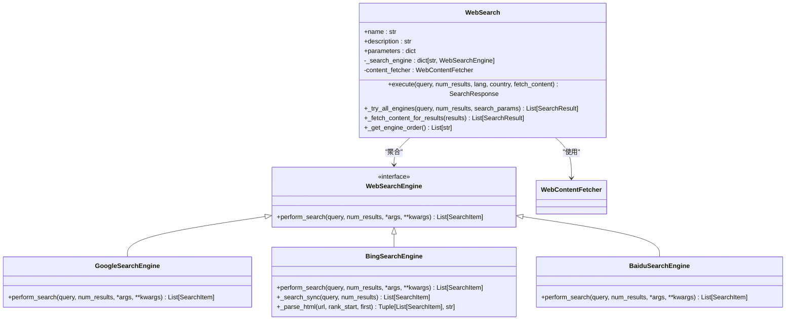
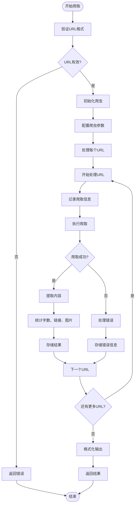
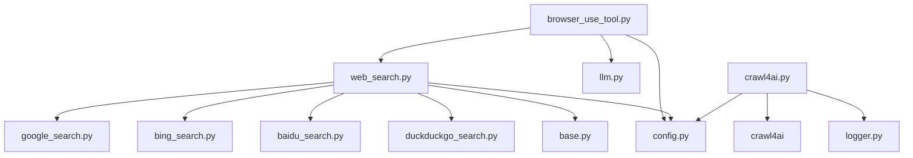
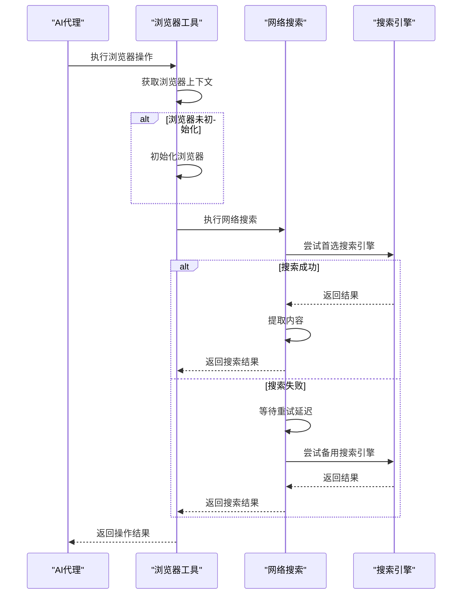

# 网络工具

<cite>
**本文档中引用的文件**  
- [browser_use_tool.py](file://app/tool/browser_use_tool.py)
- [web_search.py](file://app/tool/web_search.py)
- [crawl4ai.py](file://app/tool/crawl4ai.py)
- [google_search.py](file://app/tool/search/google_search.py)
- [bing_search.py](file://app/tool/search/bing_search.py)
- [baidu_search.py](file://app/tool/search/baidu_search.py)
- [base.py](file://app/tool/search/base.py)
- [config.py](file://app/config.py)
</cite>

## 目录
1. [简介](#简介)
2. [项目结构](#项目结构)
3. [核心组件](#核心组件)
4. [架构概述](#架构概述)
5. [详细组件分析](#详细组件分析)
6. [依赖分析](#依赖分析)
7. [性能考虑](#性能考虑)
8. [故障排除指南](#故障排除指南)
9. [结论](#结论)

## 简介
本文档全面介绍了OpenManus项目中的网络工具套件，重点说明了浏览器自动化、计算机使用、多种搜索引擎集成和网络爬取功能。文档详细解释了`browser_use_tool.py`如何利用Playwright实现网页交互，包括页面导航、元素定位和内容提取；描述了不同搜索工具（Google、Bing、百度等）的实现差异和统一接口设计；说明了`web_search.py`如何整合多个搜索结果源，以及`crawl4ai.py`如何实现高级网页内容抓取。文档还提供了配置选项说明，如搜索参数设置、浏览器行为配置和反爬虫策略，并包含实际使用案例，展示如何在代理任务中组合使用这些工具进行信息检索和网页操作。

## 项目结构
网络工具相关代码主要位于`app/tool`目录下，按照功能模块进行组织。核心工具包括浏览器自动化、搜索引擎集成和网页内容爬取三大类，每个类别都有独立的模块和实现。

**图源**  
- [browser_use_tool.py](file://app/tool/browser_use_tool.py)
- [web_search.py](file://app/tool/web_search.py)
- [crawl4ai.py](file://app/tool/crawl4ai.py)

**节源**  
- [browser_use_tool.py](file://app/tool/browser_use_tool.py)
- [web_search.py](file://app/tool/web_search.py)
- [crawl4ai.py](file://app/tool/crawl4ai.py)

## 核心组件
网络工具套件由三个核心组件构成：浏览器自动化工具、综合搜索引擎和高级网页爬取器。这些组件协同工作，为AI代理提供完整的网络交互能力。

**节源**  
- [browser_use_tool.py](file://app/tool/browser_use_tool.py#L1-L50)
- [web_search.py](file://app/tool/web_search.py#L1-L50)
- [crawl4ai.py](file://app/tool/crawl4ai.py#L1-L50)

## 架构概述
网络工具的架构采用分层设计，上层工具依赖底层服务，形成清晰的调用链。浏览器自动化工具作为最高层，可以调用搜索引擎和网页爬取功能，而搜索引擎又集成了多个具体的搜索实现。

**图源**  
- [browser_use_tool.py](file://app/tool/browser_use_tool.py#L1-L50)
- [web_search.py](file://app/tool/web_search.py#L1-L50)
- [crawl4ai.py](file://app/tool/crawl4ai.py#L1-L50)

## 详细组件分析

### 浏览器自动化工具分析
`browser_use_tool.py`实现了基于Playwright的浏览器自动化功能，支持多种网页交互操作。

#### 浏览器操作功能

**图源**  
- [browser_use_tool.py](file://app/tool/browser_use_tool.py#L1-L567)

**节源**  
- [browser_use_tool.py](file://app/tool/browser_use_tool.py#L1-L567)

### 搜索引擎集成分析
`web_search.py`实现了统一的搜索引擎接口，支持多种搜索服务的集成和故障转移。

#### 搜索引擎统一接口

**图源**  
- [web_search.py](file://app/tool/web_search.py#L1-L418)
- [google_search.py](file://app/tool/search/google_search.py#L1-L33)
- [bing_search.py](file://app/tool/search/bing_search.py#L1-L144)
- [baidu_search.py](file://app/tool/search/baidu_search.py#L1-L54)
- [base.py](file://app/tool/search/base.py#L1-L40)

**节源**  
- [web_search.py](file://app/tool/web_search.py#L1-L418)
- [google_search.py](file://app/tool/search/google_search.py#L1-L33)
- [bing_search.py](file://app/tool/search/bing_search.py#L1-L144)
- [baidu_search.py](file://app/tool/search/baidu_search.py#L1-L54)
- [base.py](file://app/tool/search/base.py#L1-L40)

### 高级网页爬取分析
`crawl4ai.py`实现了基于Crawl4AI的高级网页内容抓取功能，专注于为AI模型提供高质量的内容。

#### 网页爬取流程

**图源**  
- [crawl4ai.py](file://app/tool/crawl4ai.py#L1-L269)

**节源**  
- [crawl4ai.py](file://app/tool/crawl4ai.py#L1-L269)

## 依赖分析
网络工具套件的依赖关系清晰，采用模块化设计，各组件之间的耦合度较低。

**图源**  
- [browser_use_tool.py](file://app/tool/browser_use_tool.py#L1-L567)
- [web_search.py](file://app/tool/web_search.py#L1-L418)
- [crawl4ai.py](file://app/tool/crawl4ai.py#L1-L269)
- [config.py](file://app/config.py#L1-L372)

**节源**  
- [browser_use_tool.py](file://app/tool/browser_use_tool.py#L1-L567)
- [web_search.py](file://app/tool/web_search.py#L1-L418)
- [crawl4ai.py](file://app/tool/crawl4ai.py#L1-L269)
- [config.py](file://app/config.py#L1-L372)

## 性能考虑
网络工具在设计时充分考虑了性能和可靠性，采用了多种优化策略。

### 异步处理与错误重试
网络工具广泛使用异步处理机制，确保高并发性能。同时，实现了完善的错误重试机制，提高操作的可靠性。

**图源**  
- [browser_use_tool.py](file://app/tool/browser_use_tool.py#L145-L174)
- [web_search.py](file://app/tool/web_search.py#L271-L304)

**节源**  
- [browser_use_tool.py](file://app/tool/browser_use_tool.py#L145-L174)
- [web_search.py](file://app/tool/web_search.py#L271-L304)

## 故障排除指南
本节提供常见问题的解决方案和调试建议。

### 常见问题及解决方案
| 问题现象 | 可能原因 | 解决方案 |
|---------|--------|--------|
| 浏览器操作失败 | 浏览器未正确初始化 | 检查`browser_config`配置，确保参数正确 |
| 搜索无结果 | 搜索引擎API限制 | 检查`search_config`中的`retry_delay`和`max_retries`设置 |
| 爬取内容为空 | 网页内容动态加载 | 确保`crawl4ai`配置中`java_script_enabled`为`True` |
| 连接超时 | 网络问题或代理配置错误 | 检查`proxy`设置，验证网络连接 |
| 内容提取不完整 | 内容长度限制 | 调整`max_content_length`配置值 |

**节源**  
- [config.py](file://app/config.py#L38-L65)
- [web_search.py](file://app/tool/web_search.py#L200-L239)
- [browser_use_tool.py](file://app/tool/browser_use_tool.py#L145-L174)

## 结论
OpenManus的网络工具套件提供了一套完整的网络交互解决方案，涵盖了浏览器自动化、搜索引擎集成和高级网页爬取三大核心功能。通过模块化设计和统一接口，这些工具能够灵活组合，为AI代理提供强大的网络操作能力。配置系统允许用户根据具体需求调整行为，而异步处理和错误重试机制确保了操作的可靠性和性能。这套工具为构建智能代理系统提供了坚实的基础。