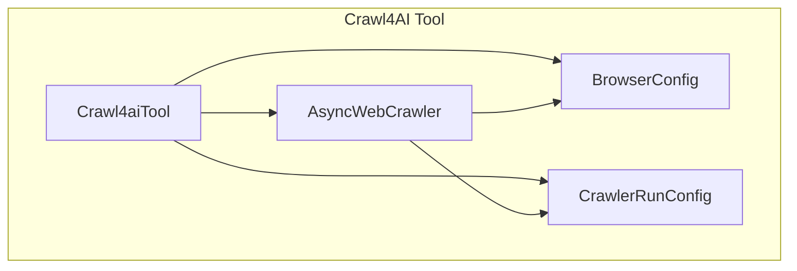
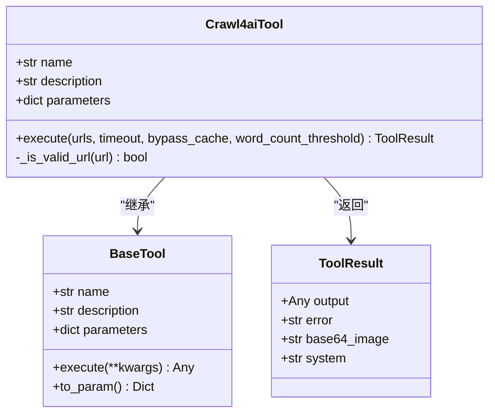
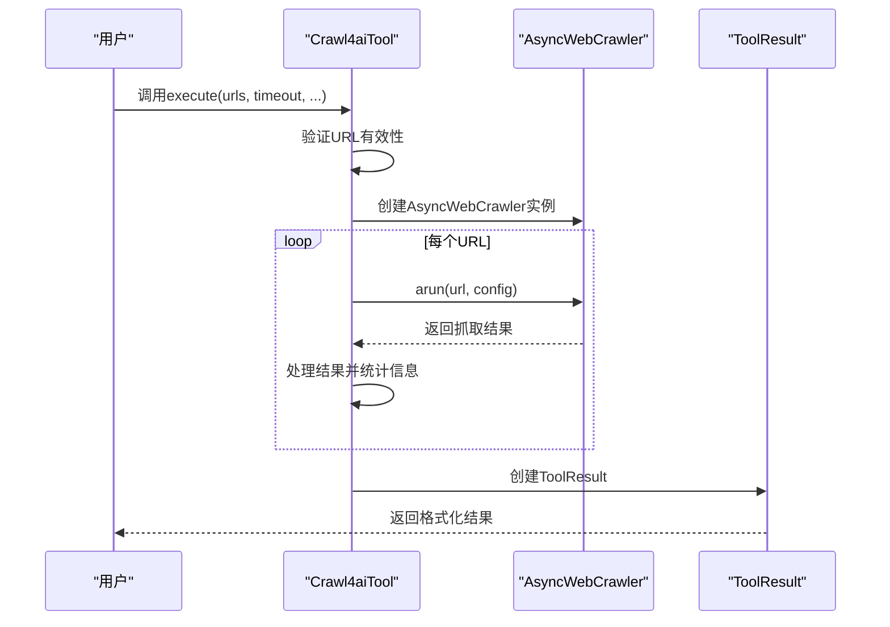
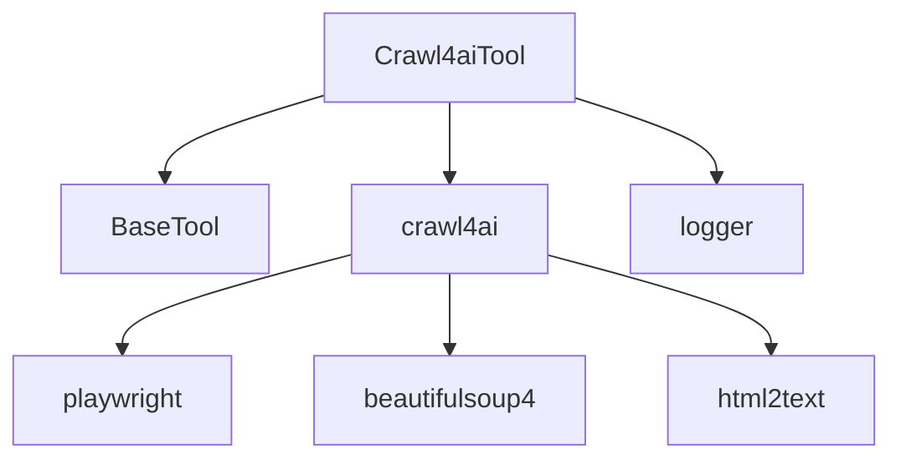

# 网络爬取工具

<cite>
**Referenced Files in This Document**   
- [crawl4ai.py](file://app/tool/crawl4ai.py)
- [base.py](file://app/tool/base.py)
- [requirements.txt](file://requirements.txt)
</cite>

## 目录
1. [简介](#简介)
2. [项目结构](#项目结构)
3. [核心组件](#核心组件)
4. [架构概述](#架构概述)
5. [详细组件分析](#详细组件分析)
6. [依赖分析](#依赖分析)
7. [性能考量](#性能考量)
8. [故障排除指南](#故障排除指南)
9. [结论](#结论)

## 简介
Crawl4AI 是一个高性能的网页爬取工具，专为大型语言模型（LLM）和AI代理设计。该工具能够从网页中提取干净、结构化的AI就绪数据，并生成优化的Markdown内容。它特别适用于内容分析、研究以及向AI模型提供网页内容。本文档深入探讨了Crawl4AI的高级网页内容抓取功能，包括其智能网页解析能力、结构化内容提取以及处理JavaScript渲染的动态内容的方法。

## 项目结构
Crawl4AI工具位于`app/tool/`目录下，作为OpenManus项目的一个独立模块。该工具通过集成Crawl4AI库实现高级网页抓取功能，与其他工具如浏览器使用工具、搜索工具等协同工作。

**Section sources**
- [crawl4ai.py](file://app/tool/crawl4ai.py#L1-L30)

## 核心组件
Crawl4AI工具的核心是`Crawl4aiTool`类，它继承自`BaseTool`并实现了网页抓取功能。该工具能够处理单个或多个URL，提取包括文本、链接、图片和元数据在内的结构化内容，并以Markdown格式输出，便于AI处理。

**Section sources**
- [crawl4ai.py](file://app/tool/crawl4ai.py#L31-L72)
- [base.py](file://app/tool/base.py#L1-L181)

## 架构概述
Crawl4AI工具采用异步架构，利用`AsyncWebCrawler`进行高效的网页抓取。它通过配置`BrowserConfig`和`CrawlerRunConfig`来控制浏览器行为和抓取策略，确保能够处理JavaScript渲染的动态内容。

**Diagram sources**
- [crawl4ai.py](file://app/tool/crawl4ai.py#L74-L150)

## 详细组件分析

### Crawl4aiTool 分析
`Crawl4aiTool`是Crawl4AI工具的主要实现类，负责协调整个抓取过程。它通过`execute`方法接收URL列表和其他配置参数，然后调用底层的Crawl4AI库执行实际的抓取任务。

#### 类图

**Diagram sources**
- [crawl4ai.py](file://app/tool/crawl4ai.py#L31-L72)
- [base.py](file://app/tool/base.py#L1-L181)

#### 执行流程

**Diagram sources**
- [crawl4ai.py](file://app/tool/crawl4ai.py#L74-L268)

## 依赖分析
Crawl4AI工具依赖于多个外部库和内部模块。主要依赖包括Crawl4AI库本身、Playwright（用于浏览器自动化）以及项目内部的工具基础类。

**Diagram sources**
- [requirements.txt](file://requirements.txt#L40-L42)
- [crawl4ai.py](file://app/tool/crawl4ai.py#L7-L10)

## 性能考量
Crawl4AI工具在设计时考虑了性能优化。它支持缓存模式，可以通过`bypass_cache`参数控制是否绕过缓存获取新鲜内容。此外，工具还支持设置超时时间、字数阈值等参数，以平衡抓取质量和性能。

**Section sources**
- [crawl4ai.py](file://app/tool/crawl4ai.py#L118-L150)

## 故障排除指南
当Crawl4AI工具无法正常工作时，首先应检查是否已正确安装Crawl4AI库。如果出现导入错误，系统会提示安装命令。此外，工具内置了详细的日志记录，可以帮助诊断抓取过程中的问题。

**Section sources**
- [crawl4ai.py](file://app/tool/crawl4ai.py#L246-L268)

## 结论
Crawl4AI工具为OpenManus项目提供了强大的网页内容抓取能力。通过集成Crawl4AI库，该工具能够高效地提取结构化内容，特别适合需要处理JavaScript渲染的动态网页的场景。其灵活的配置选项和健壮的错误处理机制使其成为AI驱动的内容分析和研究的理想选择。