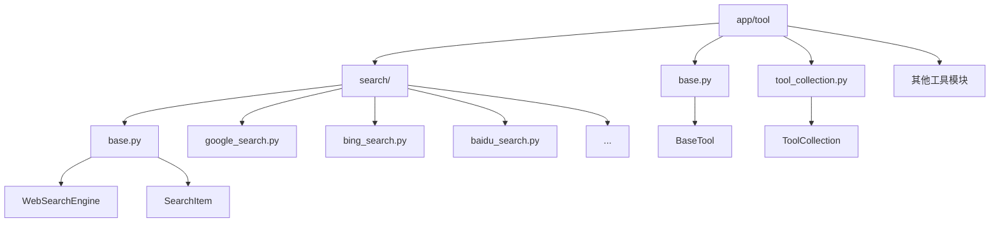
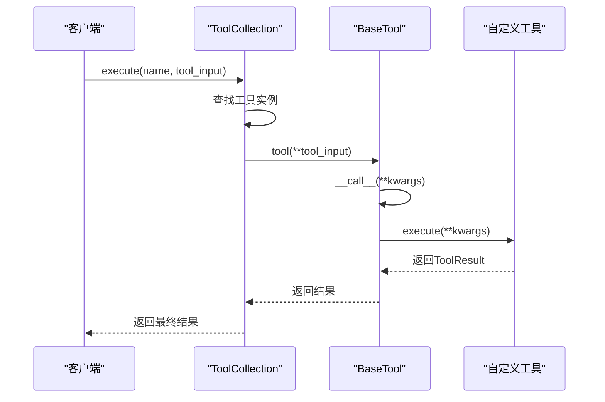
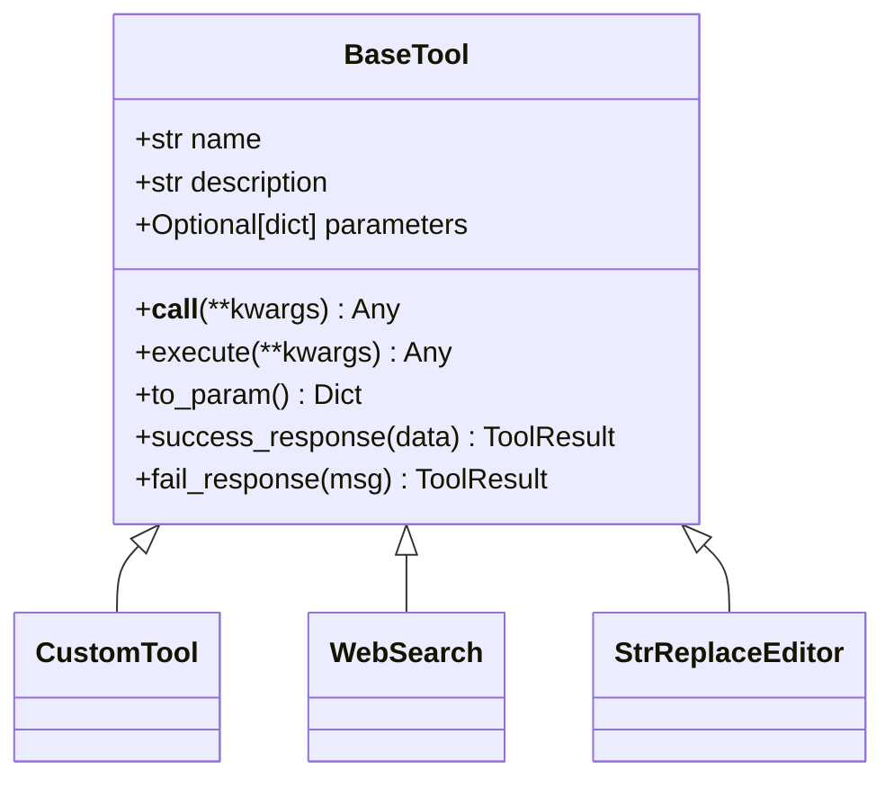
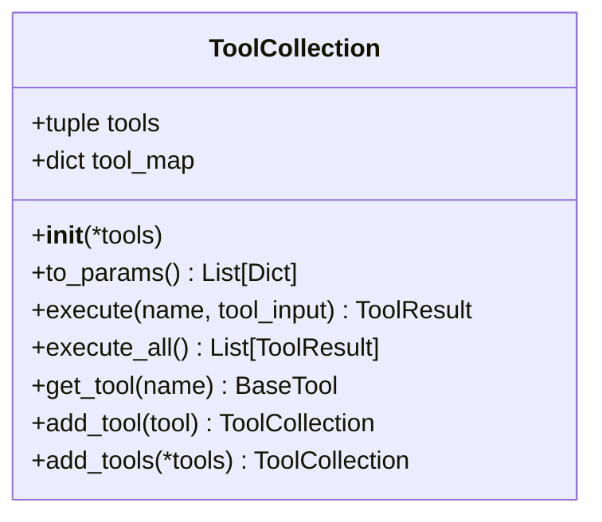
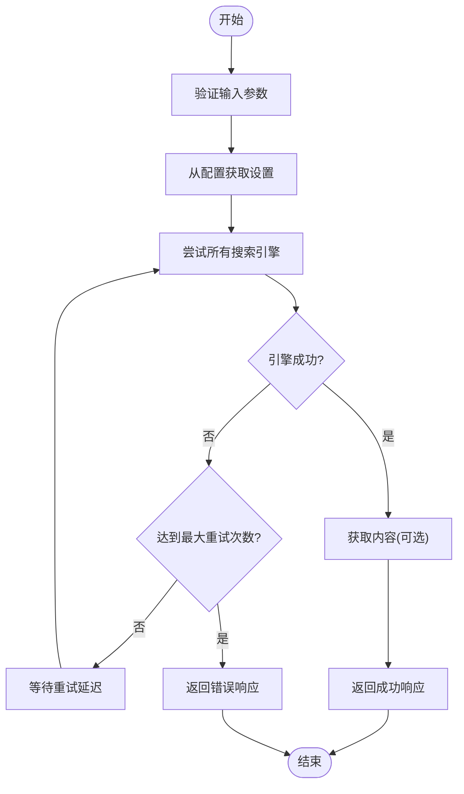
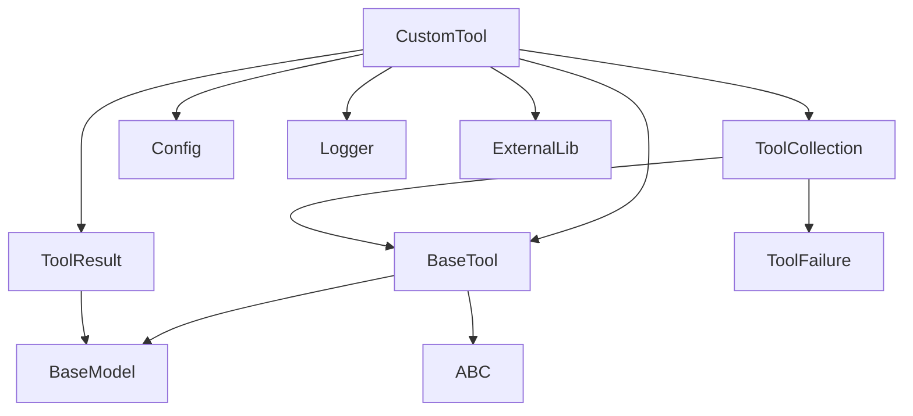

# 自定义工具开发

<cite>
**Referenced Files in This Document**   
- [base.py](file://app/tool/base.py)
- [tool_collection.py](file://app/tool/tool_collection.py)
- [search/base.py](file://app/tool/search/base.py)
- [search/google_search.py](file://app/tool/search/google_search.py)
- [search/bing_search.py](file://app/tool/search/bing_search.py)
- [search/baidu_search.py](file://app/tool/search/baidu_search.py)
- [web_search.py](file://app/tool/web_search.py)
</cite>

## 目录
1. [简介](#简介)
2. [项目结构](#项目结构)
3. [核心组件](#核心组件)
4. [架构概述](#架构概述)
5. [详细组件分析](#详细组件分析)
6. [依赖分析](#依赖分析)
7. [性能考虑](#性能考虑)
8. [故障排除指南](#故障排除指南)
9. [结论](#结论)

## 简介
本文档提供了在OpenManus框架中开发自定义工具的权威指南。文档详细阐述了如何继承BaseTool抽象基类，实现execute方法，定义参数模式（parameters）和工具元数据。同时解释了工具注册机制，以及如何通过ToolCollection.add_tool将新工具集成到系统中。文档还包含了完整的代码模板、最佳实践、高级主题和常见陷阱的解决方案。

## 项目结构
OpenManus的工具系统采用模块化设计，所有工具都位于`app/tool`目录下。每个工具通常作为一个独立的模块存在，遵循一致的结构模式。核心基类`BaseTool`定义在`base.py`中，而工具集合管理则由`tool_collection.py`负责。搜索相关工具被组织在`search`子目录中，体现了功能分组的设计理念。

**Diagram sources**
- [app/tool/base.py](file://app/tool/base.py#L77-L172)
- [app/tool/tool_collection.py](file://app/tool/tool_collection.py#L8-L70)
- [app/tool/search/base.py](file://app/tool/search/base.py#L1-L40)

**Section sources**
- [app/tool](file://app/tool)
- [app/tool/base.py](file://app/tool/base.py)
- [app/tool/tool_collection.py](file://app/tool/tool_collection.py)

## 核心组件
自定义工具开发的核心在于理解`BaseTool`抽象基类和`ToolCollection`集合类。`BaseTool`作为所有工具的基类，提供了标准化的接口和功能，包括异步执行、结果处理和元数据定义。`ToolCollection`则负责管理一组工具的生命周期，提供注册、查找和执行的功能。通过继承`BaseTool`并实现其抽象方法，开发者可以创建符合系统规范的自定义工具。

**Section sources**
- [app/tool/base.py](file://app/tool/base.py#L77-L172)
- [app/tool/tool_collection.py](file://app/tool/tool_collection.py#L8-L70)

## 架构概述
OpenManus的工具系统采用分层架构，上层是具体的工具实现，中层是`BaseTool`提供的通用功能，底层是`ToolCollection`的管理机制。这种设计实现了关注点分离，使得工具的开发、注册和执行相互独立。当一个工具被调用时，请求首先到达`ToolCollection`，然后路由到具体的工具实例，最后通过`BaseTool`的`__call__`方法触发`execute`方法的执行。

**Diagram sources**
- [app/tool/tool_collection.py](file://app/tool/tool_collection.py#L24-L34)
- [app/tool/base.py](file://app/tool/base.py#L115-L117)
- [app/tool/base.py](file://app/tool/base.py#L120-L121)

## 详细组件分析

### BaseTool 基类分析
`BaseTool`是所有工具的抽象基类，继承自Pydantic的`BaseModel`和Python的`ABC`（抽象基类）。它定义了工具的基本结构，包括`name`、`description`和`parameters`三个核心属性。`name`是工具的唯一标识符，`description`用于描述工具的功能，而`parameters`则定义了工具接受的参数及其验证规则。

**Diagram sources**
- [app/tool/base.py](file://app/tool/base.py#L77-L172)

**Section sources**
- [app/tool/base.py](file://app/tool/base.py#L77-L172)

### ToolCollection 集合类分析
`ToolCollection`类负责管理一组工具实例。它通过字典`tool_map`以工具名称为键来存储工具，实现了高效的查找。`add_tool`和`add_tools`方法允许动态地向集合中添加工具，而`execute`方法则根据名称调用相应的工具。这种设计使得工具的注册和执行变得简单而灵活。

**Diagram sources**
- [app/tool/tool_collection.py](file://app/tool/tool_collection.py#L8-L70)

**Section sources**
- [app/tool/tool_collection.py](file://app/tool/tool_collection.py#L8-L70)

### WebSearch 工具开发案例
`WebSearch`工具是一个典型的自定义工具实现，它展示了如何利用基类功能构建复杂的工具。该工具聚合了多个搜索引擎（Google、Baidu、Bing、DuckDuckGo），并实现了故障转移机制。其`execute`方法包含了完整的错误处理、重试逻辑和结果格式化，是学习高级工具开发的最佳范例。

**Diagram sources**
- [app/tool/web_search.py](file://app/tool/web_search.py#L200-L287)
- [app/tool/web_search.py](file://app/tool/web_search.py#L289-L326)

**Section sources**
- [app/tool/web_search.py](file://app/tool/web_search.py#L155-L407)

## 依赖分析
自定义工具的开发依赖于多个核心组件。首先是`BaseTool`基类，它提供了所有工具必须遵循的接口。其次是`ToolResult`类，用于标准化工具的返回结果。`ToolCollection`则负责工具的注册和管理。此外，工具还可能依赖于配置系统（`config`）、日志系统（`logger`）和特定的外部库（如`googlesearch`、`baidusearch`等）。

**Diagram sources**
- [app/tool/base.py](file://app/tool/base.py#L37-L74)
- [app/tool/base.py](file://app/tool/base.py#L77-L172)
- [app/tool/tool_collection.py](file://app/tool/tool_collection.py#L8-L70)

**Section sources**
- [app/tool/base.py](file://app/tool/base.py)
- [app/tool/tool_collection.py](file://app/tool/tool_collection.py)
- [app/config.py](file://app/config.py)
- [app/utils/logger.py](file://app/utils/logger.py)

## 性能考虑
在开发自定义工具时，性能是一个重要的考虑因素。异步执行是提高性能的关键，所有工具的`execute`方法都应该是异步的。对于可能耗时的操作，如网络请求或文件I/O，应使用`asyncio`的相应机制。此外，合理的缓存策略和连接池管理也能显著提升工具的响应速度。例如，`BingSearchEngine`使用了持久化的`requests.Session`来复用TCP连接，减少了建立连接的开销。

## 故障排除指南
开发自定义工具时可能会遇到各种问题。最常见的错误是参数验证失败，这通常是因为`parameters`模式定义不正确或调用时传递了无效的参数。另一个常见问题是工具注册失败，这可能是由于工具名称冲突或`ToolCollection`未正确初始化。对于异步工具，忘记使用`await`关键字会导致逻辑错误。调试时，应充分利用日志系统，`BaseTool`中的`logger.debug`语句可以提供有价值的执行信息。

**Section sources**
- [app/tool/base.py](file://app/tool/base.py#L146-L172)
- [app/tool/tool_collection.py](file://app/tool/tool_collection.py#L50-L61)

## 结论
本文档全面介绍了在OpenManus框架中开发自定义工具的方法。通过继承`BaseTool`并实现`execute`方法，开发者可以轻松创建新的工具。利用`ToolCollection`的注册机制，这些工具可以无缝集成到现有系统中。遵循文档中提到的最佳实践和避免常见陷阱，可以确保开发出高效、可靠且易于维护的工具。随着对框架理解的深入，开发者还可以探索更高级的主题，如工具组合、中间件模式和性能监控，以构建更加复杂和强大的功能。