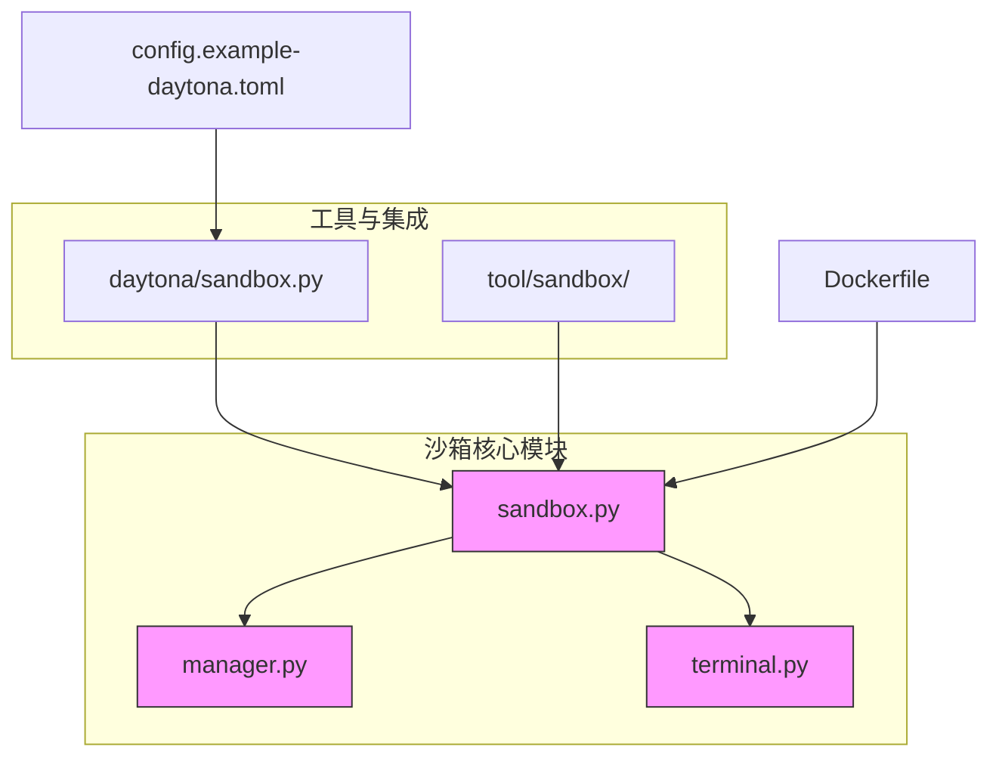
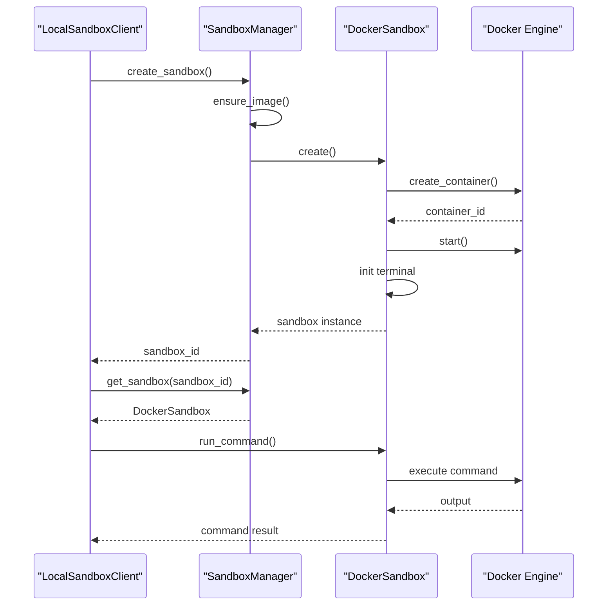
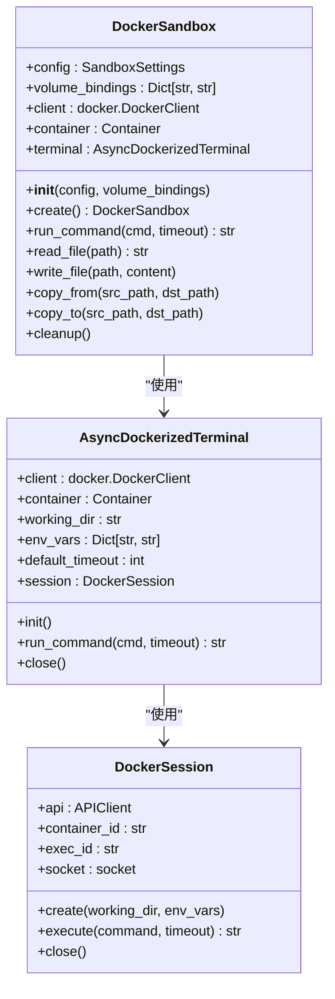
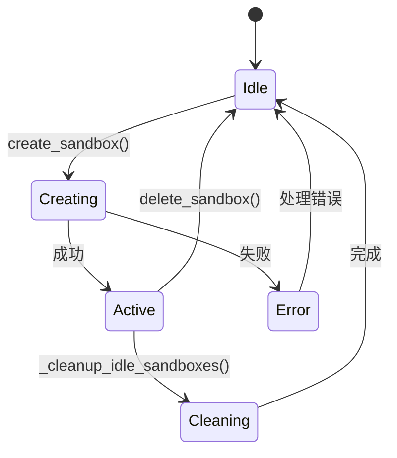
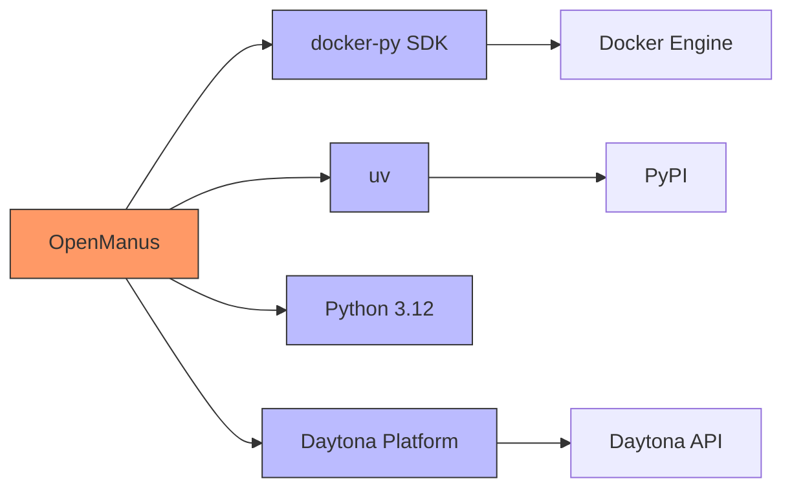

# Docker集成

<cite>
**本文档中引用的文件**  
- [Dockerfile](file://Dockerfile)
- [sandbox.py](file://app/sandbox/core/sandbox.py)
- [manager.py](file://app/sandbox/core/manager.py)
- [terminal.py](file://app/sandbox/core/terminal.py)
- [sandbox.py](file://app/daytona/sandbox.py)
- [config.example-daytona.toml](file://config/config.example-daytona.toml)
</cite>

## 目录
1. [简介](#简介)
2. [项目结构](#项目结构)
3. [核心组件](#核心组件)
4. [架构概述](#架构概述)
5. [详细组件分析](#详细组件分析)
6. [依赖分析](#依赖分析)
7. [性能考虑](#性能考虑)
8. [故障排除指南](#故障排除指南)
9. [结论](#结论)

## 简介
OpenManus通过Docker SDK实现了Docker容器技术的深度集成，为AI代理提供了一个安全、隔离且可配置的沙箱执行环境。该系统利用Docker容器化技术，确保代码执行的标准化和安全性，同时支持与Daytona平台的无缝集成。本文档详细说明了Docker集成的各个方面，包括基础镜像配置、容器创建参数、镜像管理策略以及与外部平台的兼容性要求。

## 项目结构
OpenManus的Docker集成主要围绕`app/sandbox`目录下的核心模块构建。该系统采用分层架构，将沙箱管理、容器操作和文件系统交互分离，确保了代码的可维护性和扩展性。



**Diagram sources**
- [sandbox.py](file://app/sandbox/core/sandbox.py)
- [manager.py](file://app/sandbox/core/manager.py)
- [terminal.py](file://app/sandbox/core/terminal.py)
- [daytona/sandbox.py](file://app/daytona/sandbox.py)
- [Dockerfile](file://Dockerfile)
- [config.example-daytona.toml](file://config/config.example-daytona.toml)

**Section sources**
- [app/sandbox/core](file://app/sandbox/core)
- [app/daytona](file://app/daytona)

## 核心组件
OpenManus的Docker集成由几个核心组件构成：`DockerSandbox`类负责容器的生命周期管理，`SandboxManager`类提供沙箱实例的集中管理，`AsyncDockerizedTerminal`类实现异步命令执行，以及`Dockerfile`定义了基础运行环境。这些组件协同工作，为AI代理提供了一个稳定可靠的执行沙箱。

**Section sources**
- [sandbox.py](file://app/sandbox/core/sandbox.py)
- [manager.py](file://app/sandbox/core/manager.py)
- [terminal.py](file://app/sandbox/core/terminal.py)
- [Dockerfile](file://Dockerfile)

## 架构概述
OpenManus的Docker集成架构采用客户端-管理器-容器的三层模式。`LocalSandboxClient`作为外部接口，`SandboxManager`负责资源调度和生命周期管理，而`DockerSandbox`直接与Docker守护进程交互。这种设计实现了关注点分离，提高了系统的可扩展性和可靠性。



**Diagram sources**
- [sandbox.py](file://app/sandbox/core/sandbox.py)
- [manager.py](file://app/sandbox/core/manager.py)
- [client.py](file://app/sandbox/client.py)

## 详细组件分析

### DockerSandbox分析
`DockerSandbox`是OpenManus中Docker集成的核心类，负责单个沙箱容器的创建、管理和销毁。它封装了Docker SDK的复杂性，为上层应用提供了一个简洁的接口。

#### 类图


**Diagram sources**
- [sandbox.py](file://app/sandbox/core/sandbox.py)
- [terminal.py](file://app/sandbox/core/terminal.py)

**Section sources**
- [sandbox.py](file://app/sandbox/core/sandbox.py#L17-L461)
- [terminal.py](file://app/sandbox/core/terminal.py#L250-L345)

### SandboxManager分析
`SandboxManager`负责管理多个`DockerSandbox`实例的生命周期，提供资源限制、自动清理和并发控制功能。它确保系统资源的合理分配，防止沙箱实例无限增长。

#### 状态图


**Diagram sources**
- [manager.py](file://app/sandbox/core/manager.py#L13-L312)

**Section sources**
- [manager.py](file://app/sandbox/core/manager.py#L13-L312)

### Dockerfile配置分析
`Dockerfile`定义了OpenManus沙箱环境的基础镜像和运行时依赖。它基于`python:3.12-slim`构建，确保了轻量级和安全性，同时安装了必要的工具以支持AI代理的执行需求。

#### 构建流程图
```mermaid
flowchart TD
Start([开始]) --> BaseImage["FROM python:3.12-slim"]
BaseImage --> WorkDir["WORKDIR /app/OpenManus"]
WorkDir --> InstallDeps["RUN apt-get update && apt-get install -y git curl"]
InstallDeps --> InstallUV["RUN pip install uv"]
InstallUV --> CopyFiles["COPY . ."]
CopyFiles --> InstallPython["RUN uv pip install --system -r requirements.txt"]
InstallPython --> SetCmd["CMD [\"bash\"]"]
SetCmd --> End([完成])
```

**Diagram sources**
- [Dockerfile](file://Dockerfile)

**Section sources**
- [Dockerfile](file://Dockerfile)

## 依赖分析
OpenManus的Docker集成依赖于多个关键组件和外部服务。系统通过`docker-py` SDK与Docker守护进程通信，利用`uv`作为Python包管理器，并通过配置文件与Daytona平台集成。



**Diagram sources**
- [go.mod](file://go.mod)
- [requirements.txt](file://requirements.txt)
- [config.example-daytona.toml](file://config/config.example-daytona.toml)

**Section sources**
- [requirements.txt](file://requirements.txt)
- [config.example-daytona.toml](file://config/config.example-daytona.toml)

## 性能考虑
OpenManus的Docker集成在性能方面进行了多项优化。通过异步I/O操作，系统能够高效地处理多个并发的沙箱请求。资源限制配置确保了单个沙箱不会耗尽系统资源，而自动清理机制则防止了资源泄漏。

- **CPU限制**：通过`cpu_quota`参数限制容器的CPU使用率
- **内存限制**：通过`mem_limit`参数设置容器的内存上限
- **超时控制**：所有命令执行都设有超时机制，防止无限等待
- **并发控制**：`SandboxManager`使用锁机制管理并发操作

## 故障排除指南
当Docker集成出现问题时，可以参考以下常见问题的解决方案：

1. **镜像拉取失败**：检查网络连接，确保Docker守护进程正常运行
2. **容器创建失败**：检查资源限制配置，确保系统有足够的内存和CPU
3. **命令执行超时**：增加`timeout`配置值，或优化执行的命令
4. **文件复制失败**：检查路径权限，确保目标目录存在
5. **网络连接问题**：验证`network_enabled`配置，确保网络模式正确

**Section sources**
- [sandbox.py](file://app/sandbox/core/sandbox.py)
- [manager.py](file://app/sandbox/core/manager.py)
- [terminal.py](file://app/sandbox/core/terminal.py)

## 结论
OpenManus通过精心设计的Docker集成，为AI代理提供了一个安全、可靠且高效的执行环境。系统通过`DockerSandbox`和`SandboxManager`的协同工作，实现了沙箱的自动化管理，而`Dockerfile`的标准化配置确保了环境的一致性。与Daytona平台的集成进一步扩展了系统的功能，使其能够支持更复杂的AI应用场景。未来的工作可以集中在性能优化和安全增强上，以提供更强大的沙箱执行能力。