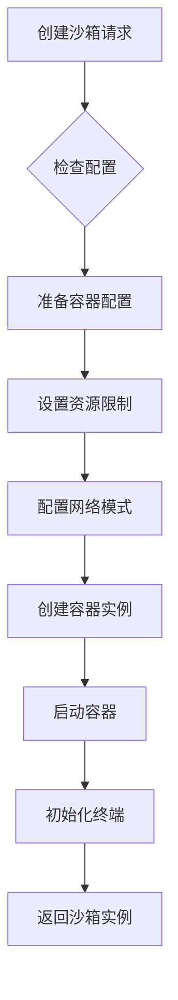
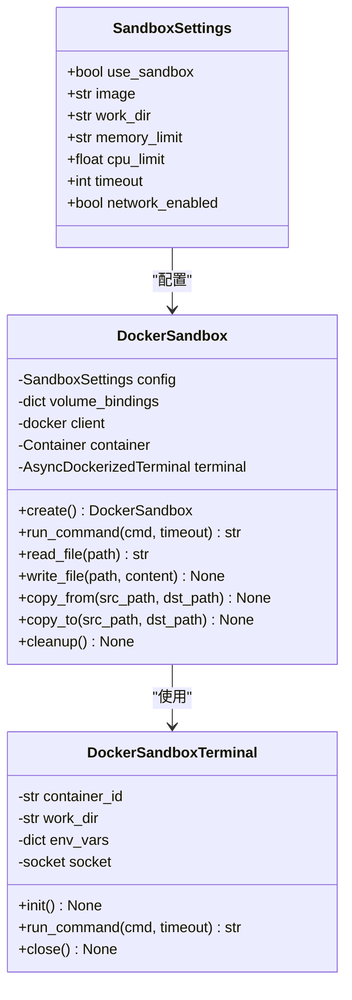
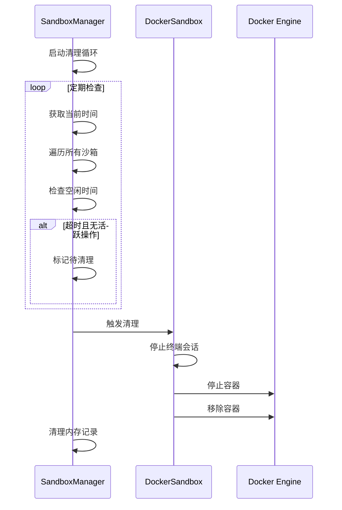
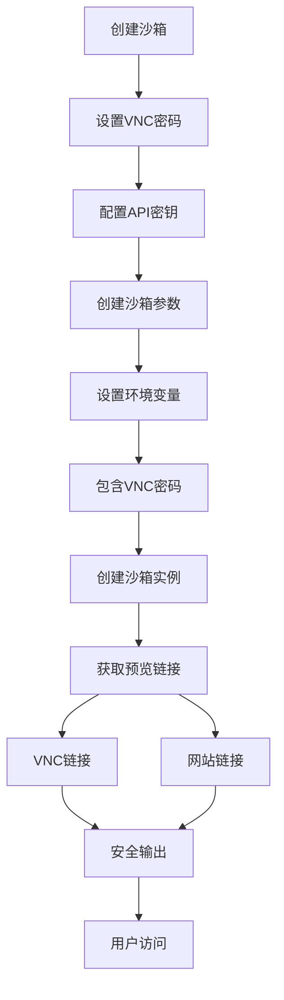

# 安全控制

<cite>
**本文档引用的文件**
- [DockerSandbox](file://app/sandbox/core/sandbox.py)
- [SandboxManager](file://app/sandbox/core/manager.py)
- [SandboxSettings](file://app/config.py)
- [daytona/sandbox.py](file://app/daytona/sandbox.py)
- [config.example-daytona.toml](file://config/config.example-daytona.toml)
- [config.example.toml](file://config/config.example.toml)
- [sandbox_agent.py](file://app/agent/sandbox_agent.py)
- [tool_base.py](file://app/daytona/tool_base.py)
</cite>

## 目录
1. [执行环境隔离机制](#执行环境隔离机制)
2. [权限最小化与资源配额](#权限最小化与资源配额)
3. [沙箱空闲超时清理机制](#沙箱空闲超时清理机制)
4. [Daytona平台集成安全](#daytona平台集成安全)
5. [安全审计与监控](#安全审计与监控)

## 执行环境隔离机制

系统采用基于Docker的沙箱隔离机制，为每个执行环境提供独立的容器化运行空间。通过`DockerSandbox`类实现容器的创建与管理，确保代码执行在隔离环境中进行，防止对宿主机系统造成影响。

沙箱创建过程中，容器被配置为无特权模式运行，通过Docker API的`host_config`参数明确禁用特权模式。容器的网络模式根据配置动态设置：当`network_enabled`为`False`时，网络模式设置为`none`，完全隔离网络访问；当为`True`时，使用`bridge`模式提供有限网络连接。

容器的主机名被固定为`sandbox`，工作目录设置为`/workspace`，并通过`tail -f /dev/null`命令保持容器运行状态。这种设计确保了执行环境的稳定性和可预测性，同时防止了容器逃逸等安全风险。

**图示来源**
- [DockerSandbox](file://app/sandbox/core/sandbox.py#L17-L461)

**本节来源**
- [DockerSandbox](file://app/sandbox/core/sandbox.py#L17-L461)

## 权限最小化与资源配额

系统通过`SandboxSettings`配置类实现权限最小化原则和资源配额限制。该配置类定义了沙箱环境的各项安全参数，确保执行环境遵循最小权限原则。

CPU和内存资源受到严格限制：`cpu_limit`字段控制CPU使用配额，通过`cpu_quota`参数实现；`memory_limit`字段设置内存使用上限，防止资源耗尽攻击。默认配置下，内存限制为"512m"，CPU限制为1.0核心，可根据需要调整。

网络访问控制通过`network_enabled`布尔字段实现，默认值为`False`，即默认禁用网络访问。只有在明确需要网络功能时才启用，有效降低了外部攻击面。文件系统访问通过`_safe_resolve_path`方法进行路径安全检查，阻止`..`等路径遍历攻击。

**图示来源**
- [SandboxSettings](file://app/config.py#L93-L104)
- [DockerSandbox](file://app/sandbox/core/sandbox.py#L17-L461)

**本节来源**
- [SandboxSettings](file://app/config.py#L93-L104)
- [DockerSandbox](file://app/sandbox/core/sandbox.py#L17-L461)

## 沙箱空闲超时清理机制

系统实现了自动化的沙箱空闲超时清理机制，通过`SandboxManager`类管理沙箱生命周期，有效降低长期运行的安全风险。该机制通过定期检查和自动清理闲置沙箱，确保资源及时释放。

`SandboxManager`维护一个清理任务循环，检查间隔由`cleanup_interval`参数控制，默认为300秒。每个沙箱的最后使用时间被记录在`_last_used`字典中。当沙箱空闲时间超过`idle_timeout`设定值（默认3600秒）且无活跃操作时，系统将自动触发清理流程。

清理过程包含多个安全步骤：首先检查沙箱是否有活跃操作，若有则等待完成或超时；然后调用沙箱自身的`cleanup`方法停止并移除容器；最后从管理器中移除沙箱记录。这种分阶段的清理机制确保了数据完整性和系统稳定性。

**图示来源**
- [SandboxManager](file://app/sandbox/core/manager.py#L13-L312)

**本节来源**
- [SandboxManager](file://app/sandbox/core/manager.py#L13-L312)

## Daytona平台集成安全

系统与Daytona平台集成，通过`daytona/sandbox.py`模块实现安全的远程沙箱管理。集成方案包含VNC访问密码保护、API密钥管理和安全的访问链接传输机制。

VNC访问通过环境变量`VNC_PASSWORD`进行密码保护，该密码在创建沙箱时通过`CreateSandboxFromImageParams`的`env_vars`参数传递。默认密码在`config.example-daytona.toml`中配置为"123456"，建议用户修改为强密码。VNC服务运行在沙箱内部，通过6080端口暴露。

API密钥管理通过`DaytonaConfig`类实现，密钥存储在配置文件中，通过`daytona_api_key`字段读取。系统在初始化时验证API密钥的有效性，并记录配置状态。密钥不硬编码在源代码中，而是通过配置文件管理，便于轮换和安全管理。

访问链接的安全传输通过日志记录和控制台输出实现。系统在创建沙箱后，获取VNC和网站预览链接，并通过安全的日志系统输出。链接包含随机生成的子域名，增加了猜测难度，有效防止未授权访问。

**图示来源**
- [daytona/sandbox.py](file://app/daytona/sandbox.py#L0-L165)
- [config.example-daytona.toml](file://config/config.example-daytona.toml#L97-L113)

**本节来源**
- [daytona/sandbox.py](file://app/daytona/sandbox.py#L0-L165)
- [config.example-daytona.toml](file://config/config.example-daytona.toml#L97-L113)

## 安全审计与监控

系统实现了全面的安全审计日志记录和异常行为监控机制。通过结构化的日志系统，记录所有关键安全事件，便于事后审计和问题排查。

日志记录使用`structlog`库实现，支持本地开发环境的控制台输出和生产环境的JSON格式输出。日志级别可配置，包含DEBUG、INFO、WARNING、ERROR和CRITICAL五个级别。所有沙箱操作，包括创建、使用和清理，都被详细记录，包含时间戳、文件名和行号等上下文信息。

异常行为监控主要通过沙箱管理器的错误处理机制实现。当沙箱创建失败、命令执行超时或清理过程出错时，系统会记录详细的错误信息，包括异常类型和堆栈跟踪。`SandboxManager`的`get_stats`方法提供实时监控数据，包括活跃沙箱数量、最大限制和清理状态。

安全审计重点关注沙箱生命周期管理，记录每个沙箱的创建时间、最后使用时间和清理时间。这些数据可用于分析系统使用模式，检测异常行为，如频繁创建沙箱或长时间占用资源等潜在安全威胁。

**本节来源**
- [logger.py](file://app/utils/logger.py#L0-L31)
- [SandboxManager](file://app/sandbox/core/manager.py#L299-L312)
- [DockerSandbox](file://app/sandbox/core/sandbox.py#L445-L461)