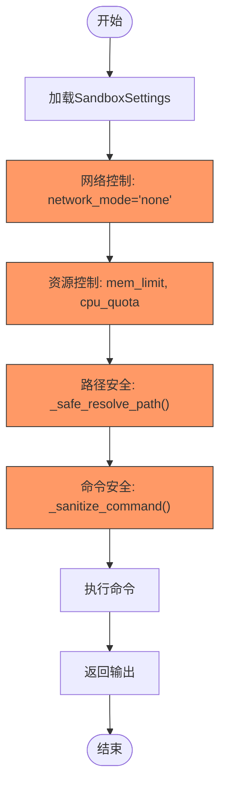

# 执行环境

<cite>
**本文档引用的文件**
- [manager.py](file://app/sandbox/core/manager.py)
- [sandbox.py](file://app/sandbox/core/sandbox.py)
- [terminal.py](file://app/sandbox/core/terminal.py)
- [client.py](file://app/sandbox/client.py)
- [config.py](file://app/config.py)
- [sandbox.py](file://app/daytona/sandbox.py)
</cite>

## 目录
1. [简介](#简介)
2. [项目结构](#项目结构)
3. [核心组件](#核心组件)
4. [架构概述](#架构概述)
5. [详细组件分析](#详细组件分析)
6. [依赖分析](#依赖分析)
7. [性能考虑](#性能考虑)
8. [故障排除指南](#故障排除指南)
9. [结论](#结论)

## 简介
本文档详细描述了OpenManus平台中执行环境的架构设计，重点介绍基于Docker的沙箱机制如何提供安全隔离和资源控制。文档涵盖了沙箱管理器、终端管理器、安全控制策略以及与Daytona平台的集成方式，旨在帮助用户理解执行环境的可靠性和安全性。

## 项目结构
执行环境的核心功能位于`app/sandbox`目录下，主要包含以下子模块：
- `core`：包含沙箱核心实现，包括沙箱管理器、沙箱实例和终端管理
- `client`：提供沙箱客户端接口
- `daytona`：与Daytona平台集成的相关实现

此外，配置信息在`app/config.py`中定义，测试代码位于`tests/sandbox`目录。

**图源**
- [manager.py](file://app/sandbox/core/manager.py#L13-L312)
- [sandbox.py](file://app/sandbox/core/sandbox.py#L17-L461)
- [terminal.py](file://app/sandbox/core/terminal.py#L250-L345)
- [config.py](file://app/config.py#L300-L372)
- [sandbox.py](file://app/daytona/sandbox.py#L1-L165)

**本节来源**
- [app/sandbox/core/manager.py](file://app/sandbox/core/manager.py#L13-L312)
- [app/sandbox/core/sandbox.py](file://app/sandbox/core/sandbox.py#L17-L461)
- [app/sandbox/core/terminal.py](file://app/sandbox/core/terminal.py#L250-L345)

## 核心组件
执行环境的核心组件包括沙箱管理器（SandboxManager）、沙箱实例（DockerSandbox）和终端管理器（AsyncDockerizedTerminal）。这些组件协同工作，提供安全的容器化执行环境。

**本节来源**
- [manager.py](file://app/sandbox/core/manager.py#L13-L312)
- [sandbox.py](file://app/sandbox/core/sandbox.py#L17-L461)
- [terminal.py](file://app/sandbox/core/terminal.py#L250-L345)

## 架构概述
执行环境采用分层架构设计，从上到下分为客户端层、管理器层、沙箱层和终端层。这种设计实现了关注点分离，提高了系统的可维护性和可扩展性。

**图源**
- [manager.py](file://app/sandbox/core/manager.py#L13-L312)
- [sandbox.py](file://app/sandbox/core/sandbox.py#L17-L461)
- [terminal.py](file://app/sandbox/core/terminal.py#L250-L345)

## 详细组件分析

### 沙箱管理器分析
沙箱管理器（SandboxManager）负责管理多个沙箱实例的生命周期，包括创建、监控和清理。它提供了并发访问控制和自动清理机制。

**图源**
- [manager.py](file://app/sandbox/core/manager.py#L13-L312)
- [sandbox.py](file://app/sandbox/core/sandbox.py#L17-L461)

### 终端管理器分析
终端管理器（AsyncDockerizedTerminal）提供异步终端功能，允许与Docker容器进行交互式命令执行，并具有超时控制。

**图源**
- [terminal.py](file://app/sandbox/core/terminal.py#L250-L345)
- [sandbox.py](file://app/sandbox/core/sandbox.py#L17-L461)

### 安全控制策略
执行环境实现了多层次的安全控制策略，包括权限限制、网络访问控制和资源配额。

**图源**
- [sandbox.py](file://app/sandbox/core/sandbox.py#L17-L461)
- [terminal.py](file://app/sandbox/core/terminal.py#L250-L345)

### Daytona平台集成
执行环境通过Daytona SDK与Daytona平台集成，实现远程沙箱的创建、启动和管理。

**图源**
- [sandbox.py](file://app/daytona/sandbox.py#L1-L165)
- [config.py](file://app/config.py#L300-L372)

## 依赖分析
执行环境的组件之间存在明确的依赖关系，确保了系统的模块化和可维护性。

**图源**
- [manager.py](file://app/sandbox/core/manager.py#L13-L312)
- [sandbox.py](file://app/sandbox/core/sandbox.py#L17-L461)
- [terminal.py](file://app/sandbox/core/terminal.py#L250-L345)
- [client.py](file://app/sandbox/client.py#L1-L201)
- [config.py](file://app/config.py#L1-L372)
- [sandbox.py](file://app/daytona/sandbox.py#L1-L165)

**本节来源**
- [manager.py](file://app/sandbox/core/manager.py#L13-L312)
- [sandbox.py](file://app/sandbox/core/sandbox.py#L17-L461)
- [terminal.py](file://app/sandbox/core/terminal.py#L250-L345)
- [client.py](file://app/sandbox/client.py#L1-L201)
- [config.py](file://app/config.py#L1-L372)
- [sandbox.py](file://app/daytona/sandbox.py#L1-L165)

## 性能考虑
执行环境在设计时考虑了性能优化，包括并发操作、资源清理和超时控制。

**本节来源**
- [manager.py](file://app/sandbox/core/manager.py#L13-L312)
- [sandbox.py](file://app/sandbox/core/sandbox.py#L17-L461)
- [terminal.py](file://app/sandbox/core/terminal.py#L250-L345)

## 故障排除指南
当执行环境出现问题时，可以参考以下常见问题的解决方案。

**本节来源**
- [manager.py](file://app/sandbox/core/manager.py#L13-L312)
- [sandbox.py](file://app/sandbox/core/sandbox.py#L17-L461)
- [terminal.py](file://app/sandbox/core/terminal.py#L250-L345)

## 结论
OpenManus的执行环境通过基于Docker的沙箱机制提供了安全隔离和资源控制。沙箱管理器负责管理多个沙箱实例的生命周期，终端管理器处理命令执行和输出流。安全控制策略包括权限限制、网络访问控制和资源配额。通过与Daytona平台的集成，实现了远程沙箱的创建和管理。整体架构设计合理，性能优化到位，为用户提供了一个可靠和安全的执行环境。