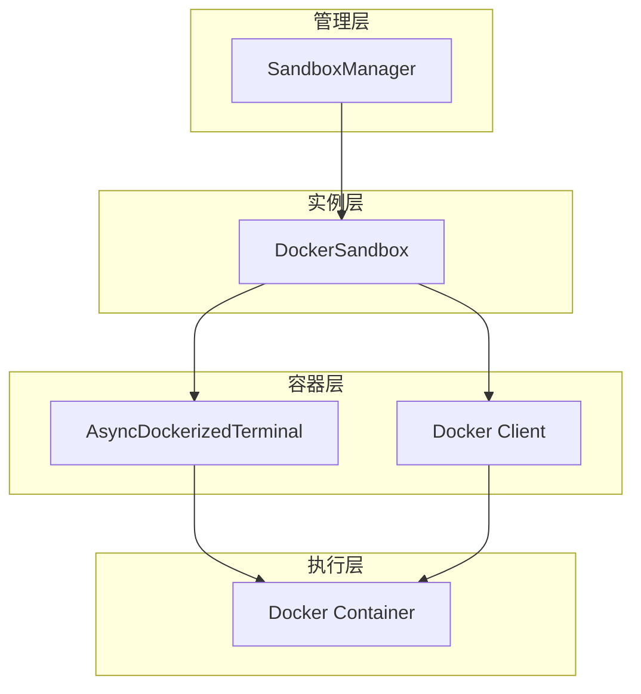
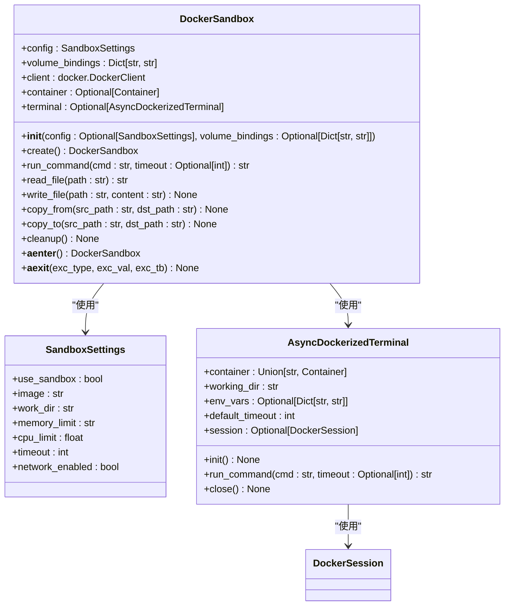
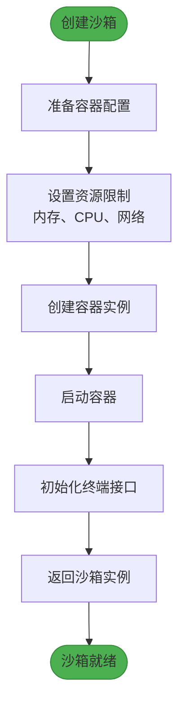
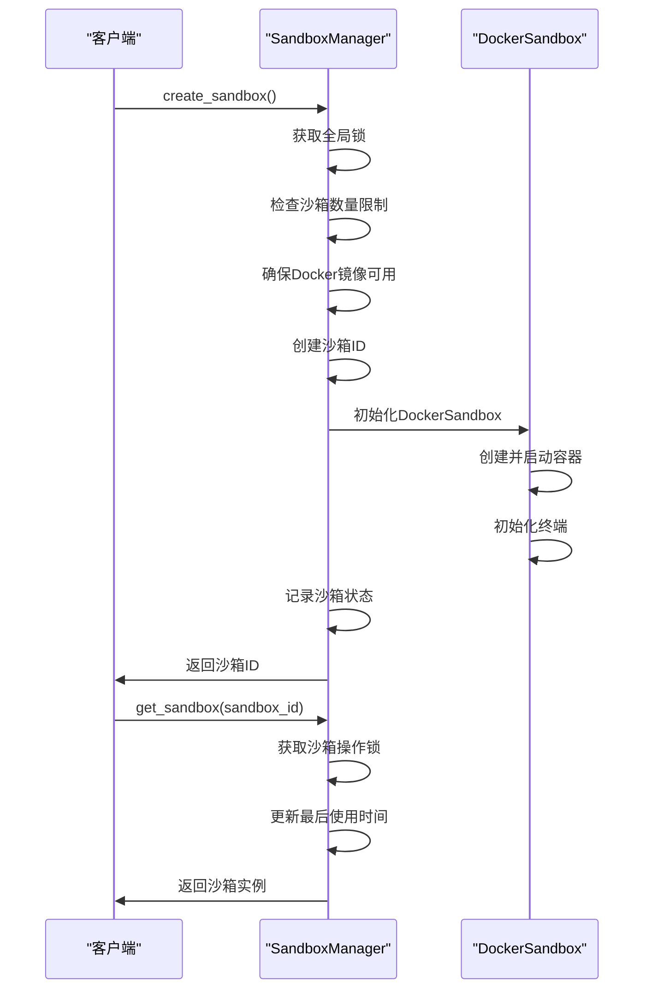
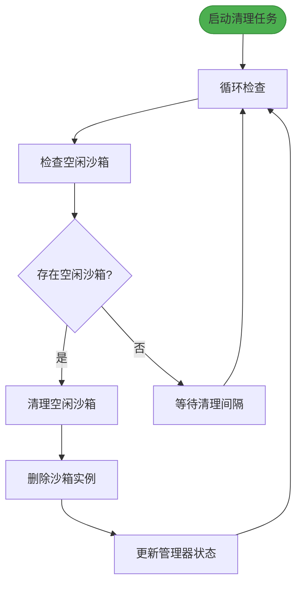
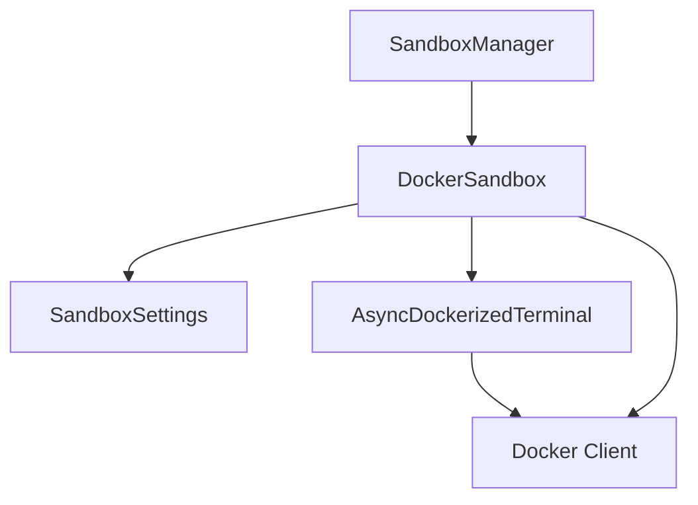

# 沙箱机制

<cite>
**Referenced Files in This Document**   
- [DockerSandbox](file://app/sandbox/core/sandbox.py#L17-L461)
- [SandboxSettings](file://app/config.py#L93-L104)
- [SandboxManager](file://app/sandbox/core/manager.py#L13-L312)
- [AsyncDockerizedTerminal](file://app/sandbox/core/terminal.py#L250-L345)
- [SandboxTimeoutError](file://app/sandbox/core/exceptions.py#L11-L12)
</cite>

## 目录
1. [简介](#简介)
2. [核心组件](#核心组件)
3. [架构概述](#架构概述)
4. [详细组件分析](#详细组件分析)
5. [依赖分析](#依赖分析)
6. [性能考虑](#性能考虑)
7. [故障排除指南](#故障排除指南)
8. [结论](#结论)

## 简介
本文档详细描述了OpenManus项目中沙箱机制的架构设计与实现。该机制通过Docker容器技术为代码执行提供安全隔离的环境，确保系统稳定性和安全性。核心功能包括容器化执行环境的生命周期管理、资源限制、文件操作和命令执行。文档重点分析DockerSandbox类如何实现容器化执行环境的创建、运行和销毁，SandboxSettings配置模型的设计与作用，以及SandboxManager对多个沙箱实例的并发控制和自动清理策略。

## 核心组件
沙箱机制由三个核心组件构成：DockerSandbox类负责单个沙箱实例的生命周期管理，SandboxSettings类定义沙箱的配置参数，SandboxManager类管理多个沙箱实例的并发操作和资源调度。这些组件协同工作，提供了一个安全、可控的代码执行环境。

**Section sources**
- [DockerSandbox](file://app/sandbox/core/sandbox.py#L17-L461)
- [SandboxSettings](file://app/config.py#L93-L104)
- [SandboxManager](file://app/sandbox/core/manager.py#L13-L312)

## 架构概述
沙箱机制采用分层架构设计，上层为SandboxManager管理器，中层为DockerSandbox沙箱实例，底层为Docker容器和终端接口。SandboxManager负责全局资源管理和并发控制，DockerSandbox封装单个容器的生命周期操作，而底层的Docker客户端和终端接口处理具体的容器交互。

**Diagram sources**
- [SandboxManager](file://app/sandbox/core/manager.py#L13-L312)
- [DockerSandbox](file://app/sandbox/core/sandbox.py#L17-L461)
- [AsyncDockerizedTerminal](file://app/sandbox/core/terminal.py#L250-L345)

## 详细组件分析

### DockerSandbox类分析
DockerSandbox类是沙箱机制的核心，负责创建和管理单个Docker容器实例。它通过Docker SDK与Docker守护进程交互，实现容器的创建、启动、命令执行和清理。

#### 类关系图

**Diagram sources**
- [DockerSandbox](file://app/sandbox/core/sandbox.py#L17-L461)
- [SandboxSettings](file://app/config.py#L93-L104)
- [AsyncDockerizedTerminal](file://app/sandbox/core/terminal.py#L250-L345)

#### 沙箱创建流程

**Diagram sources**
- [DockerSandbox](file://app/sandbox/core/sandbox.py#L17-L461)

### SandboxSettings配置模型
SandboxSettings类定义了沙箱的配置参数，采用Pydantic模型进行数据验证和类型检查。该配置模型控制沙箱的各个方面，包括镜像选择、资源限制和网络配置。

#### 配置参数表
| 参数 | 类型 | 默认值 | 描述 |
|------|------|--------|------|
| use_sandbox | bool | False | 是否启用沙箱 |
| image | str | python:3.12-slim | 基础镜像 |
| work_dir | str | /workspace | 容器工作目录 |
| memory_limit | str | 512m | 内存限制 |
| cpu_limit | float | 1.0 | CPU限制 |
| timeout | int | 300 | 命令超时时间(秒) |
| network_enabled | bool | False | 是否允许网络访问 |

**Section sources**
- [SandboxSettings](file://app/config.py#L93-L104)

### SandboxManager管理器分析
SandboxManager类负责管理多个DockerSandbox实例的生命周期，提供并发控制、自动清理和资源调度功能。它确保系统资源的有效利用，防止资源泄漏。

#### 并发控制流程

**Diagram sources**
- [SandboxManager](file://app/sandbox/core/manager.py#L13-L312)
- [DockerSandbox](file://app/sandbox/core/sandbox.py#L17-L461)

#### 自动清理机制

**Diagram sources**
- [SandboxManager](file://app/sandbox/core/manager.py#L13-L312)

## 依赖分析
沙箱机制的组件之间存在明确的依赖关系。SandboxManager依赖于DockerSandbox进行具体的容器操作，DockerSandbox依赖于SandboxSettings进行配置管理，同时依赖于AsyncDockerizedTerminal进行终端交互。

**Diagram sources**
- [SandboxManager](file://app/sandbox/core/manager.py#L13-L312)
- [DockerSandbox](file://app/sandbox/core/sandbox.py#L17-L461)
- [SandboxSettings](file://app/config.py#L93-L104)
- [AsyncDockerizedTerminal](file://app/sandbox/core/terminal.py#L250-L345)

## 性能考虑
沙箱机制在设计时充分考虑了性能因素。通过异步I/O操作提高并发处理能力，使用连接池减少Docker API调用开销，以及实现自动清理机制避免资源泄漏。建议根据实际负载调整max_sandboxes、idle_timeout和cleanup_interval等参数，以平衡性能和资源利用率。

## 故障排除指南
沙箱机制提供了完善的异常处理机制。SandboxTimeoutError在命令执行超时时抛出，SandboxError作为所有沙箱相关异常的基类。当遇到问题时，首先检查Docker服务是否正常运行，然后验证配置参数是否正确，最后查看日志中的具体错误信息。

**Section sources**
- [SandboxTimeoutError](file://app/sandbox/core/exceptions.py#L11-L12)
- [SandboxError](file://app/sandbox/core/exceptions.py#L8-L9)

## 结论
OpenManus的沙箱机制通过DockerSandbox、SandboxSettings和SandboxManager三个核心组件，实现了安全、高效的容器化执行环境。该设计具有良好的扩展性和可维护性，能够满足各种代码执行场景的需求。通过合理的配置和管理，可以有效保障系统的稳定性和安全性。