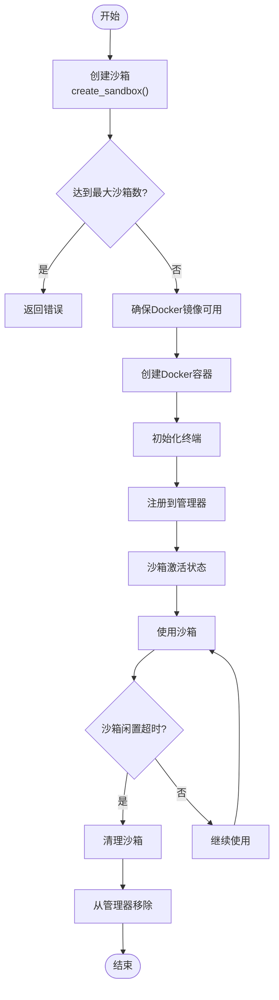
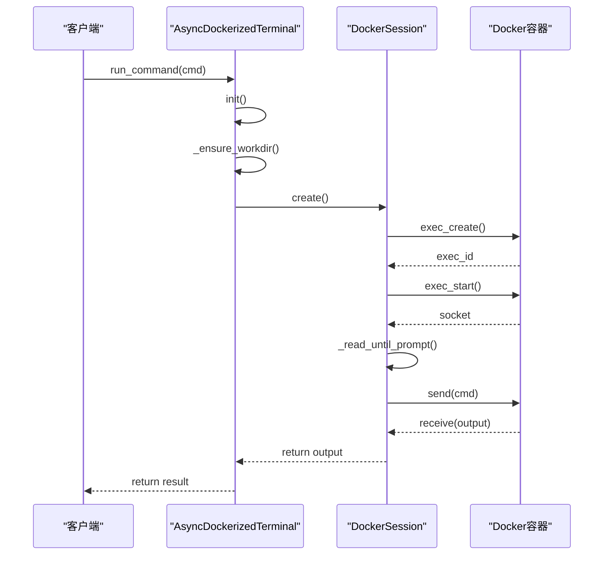
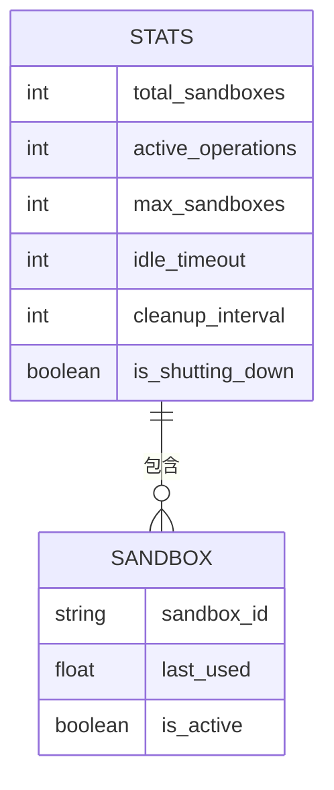
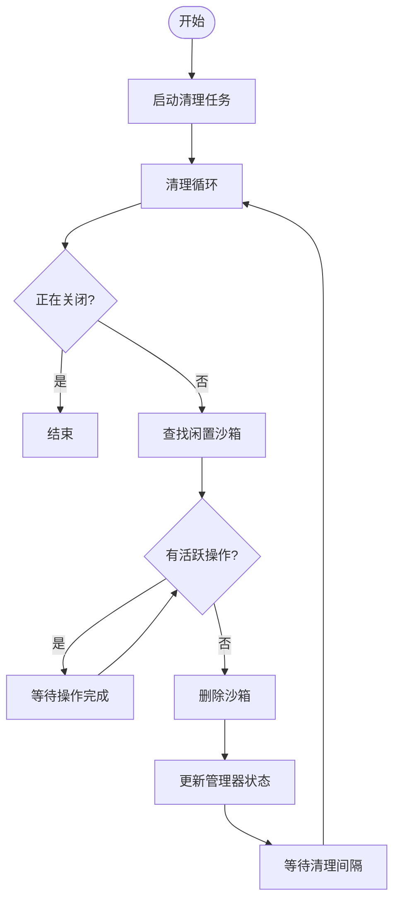

# 资源管理

<cite>
**本文档中引用的文件**   
- [manager.py](file://app/sandbox/core/manager.py)
- [sandbox.py](file://app/sandbox/core/sandbox.py)
- [terminal.py](file://app/sandbox/core/terminal.py)
- [exceptions.py](file://app/sandbox/core/exceptions.py)
- [client.py](file://app/sandbox/client.py)
</cite>

## 目录
1. [引言](#引言)
2. [沙箱资源全生命周期管理](#沙箱资源全生命周期管理)
3. [并发锁与操作状态跟踪](#并发锁与操作状态跟踪)
4. [终端管理器机制](#终端管理器机制)
5. [资源使用统计信息](#资源使用统计信息)
6. [资源泄漏预防与回收](#资源泄漏预防与回收)
7. [结论](#结论)

## 引言
本文档深入解析OpenManus项目中沙箱资源的全生命周期管理机制。重点阐述SandboxManager如何通过并发锁和操作状态跟踪确保资源访问的线程安全，分析终端管理器（Terminal）如何处理命令执行、输入输出流缓冲和会话保持。同时涵盖资源使用统计信息的收集与暴露方式，并提供资源泄漏预防和高效回收的最佳实践指南。

## 沙箱资源全生命周期管理

沙箱资源的全生命周期管理由`SandboxManager`类负责，该类实现了对多个`DockerSandbox`实例的创建、监控和清理管理。生命周期管理包括沙箱的创建、使用、闲置检测和自动清理等关键阶段。



**Diagram sources**
- [manager.py](file://app/sandbox/core/manager.py#L113-L156)
- [sandbox.py](file://app/sandbox/core/sandbox.py#L48-L102)

**Section sources**
- [manager.py](file://app/sandbox/core/manager.py#L13-L312)
- [sandbox.py](file://app/sandbox/core/sandbox.py#L17-L461)

## 并发锁与操作状态跟踪

`SandboxManager`通过多层次的并发控制机制确保资源访问的线程安全。系统采用全局锁和沙箱专属锁相结合的方式，配合操作状态跟踪，有效防止了资源竞争和数据不一致问题。

```mermaid
classDiagram
class SandboxManager {
+max_sandboxes : int
+idle_timeout : int
+cleanup_interval : int
-_sandboxes : Dict[str, DockerSandbox]
-_last_used : Dict[str, float]
-_locks : Dict[str, asyncio.Lock]
-_global_lock : asyncio.Lock
-_active_operations : Set[str]
+create_sandbox() : str
+get_sandbox() : DockerSandbox
+delete_sandbox() : None
+sandbox_operation() : AsyncContextManager
}
class DockerSandbox {
+config : SandboxSettings
+volume_bindings : Dict[str, str]
-_client : docker.client
-_container : Container
-_terminal : AsyncDockerizedTerminal
+create() : DockerSandbox
+run_command() : str
+read_file() : str
+write_file() : None
+cleanup() : None
}
SandboxManager --> DockerSandbox : "管理"
SandboxManager : "_locks : Dict[str, asyncio.Lock]"
SandboxManager : "_global_lock : asyncio.Lock"
SandboxManager : "_active_operations : Set[str]"
```

**Diagram sources**
- [manager.py](file://app/sandbox/core/manager.py#L41-L59)
- [sandbox.py](file://app/sandbox/core/sandbox.py#L42-L45)

**Section sources**
- [manager.py](file://app/sandbox/core/manager.py#L88-L111)
- [manager.py](file://app/sandbox/core/manager.py#L48-L55)

## 终端管理器机制

终端管理器（`AsyncDockerizedTerminal`）负责处理与Docker容器的交互，包括命令执行、输入输出流缓冲和会话保持。它通过`DockerSession`类与Docker API进行底层通信，提供异步的命令执行接口。



**Diagram sources**
- [terminal.py](file://app/sandbox/core/terminal.py#L250-L345)
- [terminal.py](file://app/sandbox/core/terminal.py#L277-L288)

**Section sources**
- [terminal.py](file://app/sandbox/core/terminal.py#L250-L345)
- [terminal.py](file://app/sandbox/core/terminal.py#L277-L288)

## 资源使用统计信息

系统提供了全面的资源使用统计信息收集与暴露机制。通过`get_stats()`方法，可以获取当前沙箱管理器的关键性能指标，包括活跃沙箱数量、操作队列状态和配置参数等。



**Diagram sources**
- [manager.py](file://app/sandbox/core/manager.py#L299-L312)

**Section sources**
- [manager.py](file://app/sandbox/core/manager.py#L299-L312)

## 资源泄漏预防与回收

系统通过自动清理机制有效预防资源泄漏。`SandboxManager`启动一个后台清理任务，定期检查并清理闲置的沙箱。同时，在管理器关闭时，会执行全面的资源清理，确保所有沙箱都被正确回收。



**Diagram sources**
- [manager.py](file://app/sandbox/core/manager.py#L173-L184)
- [manager.py](file://app/sandbox/core/manager.py#L186-L203)

**Section sources**
- [manager.py](file://app/sandbox/core/manager.py#L205-L241)
- [manager.py](file://app/sandbox/core/manager.py#L243-L275)

## 结论
OpenManus项目的沙箱资源管理机制设计完善，通过`SandboxManager`实现了沙箱资源的全生命周期管理。系统采用并发锁和操作状态跟踪确保了线程安全，通过终端管理器实现了高效的命令执行和会话保持。资源使用统计信息的收集与暴露为系统监控提供了有力支持，而自动清理机制则有效预防了资源泄漏。这些机制共同确保了沙箱系统的稳定性和可靠性。