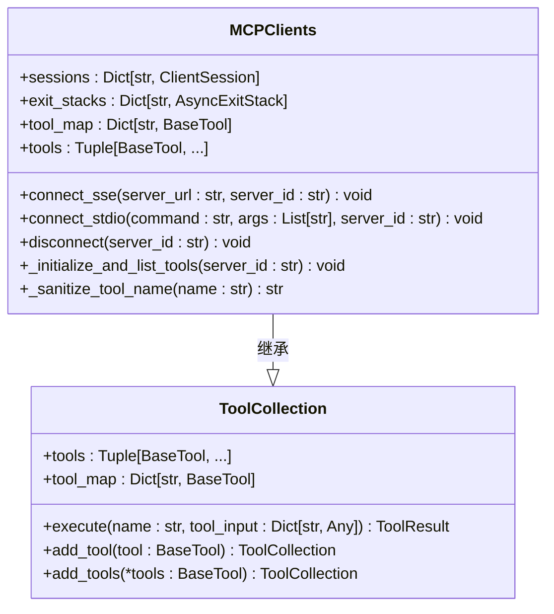
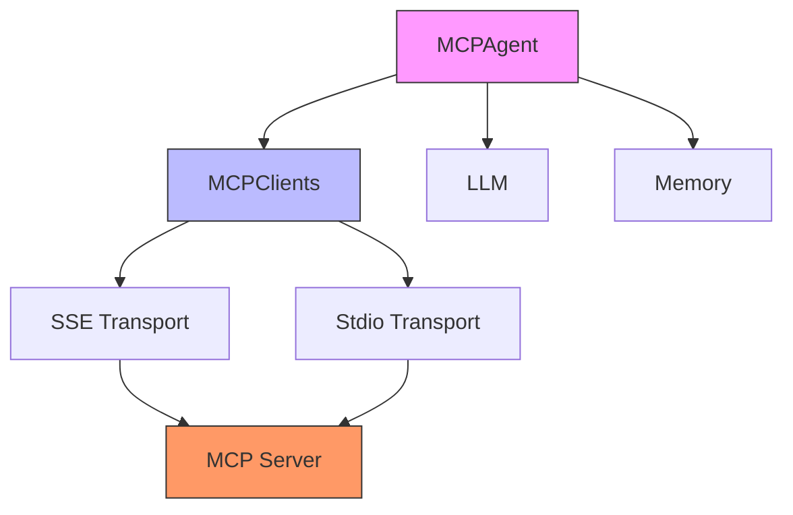
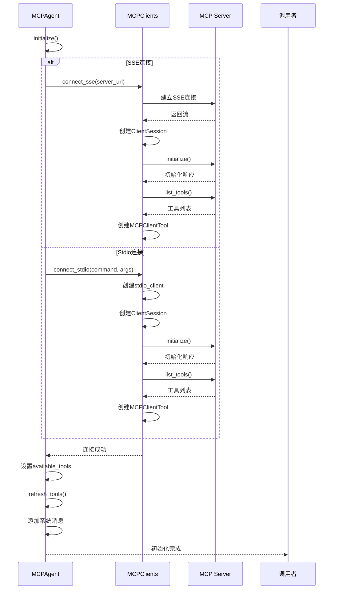
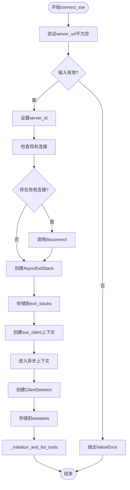
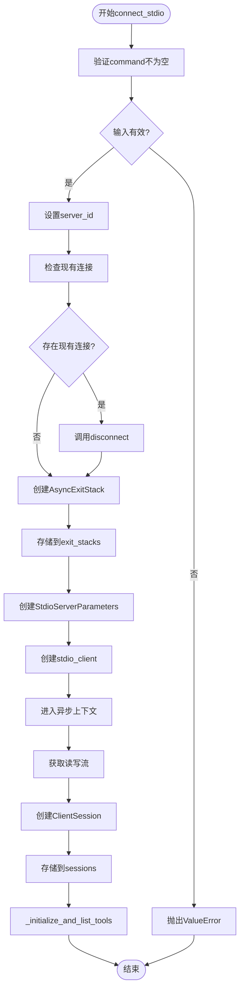
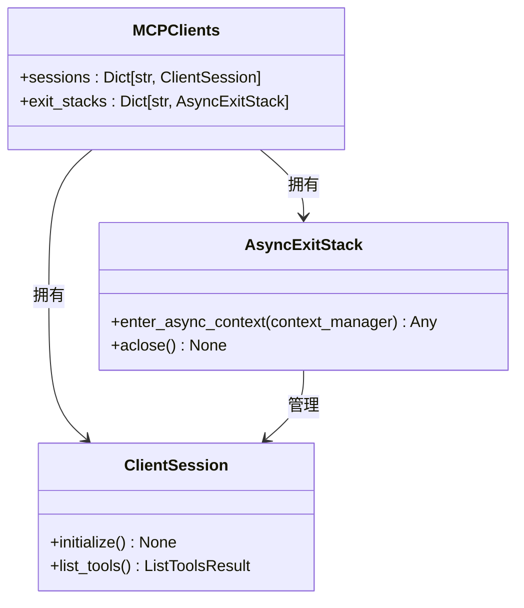
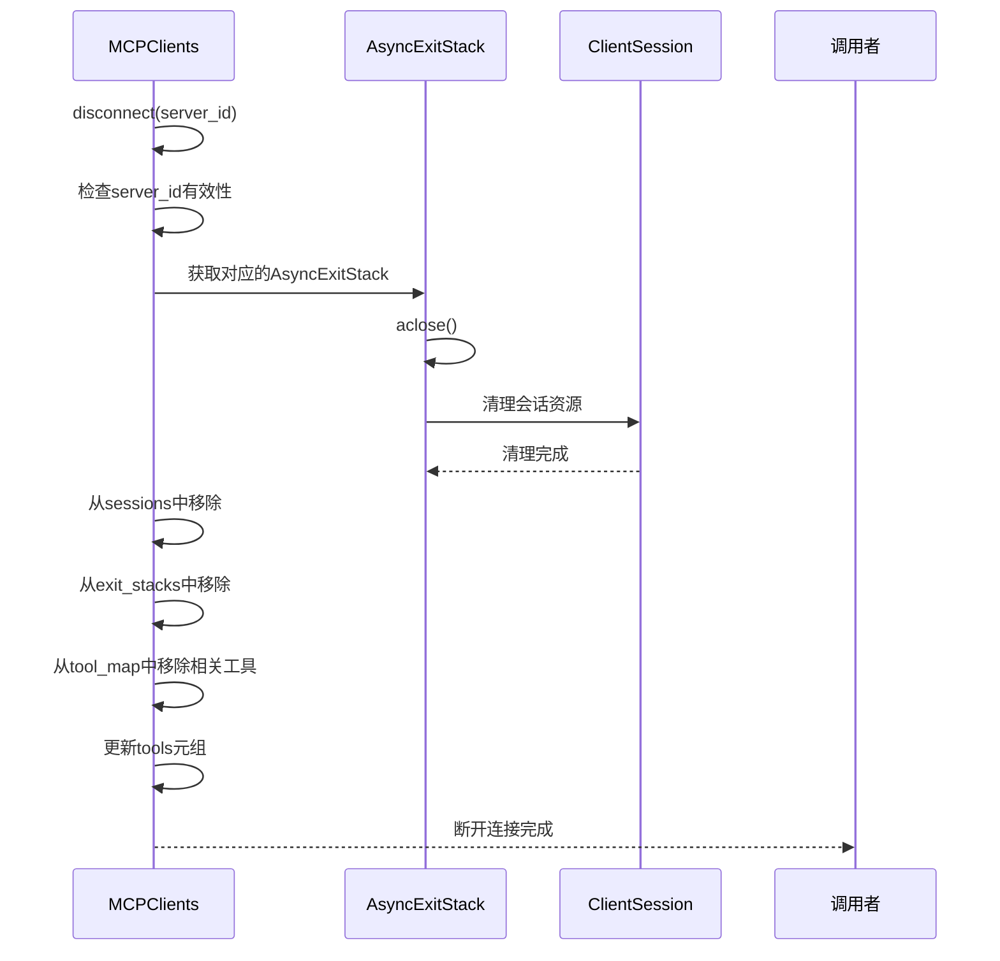
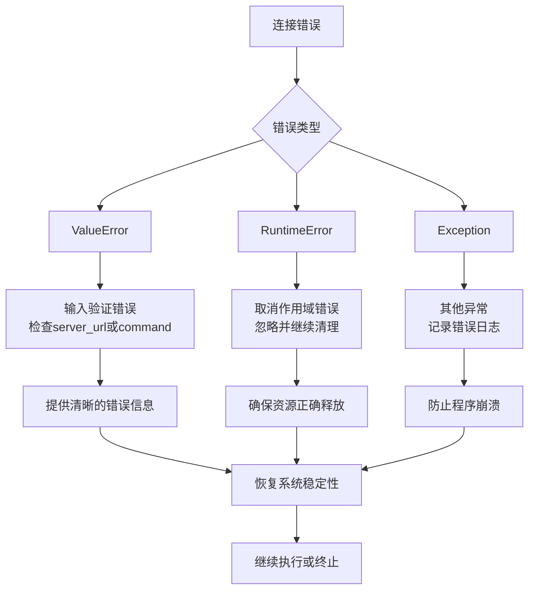

# MCP连接管理

<cite>
**本文档中引用的文件**  
- [MCPClients](file://app/tool/mcp.py)
- [MCPAgent](file://app/agent/mcp.py)
- [server.py](file://app/mcp/server.py)
- [ToolCollection](file://app/tool/tool_collection.py)
- [ReActAgent](file://app/agent/react.py)
</cite>

## 目录
1. [简介](#简介)
2. [核心组件](#核心组件)
3. [连接管理架构](#连接管理架构)
4. [SSE与stdio传输机制](#sse与stdio传输机制)
5. [会话管理与资源清理](#会话管理与资源清理)
6. [连接配置与错误处理](#连接配置与错误处理)
7. [调试技巧与最佳实践](#调试技巧与最佳实践)
8. [结论](#结论)

## 简介
本文档详细描述了OpenManus中MCP（Model Context Protocol）连接管理的实现机制。重点介绍MCPAgent如何通过SSE（Server-Sent Events）和stdio两种传输方式连接MCP服务器，以及MCPClients类如何管理多个MCP会话。文档涵盖了连接过程中的资源管理、会话清理、配置参数、错误处理策略以及开发者调试技巧。

**Section sources**
- [MCPAgent](file://app/agent/mcp.py#L12-L184)
- [MCPClients](file://app/tool/mcp.py#L36-L193)

## 核心组件

### MCPAgent类
MCPAgent是负责与MCP服务器交互的核心代理类。它继承自ToolCallAgent，通过SSE或stdio传输方式连接到MCP服务器，并将服务器提供的工具暴露给代理的工具接口。

该代理在初始化时根据指定的连接类型建立连接，并定期刷新可用工具列表以检测工具的变化。代理还实现了特殊的工具处理逻辑，包括多媒体响应处理和终止条件判断。

**Section sources**
- [MCPAgent](file://app/agent/mcp.py#L12-L184)

### MCPClients类
MCPClients类是管理多个MCP服务器连接的核心组件。它继承自ToolCollection，负责建立和管理与多个MCP服务器的会话，以及工具的注册和管理。

该类维护了会话字典（sessions）、退出栈字典（exit_stacks）和工具映射（tool_map），实现了连接、断开、工具刷新等关键功能。

**Diagram sources**
- [MCPClients](file://app/tool/mcp.py#L36-L193)
- [ToolCollection](file://app/tool/tool_collection.py#L8-L70)

## 连接管理架构

### 架构概览
MCP连接管理采用分层架构设计，由MCPAgent作为高层代理，MCPClients作为底层连接管理器，共同实现与MCP服务器的通信。

**Diagram sources**
- [MCPAgent](file://app/agent/mcp.py#L12-L184)
- [MCPClients](file://app/tool/mcp.py#L36-L193)

### 初始化流程
MCPAgent的初始化流程包括连接建立、工具刷新和系统消息添加三个主要步骤。

**Diagram sources**
- [MCPAgent.initialize](file://app/agent/mcp.py#L39-L84)
- [MCPClients.connect_sse](file://app/tool/mcp.py#L49-L68)
- [MCPClients.connect_stdio](file://app/tool/mcp.py#L70-L94)

## SSE与stdio传输机制

### SSE连接实现
SSE（Server-Sent Events）连接通过HTTP长连接实现服务器到客户端的单向数据推送。MCPClients类的connect_sse方法实现了SSE连接的建立过程。

**Diagram sources**
- [MCPClients.connect_sse](file://app/tool/mcp.py#L49-L68)

### Stdio连接实现
Stdio连接通过标准输入输出流与MCP服务器进程进行通信。MCPClients类的connect_stdio方法实现了stdio连接的建立过程。

**Diagram sources**
- [MCPClients.connect_stdio](file://app/tool/mcp.py#L70-L94)

## 会话管理与资源清理

### 资源管理机制
MCP连接管理使用AsyncExitStack来确保资源的正确管理和清理。每个连接都关联一个AsyncExitStack实例，用于管理会话生命周期内的所有异步资源。

**Diagram sources**
- [MCPClients](file://app/tool/mcp.py#L36-L193)

### 会话清理流程
会话清理通过disconnect方法实现，确保在断开连接时正确释放所有资源。

**Diagram sources**
- [MCPClients.disconnect](file://app/tool/mcp.py#L154-L193)

## 连接配置与错误处理

### 连接配置参数
MCP连接支持多种配置参数，允许开发者灵活配置连接行为。

| 参数 | 类型 | 默认值 | 描述 |
|------|------|--------|------|
| connection_type | str | "stdio" | 连接类型，可选"sse"或"stdio" |
| server_url | str | None | SSE连接的服务器URL |
| command | str | None | stdio连接的命令 |
| args | List[str] | [] | 命令参数列表 |
| server_id | str | "" | 服务器标识符，用于区分多个连接 |

**Section sources**
- [MCPAgent.initialize](file://app/agent/mcp.py#L39-L84)

### 错误处理策略
系统实现了全面的错误处理机制，确保连接过程的稳定性和可靠性。

**Diagram sources**
- [MCPClients.connect_sse](file://app/tool/mcp.py#L49-L68)
- [MCPClients.connect_stdio](file://app/tool/mcp.py#L70-L94)
- [MCPClients.disconnect](file://app/tool/mcp.py#L154-L193)

### 常见问题解决方案
针对常见的连接问题，提供以下解决方案：

1. **连接超时**
   - 检查网络连接是否正常
   - 验证服务器地址和端口是否正确
   - 增加连接超时时间（如果支持）

2. **认证失败**
   - 检查认证凭据是否正确
   - 验证认证令牌是否过期
   - 确认服务器端认证配置

3. **工具不可用**
   - 检查服务器是否正常运行
   - 验证工具是否已正确注册
   - 确认网络连接是否稳定

4. **会话中断**
   - 实现自动重连机制
   - 保存会话状态以便恢复
   - 使用心跳机制检测连接状态

**Section sources**
- [MCPClients](file://app/tool/mcp.py#L36-L193)
- [MCPAgent](file://app/agent/mcp.py#L12-L184)

## 调试技巧与最佳实践

### 调试技巧
1. **日志分析**
   - 启用详细日志记录
   - 监控连接建立和断开过程
   - 跟踪工具调用和响应

2. **连接状态监控**
   - 定期检查会话状态
   - 监控资源使用情况
   - 记录连接生命周期事件

3. **工具刷新检测**
   - 监控工具列表变化
   - 记录工具添加和移除
   - 验证工具模式变更

### 最佳实践
1. **连接管理**
   - 始终在新连接前断开现有连接
   - 使用AsyncExitStack确保资源正确释放
   - 实现优雅的连接关闭流程

2. **错误处理**
   - 提供清晰的错误信息
   - 实现适当的重试机制
   - 记录详细的错误日志

3. **性能优化**
   - 批量处理工具调用
   - 缓存频繁访问的数据
   - 优化连接建立过程

4. **安全性**
   - 验证所有输入参数
   - 实施适当的认证机制
   - 保护敏感信息

**Section sources**
- [MCPClients](file://app/tool/mcp.py#L36-L193)
- [MCPAgent](file://app/agent/mcp.py#L12-L184)

## 结论
OpenManus的MCP连接管理提供了一套完整的机制，支持通过SSE和stdio两种传输方式连接MCP服务器。MCPClients类有效地管理多个会话，使用AsyncExitStack确保资源的正确管理和清理。系统实现了健壮的错误处理机制和灵活的配置选项，为开发者提供了可靠的连接管理解决方案。通过遵循文档中提供的调试技巧和最佳实践，开发者可以更有效地使用和维护MCP连接功能。