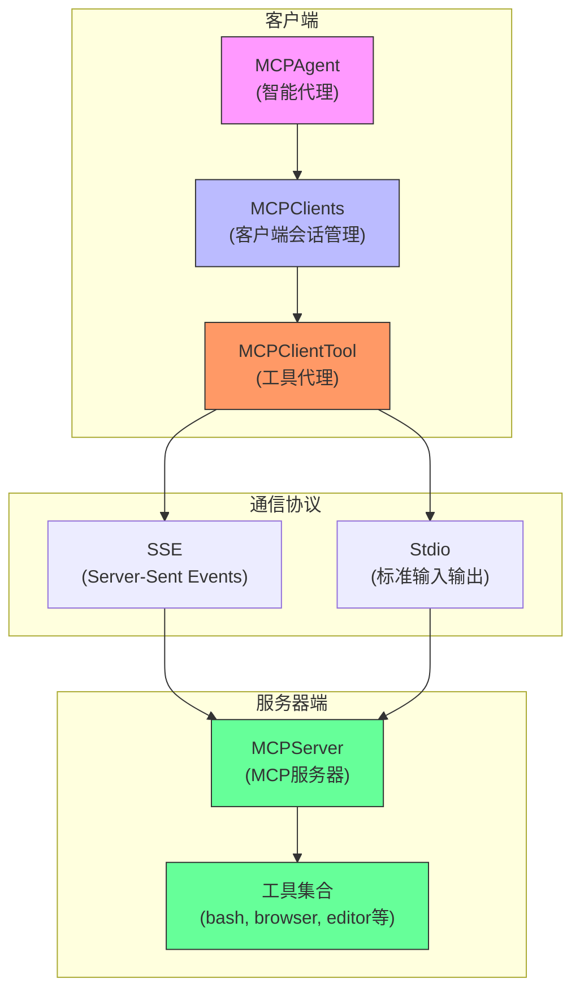
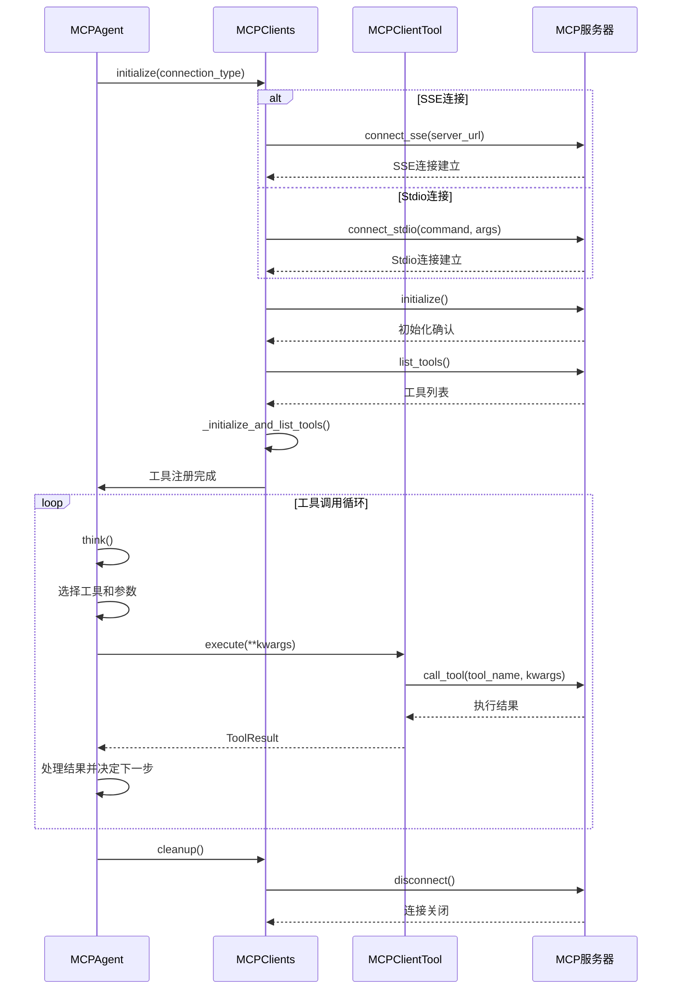

# MCP集成架构

<cite>
**本文档引用的文件**
- [mcp.py](file://app/agent/mcp.py)
- [server.py](file://app/mcp/server.py)
- [mcp.py](file://app/tool/mcp.py)
- [mcp.example.json](file://config/mcp.example.json)
</cite>

## 目录
1. [简介](#简介)
2. [MCPAgent与MCP服务器连接机制](#mcpagent与mcp服务器连接机制)
3. [MCPClients会话管理与工具发现](#mcpcients会话管理与工具发现)
4. [MCPClientTool动态注册与调用机制](#mcpclienttool动态注册与调用机制)
5. [工具模式与特殊工具处理逻辑](#工具模式与特殊工具处理逻辑)
6. [MCP集成架构图](#mcp集成架构图)
7. [协议交互时序图](#协议交互时序图)
8. [MCP服务器集成指南](#mcp服务器集成指南)
9. [工具扩展开发指南](#工具扩展开发指南)
10. [结论](#结论)

## 简介
MCP（Model Context Protocol）集成架构是OpenManus系统的核心组件，实现了智能代理与外部工具服务器的标准化通信。该架构通过MCPAgent、MCPClients和MCPClientTool三个核心组件，构建了一个灵活、可扩展的工具集成框架。MCPAgent作为智能代理，能够通过SSE（Server-Sent Events）或stdio两种传输方式连接到MCP服务器，利用服务器提供的工具完成复杂任务。MCPClients负责管理多个MCP会话和工具发现，而MCPClientTool则实现了工具的动态注册和远程调用。本架构支持动态工具发现和热更新，能够适应运行时工具集的变化，为开发者提供了强大的工具扩展能力。

## MCPAgent与MCP服务器连接机制
MCPAgent是OpenManus系统中负责与MCP服务器交互的核心代理类。它通过两种主要方式连接到MCP服务器：SSE（Server-Sent Events）和stdio（标准输入输出）。连接方式的选择由`connection_type`字段决定，该字段默认值为"stdio"。当`connection_type`设置为"sse"时，MCPAgent通过`connect_sse`方法建立连接，需要提供服务器URL作为参数。当`connection_type`设置为"stdio"时，MCPAgent通过`connect_stdio`方法建立连接，需要提供要执行的命令和参数。

连接过程在`initialize`方法中实现，该方法根据指定的连接类型调用相应的连接方法。对于SSE连接，系统使用`mcp.client.sse.sse_client`创建SSE客户端，建立与服务器的持久化HTTP连接。对于stdio连接，系统使用`mcp.client.stdio.stdio_client`创建stdio客户端，通过进程的标准输入输出流与服务器通信。无论哪种连接方式，系统都使用`AsyncExitStack`确保资源的正确清理。连接成功后，MCPAgent会通过`_initialize_and_list_tools`方法初始化会话并获取服务器提供的工具列表，将这些工具注册到本地工具映射中，使代理能够调用这些远程工具。

**Section sources**
- [mcp.py](file://app/agent/mcp.py#L39-L84)
- [mcp.py](file://app/tool/mcp.py#L49-L68)
- [mcp.py](file://app/tool/mcp.py#L70-L94)

## MCPClients会话管理与工具发现
MCPClients类是MCP客户端工具集合的核心，负责管理与多个MCP服务器的会话以及可用工具的发现。该类通过`sessions`字典管理多个`ClientSession`实例，每个实例对应一个与MCP服务器的连接。`exit_stacks`字典用于管理每个会话的异步资源清理栈，确保连接的正确关闭。当通过`connect_sse`或`connect_stdio`方法建立新连接时，系统会首先检查是否存在同ID的现有会话，如果存在则先断开旧连接，确保连接的唯一性和清洁性。

工具发现机制在`_initialize_and_list_tools`方法中实现。该方法首先调用会话的`initialize`方法初始化连接，然后通过`list_tools`方法获取服务器提供的工具列表。对于每个发现的工具，系统创建一个`MCPClientTool`实例，该实例作为本地代理工具，封装了对远程工具的调用逻辑。工具名称通过`_sanitize_tool_name`方法进行规范化处理，确保符合命名规范。所有发现的工具被存储在`tool_map`字典中，并通过`tools`元组暴露给外部使用。`list_tools`方法可以列出所有已连接服务器的工具，为代理提供完整的工具视图。

**Section sources**
- [mcp.py](file://app/tool/mcp.py#L36-L193)
- [mcp.py](file://app/tool/mcp.py#L96-L125)
- [mcp.py](file://app/tool/mcp.py#L127-L144)

## MCPClientTool动态注册与调用机制
MCPClientTool类代表一个可以代理调用的MCP服务器工具，实现了工具的动态注册和远程调用机制。每个MCPClientTool实例都持有对`ClientSession`的引用，通过该会话与MCP服务器进行通信。`execute`方法是工具调用的核心，它接收关键字参数作为工具输入，通过`session.call_tool`方法向服务器发起远程调用。调用结果被封装在`ToolResult`对象中返回，包含输出内容、错误信息和可能的多媒体数据。

工具的动态注册发生在`_initialize_and_list_tools`方法中，当发现新的MCP服务器工具时，系统会创建相应的MCPClientTool实例并将其添加到`tool_map`中。这种机制允许MCPAgent在运行时动态发现和使用新工具，无需重启或重新配置。工具名称的规范化处理确保了不同服务器上同名工具的唯一性，通过在工具名前添加服务器标识前缀（如`mcp_server1_bash`）来避免命名冲突。`disconnect`方法负责清理与特定服务器的连接，包括关闭会话、清理资源栈和从工具映射中移除相关工具，确保系统状态的一致性。

**Section sources**
- [mcp.py](file://app/tool/mcp.py#L13-L33)
- [mcp.py](file://app/tool/mcp.py#L20-L33)
- [mcp.py](file://app/tool/mcp.py#L154-L193)

## 工具模式与特殊工具处理逻辑
MCPAgent通过`tool_choices`和`special_tool_names`字段实现对工具调用模式和特殊工具的处理逻辑。`tool_choices`字段定义了代理在调用工具时的行为模式，支持"auto"、"none"和"required"三种模式。在"auto"模式下，代理可以根据需要自由调用工具；在"none"模式下，禁止调用任何工具；在"required"模式下，必须调用至少一个工具。这种灵活的模式控制允许开发者根据具体应用场景调整代理的行为。

特殊工具处理逻辑通过`special_tool_names`字段和相关方法实现。`special_tool_names`默认包含"terminate"工具，当该工具被调用时，代理会结束执行。`_should_finish_execution`方法检查工具名称是否为"terminate"，如果是则返回True，指示代理结束执行。`_handle_special_tool`方法处理特殊工具的执行结果，例如当工具返回多媒体响应时，向记忆系统添加相应的系统消息。`_refresh_tools`方法定期刷新工具列表，检测工具的添加、移除和变更，并相应地更新代理的状态和记忆，确保代理始终使用最新的工具集。

**Section sources**
- [mcp.py](file://app/agent/mcp.py#L37-L37)
- [mcp.py](file://app/agent/mcp.py#L166-L169)
- [mcp.py](file://app/agent/mcp.py#L153-L164)
- [mcp.py](file://app/agent/mcp.py#L86-L131)

## MCP集成架构图

**Diagram sources**
- [mcp.py](file://app/agent/mcp.py#L12-L184)
- [mcp.py](file://app/tool/mcp.py#L36-L193)
- [server.py](file://app/mcp/server.py#L23-L159)

## 协议交互时序图

**Diagram sources**
- [mcp.py](file://app/agent/mcp.py#L39-L84)
- [mcp.py](file://app/tool/mcp.py#L49-L68)
- [mcp.py](file://app/tool/mcp.py#L70-L94)
- [mcp.py](file://app/tool/mcp.py#L20-L33)

## MCP服务器集成指南
要将MCP服务器集成到OpenManus系统中，首先需要创建一个符合MCP协议的服务器。服务器实现基于`MCPServer`类，该类使用`FastMCP`框架处理MCP协议。服务器通过`register_tool`方法注册工具，每个工具必须是`BaseTool`的子类，并实现`execute`方法。工具的元数据（名称、描述、参数模式）通过`to_param`方法提供。服务器支持stdio和SSE两种传输方式，通过`run`方法启动。

在客户端配置方面，需要在`config/mcp.example.json`文件中定义MCP服务器的连接信息。配置文件使用`mcpServers`对象定义多个服务器，每个服务器指定`type`（"sse"或"stdio"）和相应的连接参数（`url`或`command`和`args`）。MCPAgent在初始化时读取这些配置，建立与服务器的连接。对于SSE服务器，确保服务器在指定URL上监听SSE连接；对于stdio服务器，确保可执行文件能够通过命令行启动并处理stdio通信。

**Section sources**
- [server.py](file://app/mcp/server.py#L23-L159)
- [mcp.example.json](file://config/mcp.example.json#L1-L8)

## 工具扩展开发指南
开发新的MCP工具需要创建`BaseTool`的子类，实现`execute`方法。工具类必须定义`name`、`description`和`parameters`三个属性，其中`parameters`遵循JSON Schema格式描述工具的输入参数。工具的执行逻辑在`execute`方法中实现，该方法接收关键字参数作为输入，返回`ToolResult`对象。对于需要持久化状态的工具，可以使用类属性存储状态数据。

工具注册通过`MCPServer`的`register_tool`方法完成。服务器会自动处理工具的元数据转换和远程调用包装。工具的参数验证和文档生成由服务器框架自动处理。对于复杂的工具，可以使用`_build_docstring`和`_build_signature`方法自定义文档字符串和函数签名。工具的清理逻辑应在`cleanup`方法中实现，并通过`atexit`注册，确保服务器关闭时正确释放资源。

**Section sources**
- [server.py](file://app/mcp/server.py#L36-L75)
- [base.py](file://app/tool/base.py#L77-L172)

## 结论
MCP集成架构为OpenManus系统提供了一个强大、灵活的工具集成框架。通过SSE和stdio两种连接方式，MCPAgent能够与各种MCP服务器无缝集成，利用外部工具扩展其能力。MCPClients的会话管理和工具发现机制确保了系统能够动态适应运行时环境的变化。MCPClientTool的动态注册和调用机制实现了工具的即插即用，为开发者提供了便捷的扩展接口。工具模式和特殊工具的处理逻辑增强了代理的智能性和可控性。该架构不仅满足了当前的功能需求，还为未来的扩展和优化提供了坚实的基础，是OpenManus系统实现复杂任务自动化的核心支撑。