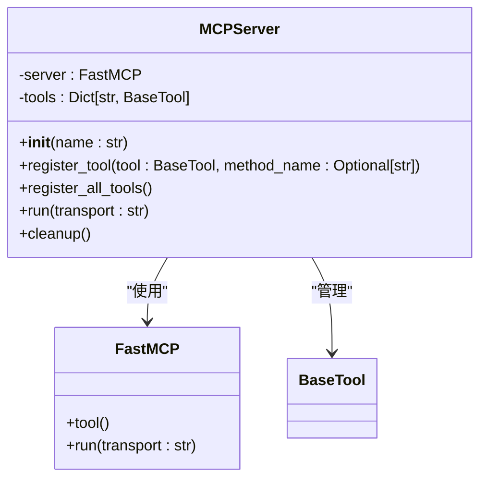
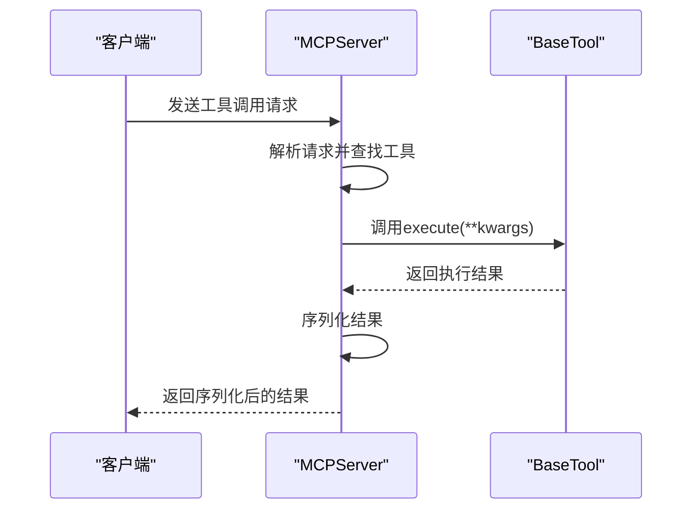
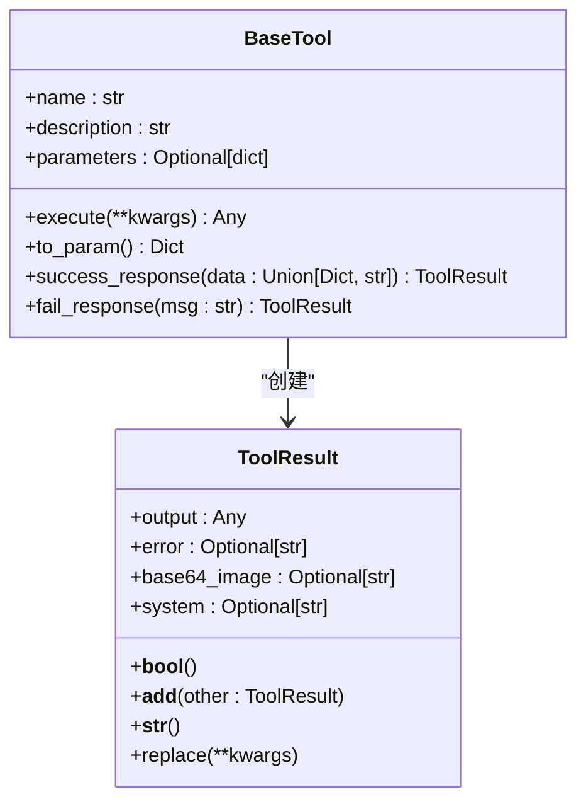
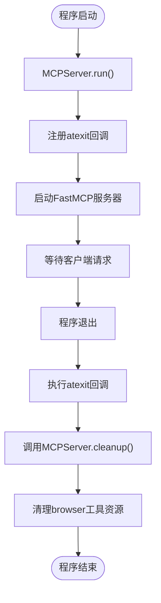

# 协议处理与交互

<cite>
**Referenced Files in This Document**   
- [server.py](file://app/mcp/server.py)
- [base.py](file://app/tool/base.py)
- [tool_collection.py](file://app/tool/tool_collection.py)
- [mcp.py](file://app/tool/mcp.py)
- [run_mcp_server.py](file://run_mcp_server.py)
</cite>

## 目录
1. [引言](#引言)
2. [MCP服务器架构](#mcp服务器架构)
3. [工具注册机制](#工具注册机制)
4. [协议处理与序列化](#协议处理与序列化)
5. [资源清理与生命周期管理](#资源清理与生命周期管理)
6. [协议兼容性与升级指南](#协议兼容性与升级指南)
7. [结论](#结论)

## 引言

OpenManus的MCP（Model Context Protocol）协议处理机制是其核心功能之一，实现了客户端与服务器之间的高效工具调用和交互。该机制基于FastMCP框架构建，通过`MCPServer`类提供了一套完整的工具注册、管理和执行体系。系统允许将各种功能封装为`BaseTool`的子类，并通过标准化的协议暴露给客户端使用。本文档将深入解析这一机制，包括服务器如何注册工具、处理客户端请求、管理工具调用的序列化/反序列化过程，以及服务器端的资源清理和生命周期管理。

## MCP服务器架构

`MCPServer`类是整个MCP协议交互的核心，它封装了FastMCP框架，为上层应用提供了简洁的工具管理接口。服务器在初始化时会预加载一组标准工具，如`bash`、`browser`、`editor`和`terminate`，这些工具被存储在`tools`字典中，以工具名称为键。

**Diagram sources**
- [server.py](file://app/mcp/server.py#L23-L159)

**Section sources**
- [server.py](file://app/mcp/server.py#L23-L159)

## 工具注册机制

`register_tool`方法是将`BaseTool`实例转换为符合MCP协议的异步方法的关键。该过程包含参数验证、文档字符串生成和签名构建三个核心步骤。

### 参数验证与元数据构建

当一个`BaseTool`实例被注册时，首先通过`to_param()`方法获取其元数据。该方法返回一个符合OpenAI函数调用格式的字典，包含工具的名称、描述和参数模式。参数模式（parameters schema）随后被存储在生成的异步方法的`_parameter_schema`属性中，供其他组件程序化访问。

### 文档字符串生成

`_build_docstring`方法负责将工具的元数据转换为格式化的文档字符串。它首先提取工具的描述，然后遍历其参数属性，为每个参数生成详细的说明，包括类型、是否必需以及描述文本。生成的文档字符串遵循标准的Python docstring格式，便于开发者理解和使用。

### 签名构建

`_build_signature`方法是实现类型安全的关键。它将JSON Schema中的类型（如"string"、"integer"）映射到Python的类型（如`str`、`int`），并为每个参数创建一个`Parameter`对象。这些对象被组合成一个`Signature`对象，该对象被赋值给生成的异步方法的`__signature__`属性。这使得Python的`inspect`模块能够正确地解析方法的签名，确保了与FastMCP框架的兼容性。

**Diagram sources**
- [server.py](file://app/mcp/server.py#L36-L75)
- [base.py](file://app/tool/base.py#L123-L136)

**Section sources**
- [server.py](file://app/mcp/server.py#L36-L97)
- [base.py](file://app/tool/base.py#L123-L136)

## 协议处理与序列化

工具调用的序列化/反序列化过程是MCP协议交互的核心。当客户端发起一个工具调用时，FastMCP框架会将请求反序列化为Python字典，并作为`**kwargs`传递给相应的异步方法。该方法内部调用`BaseTool`的`execute`方法执行实际逻辑。

### 结果处理逻辑

`execute`方法的返回值需要被正确序列化以返回给客户端。`MCPServer`通过一个内部定义的`tool_method`来处理这一过程。该方法首先记录执行日志，然后根据返回值的类型进行处理：
- 如果返回值具有`model_dump`方法（如Pydantic模型），则调用该方法并将其结果序列化为JSON字符串。
- 如果返回值是字典，则直接将其序列化为JSON字符串。
- 对于其他类型的返回值，则直接返回。

这种处理逻辑确保了不同类型的结果都能被正确地传递给客户端。

### 工具结果模型

`ToolResult`是所有工具执行结果的统一表示。它是一个Pydantic模型，包含`output`、`error`、`base64_image`和`system`四个字段，分别用于存储输出、错误信息、Base64编码的图片和系统消息。`BaseTool`提供了`success_response`和`fail_response`两个便捷方法来创建成功或失败的`ToolResult`实例。

**Diagram sources**
- [base.py](file://app/tool/base.py#L37-L74)
- [base.py](file://app/tool/base.py#L77-L172)

**Section sources**
- [base.py](file://app/tool/base.py#L37-L74)
- [base.py](file://app/tool/base.py#L146-L172)

## 资源清理与生命周期管理

服务器端的资源清理机制通过`cleanup`方法和`atexit`注册模式实现。`cleanup`方法是一个异步方法，负责清理服务器占用的资源。目前，它主要清理`browser`工具的资源，通过检查`tools`字典中是否存在`browser`工具，并调用其`cleanup`方法来实现。

`run`方法在启动服务器之前，会通过`atexit.register(lambda: asyncio.run(self.cleanup()))`将`cleanup`方法注册为程序退出时的回调函数。这确保了即使程序异常退出，也能执行必要的清理工作，防止资源泄漏。

**Diagram sources**
- [server.py](file://app/mcp/server.py#L137-L159)

**Section sources**
- [server.py](file://app/mcp/server.py#L137-L159)

## 协议兼容性与升级指南

OpenManus的MCP协议处理机制设计时考虑了良好的兼容性。通过`ToolCollection`类，可以方便地管理多个工具的集合，并通过`to_params()`方法批量获取所有工具的元数据。这对于与不同版本的客户端进行交互非常有用。

### 升级指南

1.  **添加新工具**：创建一个新的`BaseTool`子类，实现`execute`方法，并在`MCPServer`的初始化过程中将其添加到`tools`字典中。
2.  **修改现有工具**：修改`BaseTool`子类的`parameters`属性以更新其参数模式。注意，修改参数模式可能会影响现有客户端的兼容性。
3.  **处理协议变更**：如果MCP协议本身发生重大变更，可能需要更新`register_tool`方法中的序列化/反序列化逻辑，以确保与新协议的兼容性。

## 结论

OpenManus的MCP协议处理机制通过`MCPServer`和`BaseTool`等核心组件，构建了一个强大而灵活的工具交互框架。该机制不仅实现了工具的注册和调用，还通过完善的序列化、结果处理和资源清理机制，确保了系统的稳定性和可靠性。其设计充分考虑了可扩展性和兼容性，为未来的功能升级和协议演进奠定了坚实的基础。